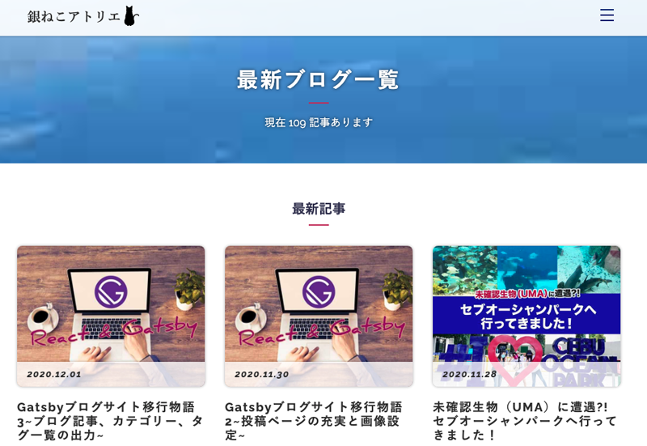
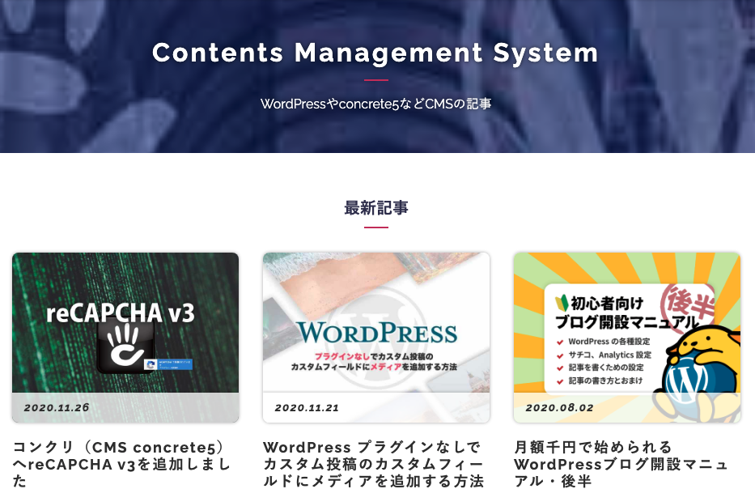
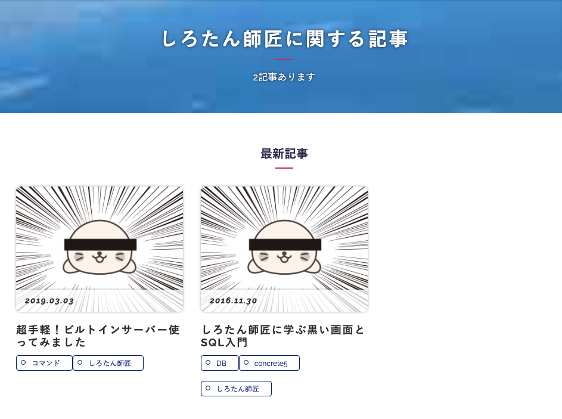

## 今までのGatsbyの記事と注意点
現在ここまで記載しています。<br>制作するまでを目標にUPしていくので順を追ったらGatsbyサイトが作れると思います。

1. [インストールからNetlifyデプロイまで](/blogs/entry401/)
2. [投稿テンプレにカテゴリやらメインビジュアル（アイキャッチ）追加](/blogs/entry406/)
3. *ブログ記事、カテゴリー、タグ一覧の出力*（←イマココ）
4. [プラグインを利用して目次出力](/blogs/entry410/)
5. [プラグインナシで一覧にページネーション実装](/blogs/entry413/)
6. [個別ページテンプレート作成](/blogs/entry416/)
7. [プラグインHelmetでSEO調整](/blogs/entry418/)
8. [CSSコンポーネントでオリジナルページを作ろう！！](/blogs/entry421/)
9. [関連記事一覧出力](/blogs/entry430/)

<small>※ Gatsbyは2021月12月、v4にバージョンアップしています。随時リライトしています。</small>


### このシリーズではテーマGatsby Starter Blogを改造
この記事は一番メジャーなテンプレート、 Gatsby Starter Blogを改造しています。同じテーマでないと動かない可能性があります。

### 今回やりたいこと
ブログ記事のみ抽出してサムネイルのある一覧を作る。<br>
さらにカテゴリーとタグごとの一覧も作成。

## src/pageディレクトリーにあるindex.jsを複製

Gatsby Starter Blogでは、テンプレートはsrc/templates内に収められています。<br>
まずは、以下にblogs-list.jsという名前で格納します。
```
src/
├ pages/
|   ├ index.js （これをコピー）
|   └ 404.js
├ templates/
|   ├ blog-post.js
|   └ blogs-list.js（ここに格納）
├ components/
├ style.css
└ normalize.css
```

blogs-list.js の変数名を変更。

```javascript
// 省略
const BlogList = ({ data, location }) => {
// 省略
}

export default BlogList
// 省略

```

## gatsby-node.jsで一覧を作成するためのコードを書く
gatsbyjsは静的ページを生成するので各一覧を生成するためのコードを書きます。

前回、[投稿テンプレにカテゴリやらメインビジュアル（アイキャッチ）追加](/blogs/entry406/)では投稿した日付昇順にソートし、 `pagetype` が `blog` の記事だけを上限に1000件絞り込みました。

データは変数 **gatsby-node.js** の `result` に格納されています。
```javascript
// Get all markdown blog posts sorted by date
const result = await graphql(
`
{
allMarkdownRemark(
sort: { fields: [frontmatter___date], order: ASC }
filter: {frontmatter: {pagetype: {eq: "blog"}}}
limit: 1000
) {
totalCount
nodes {
id
fields {
slug
}
frontmatter {
hero
}
}
}
}
`)

if (result.errors) {
reporter.panicOnBuild(
`There was an error loading your blog posts`,
result.errors
)
return
}

const posts = result.data.allMarkdownRemark.nodes
```

GraphQLで絞り込み&並び替えた記事データを変数 `posts` に格納されています。

当銀ねこアトリエの記事のパスは、`/blogs/entry+数字` です。<br>
数字順に並べ替えたい場合は、以下のようにするとOK。

```js
sort: { fields: fields___slug, order: ASC }
```

先ほど作ったblog-list.jsからクエリを投げて、`createPage()`でページを生成します。

## ブログ記事の一覧を生成する
gatyby-node.jsに createPageを実行するテンプレートを追加します。

```javascript
// 省略
exports.createPages = async ({ graphql, actions, reporter }) => {
const { createPage } = actions
// 省略

const blogPost = path.resolve(`./src/templates/blog-post.js`)

const blogList = path.resolve(`./src/templates/blog-list.js`)//テンプレートとなるページを追加
// 省略
}
```
ページネーションなどないプレーンな一覧を取得するコードを追加します。<br>
投稿ページの生成しているコードの下あたりに追加します。

```javascript
//省略
if (posts.length > 0) {
const blog = posts.filter(post => post.frontmatter.pagetype === "blog")

blog.forEach((post, index) => {
//省略
})

// 以下追加
createPage({
path: '/blogs/',
component: blogList,
})
}
//省略
```
## pagetypeがblogの記事のみを取得する
blog-list.jsを編集しましょう。記事一覧と、総数を取得し表示できるように改造します。

理想はこんな感じにしたい。



コードを以下のように追記して、GraphQLで `totalCount` (記事の総数)も取得します。

前回の[投稿テンプレにカテゴリやらメインビジュアル（アイキャッチ）追加](/blogs/entry406/)とほぼ一緒ですが、 `blosQyery` の `allMarkdownRemark` に `totalCount` を追記します。

```javascript
import React from "react"
import { Link, graphql } from "gatsby"
import Layout from "../components/layout"
import SEO from "../components/seo"

const blogs = ({ data, location }) => {
const { totalCount, nodes } = data.allMarkdownRemark
const posts = nodes //書き換える
console.log(totalCount)//デバッグ

return (
<Layout location={location} title="銀ねこアトリエ">
{/* 省略 */}
</Layout>
)
}
export default blogs
export const pageQuery = graphql`
query blosQyery {
site {
siteMetadata {
title
}
}
allMarkdownRemark(
sort: {fields: [frontmatter___date], order: DESC }
# pagetype=blogで絞り込む
filter: {frontmatter: {pagetype: { eq: "blog" } } }
)
{
# 記事総数取得
totalCount
nodes {
excerpt
fields {
slug
}
frontmatter {
title
date(formatString: "YYYY.MM.DD")
description
# 画像を引っ張り出すのに使います
hero
# カテゴリーやタグを出力したいなら
cate
tags
}
}
}
}
`
```
記事詳細の出力時と違い、GraghQLでfilterを使ってpagetype=blogで絞り込んでいます。
```
filter: {frontmatter: {pagetype: { eq: "blog" } } }
```
### サムネを出力するためのコンポーネント作成
サムネを出力するためのコンポーネントを作成します。
```
src/
└ components/
└ img.js（追加）
```
img.js を src/components/内に格納します。
```js
import * as React from "react"
import { useStaticQuery, graphql } from "gatsby"
import { GatsbyImage, getImage } from "gatsby-plugin-image"

const Img = ({ image, alt, className }) => {
const { allFile } = useStaticQuery(
graphql`
query {
allFile(filter: { sourceInstanceName: { eq: "images" } }) {
edges {
node {
  relativePath
  childImageSharp {
    gatsbyImageData(
      blurredOptions: { width: 100 }
      width: 640
      formats: [AUTO, WEBP, AVIF]
      placeholder: BLURRED
    )
  }
}
}
}
}
`
)
// 代替文字
alt = alt ? alt : ""
//画像がない場合はダミーをセット
let imagePath = image ? image : "common/dummy.png"

// findで条件と同じ画像を探す
let img = allFile.edges.find(img => img.node.relativePath === imagePath)
if (img) {
return (
<GatsbyImage
image={getImage(img.node.childImageSharp.gatsbyImageData)}
alt={alt}
key={alt}
className={className}
/>
)
} else {
return ""
}
}
export default Img
```
コンポーネントを読み込み、画像を表示するために記事を改造します。
```js
import * as React from "react"
import { Link, graphql } from "gatsby"

import Layout from "../components/layout"
import Seo from "../components/seo"
import Img from "../components/img" //画像読み込み

const BlogList = ({ data, location }) => {
const { totalCount, nodes } = data.allMarkdownRemark
const posts = nodes
const title = "記事一覧"
console.log(totalCount)

return (
<Layout location={location} title={title}>
<Seo title={title} />
<header>
<h1>{title}</h1>
<p>現在 {totalCount} 記事あります。</p>
</header>

<ol style={{ listStyle: `none` }}>
{posts.map(post => {
const title = post.frontmatter.title || post.fields.slug

return (
<li key={post.fields.slug}>
  <article
    className="post-list-item"
    itemScope
    itemType="http://schema.org/Article"
  >
    <Link to={post.fields.slug} itemProp="url">
      </Img>
      <time dateTime={post.frontmatter.date}>
        {post.frontmatter.date}
      </time>
      <h2>{title}</h2>
      <p
        dangerouslySetInnerHTML={{
          __html: post.frontmatter.description || post.excerpt,
        }}
        itemProp="description"
      />
    </Link>
  </article>
</li>
)
})}
</ol>
</Layout>
)
}
// 省略
```

CSSが効いてないとこんなもんですが、一応出力はできました。


## カテゴリーを追加する
frontmatterにcategory項目を追加します。

ブログを設計するときに、カテゴリーの数は6個と決めていました。

<msg txt="カテゴリーを増やしすぎると、自分の書きたい内容の軸がブレそうですしね。"></msg>

ということで、gatby-config.js の `siteMetadata` 、以下のようにcategoryを追記しておきました。

```js
module.exports = {
siteMetadata: {
title: `銀ねこアトリエ`,
author: {
name: `かみーゆ`,
summary: `「銀ねこアトリエ」はセブ島に住むフロントエンドエンジニア`,
},
description: `「銀ねこアトリエ」はセブ島に住むフロントエンドエンジニアの気ままな日記です。`,
siteUrl: `https://ginneko-atelier.com/`,
social: {
twitter: `lirioL`,
instagram: `yurico.k`,
},
category: [
{
slug: `cms`,
name: `Contents Management System`,
description: `WordPressやconcrete5などCMSの記事`,
},
{
slug: `frontend`,
name: `Front End`,
description: `HTML、CSS、JSなどの書き留めたチップス`,
},
{
slug: `backend`,
name: `Back End`,
description: `PHP、黒い画面、DBが中心`
},
{
slug: `seo`,
name: `Seaarch Engine Optimization`,
description: `SEOやコンテンツマーケティングに関する記事`
},
{
slug: `career`,
name: `ITセミナー`,
description: `勉強会の開催/登壇について書いてます`
},
{
slug: `ginneko-tsuredure`,
name: `Life Hack`,
description: `思ったことを気ままに書いてます`
},
]
},
]
```
mdファイルの `cate` には `siteMetadata` の `slug` を記述するというルールを設けます。

```
---
title: Webサイトの表示速度を真剣に考える
date: 2019-06-21
hero: entry325.png
pagetype: blog
cate: seo
tags: [表示速度,SEOコーディング]
description: 昔いた会社で、画像の圧縮、CSSなどの外部ファイルを徹底して不要ファイルを削除して圧縮してさらにワンソース化した結果、50位から20位以内に順位が改善したことがあります。今日はWebサイトの軽量化とスピードについて真剣に考えようと思います。
---
```

blog-list.jsをsrc/templates/内に複製し、category.jsを作成します。

gatsby-node.jsのクエリに`cate`を追加します。

```jS
const result = await graphql(
`
{
allMarkdownRemark(
sort: {fields: fields___slug, order: ASC }
limit: 1000
) {
nodes {
id
fields {
slug
}
frontmatter {
pagetype
cate
hero
}
}
}
}
`
)
```

cate-list.jsをテンプレートとしたすべての記事からcateを絞り込んだそれぞれの一覧を出力するページを生成します。

```javascript
// テンプレ追加
const cateList = path.resolve(`./src/templates/cate-list.js`);
```

```js
//カテゴリー一覧追加
//カテゴリーのリスト取得
let cates = posts.reduce((cates, edge) => {
const edgeCates = edge.frontmatter.cate
return edgeCates ? cates.concat(edgeCates) : cates
}, [])
// 重複削除
cates = [...new Set(cates)]
// カテゴリー分ページを作成
cates.forEach(cate => {
const cateSlug = cate
createPage({
path: `/blogs/${cate}/`,
component: cateList,
context: {
cateSlug,
},
})
})
```
`cateSlug`（カテゴリーID）はcreatePageの`context`に格納され、引数`pageContext`で取得できます。

`import { siteMetadata } from "../../gatsby-config"`であらかじめgatsby-config.jsに設定したカテゴリーのslug、name、descriptionを取得し、`cateSlug`と一致するデータのみを使用します。

CSSさえ実装されていればこんな感じに表示したい。




```javascript
import * as React from "react"
import { Link, graphql } from "gatsby"

import Layout from "../components/layout"
import Seo from "../components/seo"
import Img from "../components/img"

import { siteMetadata } from "../../gatsby-config"

const BlogList = ({ pageContext, data, location }) => {
// カテゴリースラッグ取得
const { cateSlug } = pageContext
const { nodes } = data.allMarkdownRemark
const posts = nodes
// cateSlugと一致するカテゴリーを取得する
const cate = siteMetadata.category.find(item => item.slug === cateSlug)

return (
<Layout location={location} title={cate.name}>
<Seo title={cate.name} />
<header>
<h1>{cate.name}</h1>
<p>{cate.description}</p>
</header>

<ol style={{ listStyle: `none` }}>
{posts.map(post => {
const title = post.frontmatter.title || post.fields.slug

return (
<li key={post.fields.slug}>
  <article
    className="post-list-item"
    itemScope
    itemType="http://schema.org/Article"
  >
    <Link to={post.fields.slug} itemProp="url">
      </Img>
      <time dateTime={post.frontmatter.date}>
        {post.frontmatter.date}
      </time>
      <h2>{title}</h2>
      <p
        dangerouslySetInnerHTML={{
          __html: post.frontmatter.description || post.excerpt,
        }}
        itemProp="description"
      />
    </Link>
  </article>
</li>
)
})}
</ol>
</Layout>
)
}

export default BlogList

export const pageQuery = graphql`
query ($cateSlug: String) {
site {
siteMetadata {
title
}
}
allMarkdownRemark(
sort: { fields: fields___slug, order: ASC }
filter: {
frontmatter: { pagetype: { eq: "blog" }, cate: { eq: $cateSlug } }
}
) {
nodes {
excerpt
fields {
slug
}
frontmatter {
date(formatString: "YYYY-MM-DD")
title
description
hero
}
}
}
}
`

```
取得する一覧は、gatsby-node.jsからスラッグを受け取って
```
query ($cateSlug: String){
# 省略
```
フィルターで絞り込んでいます。
```
# 省略
filter: {
frontmatter: { pagetype: { eq: "blog" }, cate: { eq: $cateSlug } }
}
# 省略
```
## タグを追加する
この銀ねこアトリエではタグは複数設定OKというルールを設けてるので以下のように追加します。
```markdown
---
title: Webサイトの表示速度を真剣に考える
date: 2019-06-21
hero: entry325.png
pagetype: blog
cate: seo
tags: [表示速度,SEOコーディング]
description: 昔いた会社で、画像の圧縮、CSSなどの外部ファイルを徹底して不要ファイルを削除して圧縮してさらにワンソース化した結果、50位から20位以内に順位が改善したことがあります。今日はWebサイトの軽量化とスピードについて真剣に考えようと思います。
---
```
gatsby-node.js側のqueryに `tags` を追記します。
```javascript
const result = await graphql(
`
{
allMarkdownRemark(
sort: { fields: [frontmatter___date], order: ASC }
limit: 1000
) {
nodes {
id
fields {
slug
}
frontmatter {
hero
pagetype
cate
tags
}
}
}
}
`
)
```
カテゴリー同様すべてのブログ記事一覧を表示させるためのblogs-list.jsを複製しtag-list.jsをテンプレートとして使用します。

カテゴリー同様、すべての記事からtagsを取得し、重複を削除してタグごとのページを表示しています。<br>
タグはたくさん増えると判断し、siteMetaでのスラッグの管理はしないことにしました。

どのタグの記事が何件あるかは表示したかったので、カテゴリーで説明のところに表示されていた文章を以下のようにしました。

理想を言えば、CSSを整えてこんな感じで実装したい。



gatsby-node.js側にタグのページを生成するためのコードを追記します。

```javascript
//タグページを作成
const tagList= path.resolve(`./src/templates/tag-list.js`);
```
タグ一覧のテンプレートへの出力。categoryを改造しただけです。
```javascript
//タグの一覧作成
let tags = posts.reduce((tags, edge) => {
const edgeTags = edge.frontmatter.tags
return edgeTags ? tags.concat(edgeTags) : tags
}, [])
// 重複削除
tags = [...new Set(tags)]

// カテゴリー分ページを作成
tags.forEach(item => {
const tag = item
createPage({
path: `/blogs/tags/${item}/`,
component: tagList,
context: {
tag,
},
})
})
```
tag-list.js です。

ポイントはテンプレート側クエリのフィルターが配列なので`filter: {frontmatter: {tags: { in: [$tag] } } }`で絞り込んでいる点です。

```javascript
import * as React from "react"
import { Link, graphql } from "gatsby"

import Layout from "../components/layout"
import Seo from "../components/seo"
import Img from "../components/img"

import { siteMetadata } from "../../gatsby-config"

const BlogList = ({ pageContext, data, location }) => {
const { totalCount, nodes } = data.allMarkdownRemark
const posts = nodes
const tag = pageContext.tag

return (
<Layout location={location} title={tag}>
<Seo title={tag} />
<header>
<h1>{tag}</h1>
<p>現在 {totalCount} 記事あります。</p>
</header>

<ol style={{ listStyle: `none` }}>
{posts.map(post => {
const title = post.frontmatter.title || post.fields.slug

return (
<li key={post.fields.slug}>
  <article
    className="post-list-item"
    itemScope
    itemType="http://schema.org/Article"
  >
    <Link to={post.fields.slug} itemProp="url">
      </Img>
      <time dateTime={post.frontmatter.date}>
        {post.frontmatter.date}
      </time>
      <h2>{title}</h2>
      <p
        dangerouslySetInnerHTML={{
          __html: post.frontmatter.description || post.excerpt,
        }}
        itemProp="description"
      />
    </Link>
  </article>
</li>
)
})}
</ol>
</Layout>
)
}

export default BlogList

export const pageQuery = graphql`
  query ($tag: String) {
    site {
      siteMetadata {
        title
      }
    }
    allMarkdownRemark(
      sort: { fields: fields___slug, order: ASC }
      filter: {
        frontmatter: { pagetype: { eq: "blog" }, tags: { in: [$tag] } }
      }
    ) {
    totalCount
    nodes {
      excerpt
      fields {
        slug
      }
      frontmatter {
          date(formatString: "YYYY-MM-DD")
          title
          description
          hero
          tags
        }
      }
    }
  }
`

```
記事一覧の記事ごとにタグへのリンクを付与したければGraghQLでデータを取得し、配列で回します。
```js
<li key={post.fields.slug}>
  <article
    className="post-list-item"
    itemScope
    itemType="http://schema.org/Article"
  >
    <Link to={post.fields.slug} itemProp="url">
      </Img>
      <time dateTime={post.frontmatter.date}>
        {post.frontmatter.date}
      </time>
      <h2>{title}</h2>
      <p
        dangerouslySetInnerHTML={{
          __html: post.frontmatter.description || post.excerpt,
        }}
        itemProp="description"
      />
    </Link>
    {post.frontmatter.tags
      ? post.frontmatter.tags.map(item => {
          return (
            <Link
              to={`/blogs/tags/${item}/`}
              itemProp="url"
              key={item}
            >
              {item}
            </Link>
          )
        })
      : ""}
  </article>
</li>
```

## まとめ
これですべてのブログ記事、カテゴリー、タグの一覧が取得できるようになったと思います！

2020年前半までのGatsby関連の記事をググると最新のテンプレートに即しているものが少なく、手探りでなんとか一覧を表示できるようなりました。

駆け出しエンジニアにはキツイと思います^ ^

まだまだコードがモダンじゃないのでテコ入れしてこの記事もブラッシュアップしアップデートします！<br>生暖かい目で見守ってください。

この記事がみなさんのコーディングライフの一助となれば幸いです。

最後までお読みいただきありがとうございました！
