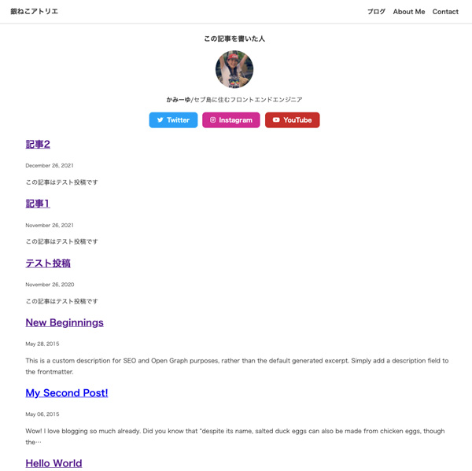
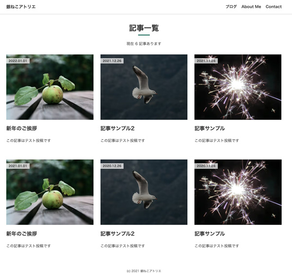
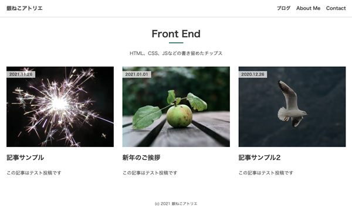
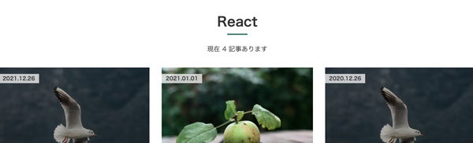
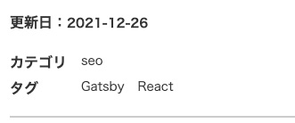
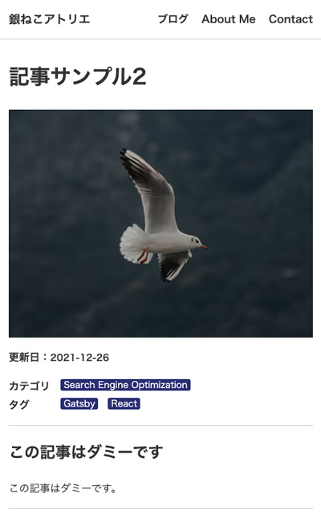

gatsbyのブログ用記事を抽出し一覧を作りました。カテゴリ、タグ一覧もぞれぞれ用意したのでだいぶ使い勝手がよくなりました。今回はそれぞれの一覧の出力の仕方についてまとめます。

サムネ出力用のコンポーネントの作り方も紹介しています。

<p><small>※ 2021年12月30日v4対応のためリライトしました。</small></p>
<prof></prof>

## 今までのGatsbyの記事と注意点
現在ここまで記載しています。<br>制作するまでを目標にUPしていくので順を追ったらGatsbyサイトが作れると思います。

1. [インストールからNetlifyデプロイまで](/blogs/entry401/)
2. [ヘッダーとフッターを追加する](/blogs/entry484/)
2. [投稿テンプレにカテゴリやらメインビジュアル（アイキャッチ）追加](/blogs/entry406/)
3. *ブログ記事、カテゴリ、タグ一覧の出力*（←イマココ）
4. [プラグインを利用して目次出力](/blogs/entry410/)
5. [プラグインナシで一覧にページネーション実装](/blogs/entry413/)
6. [個別ページテンプレート作成](/blogs/entry416/)
7. [プラグインHelmetでSEO調整](/blogs/entry418/)
8. [CSSコンポーネントでオリジナルページを作ろう！！](/blogs/entry421/)
9. [関連記事一覧出力](/blogs/entry430/)
11. [タグクラウドコンポーネントを作成する](/blogs/entry486/)
12. [パンくずリストを追加する](/blogs/entry487/)
13. [記事内で独自タグ（コンポーネント）を使えるようにする](/blogs/entry489/)

v5へのアップグレード方法はこちら。
<card id="/blogs/entry519/"></card>

<toc id="/blogs/entry408/"></toc>

<small>※ Gatsbyは2021月12月、v4にバージョンアップしています。随時リライトしています。</small>

このシリーズは[Github・gatsby-blog](https://github.com/yuririn/gatsby-blog)に各内容ブランチごとで分けて格納しています。

今回のソースは[blog-list](https://github.com/yuririn/gatsby-blog/tree/blog-list)ブランチにあります。


### このシリーズではテーマGatsby Starter Blogを改造
この記事は一番メジャーなテンプレート、 Gatsby Starter Blogを改造しています。同じテーマでないと動かない可能性があります。

### 今回やりたいこと
ブログ記事のみ抽出してサムネイルのある一覧を作る。<br>
さらにカテゴリとタグごとの一覧も作成。

## src/pageディレクトリーにあるindex.jsを複製

Gatsby Starter Blogでは、テンプレートはsrc/templates内に収められています。<br>
まずは、以下にblogs-list.jsという名前で格納します。

一覧の出力を確認したいのでダミーの記事も用意しておきます。
```
src/
  ├ pages/
  |  ├ index.js （これをコピー）
  |  └ 404.js
  ├ templates/
  |  ├ blog-post.js
  |  └ blogs-list.js（ここに格納）
  └ images/
    └ thumbnail/
      （記事のサムネイル出力画像）
      ├ entry01.jpg
      ├ entry02.jpg
      └ entry03.jpg
content/blog/
  └ blogs
  （一覧出力の確認用にいくつかダミーの記事を作っておく）
    ├ entry1.md
    ├ entry2.md
    ├ entry3.md
    ├ entry4.md
    ├ entry5.md
    └ entry6.md
```

blogs-list.js の変数名を変更。

```js:title=blogs-list.js
// 省略
const BlogList = ({ data, location }) => {
// 省略
}

export default BlogList
// 省略
```

## gatsby-node.jsで一覧を作成するためのコードを書く
gatsbyjsは静的ページを生成するので各一覧を生成するためのコードを書きます。

出力する元となるデータは **gatsby-node.js** の `result` に格納されています。
```js{33}:title=gatsby-node.js
// Get all markdown blog posts sorted by date
const result = await graphql(
  const result = await graphql(
    `
      {
        allMarkdownRemark(
          sort: { fields: [frontmatter___date], order: ASC }
          limit: 1000
        ) {
          nodes {
            id
            fields {
              slug
            }
            frontmatter {
              hero
              pagetype
            }
          }
        }
      }
    `
  )

if (result.errors) {
  reporter.panicOnBuild(
    `There was an error loading your blog posts`,
    result.errors
  )
  return
}

const posts = result.data.allMarkdownRemark.nodes
```

記事データは変数 `posts` に格納されています。

### テンプレートを使ってブログ記事の一覧を生成する

gatyby-node.jsにテンプレート(blog-list.js)を追加します。

```js{7}:title=gatsby-node.js
// 省略
exports.createPages = async ({ graphql, actions, reporter }) => {
  const { createPage } = actions
  // 省略
  const blogPost = path.resolve(`./src/templates/blog-post.js`)

  const blogList = path.resolve(`./src/templates/blog-list.js`)//テンプレートとなるページを追加
  // 省略
}
```

ブログ記事として扱う投稿にはfrontmatterのpagetypeにblogを付与します。

```js{4}:title=mdファイル
---
title: 記事2
date: 2021-12-26
pagetype: blog
# 省略
```
前回ブログ詳細ページでも[投稿テンプレにカテゴリやらメインビジュアル（アイキャッチ）追加](/blogs/entry408/)、`posts`の中から**pagetypeがblogのデータだけ抽出**しました。

ブログ詳細を出力しているコードの下に`createPage`を使って一覧を出力するコードを追加します。

```js{11-14}:title=gatsby-node.js
//省略
if (posts.length > 0) {
  const blogPosts = posts.filter(post => post.frontmatter.pagetype === "blog")

  //ブログ詳細出力
  blogPosts.forEach((post, index) => {
  //省略
  })

  // 一覧を出力するコードを追加
  createPage({
    path: '/blogs/',
    component: blogList,
  })
}
//省略
```
[localhost:8000/blogs/](localhost:8000/blogs/)にアクセスします。



まだblog以外の記事も取得されています。

## pagetypeがblogの記事のみを取得する
blog-list.jsを編集しましょう。記事一覧と、総数を取得し表示できるようにします。

コードを以下のように追記して、GraphQLで `totalCount` (記事の総数)も取得します。

`blosQyery` の `allMarkdownRemark` に `totalCount`、`hero`を追記。

```js{6,23,26,37}:title=blog-list.js
// 省略

const BlogList = ({ data, location }) => {
  const siteTitle = data.site.siteMetadata?.title || `Title`
  const posts = data.allMarkdownRemark.nodes
  console.log(data.allMarkdownRemark.totalCount) //デバッグ

  // 省略
}

export default BlogList

export const pageQuery = graphql`
  query {
    site {
      siteMetadata {
        title
      }
    }
    allMarkdownRemark(
      sort: { fields: [frontmatter___date], order: DESC }
      # pagetype=blogで絞り込む
      filter: { frontmatter: { pagetype: { eq: "blog" } } }
    ) {
      # 記事総数取得
      totalCount
      nodes {
        excerpt
        fields {
          slug
        }
        frontmatter {
          date(formatString: "YYYY.MM.DD")
          title
          description
          # 画像
          hero
        }
      }
    }
  }
`

```
GraghQLでfilterを使ってpagetype=blogで絞り込んでいます。
```
filter: {frontmatter: {pagetype: { eq: "blog" } } }
```
## サムネを出力するためのコンポーネント作成
サムネを出力するためのコンポーネントを作成します。
```
src/
└ components/
  └ img.js（新規作成）
```
img.js を src/components/内に格納します。
```js:title=img.js
import * as React from "react"
import { useStaticQuery, graphql } from "gatsby"
import { GatsbyImage, getImage } from "gatsby-plugin-image"

const Img = ({ image, alt, className }) => {
  const { allFile } = useStaticQuery(
    graphql`
      query {
        allFile(filter: { sourceInstanceName: { eq: "images" } }) {
          edges {
            node {
              relativePath
              childImageSharp {
                gatsbyImageData(
                  blurredOptions: { width: 100 }
                  width: 640
                  formats: [AUTO, WEBP, AVIF]
                  placeholder: BLURRED
                )
              }
            }
          }
        }
      }
    `
  )
  // 代替文字
  alt = alt ? alt : ""
  //画像がない場合はダミーをセット
  let imagePath = image ? image : "common/dummy.png"

  // findで条件と同じ画像を探す
  let img = allFile.edges.find(img => img.node.relativePath === imagePath)
  if (img) {
    return (
      <GatsbyImage
        image={getImage(img.node.childImageSharp.gatsbyImageData)}
        alt={alt}
        key={alt}
        className={className}
      />
    )
  } else {
    return ""
  }
}
export default Img
```
blog-list.jsを編集します。`<Bio/>`は使わないので削除します。
```js:title=blog-list.js
// 削除
import Bio from "../components/bio"
// 削除
<Bio/>
```

Imgコンポーネントを読み込み、画像を表示するために記事を改造します。
```js{4,34}:title=blog-list.js
// 省略

//画像読み込み
import Img from "../components/img"

const BlogList = ({ data, location }) => {
  const { totalCount, nodes } = data.allMarkdownRemark
  const posts = nodes
  const title = "記事一覧"

  if (posts.length === 0) {
    // 省略
  }

  return (
    <Layout location={location} title={title}>
      <Seo title="All posts" />
      <header>
        <h1>{title}</h1>
        <p>現在 {totalCount} 記事あります</p>
      </header>
      <ol style={{ listStyle: `none` }}>
        {posts.map(post => {
          const title = post.frontmatter.title || post.fields.slug

          return (
            <li key={post.fields.slug}>
              <article
                className="post-list-item"
                itemScope
                itemType="http://schema.org/Article"
              >
                <Link to={post.fields.slug} itemProp="url">
                  </Img>
                  <small>
                    <time datetime={post.frontmatter.date}>
                      {post.frontmatter.date}
                    </time>
                  </small>
                </Link>
                <h2>
                  <Link to={post.fields.slug} itemProp="url">
                    <span itemProp="headline">{title}</span>
                  </Link>
                </h2>
                <section>
                  <p
                    dangerouslySetInnerHTML={{
                      __html: post.frontmatter.description || post.excerpt,
                    }}
                    itemProp="description"
                  />
                </section>
              </article>
            </li>
          )
        })}
      </ol>
    </Layout>
  )
// 省略
```

見た目は悪いですが、出力できました。


### styled-componentsで見た目をきれいにする

ブログ一覧用のスタイルを作成します。外部ファイルで、styled-componentsコンポーネントを作ります。
```
src/
└ style/
  └ blog-list-style.js
```
一覧全体の見出し用と、一覧用のコンポーネントを1つのファイルに作成します。

```js:title=blog-list-style.js
import styled from "styled-components"

export const BlogListHeader = styled.header`
  text-align:center;
  h1 {
    &:after {
      margin: 0 auto;
      content: '';
      display: block;
      width: 50px;
      height: 3px;
      background: rgb(29, 104, 88);
    }
  }
`
export const BlogListWrapper = styled.ol`
  list-style: none;
  padding: 0;
  li {
    margin-bottom: 20px;

    a {
        color: var(--black);
        text-decoration: none ;
    }
    h2 {
        font-size: 18px;
    }
  }
  .thumbnail {
    position: relative;

    time {
      font-weight: 700;
      position: absolute;
      left: 0;
      top: 10px;
      background: rgba(255,255,255,.7);
      padding: 0 10px;
    }
  }
  @media screen and (min-width: 768px) {
    display: flex;
    flex-wrap: wrap;
    margin: 0 -15px;

    li {
        box-sizing: border-box;
        padding: 15px;
        width: 33.33%;

        h2 {
          font-size: 22px;

          a {
              &:hover {
              text-decoration: underline;
            }
          }
        }

      .thumbnail {
        transition: .3s;

        &:hover {
            opacity: 0.5;
        }
      }
    }
  }
`
```

```js{3,12,15,17,31,57}:title=blog-list.js
import Img from "../components/img"

import { BlogListWrapper, BlogListHeader } from "../style/blog-list-style"

const BlogList = ({ data, location }) => {
  // 省略

  return (
    <Layout location={location} title={title}>
      <Seo title="All posts" />
      {/* タグ変更 */}
      <BlogListHeader>
        <h1>{title}</h1>
        <p>現在 {totalCount} 記事あります</p>
      </BlogListHeader>
      {/* タグ変更 */}
      <BlogListWrapper>
        {posts.map(post => {
          const title = post.frontmatter.title || post.fields.slug

          return (
            <li key={post.fields.slug}>
              <article
                itemScope
                itemType="http://schema.org/Article"
              >
                {/* クラス追加 */}
                <Link
                  to={post.fields.slug}
                  itemProp="url"
                  className="thumbnail"
                >
                  </Img>
                  <small>
                    <time datetime={post.frontmatter.date}>
                      {post.frontmatter.date}
                    </time>
                  </small>
                </Link>
                <h2>
                  <Link to={post.fields.slug} itemProp="url">
                    <span itemProp="headline">{title}</span>
                  </Link>
                </h2>
                <section>
                  <p
                    dangerouslySetInnerHTML={{
                      __html: post.frontmatter.description || post.excerpt,
                    }}
                    itemProp="description"
                  />
                </section>
              </article>
            </li>
          )
        })}
      </BlogListWrapper>
    </Layout>
  )
}

export default BlogList
//省略
```
シンプルですがサイトとして見れるレベルまでになりました。


## カテゴリを追加する
カテゴリ項目の一覧も追加します。

ブログを設計するときに、カテゴリの数は6個と決めていました。

<msg txt="カテゴリを増やしすぎると、自分の書きたい内容の軸がブレそうですしね。"></msg>

ということで、gatby-config.js の `siteMetadata` 、以下のようにカテゴリを追記しておきました。

```js:title=gatby-config.js
module.exports = {
  siteMetadata: {
    title: `銀ねこアトリエ`,
    author: {
      name: `かみーゆ`,
      summary: `セブ島に住むフロントエンドエンジニア`,
    },
    description: `セブ島に住むフロントエンドエンジニアの気ままな日記`,
    siteUrl: `https://ginneko-atelier.com/`,
    social: {
      twitter: `lirioY`,
      instagram: `yurico.k`,
      youtube: `https://www.youtube.com/channel/UCbSgjkCIPucux8cFTuQcdcw`,
    },
    カテゴリ: [
      {
        slug: `cms`,
        name: `Contents Management System`,
        description: `WordPressやconcrete5などCMSの記事`,
      },
      {
        slug: `frontend`,
        name: `Front End`,
        description: `HTML、CSS、JSなどの書き留めたチップス`,
      },
      {
        slug: `backend`,
        name: `Back End`,
        description: `PHP、黒い画面、DBが中心`,
      },
      {
        slug: `seo`,
        name: `Seaarch Engine Optimization`,
        description: `SEOやコンテンツマーケティングに関する記事`,
      },
      {
        slug: `career`,
        name: `ITセミナー`,
        description: `勉強会の開催/登壇について書いてます`,
      },
      {
        slug: `ginneko-tsuredure`,
        name: `Life Hack`,
        description: `思ったことを気ままに書いてます`,
      },
    ],
  },
  省略
]
```
markdownファイルの `cate` には `siteMetadata` の `slug` を記述するというルールを設けます。

```md{7}:title=mdファイル
---
title: 記事サンプル2
date: 2021-12-26
pagetype: blog
hero: thumbnail/entry02.jpg
description: この記事はテスト投稿です
cate: frontend
tags: ['Gatsby', 'React']
---
```

blog-list.jsをsrc/templates/内に複製し、cate-list.jsを作成します。

gatsby-node.jsのクエリに`cate`を追加します。

```js{16}:title=gatsby-node.js
 const result = await graphql(
    `
      {
        allMarkdownRemark(
          sort: { fields: [frontmatter___date], order: ASC }
          limit: 1000
        ) {
          nodes {
            id
            fields {
              slug
            }
            frontmatter {
              pagetype
              hero
              cate
            }
          }
        }
      }
    `
  )
```

cate-list.jsをテンプレートとしたすべての記事から`cate`を絞り込んだそれぞれの一覧を出力するページを生成します。

```js:title=gatsby-node.js
// カテゴリ一覧出力用テンプレ追加
const cateList = path.resolve(`./src/templates/cate-list.js`);
```

```js:title=gatsby-node.js
// 一覧出力
createPage({
  path: "/blogs/",
  component: blogList,
  context: {},
})

//ここからカテゴリ一覧追加
//カテゴリのリスト取得
let cates = posts.reduce((cates, edge) => {
  const edgeCates = edge.frontmatter.cate
  return edgeCates ? cates.concat(edgeCates) : cates
}, [])
// 重複削除
cates = [...new Set(cates)]
// カテゴリ分ページを作成
cates.forEach(cate => {
  const cateSlug = cate
  createPage({
    path: `/blogs/${cate}/`,
    component: cateList,
    context: {
      cateSlug,
    },
  })
})
```
`cateSlug`（カテゴリ）はcreatePageの`context`に格納すれば、テンプレートcate-list.jsに値を渡すことができます。`pageContext`で取得できます。

`cateSlug`と一致するデータのみを使用します。pagetype=blogかつ cateが $cateSlugと一致するものだけ絞り込みます。

```js{3,11-13}:title=cate-list.js
// 省略
export const pageQuery = graphql`
  query( $cateSlug: String ) {
    site {
      siteMetadata {
        title
      }
    }
    allMarkdownRemark(
      sort: { fields: [frontmatter___date], order: DESC }
      filter: {
        frontmatter: { pagetype: { eq: "blog" }, cate: { eq: $cateSlug } }
      }
    ) {
      nodes {
        excerpt
        fields {
          slug
        }
        frontmatter {
          date(formatString: "YYYY.MM.DD")
          title
          description
          hero
        }
      }
    }
  }
`
```
（カテゴリ）を受け取って
```js
query ($cateSlug: String)
```
出力する一覧をフィルターをかけて絞り込んでいます。
```js
filter: {
  frontmatter: { pagetype: { eq: "blog" }, cate: { eq: $cateSlug } }
}
```
`import { siteMetadata } from "../../gatsby-config"`であらかじめgatsby-config.jsに設定したカテゴリのslug、name、descriptionを取得しページ全体の見出しや説明として利用します。

```js{10,12,13,17,20,21,23,24}:title=cate-list.js
import * as React from "react"
import { Link, graphql } from "gatsby"

import Layout from "../components/layout"
import Seo from "../components/seo"
import { BlogListWrapper, BlogListHeader } from "../style/blog-list-style"

import Img from "../components/img"
// 追加
import { siteMetadata } from "../../gatsby-config"

const CateList = ({ pageContext, data, location }) => {
  const { cateSlug } = pageContext
  const { nodes } = data.allMarkdownRemark
  const posts = nodes

  const cate = siteMetadata.category.find(item => item.slug === cateSlug)

  return (
    <Layout location={location} title={cate.name}>
      <Seo title={cate.name} />
      <BlogListHeader>
        <h1>{cate.name}</h1>
        <p>{cate.description}</p>
      </BlogListHeader>
      <BlogListWrapper>
        {/* 省略 */}
      </BlogListWrapper>
    </Layout>
  )
}

export default CateList
// 省略
```

## タグ一覧ページを追加する
この銀ねこアトリエではタグは複数設定OKというルールを設けています。
```markdown:title=mdファイル
---
title: 記事サンプル
date: 2021-11-26
pagetype: blog
hero: thumbnail/entry01.jpg
description: この記事はテスト投稿です
cate: frontend
tags: ['Gatsby', '表示スピード']
---
```
gatsby-node.js側のqueryに `tags` を追記します。
```js{17}:title=gatsby-node.js
const result = await graphql(
  `
    {
      allMarkdownRemark(
        sort: { fields: [frontmatter___date], order: ASC }
        limit: 1000
      ) {
        nodes {
          id
          fields {
            slug
          }
          frontmatter {
            hero
            pagetype
            cate
            tags
          }
        }
      }
    }
  `
)
```
カテゴリ同様blogs-list.jsを複製し *tag-list.js* をテンプレートとして使用します。

すべての記事からtagsを取得し、重複を削除してタグごとのページを表示します。<br>
タグはたくさん増えると判断し、siteMetaでのスラッグの管理はしないことにしました。

gatsby-node.js側にタグのページを生成するためのコードを追記します。

```js:title=gatsby-node.js
//タグページを作成
const tagList= path.resolve(`./src/templates/tag-list.js`);
```
タグ一覧のテンプレートへの出力。カテゴリを改造しただけのコードです。カテゴリ一覧出力コードの下のあたりに記述します。

```js:title=gatsby-node.js
//タグの一覧作成追加
let tags = posts.reduce((tags, edge) => {
  const edgeTags = edge.frontmatter.tags
  return edgeTags ? tags.concat(edgeTags) : tags
}, [])
// 重複削除
tags = [...new Set(tags)]

// カテゴリ分ページを作成
tags.forEach(item => {
  const tag = item
  createPage({
    path: `/blogs/tags/${item}/`,
    component: tagList,
    context: {
      tag,
    },
  })
})
```
タグの一覧出力のフィルターの記述方法が、カテゴリと少し異なります。
タグはmarkdownファイル毎に複数設定してある（配列）なので`tags: { in: [$tag] } }`で絞り込んでいる点です。

タグ毎の記事の総数を表示したかったので、`totalCount`を取得しています。

```js{10-12,15}:title=tag-list.js
export const pageQuery = graphql`
  query ($tag: String) {
    site {
      siteMetadata {
        title
      }
    }
    allMarkdownRemark(
      sort: { fields: [frontmatter___date], order: DESC }
      filter: {
        frontmatter: { pagetype: { eq: "blog" }, tags: { in: [$tag] } }
      }
    ) {
      # 記事総数取得
      totalCount
      nodes {
        excerpt
        fields {
          slug
        }
        frontmatter {
          date(formatString: "YYYY.MM.DD")
          title
          description
          hero
        }
      }
    }
  }
`
```
`pageContext`からタグ名を取得してタイトルとして利用します。
```js{3,4,9,10,12,13}:title=tag-list.js
// 省略

const TagList = ({ pageContext, data, location }) => {
  const { tag } = pageContext
  const { totalCount, nodes } = data.allMarkdownRemark
  const posts = nodes

  return (
    <Layout location={location} title={tag}>
      <Seo title={tag} />
      <BlogListHeader>
        <h1>{tag}</h1>
        <p>現在 {totalCount} 記事あります</p>
      </BlogListHeader>
      <BlogListWrapper>
        {posts.map(post => {
          const title = post.frontmatter.title || post.fields.slug

          return (
            <li key={post.fields.slug}>
              <article
                className="post-list-item"
                itemScope
                itemType="http://schema.org/Article"
              >
                <Link
                  to={post.fields.slug}
                  itemProp="url"
                  className="thumbnail"
                >
                  </Img>
                  <small>
                    <time datetime={post.frontmatter.date}>
                      {post.frontmatter.date}
                    </time>
                  </small>
                </Link>
                <h2>
                  <Link to={post.fields.slug} itemProp="url">
                    <span itemProp="headline">{title}</span>
                  </Link>
                </h2>
                <section>
                  <p
                    dangerouslySetInnerHTML={{
                      __html: post.frontmatter.description || post.excerpt,
                    }}
                    itemProp="description"
                  />
                </section>
              </article>
            </li>
          )
        })}
      </BlogListWrapper>
    </Layout>
  )
}

export default TagList
// 省略
```



## 記事詳細にカテゴリやタグのリンクを追加する
せっかくなので[投稿テンプレにカテゴリやらメインビジュアル（アイキャッチ）追加](/blogs/entry406/)で作った、カテゴリやタグにリンクを貼りたいですよね？



```
src/
  └ templates/
    └ blog-post.js（こちらを編集）
```
カテゴリの詳細が取得できるようにします。

```js{2,6,8,19,28}:title=blog-post.js
// 省略
import { siteMetadata } from "../../gatsby-config"

const BlogPostTemplate = ({ data, location }) => {
  // 省略
  const { cate, tags } = data.markdownRemark.frontmatter

  const cateName = siteMetadata.category.find(item => item.slug === cate).name
  // 省略

  return (
    <Layout location={location} title={siteTitle}>
      {/* 省略 */}

        <Dl>
          <dt>カテゴリ</dt>
          <dd>
            {/* リンク追加 */}
            <Link to={`/blogs/${cate}/`}>{cateName}</Link>
          </dd>
        </Dl>
        <Dl>
          <dt>タグ</dt>
          {tags.map((tag, index) => {
            return (
              <dd key={`tag${index}`}>
                {/* リンク追加 */}
                <Link to={`/blogs/tags/${tag}/`}>{tag}</Link>
              </dd>
            )
          })}
        </Dl>

      {/* 省略 */}
     </Layout>
  )
}
// 省略
```
Dlコンポーネントにスタイルを追加します。
```js{14-24}:title=blog-post.js
const Dl = styled.dl`
  display: flex;
  margin: 0;

  dt {
    width: 80px;
    font-weight: 700;
  }
  dd {
    font-size: 14px;
    margin-left: 0;
    padding-left: 0;

    a {
      text-decoration: none;
      border-radius: 3px;
      color:#fff;
      background: rgb(41, 46, 114);
      padding: 2px 5px;

      &:hover {
        opacity: .5;
      }
    }

    & + dd {
      margin-left: 15px;
      margin-bottom: 5px;
    }
  }
`
```
これで記事のからお好みのジャンル一覧へ飛べるようになりました。



## まとめ
これですべてのブログ記事、カテゴリ、タグの一覧が取得できるようになったと思います！

次の記事は「[プラグインを利用して目次出力](/blogs/entry410/)」です。

2020年末からGatsbyでのブログ運用を始め、2021年末v4になり今記事を修正しているところです。

<msg txt="できるだけ早く全記事修正します。生暖かい目で見守ってください。"></msg>

この記事がみなさんのコーディングライフの一助となれば幸いです。

最後までお読みいただきありがとうございました！
