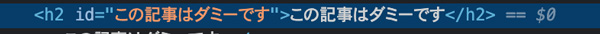
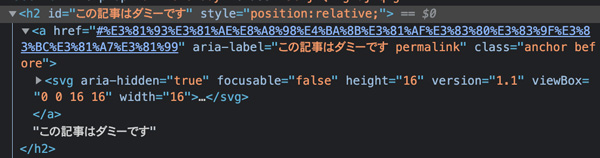
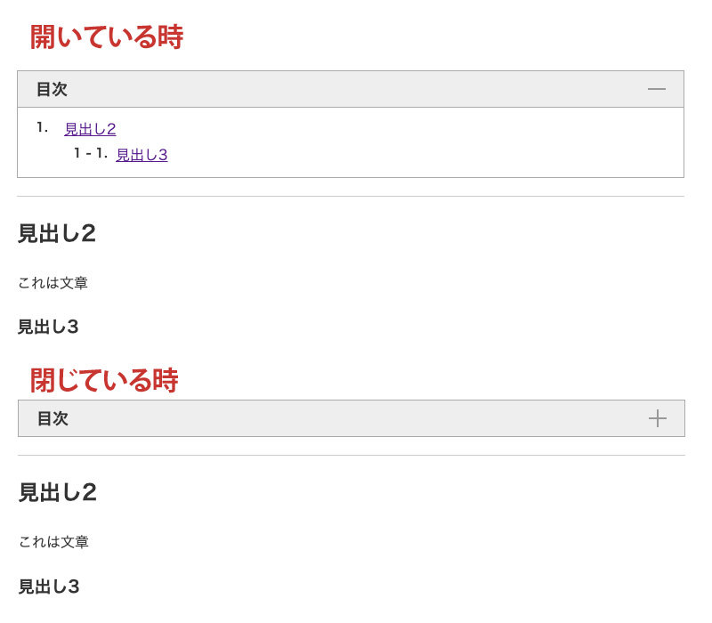

記事に目次をつけたかったのでプラグインgatsby-remark-autolink-headersを利用して目次を実装しました。

ulタグからolタグに変え、目次が長くなるので閉じるボタンをつけ、アコーディオンさせるなど少し改造しました。そのやり方について綴ります。

<p><small>※ 2021年12月v4バージョンアップに伴いリライトしました。</small></p>
<prof></prof>

## 今までのGatsbyの記事と注意点
現在ここまで記載しています。<br>制作するまでを目標にUPしていくので順を追ったらGatsbyサイトが作れると思います。

1. [インストールからNetlifyデプロイまで](/blogs/entry401/)
2. [ヘッダーとフッターを追加する](/blogs/entry484/)
2. [投稿テンプレにカテゴリやらメインビジュアル（アイキャッチ）追加](/blogs/entry406/)
3. [ブログ記事、カテゴリ、タグ一覧の出力](/blogs/entry408/)
4. *プラグインを利用して目次出力*（←イマココ）
5. [プラグインナシで一覧にページネーション実装](/blogs/entry413/)
6. [個別ページテンプレート作成](/blogs/entry416/)
7. [プラグインHelmetでSEO調整](/blogs/entry418/)
8. [CSSコンポーネントでオリジナルページを作ろう！！](/blogs/entry420/)
9. [関連記事一覧出力](/blogs/entry230/)
11. [タグクラウドコンポーネントを作成する](/blogs/entry486/)
12. [パンくずリストを追加する](/blogs/entry487/)
13. [記事内で独自タグ（コンポーネント）を使えるようにする](/blogs/entry489/)

<toc id="/blogs/entry410/"></toc>
<small>※ Gatsbyは2021月12月、v4にバージョンアップしています。随時リライトしています。</small>

このシリーズは[Github・gatsby-blog](https://github.com/yuririn/gatsby-blog)に各内容ブランチごとで分けて格納しています。

今回のソースは[table-of-content](https://github.com/yuririn/gatsby-blog/tree/table-of-content)ブランチにあります。

### このシリーズではテーマGatsby Starter Blogを改造
この記事は一番メジャーなテンプレート、「*Gatsby Starter Blog*」を改造しています。同じテーマでないと動かない可能性があります。

## 目次出力のためのプラグインgatsby-remark-autolink-headersを利用
GatsbyJSは豊富なプラグインが魅力です。

*gatsby-remark-autolink-headers* はプラグインの1つです。<br>
以下のようなことができます。

* 見出しタグにidを振る
* 見出しタグを抽出しリンク付きのリストタグを出力

[gatsby-remark-autolink-headers](https://www.gatsbyjs.com/plugins/gatsby-remark-autolink-headers/)

### gatsby-remark-autolink-headersをインストール
`npm`インストールします。

```bash:title=コマンド
npm install gatsby-remark-autolink-headers
```
### gatsby-config.jsにプラグインの追記
*gatsby-remark-autolink-headers* は *gatsby-transformer-remark* のサブプラグインです。<br>なので、gatsby-config.jsの *gatsby-transformer-remarkのoption* に記載します。

テーマGatsby Starter Blogを利用していれば*gatsby-transformer-remark*はインストールされているはずです。

```js{6}:title=gatsby-config.js
module.exports = {
  plugins: [
    {
      resolve: `gatsby-transformer-remark`,
      options: {
        plugins: [`gatsby-remark-autolink-headers`],
      },
    },
  ],
}

```

<br><br>このプラグイン1コ問題があって、公式サイトによると**プラグインgatsby-remark-prismjsよりも前に読み込む**必要があります。

```js
// good
{
  resolve: `gatsby-transformer-remark`,
  options: {
    plugins: [
      `gatsby-remark-autolink-headers`,
      `gatsby-remark-prismjs`,
    ],
  },
}

// bad
{
  resolve: `gatsby-transformer-remark`,
  options: {
    plugins: [
      `gatsby-remark-prismjs`, // should be placed after `gatsby-remark-autolink-headers`
      `gatsby-remark-autolink-headers`,
    ],
  },
}
```

### gatsby-remark-autolink-headersを実装

実装します。

[オプション](#オプションの一覧)の説明については記事の後ろに記載します。


```js{6-14}:title=gatsby-config.js
module.exports = {
  plugins: [
    {
      resolve: `gatsby-transformer-remark`,
      options: {
        plugins: [
          {
            resolve: `gatsby-remark-autolink-headers`,
            options: {
              icon: false,
              maintainCase: false,
            },
          },
        ],
      },
    }
  ]
}
```
今回はシンプルにアイコンなし。以下のように設定しました。



オプションを設定しなければ、以下のように無駄なコードも出力されます。



<div class="box">
<h4>optionのmaintainCaseをtrueにするとアンカーリングが効かなくなることも</h4>
<p>maintainCaseをtrueにすると見出しに追加されるidに含まれるアルファベットは大文字が小文字に変換されます。目次のアンカーと差異ができて飛ばなくなることがあります。なのでここではfalseにしておきましょう。</p>
</div>

### 目次を出力するコンポーネントを作成する
次に目次を出力するコンポーネントを作成します。

table-of-content.jsを追加します。
```
src/
    ├ templates/
    |   └ blog-post.js
    └ components/
        └ table-of-content.js（新規作成）
```

コードはこんな感じです。

```js:title=table-of-content.js
import React from "react";

const Topic = props => {
  return (
    <div>
      <h2>目次</h2>
        <div
          dangerouslySetInnerHTML={{
            __html: props.data,
          }}
        >
        </div>
      </div>
  );
};

export default Topic;
```
リスト化されたデータは`data.markdownRemark.tableOfContents`に格納されます。

blog-post.jsのGraghQLのスキーマ`markdownRemark()`内に`tableOfContents`を追記します。

<br>ポイントは`maxDepth`を指定することによって表示する**見出しの深さを調整**できます。

```
tableOfContents(maxDepth: 3)
```

<msg txt="目次のネスト（入れ子）が深いのはあまり好きじゃないんだよね"></msg>

ということで、見出し3（*maxDepth: 3*）まで取得することにしました。

あとは記事詳細テンプレの読み込みたい場所にコンポーネントを出力するだけです。

```js{1,6,47}:title=blog-post.js
import TOC from "../components/table-of-content"

//~コード省略~
const BlogPostTemplate = ({ data, location }) => {
  {/*~コード省略*/}
  <TOC data={data.markdownRemark.tableOfContents} />
  {/*~コード省略*/}
}

export default BlogPostTemplate

export const pageQuery = graphql`
  query BlogPostBySlug(
    $id: String!
    $previousPostId: String
    $nextPostId: String
    $hero: String
  ) {
    site {
      siteMetadata {
        title
      }
    }
    allFile(
      filter: {
        relativePath: { eq: $hero }
        sourceInstanceName: { eq: "images" }
      }
    ) {
      edges {
        node {
          relativePath
          childImageSharp {
            gatsbyImageData(
              width: 640
              formats: [AUTO, WEBP, AVIF]
              placeholder: BLURRED
            )
          }
        }
      }
    }
    markdownRemark(id: { eq: $id }) {
      id
      excerpt(pruneLength: 160)
      html
      tableOfContents(maxDepth: 3)
      frontmatter {
        title
        date(formatString: "YYYY-MM-DD")
        description
        cate
        tags
      }
    }
    # 省略
  }
`
```
## 出力されるタグをulからolに変え、開閉ボタンをつける
リスト出力がul（アンオーダーリスト・順不同リスト）なのは個人的にはちょっと気に入らないです。<br>
なのでここから少し改変します。<br><br>

JavaScript `replace` で `ul>` から `ol>` に置換します。<br>（閉じタグもあるのでこのような形にしました）

後ほどアコーディオン機能を実装します。チェックボックスを追加して `h2` を `label` に書き換えておきます。
```js{8,9}:title=table-of-content.js
import React from "react";

const Topic = props => {
  const list = props.data.replace(/(ul>)/gi, 'ol>');

  return (
    <div className="p-box--gray u-mblg">
      <input type="checkbox" class="mokuji" id="mokuji" />
      <label className="c-content__heading" for="mokuji">目次</label>
      <div className="c-editArea mokujiList">
        <div
          dangerouslySetInnerHTML={{
            __html: list,
          }}
        >
        </div>
      </div>
    </div>
  );
};

export default Topic;
```
### スタイリングする

カウンター関数を利用してスタイリング、アコーディオンは手間なのでCSSのみで実装しました。

今回はコードしか紹介しませんので詳しく原理を知りたい方はこちらをご覧ください。

<card id="/blogs/entry363/"></card>

<card id="/blogs/entry315/"></card>

```js{2,8,18}:title=table-of-content.js
import React from "react";
import styled from "styled-components" //追加

const TableOfContent = props => {
  const list = props.data.replace(/(ul>)/gi, "ol>")

  return (
    <TOC>
      <input type="checkbox" class="mokuji" id="mokuji" />
      <label className="heading" for="mokuji">
        目次
      </label>
      <div
        dangerouslySetInnerHTML={{
          __html: list,
        }}
      ></div>
    </TOC>
  )
}
export default TableOfContent
// 省略
```
style用のコンポーネントのコードです。

```js:title=table-of-content.js
const TOC = styled.div`
  border: 1px solid #aaa;
  padding: 0;
  margin: 20px 0;

  input {
    display: none;

    &:checked ~ div {
      max-height: 0;
    }
    &:checked ~ .heading::before {
        transform: rotate(90deg);
    }
  }
  div {
    transition: .3s;
    max-height: 200vh;
    overflow: hidden;
    p {
      margin: 0;
    }

    ol {
      counter-reset: cnt;
      list-style: none;
    }
    & > ol {
      margin: 0;
      padding: 10px 20px;
      border-top: 1px solid #aaa;

      li {
        counter-increment: cnt;
        position: relative;
        padding-left: 2em;
        &::before {
          left: 0;
          font-size: 1.4rem;
          font-weight: 700;
          position: absolute;
          content: counters(cnt, " - ")'.' ;
        }
        ol {
          padding-left: 0;

          li {
            padding-left: 3em;
          }
        }
      }
    }
  }
  .heading {
    background: #eee;
    font-size: 1.4rem;
    font-weight: 700;
    display: flex;
    align-items: center;
    padding: 0 20px;
    height: 40px;
    font-size: 18px;
    margin: 0;
    position: relative;

    &::after,
    &::before {
      position: absolute;
      content: '';
      height: 2px;
      width: 20px;
      background: #999;
      right: 20px;
      top: 19px;
      transition: .3s;
    }
  }
`
```
コンポーネント化してスタイルを書きたい場合は、styled-componentsのインストールが必要です。

```bash:title=コマンド
npm i styled-components
```



<br><br>最初から閉じておきたい場合は、`input`に`checked`を付与しておきましょう。

```html
<input type="checkbox" class="mokuji" id="mokuji" checked>
```
## オプションの一覧
オプションの一覧です。icon以外はあまり使うことないかもしれません。

|オプション|用途|
|-|-|
|*offsetY*|リンクをクリックして移動した時の見出しの上の空き（オフセット）の調整。pxです|
|*icon*|Boolean。デフォルトはtrueでホバーすると左にアイコンが表示されまます。|
|*class*|アンカーに独自のクラス名を指定するそう|
|*maintainCase*|Boolean。含まれる要は大文字小文字を維持するか指定できる。|
|*removeAccents*|Boolean。アクセント削除。日本人のサイトにはまず必要なさそう。|
|*isIconAfterHeader*|Boolean。アイコンの位置を右側に移動|
|*elements*|リンクを自動挿入するためのタグ一覧を配列で指定|

## まとめ
目次があると記事の全貌がわかり、読むか読まないかの判断ができ、ユーザーに優しいです。

次の記事は「[プラグインナシで一覧にページネーション実装](/blogs/entry413/)」です。

実際私のサイトでもヒートマップで確認すると、目次ってかなりクリックされているんですよ。

この記事が皆さんのコーディングライフの一助となれば幸いです。

最後までお読みいただきありがとうございました。
