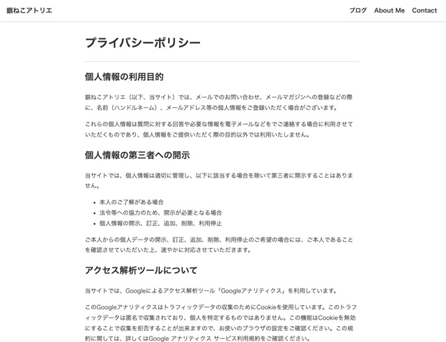

GatsbyでプライバシーポリシーやAboutページなど記事一覧のループと分ける方法をご紹介します。
<prof></prof>

## 今までのGatsbyの記事と注意点
現在ここまで記載しています。<br>制作するまでを目標にUPしていくので順を追ったらGatsbyサイトが作れると思います。

1. [インストールからNetlifyデプロイまで](/blogs/entry401/)
2. [ヘッダーとフッターを追加する](/blogs/entry484/)
2. [投稿テンプレにカテゴリやらメインビジュアル（アイキャッチ）追加](/blogs/entry406/)
3. [ブログ記事、カテゴリ、タグ一覧の出力](/blogs/entry408/)
4. [プラグインを利用して目次出力](/blogs/entry410/)
5. [プラグインナシで一覧にページネーション実装](/blogs/entry413/)
6. *個別ページテンプレート作成*（←イマココ）
7. [プラグインHelmetでSEO調整](/blogs/entry418/)
8. [CSSコンポーネントでオリジナルページを作ろう！！](/blogs/entry421/)
9. [関連記事一覧出力](/blogs/entry430/)
11. [タグクラウドコンポーネントを作成する](/blogs/entry486/)
12. [パンくずリストを追加する](/blogs/entry487/)
13. [記事内で独自タグ（コンポーネント）を使えるようにする](/blogs/entry489/)

<toc id="/blogs/entry416/"></toc>
このシリーズは[Github・gatsby-blog](https://github.com/yuririn/gatsby-blog)に各内容ブランチごとで分けて格納しています。

今回のソースは[other](https://github.com/yuririn/gatsby-blog/tree/other)ブランチにあります。

### このシリーズではテーマGatsby Starter Blogを改造
この記事は一番メジャーなテンプレート、「*Gatsby Starter Blog*」を改造しています。同じテーマでないと動かない可能性があります。


## 個別ページテンプレートの作り方
ポイントはループに含めないという点だけです。今回はブログ詳細一覧をコピーしてテンプレートを作成しました。

ファイル名をpage-post.jsとしておきます。

```
/ (プロジェクトディレクトリー)
    ├ gatsby-node.js（ページを生成するところ）
    ├ src/
    |  └ templates/
    |    └ page-post.js（個別ページを出力するテンプレート）
    └ content/
      └ blog/
        └ provacy-policy.md (個別のページ)
```

## createPageで個別ページを生成する
gatsby-node.jsにページを生成するためのコードを追記しておきます。<br>
`createPage()`関数でページは生成されます。

filterでfrontmatterの*pagetypeがblog以外のものを抽出*します。
```js:title=gatsby-node.js
// ~ 省略 ~
exports.createPages = async ({ graphql, actions, reporter }) => {
  // ~ 省略 ~

  const pagePost = path.resolve(`./src/templates/page-post.js`)

  if (posts.length > 0) {

    // ~ 省略 ~
    const pagePosts = posts.filter(post => post.frontmatter.pagetype !== "blog")

    pagePosts.forEach(
      createPage({
        path: post.fields.slug,
        component: pagePost,
        context: {
          id: post.id,
        },
      })
    )
  }
}
```
### 個別ページを出力するテンプレートpage-post.jsの編集

記事のIDが一致するものを出力するように設定します。

```js:title=page-post.js
import * as React from "react"
import { Link, graphql } from "gatsby"

import Layout from "../components/layout"
import Seo from "../components/seo"

import styled from "styled-components"

const PagePostTemplate = ({ data, location }) => {
  const post = data.markdownRemark
  const siteTitle = data.site.siteMetadata?.title || `Title`

  return (
    <Layout location={location} title={siteTitle}>
      <Seo
        title={post.frontmatter.title}
        description={post.frontmatter.description || post.excerpt}
      />
      <Article
        className="blog-post"
        itemScope
        itemType="http://schema.org/Article"
      >
        <header>
          <h1 itemProp="headline">{post.frontmatter.title}</h1>
        </header>
        <BlogEntry
          dangerouslySetInnerHTML={{ __html: post.html }}
          itemProp="articleBody"
        />
      </Article>
    </Layout>
  )
}

export default PagePostTemplate

export const pageQuery = graphql`
  query PagePostBySlug($id: String!) {
    site {
      siteMetadata {
        title
      }
    }
    markdownRemark(id: { eq: $id }) {
      id
      excerpt(pruneLength: 160)
      html
      frontmatter {
        title
        date(formatString: "YYYY-MM-DD")
        description
        cate
        tags
      }
    }
  }
`

const Article = styled.article`
  max-width: 750px;
  margin: 0 auto;
`
const BlogEntry = styled.section`
  margin: 15px 0 30px;
  border-top: 1px solid #ccc;
  border-bottom: 1px solid #ccc;
`
```
### privacy-policy.md ファイルを追加し編集
プライバシーポリシーページを追加します。



```md:title=privacy-policy.md
---
title: プライバシーポリシー
description: 個人情報保護方針についてのページです
---
## 個人情報の利用目的
銀ねこアトリエ（以下、当サイト）では、メールでのお問い合わせ、メールマガジンへの登録などの際に、名前（ハンドルネーム）、メールアドレス等の個人情報をご登録いただく場合がございます。

これらの個人情報は質問に対する回答や必要な情報を電子メールなどをでご連絡する場合に利用させていただくものであり、個人情報をご提供いただく際の目的以外では利用いたしません。
~ 省略 ~
```

これで個別ページが追加できるようになりました。

## まとめ・個別ページの追加はとってもカンタン
とってもカンタンでしたね！

次回はGatsbyサイトでの[OGP画像出力やプラグインHelmetを使ったSEO対応](/blogs/entry418/)の記事です。

皆さんのコーディングライフの一助となれば幸いです。

最後までお読みいただきありがとうございました。
