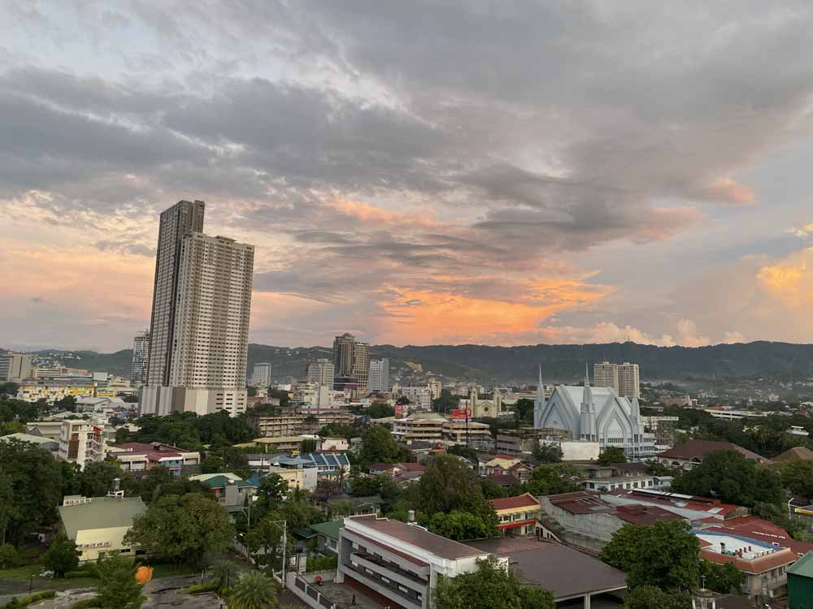
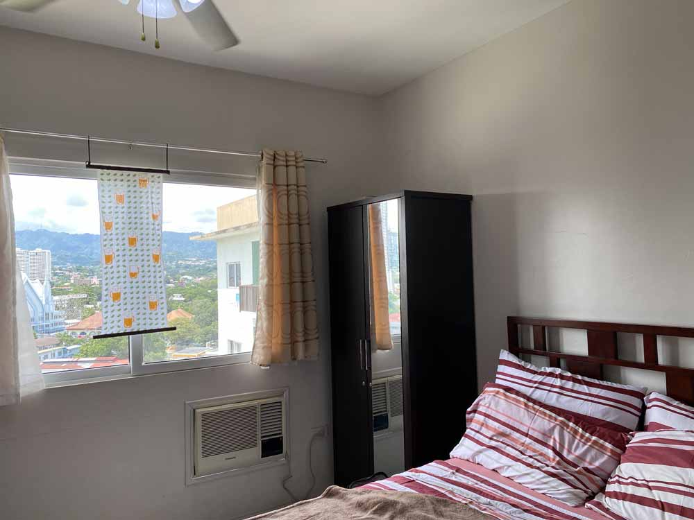
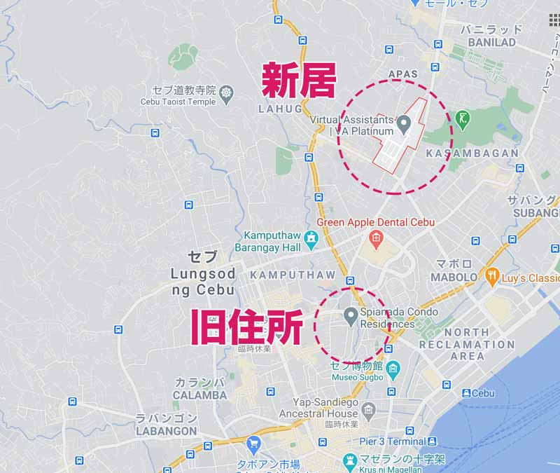
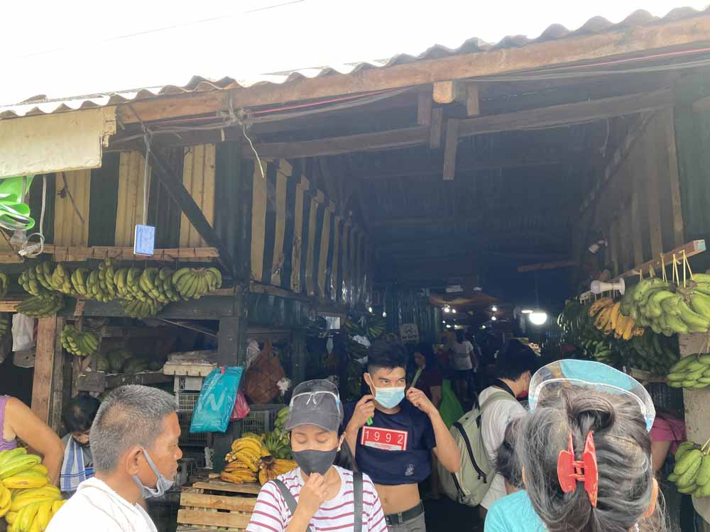
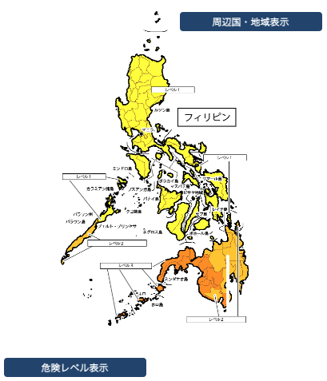
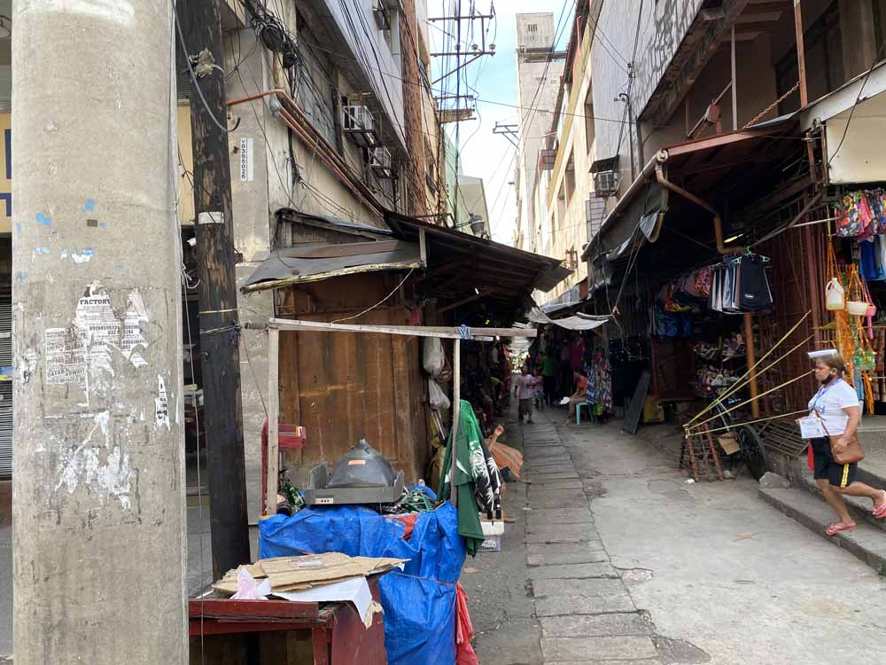
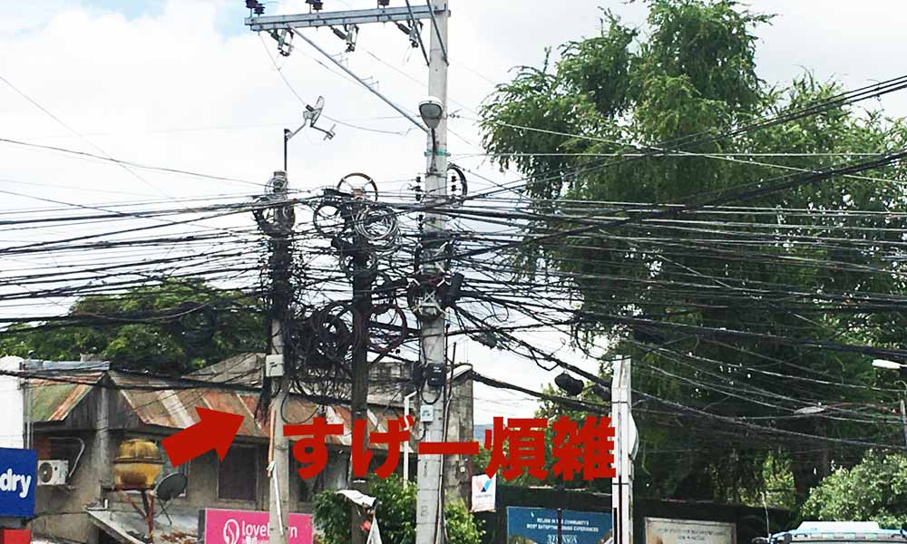
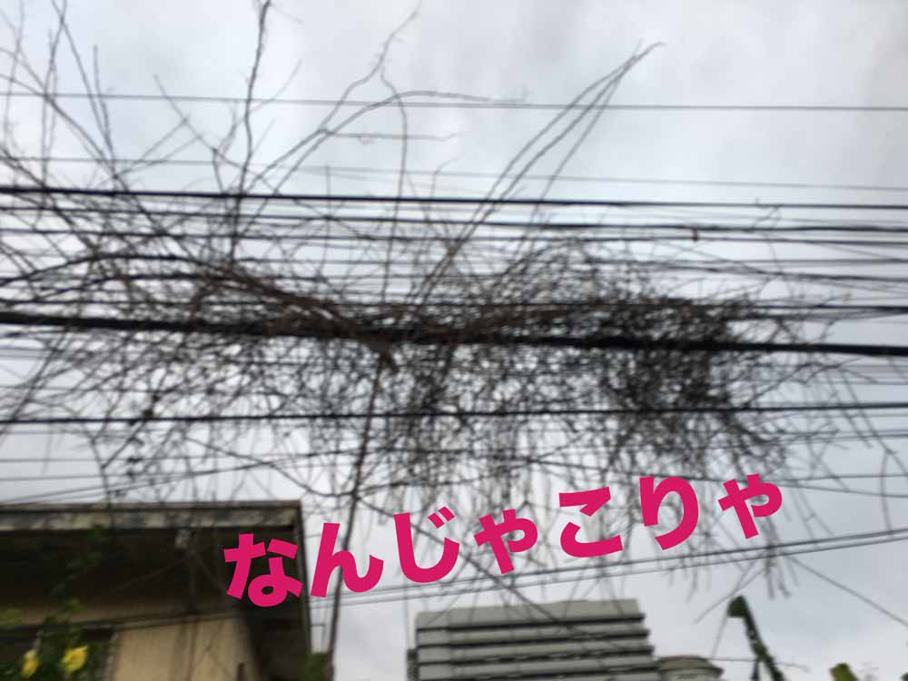
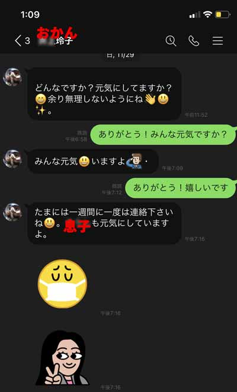

## ロックダウンが終われば海外移住も夢じゃない！？セブ島でプチ海外移住！

フィリピンは年中暖かく、物価も安い。 
公用語は英語なので中学レベルの英語を話すことができれば、日常生活でのコミュニケーションには困りません。

フィリピンは海外移住初心者にとても住みやすい国です。  

観光ビザで延長さえすれば3年もの間滞在できるので、*3 ~ 4か月の短期のプチ海外移住を体験*するのも夢ではありません。

<small>※2020年12月時点です。ルールはよく変わります。</small>  

とくにセブ島がオススメな理由です。

フィリピンの首都マニラに比べ**セブ島は治安が比較的いい**からです。

### YouTubeも公開しました！！
YouTubeも公開しましました！！引っ越し当日の様子など納めてますのでよろしければご覧ください！

<iframe width="560" height="315" src="https://www.youtube.com/embed/0HIdlacQMw0" frameborder="0" allow="accelerometer; autoplay; clipboard-write; encrypted-media; gyroscope; picture-in-picture" allowfullscreen></iframe>

## フィリピンには外国人向けのキレイなコンドミニアムがたくさんある

フィリピンセブ島は海外移住者向けに、プールやジム付きの快適なコンドミニアムがたくさんあります。

しかも家具や電化製品も備え付け。手ぶらで入居できます。

24時間警備員がいたり、コンドミニアムによっては週1度ハウスキーピングが入るところもあります。

### 現在ロックダウンの影響でコンドミニアムが安い！
2020年4月より*ロックダウンの影響で外国人居住者は激減*しました。  

入居者の減ったコンドミニアムオーナーにとってはピンチ。キレイで新しいコンドミニアムが安価に借りられるようになりました。

自国に戻らない外国人にとってはチャンスです！！  

この度私も「[セブポット](https://www.cebupot.com/)」さんの協力で引越すことにしました。

私が今回引っ越すのは日本人も多く住むITパークです。

他の地域に比べ治安も格段によく、ゴミも比較的落ちておらず清潔な地域です。

## 海外移住を検討する方へ。セブ島の物価は魅力！！私の月の生活費を公開します
私がセブ島に**住み続ける理由の1つに物価**が挙げられます。

ちなみにこちらは引越す前の月々の生活費です。

|項目|費用（ペソ）|
|-|-|
|賃貸（インターネット込み）|18,000|
|電気代|3,000 ~ 5,000|
|水道代|200|
|携帯代|400|
|*合計*|*21,600 ~ 23,600*|

日本円で約4~5万といったところです。

ジム・プール付きで、24時間エントランスにガードが配備されています。 
<small>※現在ジムはコロナの影響で使用不可です。</small>  

より治安のよいエリアに引越しますが、月額家賃がなんとネット代込みで1.7万ペソに！

1000ペソほど節約できます。**サイコー！！！**  

ちなみにこちらは私の日本での月の固定費です。

|項目|費用（円）|
|-|-|
|賃貸（3LDK）|65,000|
|電気代|3,000 ~ 8,000|
|水道代|-|
|ガス|5,000|
|インターネット|5,000|
|携帯代|10,000|
|*合計*|*85,000 ~ 93,000*|

<small>※私はひとり親なので水道代はタダした。</small>  

広島郊外の築20年の小汚いコーポに息子と住んでいました。

食費・息子の学費や交際費など、少なくとも月トータルで20万円以上使っていたと思います。

*ひとり親の補助があっても生活費は現在の倍以上*のかかっていました。  

現在の方が外食やレジャーも楽しみプチリッチな生活が実現できています。

ほどほどに日本人も住んでいるし、フィリピンは海外移住や海外ノマドを目指す人にぴったりの国です。

## 海外移住はやっぱり治安が不安。治安と上手に付き合う方法
海外移住の課題といえば治安です。

比較的治安のよいとされるセブ島でも、地域によっては危ない場所もあります。

ぶっちゃけ、「治安がいい国世界ランキング6位」の日本からすれば**どの国も治安が悪い**です。

海外に住みたいのであれば、*治安とどのように付き合うか*がポイントになります。

### 治安と付き合うため、「フィリピンの治安」を理解する
なぜフィリピンの治安は悪いのか。

理由は主に3つです。

1. イスラム過激派組織による爆弾テロ事件や身代金目的の誘拐事件等が多発（ミンダナオ地域の中部以西）。
2. もともと麻薬大国だったフィリピンはドゥテルテ大統領による「*麻薬戦争*」が勃発。麻薬所持・使用者は射殺していいとのこと。身代わりに殺される子どもがあとをたたない。
3. 貧困のため国全体で犯罪に走る人が多い。マニラを中心とした都市部ではに日本人を狙った強盗、窃盗、詐欺、恐喝が日常的に横行。

日本の外務省はフィリピンの渡航レベルを1 ~ 3に定めています。レベル3の「**渡航中止勧告**」地域もあります。

> #### フィリピンの危険レベル
> 
> * ミンダナオ地域の中部以西…レベル3
> * パラワン州南部 ~ ミンダナオ地域の中部以東…レベル2
> * 地域以外のマニラ首都圏を含む全地域…レベル1
>
> <small>レベル1：十分注意してください。（継続）</small> <small>レベル２：不要不急の渡航は止めてください。（継続）</small> <small>レベル３：渡航は止めてください。（渡航中止勧告）</small>
>
> [危険情報詳細・フィリピン | 外務省](https://www.anzen.mofa.go.jp/info/pchazardspecificinfo_2019T030.html#ad-image-0)より抜粋

<small>※ 補足しておくと、現在外務省によるとコロナ感染のレベルで見たフィリピンへの渡航レベルは3です。</small>

 私の住む中部ビサヤ地域、とくに*セブ島は比較的治安のいい地域*です。

にもかかわらず、はじめてフィリピンに来て2日後、私はiPhoneを盗まれました。  

スリなどならまだマシです。 
*ホールドアップ*といって銃を突きつけられ、金品を奪われることも少なくありません。

犯罪などに巻き込まれ、毎年数名の日本人が亡くなります。  

とくに**クリスマスシーズンのフィリピンの治安は悪化しやすい**です。  

私がセブ島にはじめて訪れた2019年。

今頃だったと思います。SMモールという大きなモールで銃撃強盗事件が起きました。しかも今年実行犯は出所とともに殺害されてしまいました。

### フィリピンでの治安対策

私が治安と付き合うために普段心がけていることがあります。

1. たとえ日中でもストリートを歩くとき、カバンはたすき掛けにしさらにしっかり抱え込んで歩く。
2. 明るくて人通りの多いところを歩く
3. 不要な夜分の外出は避ける
4. 暗くなったら移動手段にタクシーを使う
5. 街全体が治安のよい場所に住む

とりわけ住むエリアについてです。自分の居住する場所（コンドミニアムなど）を中心に*広範囲で安全*であることがポイントです。

フィリピンではいたるところにスラム街があり、コンドミニアム自体は安全でも街そのものはそうでもないこともあります。旧住居エリアがそれに当たりました。  

普段、居住する町を歩いているだけでも「日本人だから」という理由で目をつけられる可能性があります。

*平和ボケした日本人*なんてカモ以外他ならないです。肌の色が違うし、服装や振る舞いですぐバレます。  

何よりも大切なのは**ターゲットにならないこと**です。  

そして、フィリピンはまだロックダウン中です。 
多くのフィリピン人がロックダウンにより職を失っています。  

ロックダウン中は*例年より治安は悪化しているはず*なので、身を引き締めて行動していました。

セブ島に初渡航された方のためによくあるトラブルや犯罪についてまとめました。あわせてお読みください。

<card id="/blogs/entry503/"></card>

## おまけ・日本では考えられない！電気代が高いトンデモ理由
物価が安いはずのフィリピン、電気代だけはやたら高いと思いませんでした？

息子と二人暮らしだった日本の3LDKのコーポより、一人暮らしワンルームの方が明らかに高いです。  

実はフィリピンは電力を中国から買っています。

自国でほぼ発電していないのでとてもお高いです。

### フィリピン人は命がけで電気を盗む

電力が高いせいで*盗電する輩（やから）*もいます。

電気を盗むなんてはじめて聞きました。

しかも**盗電は命がけ**。春先から火事が増えるのはそのためです。  

私の知っているフィリピン人のエピソードです。やたら月の電気代が高いなーと思っていたら*隣人に自分ちの電気を盗まれていた*そうです。

中国からの輸入に頼りつつ、電気を盗む輩（やから）もいるのでさらに電気は高くなります。

### 盗電のせい？フィリピンの電線が絡まりようがとにかくひどい
ちなみにご覧ください。この絡まった電柱のコード。すごくないですか？ 

挙げ句の果てには枯れ木が絡まっています。。。

この煩雑さを見るだけで*私は気が狂いそう*です。

盗電で電柱からコードが引きちぎられるのかあちこちで電柱から垂れ下がってとても危ないです。  

毎年盗電しようとして感電するフィリピン人が多くいると思います。。。。

## まとめ・治安とうまく付き合えばセブ島海外移住は悪くない！
自分が外国人である自覚をもって羽目を外さなければ、セブ島はとても暮らしやすいところです。

ついでに、なぜここまで私が治安に対して神経質なのかもお話ししておきます。  

私が40歳過ぎているのにかかわらず、お恥ずかしながら私の両親は**超過保護**です。

未だ「**お前が海外に行くから悪い！**」と父親からチクチク言われます。

私がセブ島に引越したことに対して、まだ納得してません。  

うちの両親のような過保護な親族からすれば子どもが海外に住むだけで不安で仕方ないのです。

最近*今よりも安全なところに引越す*と両親に伝えただけでメチャ喜んでました。

「**治安とうまく付き合う**」ことは*海外移住の夢*と*親孝行*を両立できます。  

この記事が海外移住をお考えの方の一助となれば幸いです。

最後までお読みいただきありがとうございました。
