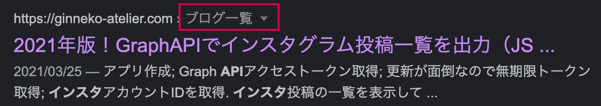
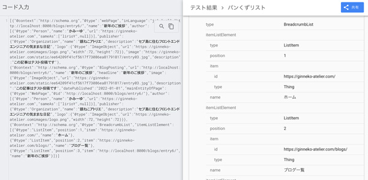
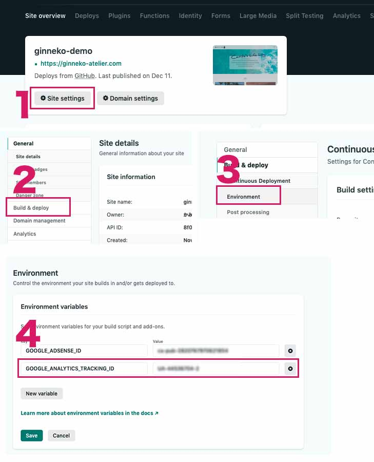
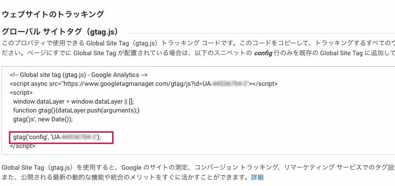
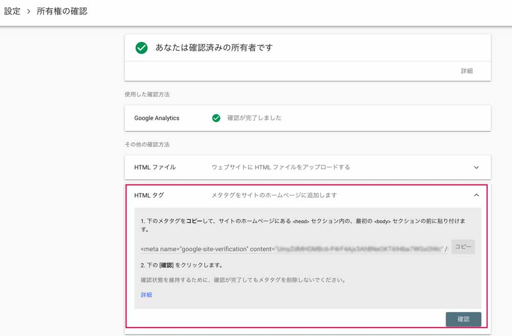
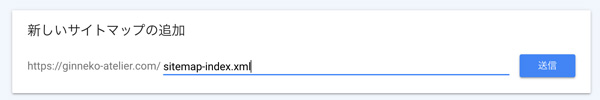

Gatsby記事もこれで8記事目となりました！！表示が早いだけではNG!!!サイトをちゃんと機能させるため、SEOで出力する情報を調整しました。パンくずやページの構造化データやOGP画像なども調整しています。

<p><small>※FBシェアのcanonilcal属性を修正しました。<br>※GA4に対応しました。<br>※ v4に対応しました。</small></p>
<prof></prof>

## 今までのGatsbyの記事と注意点
現在ここまで記載しています。<br>制作するまでを目標にUPしていくので順を追ったらGatsbyサイトが作れると思います。

1. [インストールからNetlifyデプロイまで](/blogs/entry401/)
2. [ヘッダーとフッターを追加する](/blogs/entry484/)
2. [投稿テンプレにカテゴリやらメインビジュアル（アイキャッチ）追加](/blogs/entry406/)
3. [ブログ記事、カテゴリ、タグ一覧の出力](/blogs/entry408/)
4. [プラグインを利用して目次出力](/blogs/entry410/)
5. [プラグインナシで一覧にページネーション実装](/blogs/entry413/)
6. [個別ページテンプレート作成](/blogs/entry416/)
7. *プラグインHelmetでSEO調整*（←イマココ）
8. [CSSコンポーネントでオリジナルページを作ろう！！](/blogs/entry421/)
9. [関連記事一覧出力](/blogs/entry430/)
11. [タグクラウドコンポーネントを作成する](/blogs/entry486/)
12. [パンくずリストを追加する](/blogs/entry487/)
13. [記事内で独自タグ（コンポーネント）を使えるようにする](/blogs/entry489/)

<toc id="/blogs/entry418/"></toc>
このシリーズは[Github・gatsby-blog](https://github.com/yuririn/gatsby-blog)に各内容ブランチごとで分けて格納しています。

今回のソースは[seo](https://github.com/yuririn/gatsby-blog/tree/seo)ブランチにあります。

### このシリーズではテーマGatsby Starter Blogを改造
この記事は一番メジャーなテンプレート、「*Gatsby Starter Blog*」を改造しています。同じテーマでないと動かない可能性があります。

## プラグインHelmetとは？
Helmetは「*Gatsby Starter Blog*」に最初からインストールされているプラグインで、head内にメタタグをまとめて出力してくれます。

今回ファイルの追加はとくにしません。

基本的には既存ファイルのsrc/components/seo.jsを改造します。

```
/ (プロジェクトディレクトリー)
  ├ static/
  |  └ images/
  |    ├ ogp.png（汎用ogp画像）
  |    └ logo.png（サイトのロゴ ）
  └ src/
    |  ├ thumbnail/ 記事のキービジュアルが格納されている
    |  └ templates/
    |    └ blog-post.js
    └ components/
          └ seo.js（head内にmetaタグなどを出力する）
```

## OGP画像が取得できるように下準備
Facebook、twitter、スマホでのGoogle検索一覧にも（運が良ければ）サムネイル画像が表示できるようにします。

```html
<!-- Facebookなど -->
<meta property="og:image" content=" サムネイル画像の URL" />
<!-- twitter -->
<meta property="twitter:image" content="サムネイル画像の URL">
<!-- スマホでのGoogle検索一覧 -->
<meta name="thumbnail" content="サムネイル画像の URL">
```
OGP画像は以下のように出しわけします。

* ブログ記事...[投稿テンプレにカテゴリやらメインビジュアル（アイキャッチ）追加](https://ginneko-atelier.com/blogs/entry406/)で設定した、キービジュアル画像
* ブログ記事以外（一覧やトップページなど）...共通画像

### 基本のアイキャッチの設定のあるblog-list.jsを改造する
画像のパスを取得するため、GraphQLのスキーマ `allFile` に `publicURL` を追加します。

```js{21}:title=blog-list.js
export const pageQuery = graphql`
  query BlogPostBySlug(
    $id: String!
    $previousPostId: String
    $nextPostId: String
    $hero: String
  ) {
    site {
      siteMetadata {
        title
      }
    }
    allFile(
      filter: {
        relativePath: { eq: $hero }
        sourceInstanceName: { eq: "images" }
      }
    ) {
      edges {
        node {
          publicURL
          relativePath
          childImageSharp {
            gatsbyImageData(
              width: 640
              formats: [AUTO, WEBP, AVIF]
              placeholder: BLURRED
            )
          }
        }
      }
    }
    # 省略
  }
`
```
OGP画像や検索などで表示されるサムネイル画像をアイキャッチと違う画像サイズを取得することもできます。リサイズされたパスを取得する方法についてはこちらをご覧ください。

<card id="/blogs/entry516/"></card>

<br/>

`<Seo/>`コンポーネントに値を付与します。ogp画像のパスを取得し、seo.jsに値を渡します。

```js{15,13}:title=blog-list.js
// 省略
const BlogPostTemplate = ({ data, location }) => {
  // 省略

  const ogpImg = data.allFile.edges[0].node.publicURL

  return (
    <Layout location={location} title={siteTitle}>
    <Seo
        title={post.frontmatter.title}
        description={post.frontmatter.description || post.excerpt}
        // ブログ記事のみ追加
        img={ogpImg}
        // すべてのテンプレに追加
        location={location}
      />
```
ページを出力しているすべてのテンプレに`location`属性を追加します。

seo.jsを変更します。

```js{7,29,31-32,46-49,62-65,82-85,92}:title=seo.js
import * as React from "react"
import PropTypes from "prop-types"
import { Helmet } from "react-helmet"
import { useStaticQuery, graphql } from "gatsby"

// img,location追加
const Seo = ({ description, lang, meta, title, img, location }) => {
  const { site } = useStaticQuery(
    graphql`
      query {
        site {
          siteMetadata {
            title
            description
            siteUrl
            social {
              twitter
              instagram
            }
          }
        }
      }
    `
  )

  const metaDescription = description || site.siteMetadata.description
  const defaultTitle = site.siteMetadata?.title
  // 画像パス取得
  const imgPath = `${site.siteMetadata.siteUrl.replace(/\/$/, "")}${img ? img : "/images/ogp.png"}`
  // トップページか判定
  const rootPath = `${__PATH_PREFIX__}/`
  const isRootPath = location.pathname === rootPath

  return (
    <Helmet
      htmlAttributes={{
        lang,
      }}
      title={title}
      titleTemplate={defaultTitle ? `%s | ${defaultTitle}` : null}
      meta={[
        {
          name: `description`,
          content: metaDescription,
        },
        {
          name: `thumbnail`,
          content: imgPath,
        },
        {
          property: `og:title`,
          content: title,
        },
        {
          property: `og:description`,
          content: metaDescription,
        },
        {
          property: `og:type`,
          content: `${isRootPath ? "website" : "webpage"}`,
        },
        {
          property: `og:url`,
          content: imgPath,
        },
        {
          name: `twitter:card`,
          content: `summary_large_image`,
        },
        {
          name: `twitter:creator`,
          content: site.siteMetadata?.social?.twitter || ``,
        },
        {
          name: `twitter:title`,
          content: title,
        },
        {
          name: `twitter:description`,
          content: metaDescription,
        },
        {
          property: `twitter:image`,
          content: imgPath,
        },
      ].concat(meta)}
    />
  )
}

Seo.defaultProps = {
  lang: `ja`,
  meta: [],
  description: ``,
}

Seo.propTypes = {
  description: PropTypes.string,
  lang: PropTypes.string,
  meta: PropTypes.arrayOf(PropTypes.object),
  title: PropTypes.string.isRequired,
}

export default Seo
```
補足。og:typeをトップページ以外を判定してwebpageを出力しています。
```js
{
  property: `og:type`,
  content: `${isRootPath ? "website" : "webpage"}`,
},
```
Twitterカードもサイズをお好みで変えてください。
```js
{
  name: `twitter:card`,
  content: `summary_large_image`,
},
```
日本語にするのも忘れずに。
```js
Seo.defaultProps = {
  lang: `ja`,
  meta: [],
  description: ``,
}
```

## URLの正規化をする
このサイトは投稿が増えると、一覧ページが無限に増えます。<br>
類似ページが何個もあると検索エンジンに認識されるのはSEO的にもよろしくないので、カノニカル属性を使ってURLを正規化します。 <br>※ FBシェアにおけるパラメーターの不具合を発見しcanonilcal属性を修正しました。
```html
<link rel="canonical" href="URL"/>
```
> ### canonical属性とは？
> canonical（カノニカル）属性とは、Google、Yahoo!、MSNなどの大手検索エンジンがサポートするURLを正規化するためのタグです。 同一のコンテンツが複数のURLで閲覧できる状態になっている場合、検索エンジンがインデックスするべきURLを統一させておく必要があります。 SEO対策において必須の内部対策です。

URLに`/page/数字/`を含む場合は除去し、URLをcanonical属性として出力します。

```js{6,23}:title=seo.js
  // 省略
  const isRootPath = location.pathname === rootPath

  let blogUrl = location ? location.href : site.siteMetadata.siteUrl
  // 一覧の2ページ目以降は除去
  blogUrl = String(blogUrl).replace(/page\/([0-9])+\//, "")

  return (
    <Helmet
      htmlAttributes={{
        lang,
      }}
      title={title}
      titleTemplate={defaultTitle ? `%s | ${defaultTitle}` : null}
      meta={[
        // 省略
        {
          property: `twitter:image`,
          content: imgPath,
        },
      ].concat(meta)}
    >
      <link rel="canonical" href={blogUrl} />
    </Helmet>
  )
}
// 省略
```
## 構造化データ（JSON-LD）追加
構造化データ（JSON-LD）を追加します。トップページはtypeを`WebSite`それ以外は`WebPage`とします。

またブログが記事のもののみ、BlogPosting（*この投稿はブログだよ！！って検索エンジンに教えます*）の構造化データを追加します。

### ページのデータ
seo.jsに構造化データのJSONを出力できるようにします。markdownファイルも公開日はもちろん、更新日（modifieddate）が取得できるようにしておきます。

何が大事って、**更新されて、手が入っているページ**かです。古い記事でも更新していることをアピールできることが大事です。

```md{4}:title=mdファイル
---
title: 記事サンプル
date: 2020-11-26
modifieddate: 2020-11-26
pagetype: blog
hero: thumbnail/entry01.jpg
description: この記事はテスト投稿です
cate: seo
tags: ['Gatsby', 'React']
---
```

JSONデータを追記して、出力します。

```js:title=seo.js
import * as React from "react"
import PropTypes from "prop-types"
import { Helmet } from "react-helmet"
import { useStaticQuery, graphql } from "gatsby"
//記述方法変更
const Seo = props => {
  const {
    description,
    img,
    location,
    lang,
    title,
    meta,
    type,
    date,
    modified,
  } = props
  // 省略

  const metaDescription = description || site.siteMetadata.description
  const defaultTitle = site.siteMetadata?.title
  const imgPath = `${site.siteMetadata.siteUrl.replace(/\/$/, "")}${
    img ? img : "/images/ogp.png"
  }`
  const rootPath = `${__PATH_PREFIX__}/`
  const isRootPath = location.pathname === rootPath

  let blogUrl = location ? location.href : site.siteMetadata.siteUrl
  // ページネーションのある箇所は削除
  blogUrl = String(blogUrl).replace(/page\/([0-9])+\//, "")

  // 構造化データの追加
  // 執筆者情報
  const author = [
    {
      "@type": "Person",
      name: site.siteMetadata.author.name,
      description: site.siteMetadata.author.summary,
      url: site.siteMetadata.siteUrl,
      sameAs: [
        site.siteMetadata.social.twitter,
        site.siteMetadata.social.instagram,
      ],
    },
  ]

  // 公開する組織など
  const publisher = {
    "@type": "Organization",
    name: site.siteMetadata.title,
    description: site.siteMetadata.description,
    logo: {
      "@type": "ImageObject",
      url: `${site.siteMetadata.siteUrl}images/logo.png`,
      width: 72,
      height: 72,
    },
  }

  // JSON-LDの設定
  let jsonLd = [
    {
      "@context": "http://schema.org",
      "@type": isRootPath ? "webSite" : "webPage",
      inLanguage: "ja",
      url: blogUrl,
      name: title,
      author,
      publisher,
      image: imgPath,
      description: metaDescription,
    },
  ]
  if (type === "blog") {
    const article = {
      "@context": "http://schema.org",
      "@type": "BlogPosting",
      url: blogUrl,
      name: title,
      headline: title,
      image: {
        "@type": "ImageObject",
        url: imgPath,
      },
      description: description,
      datePublished: date,
      dateModified: modified,
      mainEntityOfPage: {
        "@type": "WebPage",
        "@id": blogUrl,
      },
      author,
      publisher,
    }
    jsonLd = [...jsonLd, article]
  }

  return (
    <Helmet
      {/* 省略 */}
    >
      <link rel="canonical" href={blogUrl} />
      {/* 構造化データ出力 */}
      <script type="application/ld+json">
        {JSON.stringify(jsonLd)}
      </script>
    </Helmet>
  )
}

// 省略

export default Seo

```
### パンくずリスト

パンくずリストの構造化データも作成します。先ほどページ用に作ったJSONデータを格納した変数`jsonLd`と結合させます。

現時点では目に見えたパンくずリストはありませんが（後日記事書きました）、SEO上重要です。検索画面で親ページが日本語で表示されます。



ブログ・カテゴリ・タグのテンプレに`type`を追加します。こちらはカテゴリのテンプレのSeoコンポーネントです。

<card id="/blogs/entry487/"></card>

属性がちゃんとセットされているか確認しておきましょう。
```js
{/*ブログ*/}
<Seo
  title={title}
  location={location}
  type="blog-list"
  discription="ブログ一覧記事です。"
/>
{/*カテゴリ*/}
<Seo
  title={cate.name}
  location={location}
  type="cate-list"
  discription={`${cate.name}一覧記事です。${cate.description}`}
/>
{/*タグ*/}
<Seo
  title={tag}
  location={location}
  type="tag-list"
  discription={`${tag}一覧記事です。`}
/>
```
トップページ以外にパンくずの構造化データを追加します。
```js
if (!isRootPath) {
  let breadCrumbList
  const home = {
    "@type": "ListItem",
    "position": 1,
    "item": `${site.siteMetadata.siteUrl}/`,
    "name": "ホーム",
  }
  const blogList = {
    "@type": "ListItem",
    "position": 2,
    "item": `${site.siteMetadata.siteUrl}/blogs/`,
    "name": `ブログ一覧`,
  }

  if (type === "blog" || type === "cate-list" || type === "tag-list") {
    breadCrumbList = [
      home,
      blogList,
      {
        "@type": "ListItem",
        "position": 3,
        "item": blogUrl,
        "name": title,
      }
    ]
  } else if (type === "blog-list") {
    breadCrumbList = [
      home,
      blogList
    ]
  } else {
    breadCrumbList = [
      home,
      {
        "@type": "ListItem",
        "position": 2,
        "item": blogUrl,
        "name": title,
      }
    ]
  }
  jsonLd = [
    ...jsonLd,
    {
      "@context": "http://schema.org",
      "@type": "BreadcrumbList",
      "itemListElement": breadCrumbList,
    },
  ]
}
```
コードがきちんと動いているか、エラーがないかなどは[リッチリザルトテスト](https://search.google.com/test/rich-results)で確認しましょう。



## プラグインを使ってGoogleAnalyticsを追加（2021年4月6日追記！）

プラグインを使ってGoogleアナリティクスで計測できるようにします。

~~gatsby-plugin-google-analytics~~じゃなく、[gatsby-plugin-google-gtag](https://www.gatsbyjs.com/plugins/gatsby-plugin-google-gtag/)を使います！

<small>※ 通常のGAタグのIDを使い、GA4と連携させます。</small>

```bash:title=コマンド
npm install gatsby-plugin-google-gtag
```

プラグインをインストールしたら、gatsby-node.jsに追記します。

Googleアナリティクスはプラグインの一番上の方に追記してください。<br><br>

トラッキングIDは直接書くこともできますが、**Netlifyであれば環境変数で設定する方がベター**です。

```js:title=gatsby-node.js
module.exports = {
  plugins: [
    {
      resolve: `gatsby-plugin-google-gtag`,
      options: {
        trackingIds: [
          process.env.GOOGLE_ANALYTICS_TRACKING_ID,//トラッキングID
          process.env.GOOGLE_ADSENSE_ID,//Adsenseもまとめて入れられる！！
        ],
        pluginConfig: {
          head: true,//headerに追記
        },
      },
    },
  ],
}
```

環境変数はNetlifyの管理画面から設定したいプロジェクトを選び、deploy build > environmentを開きます。

あとはEnvironment valiables（環境変数）を登録するだけです。



*process.env.プラス設定した変数名*で呼び出せます。
```
process.env.GOOGLE_ANALYTICS_TRACKING_ID
```

<br>念の為analyticsのトラッキングコードIDの調べ方です。

Analyticsの管理画面から確認できます。




ここまでできたらあとはディプロイしたらanalyticsでトラッキングできるようになります。<br>

## Search consoleと連携
search consoleも連携しましょう。**メタタグにgoogle-site-verificationを追加する**のがカンタンです。

メタタグはsearch consoleの管理画面 > 設定 > 所有者の確認 >「HTMLタグ」から調べることができます。



```html
<meta name="google-site-verification" content="値" />
```
```js:title=seo.js
// ~ 省略 ~

return (
    <Helmet
      htmlAttributes={{
        lang,
      }}
      title={title}
      titleTemplate={pageName}
      meta={[

    // ~ 省略 ~

        {
          name: `google-site-verification`,
          content: `値`,
    },

        // ~ 省略 ~
```

## プラグインを使ってサイトマップを出力
最後にサイトマップの出力をしましょう。<br>
これでsearch consoleから、いつでもサイトマップを取得できるようになります。

[gatsby-plugin-sitemap](https://www.gatsbyjs.com/plugins/gatsby-plugin-sitemap/)

```bash:title=コマンド
npm install gatsby-plugin-sitemap
```
siteMetadata内のsiteUrlに必ずドメインを設定してください。

```js{3}:title=gatsby-config.js
module.exports = {
  siteMetadata: {
    siteUrl: `https://ginneko-atelier.com`,
  },
  plugins: [`gatsby-plugin-sitemap`]
}
```

私のケースではページネーションで生成されたページや404をサイトマップから除外しました。

ルートに出力するように設定しました。

```js:title=gatsby-config.js
module.exports = {
  plugins: [
    {
      resolve: `gatsby-plugin-sitemap`,
      options: {
        output: `/`,
        excludes: [
          `/blogs/page/*`,
          `/404?(.*)`,
          `/blogs/*/page/*`,
          `/blogs/tags/*/page/*`,
        ],
      },
    }
  ]
}
```
メインのサイトマップファイルは*sitemap-index.xml*として出力されます。

ここにsitemap-0.xml、sitemap-1.xmlという感じで追加されていきます。

Search Consoleからサイトマップを登録しておきます。



## まとめ・SEO情報が更新されたらブログを書くのが楽しくなる！
昨年は突貫でかなりやばいコードを書いていて申し訳な気持ちですが少しまともになりましたw。

FBやTwitterでのシェアしてOGP画像が表示されるようになりました。

皆さんのコーディングライフの一助となれば幸いです。

次の記事は「[CSSコンポーネントでオリジナルページを作ろう！！](/blogs/entry421/)」です。

最後までお読みいただきありがとうございました。
