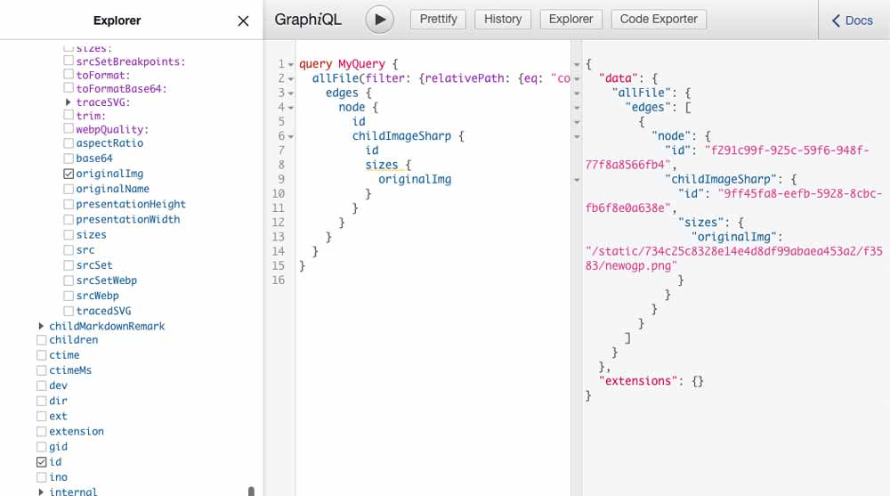
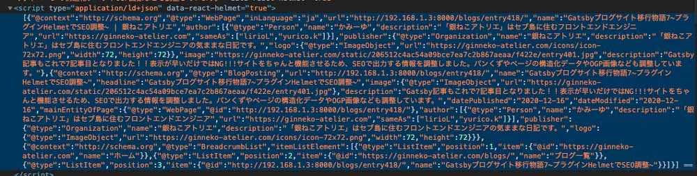

## 今までのGatsbyの記事と注意点
現在ここまで記載しています。<br>制作するまでを目標にUPしていくので順を追ったらGatsbyサイトが作れると思います。

1. [インストールからNetlifyデプロイまで](/blogs/entry401/)
2. [投稿ページの充実と画像の方法](/blogs/entry406/)
3. [ブログ記事、カテゴリー、タグ一覧の出力](/blogs/entry408/)
4. [プラグインを利用して目次出力](/blogs/entry410/)
5. [プラグインナシで一覧にページネーション実装](/blogs/entry413/)
6. [個別ページテンプレート作成](/blogs/entry416/)
7. プラグインHelmetでSEO調整（←イマココ）
8. [CSSコンポーネントでオリジナルページを作ろう！！](/blogs/entry421/)
9. [関連記事一覧出力](/blogs/entry430/)

### このシリーズではテーマGatsby Starter Blogを改造
この記事は一番メジャーなテンプレート、「*Gatsby Starter Blog*」を改造しています。同じテーマでないと動かない可能性があります。


## プラグインHelmetとは？
Helmetは「*Gatsby Starter Blog*」に最初からインストールされているプラグインで、head内にメタタグをまとめて出力してくれます。

今回ファイルの追加はとくにしません。

基本的には既存ファイルのsrc/components/seo.jsを改造します。

```
/ (プロジェクトディレクトリー)
  ├ gatsby-node.js
  └ gatsby-config.js
    └ src/
       |  ├templates/
       |    └ blog-post.js
       └ components/
           └ seo.js（head内にmetaタグなどを出力する）
```


## OGP画像などの追加
og:imageや、twitter:card、meta:thumbnailに画像が追加できるようにします。

デフォルトの設定のままだと表示されません。
デフォルトのOGP画像を設定しておきたいのでgatsby-config.jsを修正します。

[localhost:8000/___graphql](localhost:8000/___graphql)ででクエリを叩いでパスを取得しておきます。

common/newogp.pngというファイルを探している場合、ファイルは以下のクエリで格納場所が取得できます。

```js
query MyQuery {
  allFile(filter: {relativePath: {eq: "common/newogp.png"}}) {
    edges {
      node {
        id
        childImageSharp {
          id
          sizes {
            originalImg
          }
        }
      }
    }
  }
}

```



```
//取得した画像のパス
/static/734c25c8328e14e4d8df99abaea453a2/f3583/newogp.png
```

gatsby-config.jsに画像のパスを追記しておきます。OGP画像はドメインごとのパスを設定しておかないとうまく動かないので、公開先のドメインを追記しておきます。

```js
module.exports = {
  siteMetadata: {
    title: `銀ねこアトリエ`,
    author: {
      name: `かみーゆ`,
      summary: `「銀ねこアトリエ」はセブ島に住むフロントエンドエンジニア`,
    },
    description: `「銀ねこアトリエ」はセブ島に住むフロントエンドエンジニアの気ままな日記です。`,
    siteUrl: `https://ginneko-atelier.com`,
    image: `https://ginneko-atelier.com/static/734c25c8328e14e4d8df99abaea453a2/f3583/newogp.png`,//追加
    social: {

      twitter: `lirioL`,
      instagram: `yurico.k`,
      youtube: `https://www.youtube.com/channel/UCbSgjkCIPucux8cFTuQcdcw`,
    },
    // ~ 省略 ~
```

記事などはそれぞれのアイキャッチをOGPとして出力したいので、アイキャッチのフルパスが取得できるようにします。

gatsby-node.jsにコードを追記します。

```js
    // ~ 省略 ~
exports.createPages = async ({ graphql, actions, reporter }) => {
// Get all markdown blog posts sorted by date
  const result = await graphql(
    `
      {
        allMarkdownRemark(
          sort: { fields: [frontmatter___date], order: ASC }
          limit: 1000
        ) {
      totalCount
      nodes {
          id
          fields {
            slug
          }
          frontmatter {
            tags
            category
            cateId
            hero //なければ追加しておく
            pagetype
          }
        }
      }
      }
    `
  )
    // ~ 省略 ~

  if (post.frontmatter.pagetype === 'blog') {
    const previousPostId = index === 0 ? null : posts[index - 1].id
    const nextPostId = index === posts.length - 1 ? null : posts[index + 1].id
    createPage({
      path: post.fields.slug,
      component: blogPost,
      context: {
        id: post.id,
        previousPostId,
        nextPostId,
        hero: post.frontmatter.hero,//追加
      },
    })
    count++
  }
  // ~ 省略 ~

```

Blog Postからサムネイルのパスを取れるようにクエリを書き換えておきます。`allFile()`の追記をします。

これでSEOコンポーネントにアイキャッチのimageのパスを渡せるようになりました。

```js
// ~ 省略 ~
<SEO
  title={post.frontmatter.title}
  description={post.frontmatter.description || post.excerpt}
  image={src} //追加
  location={location} //なければ追加
/>

// ~ 省略 ~
export const pageQuery = graphql`
  query BlogPostBySlug(
    $id: String!
    $previousPostId: String
    $nextPostId: String
    $hero: String
  )
  {
    site {
      siteMetadata {
        title
      }
    }
    allFile(
      filter: {
        relativePath: {eq: $hero}
        sourceInstanceName: {eq: "assets"}
      }
    ){
      edges {
        node {
          name
          relativePath
          childImageSharp {
            fluid(maxWidth: 800) {
              ...GatsbyImageSharpFluid_withWebp
            }
          }
        }
      }
    }
    markdownRemark(
      id: {eq: $id }
    ){
      id
      excerpt(pruneLength: 160)
      html
      tableOfContents
      frontmatter {
        title
        date(formatString: "YYYY.MM.DD")
        description
        lead
        hero
        category
        cateId
        tags
        pagetype
        modifieddate(formatString: "YYYY.MM.DD")
      }
    }
    previous: markdownRemark(id: {eq: $previousPostId }) {
      fields {
          slug
      }
      frontmatter {
        title
      }
    }
    next: markdownRemark(id: {eq: $nextPostId }) {
      fields {
        slug
      }
      frontmatter {
        title
      }
    }
  }
`

```
src/components/seo.jsを改良します。

サイトの基本情報を引っ張ってこれるようにしておきます。

アイキャッチを持っていればアイキャッチのパスを取得しなければデフォルト画像を表示できるようにします。

```js
// ~ 省略 ~

import config from "../../gatsby-config"

// ~ 省略 ~

const SEO = ({ description, lang, meta, title, image, location }) => {
  const { site } = useStaticQuery(
    graphql`
    query {
      site {
      siteMetadata {
        title
        description
      }
      }
    }
    `
  )
  // ~ 省略 ~

  const ogImage = image ? `${config.siteMetadata.siteUrl}${image}`: config.siteMetadata.image

  // ~ 省略 ~

  return (
    <Helmet
    // ~ 省略 ~
    </Helmet>
  )
}

SEO.defaultProps = {
  lang: `ja`,
  meta: [],
  description: ``,
}

SEO.propTypes = {
  description: PropTypes.string,
  lang: PropTypes.string,
  meta: PropTypes.arrayOf(PropTypes.object),
  title: PropTypes.string.isRequired,
  image: PropTypes.string, //追加
  location: PropTypes.string, //なければ追加
}

export default SEO
```
引数`image`から画像パスを取得します。取得できない場合はデフォルト画像を表示します。

```js
const ogImage = image ? `${config.siteMetadata.siteUrl}${image}`: config.siteMetadata.image
```

メタが出力されるように追加します。

今回は*og:image*、*twitter:card*、*metathumbnail*の3つを追加しました。

```JS
return (
  <Helmet
    htmlAttributes={{
      lang,
    }}
    title={title}
    titleTemplate={pageName}
    meta={[
      {
        name: `description`,
        content: metaDescription,
      },
      {
        property: `og:title`,
        content: title,
      },
      {
        property: `og:description`,
        content: metaDescription,
      },
      {
        property: `og:type`,
        content: `website`,
      },
      {
        name: `og:image`,//追加
        content: ogImage,//追加
      },
      {
        name: `twitter:card`,
        content: `summary_large_image`,
      },
      {
        name: `thumbnail`,//追加
        content: ogImage,//追加
      },
      {
        name: `twitter:image`,//追加
        content: ogImage,//追加
      },
      {
        name: `twitter:creator`,
        content: config.siteMetadata.social.twitter || ``,
      },
      {
        name: `twitter:title`,
        content: title,
      },
      {
        name: `twitter:description`,
        content: metaDescription,
      },
    ].concat(meta)}
  >
```
### URLの正規化をする
このサイトはページネーションがあるので投稿が増えると、一覧ページが無限に増えます。
類似ページが何個もあると検索エンジンに認識されるのはSEO的にもよろしくないので、カノニカル属性を使ってURLを正規化します。
※ FBシェアにおけるパラメーターの不具合を発見しcanonilcal属性を修正しました。

```html
<link rel="canonical" href="URL"/>
```

> ### canonical属性とは？
> canonical（カノニカル）属性とは、Google、Yahoo!、MSNなどの大手検索エンジンがサポートするURLを正規化するためのタグです。
> 同一のコンテンツが複数のURLで閲覧できる状態になっている場合、検索エンジンがインデックスするべきURLを統一させておく必要があります。
> SEO対策において必須の内部対策です。


各ページのテンプレート（post-blog.jsなど）のSEOコンポーネントに`location`がなければ追加します。
```js
      <SEO
        title={post.frontmatter.title}
        description={post.frontmatter.description || post.excerpt}
        image={src}
        location={location}
        type='archive'
      />
```

URLに`/page/数字/`を含む場合は除去し、そのURLをcanonical属性として出力します。

```js
  // ~ 省略 ~

  let blogUrl = location ? location.href : `${config.siteMetadata.siteUrl}/`
  // ページネーション削除
  if (type === 'archive' || type === 'blogs') {
    blogUrl = String(blogUrl).replace(/page\/([0-9])+\//, '')
  }

  // ~ 省略 ~

  return (
    <Helmet
      htmlAttributes={{
        lang,
      }}
      title={title}
      titleTemplate={pageName}
      meta={[
    // ~ 省略 ~
    {
      name: `og:url`,
      content: blogUrl,
    },
      {
      ].concat(meta)}
    >
      <link rel="canonical" href={blogUrl}/>

    </Helmet>
  )
}

// ~ 省略 ~
```

## 構造化データ追加
構造化データを追加します。トップページはtypeを`WebSite`それ以外は`WebPage`とします。

またブログ投稿（typeがarticleのもの）のみ、BlogPosting（*この投稿はブログだよ！！って検索エンジンに教えます*）の構造化データを追加します。

post-blog.jsのSEOコンポーネントに`type="article"`を追加しておきます。

### ページのデータ
seo.jsに構造化データのJsonを出力できるようにします。更新日（modifieddate）や公開日情報（date）もすべて取得できるようにしておきます。

```js
const SEO = ({ description, lang, meta, title, image, location, modifieddate, date, type }) => {

// ~ 省略 ~

  //トップページの判定
  const isRoot = `${config.siteMetadata.siteUrl}/` === blogUrl ? true : false
  let page = isRoot ? 'WebSite' : 'WebPage'

  //更新日がない場合公開日を代入
  const modified = modifieddate ? modifieddate : date

  // 執筆者情報
  const author = [
    {
      '@type': 'Person',
      name: config.siteMetadata.author.name,
      description: config.siteMetadata.author.summary,
      'url': domain,
      "sameAs": [
        config.siteMetadata.social.twitter,
        config.siteMetadata.social.instagram,
      ]
    }
  ];

  //公開する人の判定
  const publisher = {
    '@type': 'Organization',
    name: config.siteMetadata.title,
    description: config.siteMetadata.description,
    logo: {
      '@type': 'ImageObject',
      url: `${config.siteMetadata.siteUrl}/icons/icon-72x72.png`,
      width: 72,
      height: 72
    }
  }


  // JSON+LDの設定
  const jsonLdConfigs = [
    {
      '@context': 'http://schema.org',
      '@type': page,
      inLanguage: 'ja',
      url: blogUrl,
      name: pageName,
      author,
      publisher,
      image: ogImage,
      description: metaDescription,
    }
  ];

  if (type === 'article') {
    jsonLdConfigs.push({
      '@context': 'http://schema.org',
      '@type': 'BlogPosting',
      url: blogUrl,
      name: title,
      headline: title,
      image: {
        '@type': 'ImageObject',
        url: ogImage,
      },
      description: description,
      datePublished: date.replace(/\./g, '-'),
      dateModified: modified.replace(/\./g, '-'),
      mainEntityOfPage: {
        '@type': 'WebPage',
        '@id': blogUrl
      },
      author,
      publisher
    });
  }
    // ~ 省略 ~

  return (
    <Helmet
    // ~ 省略 ~
      ].concat(meta)}
    >
      <link rel="canonical" href={blogUrl}/>
      <script type="application/ld+json">{JSON.stringify(jsonLdConfigs)}</script> {/*追加*/}
    </Helmet>
  )
}

SEO.defaultProps = {
  lang: `ja`,
  meta: [],
  description: ``,
}

SEO.propTypes = {
  description: PropTypes.string,
  lang: PropTypes.string,
  meta: PropTypes.arrayOf(PropTypes.object),
  title: PropTypes.string.isRequired,
  image: PropTypes.string,
  type: PropTypes.string,//追加
  location: PropTypes.string,
  date: PropTypes.string,//追加
  modifieddate: PropTypes.string,//追加
}

export default SEO
```
### パンくずリスト
パンくずリストの構造化データも作成します。先ほどページ用に作ったJsonデータ`jsonLdConfigs`と結合させます。

カテゴリーと記事は3階層まであるのでtypeで（`archive`と`article`）判定して出力内容を変えます。

```js
  if (!isRoot) {
    const breadCrumbList = [];
    breadCrumbList.push(
      {
        '@type': 'ListItem',
        position: 1,
        item: {
          '@id': `${config.siteMetadata.siteUrl}/`,
          name: 'ホーム',
        },

      })
    if (type === 'archive' || type === 'article') {
      breadCrumbList.push(
        {
          '@type': 'ListItem',
          position: 2,
          item: {
            '@id': `${config.siteMetadata.siteUrl}/blogs/`,
            name: `ブログ一覧`,
          },
        },
      )
      breadCrumbList.push(
        {
          '@type': 'ListItem',
          position: 3,
          item: {
            '@id': blogUrl,
            name: title,
          },
        },
      )
    } else {
      breadCrumbList.push(
        {
          '@type': 'ListItem',
          position: 2,
          item: {
            '@id': blogUrl,
            name: title,
          },
        },
      )
    }

    jsonLdConfigs.push({
      '@context': 'http://schema.org',
      '@type': 'BreadcrumbList',
      itemListElement: breadCrumbList
    })
  }
```

ぎっしり構造化データが出力されるようになりました！



## プラグインを使ってGoogleAnalyticsを追加（2021年4月6日追記！）

プラグインを使ってGoogleアナリティクスで計測できるようにします。

~~gatsby-plugin-google-analytics~~

じゃなく、こっちを使います！

[gatsby-plugin-google-gtag](https://www.gatsbyjs.com/plugins/gatsby-plugin-google-gtag/)

gatsby-plugin-google-analyticsはanalytics.jsが使われています。GA4でも計測したいのでgtag.jsに切り替える必要があります！

<small>※ 通常のGAタグのIDを使い、GA4と連携させます。</small>

```
npm install gatsby-plugin-google-gtag
```

プラグインをインストールしたら、gatsby-node.jsに追記します。

Googleアナリティクスはプラグインの一番上の方に追記してください。<br><br>

トラッキングIDは直接書くこともできますが、**Netlifyであれば環境変数で設定する方がベター**です。

```js
module.exports = {
  plugins: [
    {
      resolve: `gatsby-plugin-google-gtag`,
      options: {
        trackingIds: [
          process.env.GOOGLE_ANALYTICS_TRACKING_ID,//トラッキングID
          process.env.GOOGLE_ADSENSE_ID,//Adsenseもまとめて入れられる！！
        ],
        pluginConfig: {
          head: true,//headerに追記
        },
      },
    },
  ],
}
```

環境変数はNetlifyの管理画面から設定したいプロジェクトを選び、deploy build > environmentを開きます。

あとはEnvironment valiables（環境変数）を登録するだけです。


*process.env.プラス設定した変数名*で呼び出せます。
```
process.env.GOOGLE_ANALYTICS_TRACKING_ID
```

<br>念の為analyticsのトラッキングコードIDの調べ方です。

Analyticsの管理画面から確認できます。


ここまでできたらあとはディプロイしたらanalyticsでトラッキングできるようになります。<br>

## Search consoleと連携
search consoleも連携しましょう。メタタグにgoogle-site-verificationを追加するのが簡単です。

メタタグはsearch consoleの管理画面 > 設定 > 所有者の確認 >「HTMLタグ」から調べることができます。


```html
<meta name="google-site-verification" content="値" />
```
```js
// ~ 省略 ~

return (
    <Helmet
      htmlAttributes={{
        lang,
      }}
      title={title}
      titleTemplate={pageName}
      meta={[

    // ~ 省略 ~

        {
          name: `google-site-verification`,
          content: `値`,
    },

        // ~ 省略 ~
```

## プラグインを使ってサイトマップを出力
最後に、サイトマップの出力をしましょう。
これでsearch consoleから、いつでも更新も通知できるようになります。

[gatsby-plugin-sitemap](https://www.gatsbyjs.com/plugins/gatsby-plugin-sitemap/)

```
npm install gatsby-plugin-sitemap
```
siteMetadata内のsiteUrlに必ずドメインを設定してください。

```js
module.exports = {
  siteMetadata: {
    siteUrl: `https://ginneko-atelier.com`,
  },
  plugins: [`gatsby-plugin-sitemap`]
}
```

私のケースではページネーションで生成されたページはサイトマップから除外しました。サイトマップのファイルはsitemap.xmlとしましたがお好みで変えることも可能です。

```js
module.exports = {
  plugins: [
    {
      resolve: `gatsby-plugin-sitemap`,
      options: {
        output: `/sitemap.xml`,
        exclude: [`/blogs/page/*`, `/blogs/tags/*/page/*`, `/blogs/*/page/*`],
      }
    }
  ]
}
```

## まとめ・SEO情報が更新されたらブログを書くのが楽しくなる！
これで、FBやTwitterでのシェアしてOGP画像が表示されるようになりました。

次回「*Gatsbyブログサイト移行物語*」ではmdファイルなしで[CSSモジュールを使ってportfolioページを作ったのでそのやり方についてご紹介](/blogs/entry420/)します。

皆さんのコーディングライフの一助となれば幸いです。

最後までお読みいただきありがとうございました。
