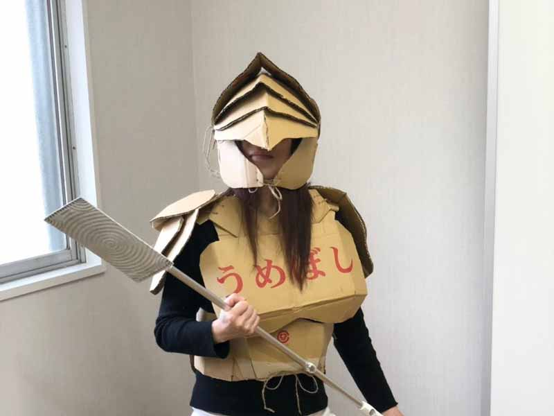
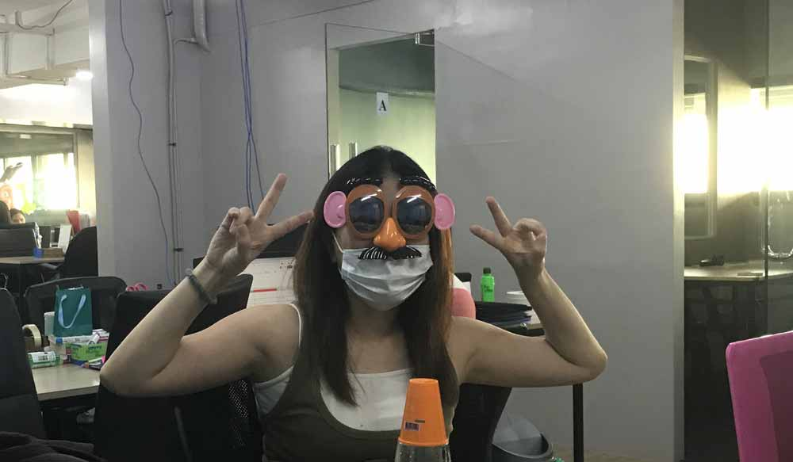

皆さんの周りに中間子（真ん中っ子）っていますか？

悲しいかな、中間子は予測不能、意味不明、よくわからん性格の人ばかりと思われがちです。 私は4人兄弟ど真ん中の中間子です。

<prof></prof>

紹介を見ていただけばわかるように、初めて海外に出たと思ったら、突然起業したり予測がつかないのが中間子。 そんな私達を理解して欲しくて中間子の私が取扱い方を説明します。

## 兄弟の順番ってすごーく性格に影響する
血液型や星座で性格判断する人もいますが、ぶっちゃけ根拠が薄いと思います。 
そもそも*人間の性格って育った環境に形成*されると考えています。

育った環境といえば**一番影響するのが家族構成**です。とくに兄弟の順番ってもろ性格の違いが出やすいです。

一概にはいえませんが、性格を判断をする上でとても参考なります。

## 中間子は変わり者？生い立ちから形成される性格や特徴
私実は4人兄弟の真ん中。少子化が進む日本で珍しい*中間子*です。

私の子供の頃ですら、日本ではすでに2人兄弟が一般的でした。

さらに中間子は毛嫌いされることが多かったです。

**中間子は変わり者が多い**からという理由です。  

*私のことも中間子のことも嫌いにならないで！！！*  

生い立ちから形成される中間子の性格を独断と経験からご紹介します。

<ad location="/blogs/entry420/"></ad>

### そもそも両親から構ってもらえない
中間子は親から見て死角です。とにかく構ってもらえません。 
私が子どもの頃、親は兄にお金を持たせて私を兄と同じ床屋で髪を切らせてました。 

床屋なので男の子のような髪型にされるだけでなく、兄のお下がりを着ていました。

兄と兄の友達と外で遊ぶので秘密基地やカエルや虫の思い出ばかりです。

真っ黒に焼けて、しょっちゅう男の子に間違われてました。  

私に比べて末っ子の幼い頃はいつもフリフリの可愛いスカートで着せ替え人形のようでした。正直羨ましかったです。

大抵の中間子は家族というコミュニティで**扱いがもっとも底辺**です。 
そして*幼少期から格差社会の洗礼を受ける*のが中間子の宿命です。

### 親に見てもらえないから目立ちたくなる
子供の頃から親に見てもらえなかったから*何とか目立とうとする*のが中間子です。 
私も思い出すと、親の注目を集めようと*笑いを取る努力*を惜しみませんでした。

実際変な格好ばかりしていました。  

いまだにこんなことばかりしているのは昔の名残です。

### 幸せの基準が低い
子供の頃から、中間子は家族からの記念日のお祝いが雑になりがちです。

参観日もあまり来てもらえませんでした。もし来てもらえたなら飛び跳ねて喜びました。

いまだに、些細なことで喜びます。 
最近母から「元気にしてますか？週に1回連絡しなさいよ」ってLINEが来ただけで嬉しかったです。  

しかし現実は母に電話したところで「今忙しい」と言われてしょっちゅうブチ切りされます。

### 飛び出したら戻ってこない
中間子は長女や長男のように期待もされず、末っ子のように過保護にも扱われません。

親の盲点をついて好き放題やり放題になります。

私の人生をざっくりまとめるとこんな感じです。

* 面白くないから大学中退
* イラストレーターになりたくて専門のお金を貯めてる最中にデキ婚
* 子育てしながらネイリスト
* 離婚
* 突然プログラマー
* 故郷を飛び出して海外生活

 私以外の兄弟は会計事務所などめちゃ固い仕事をしています。

私だけ突然変異に育ってしまい、今となっては話が噛み合わない自信あります。

たまに*私だけなんでこんなことになってしまったんだろう*って悩むこともありました。 
ちなみに、親戚の中間子も看護婦、海外ボランティア、エステティシャンで起業と結構自由に生きています。

変な中間子は私だけじゃないのでホッとします。

### サバイバー。どこでも生きていける
中間子は親の注目を集められないので外に目が向くようになります。

幼い頃から家族以外との付き合い方を覚えるので、外で生きていくのが上手いです。

友だちや仲間も状況に応じて見つけます。

親に*レールを用意されていなかった*ので自分の道を自分で探します。

<ad location="/blogs/entry420/"></ad>

自分の人生は自分で決めて、どこでも生きていけます。

### 顔色は見るけど伺わない
親に期待もされていないし、ほかの子に比べて放置されているので親の顔色を伺う必要がありませんでした。 
なので抑圧されませんので伸び伸び育ちます。

ただ、**中間子は空気を読むのは上手い**です。 
気を抜くとほかの兄弟にオヤツを食べられてしまいますしね。

顔色を誰よりも気づいていますが、素知らぬふりもできます。

### たまにうらやまさみしい
姉は褒められたり、兄は母にいつも構われたり、妹はかわいい洋服をたくさん買ってもらったり。。。 
子どもの頃はいつも他の兄弟が羨ましくて仕方ない状態です。

時折、私だけ、、、と寂しくなることもあります。

### 基本自分で解決する
寂しくても、嫉妬してもやっぱり構ってもらえません。 
なのでコンプレックスは自分で解決します。

自分のご機嫌は自分で取る術（すべ）を覚えます。

### 他人からの評価を気にせず生きられる
親からは**評価の対象ですらなかった**ので他人からの評価をあまり気にしません。

私自身、他己承認欲求は低い方だと思います。

それよりも自分が自分をどう思えるかの方が大切です。

たとえ彼氏から「鼻毛出とるで」と言われても、恥ずかしい気持ちよりナチュラルに笑いをとれた方が嬉しいです（実話）。

ようは基本自分が心地よければよいのです。

<kyle item="ken"></kyle>

## まとめ・放っておけば良い。そして中間子サイコー！
中間子は好きに生きていくので無理に取り扱おうとせず放っておけば良いんです。

お調子者に見えて、他の兄弟をめっちゃ観察しているのでどこでも生きていけるサバイバーです。

私も中間子に生まれたからこそ、親だけでなく誰の顔色も伺わず今まで自由で好きに生きてこれました。  

**中間子サイコー！！！**  

日本では中間子は絶滅危惧種。

そんな中間子を今後ともよろしくお願いします。

<a href="https://hb.afl.rakuten.co.jp/hgc/g000001d.j0byi5ae.g000001d.j0byj7d4/kaereba_main_202303200345012927?pc=https%3A%2F%2Fproduct.rakuten.co.jp%2Fproduct%2F-%2F64dbfad917d852dd8bb643c5e0ab760e%2F&m=http%3A%2F%2Fm.product.rakuten.co.jp%2Fproduct%2F64dbfad917d852dd8bb643c5e0ab760e%2F" target="_blank" >不機嫌な長男・長女無責任な末っ子たち 「きょうだい型」性格分析＆コミュニケ-ション  /ディスカヴァ-・トゥエンティワン/五百田達成</a>
posted with <a href="https://kaereba.com" rel="nofollow" target="_blank">カエレバ</a>

<a href="https://hb.afl.rakuten.co.jp/hgc/g000001d.j0byi5ae.g000001d.j0byj7d4/kaereba_main_202303200345012927?pc=https%3A%2F%2Fproduct.rakuten.co.jp%2Fproduct%2F-%2F64dbfad917d852dd8bb643c5e0ab760e%2F&m=http%3A%2F%2Fm.product.rakuten.co.jp%2Fproduct%2F64dbfad917d852dd8bb643c5e0ab760e%2F" target="_blank" >楽天市場</a>

<a href="https://www.amazon.co.jp/gp/search?keywords=%E4%B8%8D%E6%A9%9F%E5%AB%8C%E3%81%AA%E9%95%B7%E7%94%B7%E3%83%BB%E9%95%B7%E5%A5%B3%E7%84%A1%E8%B2%AC%E4%BB%BB%E3%81%AA%E6%9C%AB%E3%81%A3%E5%AD%90%E3%81%9F%E3%81%A1%20%E3%80%8C%E3%81%8D%E3%82%87%E3%81%86%E3%81%A0%E3%81%84%E5%9E%8B%E3%80%8D%E6%80%A7%E6%A0%BC%E5%88%86%E6%9E%90%EF%BC%86%E3%82%B3%E3%83%9F%E3%83%A5%E3%83%8B%E3%82%B1-%E3%82%B7%E3%83%A7%E3%83%B3&__mk_ja_JP=%E3%82%AB%E3%82%BF%E3%82%AB%E3%83%8A&tag=camille603-22" target="_blank" >Amazon</a>

ただ、*何番目に生まれようと変な人は変*です。

人と違ってもいいじゃないですか！変だと思う自分を認めて、もっと気楽に生きていきましょ。

くすっと笑える昭和のお父さん版はこちら。

<card id="/blogs/entry521/"></card>

長女版と母親版も書きました！よろしければ併せてお読みください。

<card id="/blogs/entry473/"></card>

<ad location="/blogs/entry420/"></ad>

<card id="/blogs/entry505/"></card>

最後までお読みいただきありがとうございました。
