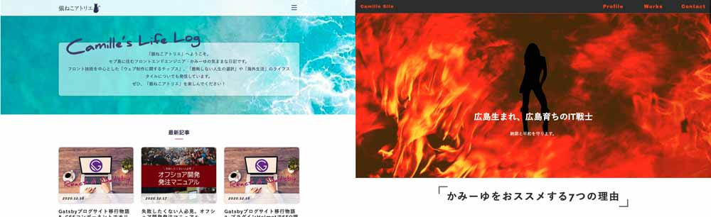

## 今までのGatsbyの記事と注意点
現在ここまで記載しています。<br>制作するまでを目標にUPしていくので順を追ったらGatsbyサイトが作れると思います。

1. [インストールからNetlifyデプロイまで](/blogs/entry401/)
2. [ヘッダーとフッターを追加する](/blogs/entry484/)
2. [投稿テンプレにカテゴリやらメインビジュアル（アイキャッチ）追加](/blogs/entry406/)
3. [ブログ記事、カテゴリー、タグ一覧の出力](/blogs/entry408/)
4. [プラグインを利用して目次出力](/blogs/entry410/)
5. [プラグインナシで一覧にページネーション実装](/blogs/entry413/)
6. [個別ページテンプレート作成](/blogs/entry416/)
7. [プラグインHelmetでSEO調整](/blogs/entry418/)
8. CSSコンポーネントでオリジナルページを作ろう！！（←イマココ）
9. [関連記事一覧出力](/blogs/entry430/)

### このシリーズではテーマGatsby Starter Blogを改造
この記事は一番メジャーなテンプレート、「*Gatsby Starter Blog*」を改造しています。同じテーマでないと動かない可能性があります。

## headerもfooterもまったく違うデザインのページを作ります
今回GatsbyJS作るのはこのポートフォリオページです。

私が2年前、テキトーに作ってヘッドハントされたきっかけとなったページです。**ぶっちゃけ中身はひどい**です。

<card id="/portfolio/"></card>

静的ページでもともと実装していたのですが、せっかくなのでこの度Gatsby用にコードを書き直しました。



この通り、本サイトとテイストがまったく違います。

新たにページを生成し、デザインをガラッと変えるためにCSSを独自で実装する必要があります。<br><br>

さて今回portfolioページを作るために必要なファイル構成です。

ファイル数が多いのでざっくり紹介します。

```
/ (プロジェクトディレクトリー)
  └  gatsby-node.js（ページ生成に必要な設定をする）
    └ src/
        └ pages/
            ├ portfolio.js （新規・ベースのページ）
            └ portfolioParts/（新規・ポートフォリオに関するファイル類をすべてここに格納）
                ├ css/ (CSSモジュールを格納)
                |   ├ common.module.css（汎用的なCSSモジュール）
                |   ├ header.module.css（header用CSSモジュール）
                |   ├ voice.module.css（voiceに対応したCSSモジュール）
                |   └  .... （コンポーネントに対応したCSSモジュール）
                ├ voice.js（プロフィールのコンテンツ）
                └  ....（パーツ出力用コンポーネント）
```
Gatsbyでは*CSSモジュール*と言って、パーツごとにスタイルを当てることができます。

しかも、file名を*〇〇.module.css*と命名するだけでモジュール化できます。<br>

<div class="box">
<h4><em>CSSモジュールやコンポーネントでパーツ分けする利点</em></h4>
長年HTMLやCSSを書いていると直面する問題があります。別のパーツがCSSで汚染されたり再利用が難しかったり、それを防ぐために上書きを繰り返したりコードばっかり長くなります。<br>このように部品単位管理することで、汚染防止もできるし再利用が楽チンになります。<br>エコロジー！
</div>

## createPage()でページを生成

gatsby-nodo.jsにコードを追記して、`createPage`関数でportfolio用のページを作ります。

```js
const path = require(`path`)
const Promise = require('bluebird')
const { createFilePath } = require(`gatsby-source-filesystem`)
const slash = require('slash')

exports.createPages = async ({ graphql, actions, reporter }) => {
  const { createPage } = actions

  // ~ 省略~

  const portfolioPost = path.resolve(`./src/pages/portfolio.js`)

  createPage({
    path: 'portfolio',
    component: portfolioPost,
  });
}
// ~ 省略~
```
## ベースになるportfolio.jsを作成
portfolio.jsを作成します。
headerやfooterなどあくまでベースになる部分を中心にコードを書きました。

```js
import React from "react"
import { Link } from "gatsby"

import SEO from "../components/seo"

// CSS
import HeaderStyles from "./portfolioParts/css/header.module.css"
import CommonStyles from "./portfolioParts/css/common.module.css"

const Portfolio = ({ location }) => {
  const nav = ['Profile', 'Works', 'Contact']
  return (
    <div class={HeaderStyles.default}>
      <SEO
        title="広島生まれ、広島育ちのIT戦士を紹介するサイト"
        description="広島のIT戦士・かみーゆを紹介するサイトです。フロントエンドエンジニアかみーゆの魅力を出し惜しみせず力一杯紹介しています。ちょっとクセ強め。"
        image="/static/213311b9bb7be131aae7771033b326b7/ee604/ogp.png"
        location={location}
      />
      <header class={HeaderStyles.header}>
        <p class={HeaderStyles.headerLogo}>Camille Site</p>
        <span
          class={HeaderStyles.navBtn}
          role="button"
          aria-label="ナビゲーションボタン"
          id="menuBtn"
        >

        </span>
        <nav class={HeaderStyles.globalNav}>
          <ul>
            {
              nav.map((value) => {
                return (
                  <li>
                    <Link to={`#${value}`}>
                      {value}
                    </Link>
                  </li>
                )
              })
            })

          </ul>
        </nav>
      </header>
      <main id="top">
        <section>
          <div class={FirstViewStyles.firstViewArea}>
            <div class={FirstViewStyles.firstViewArea_main}>
              <h1>広島生まれ、広島育ちのIT戦士</h1>
              <p>納期と平和を守ります。</p>
            </div>
          </div>
        </section>
     </main>

      <footer class={CommonStyles.footer}>
        <p class={CommonStyles.footerCopy}><small>(c)IT戦士かみーゆを紹介するサイト</small></p>
      </footer>
    </div>
  )
}

export default Portfolio

```
headerにスタイルを当てるためにheader.module.cssを作成し、HeaderStulesという名前でimportしておきます。

header.module.cssから`default`というクラスのCSSを呼び出したい場合、`class`を`HeaderStyles.default`とします。

```js
import HeaderStyles from "./portfolioParts/css/header.module.css"

const Portfolio = ({ location }) => {
  // ~ 省略~
  return (
  <div class={HeaderStyles.default}>
  {/* ~ 省略~*/}
  }
}
export default Portfolio
```

あとは、header.module.cssにはいつも通りCSSを書けばOKです。

これでheaderのスタイルが実装されます。

```css
@import url("https://fonts.googleapis.com/css?family=Archivo+Black");

.default {
  background: #e95014;
  overflow: hidden;
  animation: delete .1s 2s forwards;
  color: #333;
}

.default > * {
  opacity: 0;
  -webkit-animation: loadIn 1s 2s forwards;
  animation: loadIn 1s 2s forwards;
}

.default::before {
  position: fixed;
  display: block;
  content: '';
  width: 1px;
  height: 1px;
  display: block;
  top: 50%;
  left: 0;
  -webkit-transform: translate(0, -50%);
  transform: translate(0, -50%);
  background: #ffffff;
  -webkit-animation: boul 2s forwards;
  animation: boul 2s forwards;
}
```

CSSモジュールごとにフォントも呼び出せます。

```css
@import url("https://fonts.googleapis.com/css?family=Archivo+Black");
```
## コンポーネントの追加
各塊ごとのコンテンツをパーツ化し、コンポーネントごとにパーツ化します。

今回は1つだけ紹介します。portfolioPartsに「お喜びの声」のパーツをvoice.jsを作成し、格納しておきます。

portfolio.js側で呼び出せるようにしておきます。
```js
// components
import Voice from './portfolioParts/voice'

const Portfolio = ({ location }) => {
  // ~ 省略~

  return (
    <Voice />
    {/* ~ 省略~*/}
  }
}

export default Portfolio
```

voice.module.cssを作成し、voice.jsに`VoiceStyles`という名前でimportします。

```js
import React from 'react';
import VoiceStyles from "./css/voice.module.css"

const Voice = () => (
  <div class={VoiceStyles.container}>
    <article>
      <p>IT戦士ゆりこは強そうに見えて意外と寂しがり屋です。<br />友達未満ぐらいの距離だと、思ったことをグサッと言われたり、いつ休んでるんだと思うぐらい仲間思いで必死に仕事してるつよつよな人に見えますが、一定の距離にいくと実は寂しがりやな一面が見えるんです。<br />あとは、年齢が一回りも違う私が下の名前で呼んでも恥ずかしがるだけで怒りはしない優しい人なんです。<br />最後に敵に回すと厄介で、味方になるとかなり頼もしいので、あなたはどちらになるのか楽しみです(^^；)</p>
      <p>ニート・ギャング候補生・スポーツ選手/まだ20代男性</p>
    </article>
    {/* ~ 省略~*/}

 </div>
);

export default Voice;
```
あとは、voice.module.cssにCSSを書くだけです。

メディアクエリもCSSモジュール内に書けます。

```css
.container {
  margin-top: 30px;
}

.container article{
  background: #fff;
  padding: 20px 30px;
  border-radius: 20px;
}

.container article + article{
  margin-top: 20px;
}

/* メディアクエリ */
@media screen and (min-width: 768px){
  .headingRecomend h2{
    font-size: 3.8rem;
  }
}
```
## せっかくなのでfooterにFontAwesomeアイコンを追加
portfolioページは手抜きなので、元のページでもアイコン類などをFontAwesomeから拝借していました。

なのでGatsbyでもFontAwesomeアイコンを使えるようにします。

[gatsby-plugin-fontawesome-css](https://www.gatsbyjs.com/plugins/gatsby-plugin-fontawesome-css/)

`npm`か`yarn`でインストールします。

```
yarn add gatsby-plugin-fontawesome-css

or

npm install --save gatsby-plugin-fontawesome-css
```

さらに使いたいフォントも追加しておきます。私はTwitterやインスタアイコンを使いたかったので`free-brands-svg-icons`も追加しました。

```
yarn add @fortawesome/react-fontawesome @fortawesome/fontawesome-svg-core @fortawesome/free-solid-svg-icons　@fortawesome/free-brands-svg-icons
```

gatsby-config.jsにプラグインを追加します。

```js
module.exports = {
  plugins: [
    {
      resolve: `gatsby-plugin-fontawesome-css`
    },
  ]
}
```

iconをimportします。

```js
import { FontAwesomeIcon } from '@fortawesome/react-fontawesome'
import { faBullhorn } from '@fortawesome/free-solid-svg-icons'
import { faHome } from '@fortawesome/free-solid-svg-icons'
import { faTwitter, faInstagram } from "@fortawesome/free-brands-svg-icons";
const Portfolio = ({ location }) => {

  // ~ 省略~

  return (
  // ~ 省略~

      <footer class={CommonStyles.footer}>
        <a href="#top" class={CommonStyles.footerBtn} aria-label="先頭へ戻る"></a>
        <ul class={CommonStyles.footerNav}>
          <li><Link to="/"><FontAwesomeIcon icon={faHome} /></Link></li>
          <li><Link to="https://twitter.com/LirioY" target="_blank" rel="noopener nofollow"><FontAwesomeIcon icon={faTwitter} /></Link></li>
          <li><Link to="https://www.instagram.com/yurico.k" target="_blank" rel="noopener nofollow" ><FontAwesomeIcon icon={faInstagram} /></Link></li>
        </ul>
        <p class={CommonStyles.footerCopy}><small>(c)IT戦士かみーゆを紹介するサイト</small></p>
      </footer>
    // ~ 省略~
  )
}
```

コンポーネントを記述すれば表示されるようになります！

```js
<FontAwesomeIcon icon={faInstagram} />
```

## まとめ・CSSモジュールでまったく違うデザインのページが作れる
CSSモジュールを使うとまったく違うデザインのページが作れるだけじゃなく、コードも節約できます。ぜひ試してみてください。

次回は、カテゴリーやタグが同じ[関連記事一覧出力の仕方](/blogs/entry430/)をご紹介します！2021年一発目の記事になると思いますのでよろしくお願いします！！！

皆さんのコーディングライフの一助となれば幸いです。

最後までお読みいただきありがとうございました。
