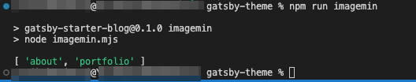

`Error [ERR_REQUIRE_ESM]: require() of ES Module` でコケた方、朗報です。

2023年1月にimagemin(v8系)のESM対応したCLスクリプトに対応しするため大幅にリライトしました。

npm-scriptで使って画像を圧縮する方法をご紹介します。imagemin cliで画像を圧縮しようとして、フォルダ階層を保てないことがわかり、どうしたものかハマりました。メモとして残しておきます。
<prof></prof>


### npm-scriptとは？
私の敬愛するICSメディアさんにとてもわかりやすい説明が掲載されていたのでそのまま引用しました！

> ウェブ制作の現場では作業の自動化が流行っています。「Gulp」「Grunt」などのタスクランナーや「webpack」などのビルドシステムなどのツールにより人力の作業を減らすことができ、生産効率や品質の向上につながります。
>
> どちらもNode.jsのモジュールとして動作するツールですが、実はこれらのタスクランナーを使わずとも、Node.jsインストール時に付属するnpm(Node Package Manager)を使用すれば、タスク処理が実現できます。
>
> npmとはNode.jsのモジュールを管理するためのツールであり、タスク処理にはnpmの機能のnpm-scriptsを使用します。Gulpやwebpackは有用ですが、npm-scriptsと併用することでさらに便利になります。本記事はnpm-scriptsを使ったタスク実行環境が構築できることを目標に解説します。

[Node.jsユーザーなら押さえておきたいnpm-scriptsのタスク実行方法まとめ](https://ics.media/entry/12226/)

### CLIとは？
CLIとはCLI(Command Line Interface) の略でコマンドラインから色々操作する方法です。
GitHubにさまざまなCLIが公開されています。

* ESLint
* npm
* imagemin（今回はこれ使います）

## imageminをインストール

`npm` で `node module` をインストールします。

```Shell:title=コマンド
$ npm install imagemin imagemin-mozjpeg imagemin-pngquant imagemin-gifsicle imagemin-svgo fs --save-dev
```

`imagemin-keep-folder` というディレクトリ構造のまま画像を取得できるモジュールがESMだと使えなくなったので `fs` というディレクトリー構造を取得できるモジュールで対応します。

ディレクトリー構造はこちら。

```
/ (プロジェクトディレクトリー)
  ├ node_modules/
  ├ package.json
  ├ src/
  |  └ assets/images/（圧縮前の画像が格納されているフォルダ）
  ├ html/
  |  └ assets/images/（圧縮後の画像格納）
  └ imagemin.mjs（追加）
```

imageminのv8系はESMのみサポートしています。

対応するためには、実行するファイルの拡張子を `.mjs` にするか、`packege.json` に `"type": "module"` を追記する必要があります。

そうすると、`require` 全て `import` での読み込みに修正する必要があったりと不便なため私は、`.mjs` で別ファイルとして取り扱うことにしました。

## package.json側で画像圧縮（imagemin.mjs）を実行するシェルスクリプトを登録する
package.jsonに以下のコードを予め追記しておきます。

```js:title=package.json
"scripts": {
  "imagemin": "node imagemin.mjs"
}
```
## 画像圧縮のjsファイルを作り処理を書く
imagemin.mjsファイルを作り以下のコードを書きます。

今回はこちらのブログ記事を参考にしました。

[imageminでディレクトリ構成を維持する方法](https://qiita.com/irico/items/89f8868826ec2207bae4)

[【Node.js】fsでフォルダ(ディレクトリ)一覧を取得する方法【やたら簡単】](https://www.ultra-noob.com/blog/2021/61/)

### 画像ディレクトリの取得

```js:title=imagemin.mjs
import * as fs from 'fs'

const srcImgDir = process.cwd() + "/src/assets/images";

let imgDir = fs.statSync(srcImgDir).isDirectory() ?
  fs.readdirSync(srcImgDir) : [];
imgDirs = imgDirs.filter(i => fs.statSync(`${srcImgDir}/${i}` ).isDirectory())

console.log(imgDirs)//出力内容を確かめる
```

`process.cwd()` で現在のディレクトリを取得します。 `fs` でディレクトリがあれば、`/src/assets/images` 直下のディレクトリを取得します。

`statSync()` と `isDirectory()` で取得したいターゲットとなるディレクトリを存在を確かめて `readdirSync()` でその直下の取得します。

さらに `isDirectory()` メソッドを使ってディレクトリのみフィルタして取得します。



### 画像の圧縮
では早速画像の圧縮をしましょう。

```js{3-7,9,16-32}:title=imagemin.mjs
import * as fs from 'fs'

import imagemin from 'imagemin';
import imageminMozjpeg from 'imagemin-mozjpeg';
import imageminPngquant from 'imagemin-pngquant';
import imageminSvgo from 'imagemin-svgo';
import imageminGifsicle from 'imagemin-gifsicle';

const srcImgDir = process.cwd() + "/src/assets/images";
const htmlImgDir = process.cwd() + "/html/assets/images";

let imgDir = fs.statSync(srcImgDir).isDirectory() ?
  fs.readdirSync(srcImgDir) : [];
imgDirs = imgDirs.filter(i => fs.statSync(`${srcImgDir}/${i}` ).isDirectory())

;(async () => {
  if(imgDirs.length !== 0) {
    imgDirs.map( async (imgDir) => {
      const file = await imagemin([`./${srcImgDir}/assets/images/${imgDir}/*.{jpg,png}`], {
        destination: `./${htmlImgDir}/assets/images/${imgDir}`,
        plugins: [
          imageminMozjpeg(),
          imageminPngquant({
            quality: [0.6, 0.8]
          }),
          imageminGifsicle(),
          imageminSvgo()
         ]
      })
    })
  }
})()
```

`map`で処理を回します。

imagemin-pngquantの公式ページで見てみると、配列で書いてねとあるので`0 ~ 1`までの値を指定します。

```js:JS
Type: Array<min: number, max: number>
Values: Array<0...1, 0...1>
Example: [0.3, 0.5]
```
[npm imagemin-pngquant](https://www.npmjs.com/package/imagemin-pngquant)

### 実行コマンド
あとはコマンドから以下のコードを叩くだけ。

```Shell:title=コマンド
npm run imagemin
```

### 他のタスクと一緒に処理
私は他のタスクと一緒に処理しています。

シェルスクリプトは`&`で接続することで並列処理、`&&`では直列処理ができます。

私は普段laravel-mixを使ってますが、画像なんてあまり追加しないのでタスクを立ち上げる際に処理を実行するようにしています。

```Shell:title=コマンド
"w": "npm run image & npm run development -- --watch"
```
続けてシェルスクリプトを追加するのであればこんな感じになると思います。
```Shell:title=コマンド
{
	"scripts": {
		"watch-poll": "npm run watch -- --watch-poll",
		"image": "node imagemin.mjs",
		"w": "npm run image & npm run development -- --watch"
	}

}
```

## まとめ
タスクランナーに依存せず使いまわせるのはとっても便利です。

走り書きですが、皆さんのコーディングライフの一助になれば幸いです。

最後までお読みいただきありがとうございました。
