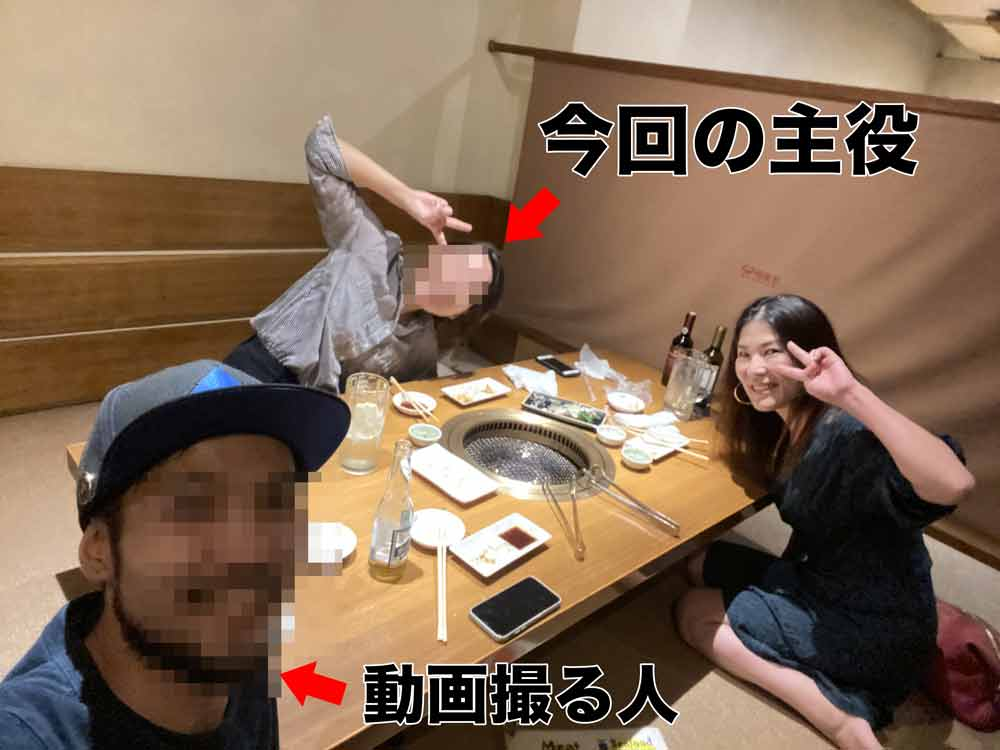
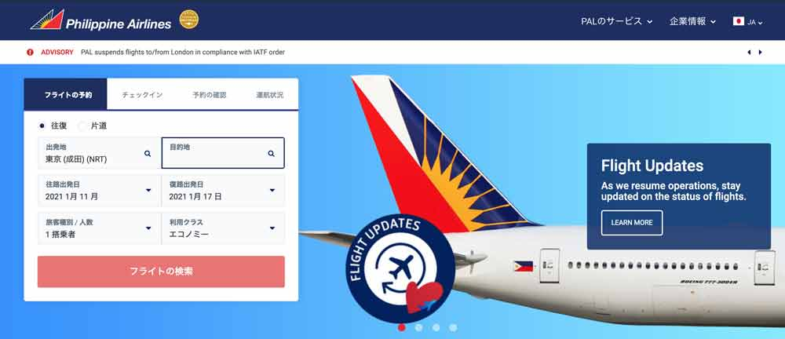
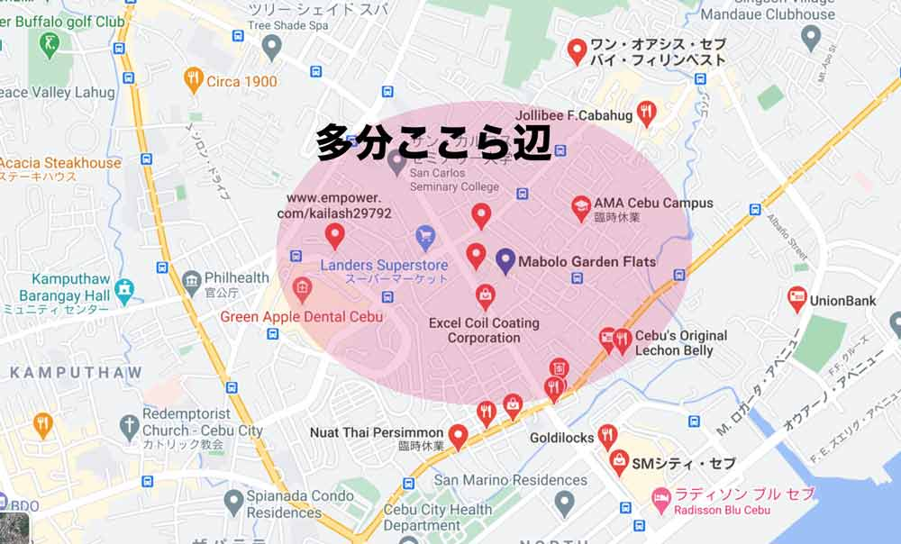
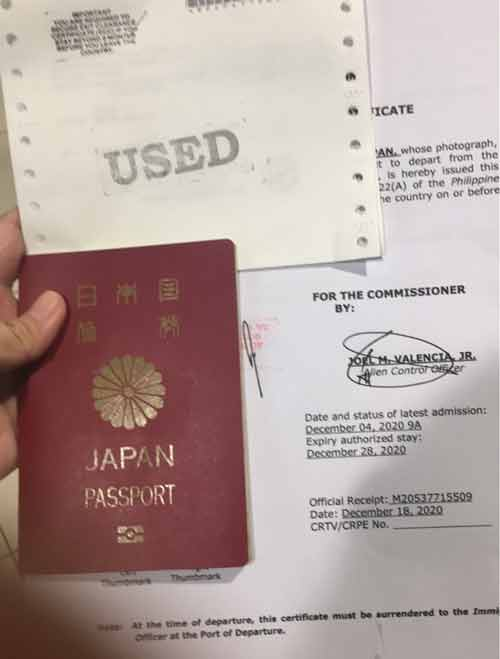
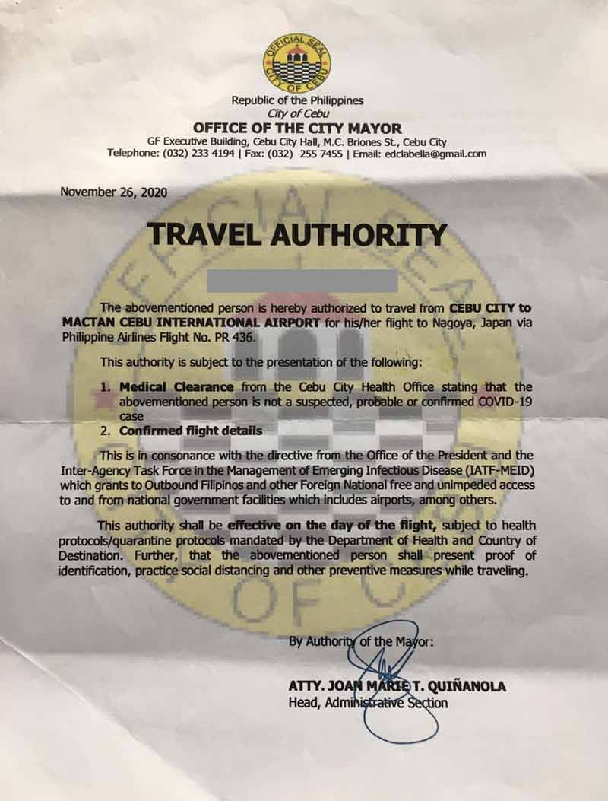

親愛なる人がフィリピンセブ島から日本に帰還するまでの手記を託してくれました。

今回は「航空券購入 + バランガイ編」でロックダウン中のセブ島での航空券の購入とバランガイという謎の役所での手続きのお話です（このシリーズは数回に分けて公開します）。

<toc id="/blogs/entry429/"></toc>

## 手記を書いたのは元同僚。ざっくりどんな人かご紹介
この記事は私の元同僚による手記です。

ロックダウンの影響もありフィリピンから航空券購入が大変だったようで、*今後日本へ帰る人たちに気をつけて欲しい点などを伝えたい*という思いで寄稿いただきました。

ちなみに彼女のパーソナリティです。

自然豊かな日本の中部地方でのびのび育った元教員。オーストラリアに留学したり、働いていたので英語はペラペラ。

<small>※ プライバシーに配慮してモザイク処理をしてます。</small>

セブでは一緒に買い物したり、昼から一緒に呑んだくれることができる重要な人でした。

1. [VISA手続き編](/blogs/entry422/)
2. 航空券購入 + バランガイ編（←イマココ）
3. [渡航編](/blogs/entry427/)
4. [帰国後編](/blogs/entry433/)

ここからは託してくれた手記をほぼそのまま掲載します。

## 航空券購入
航空券の購入も以前とは違う方法で購入したので留意した点など詳しく記載しておきます。

### チケットの購入
私は今回はじめてフィリピン航空のオフィスへ行き購入しました。

[フィリピンエアライン公式サイト](https://www.philippineairlines.com/ja-jp/jp/home)

チケットサイトでの購入も可能でしたが*サイトに出てくる便が本当に飛ぶか信用できなかった*のでやめました！

ロックダウンも長くなってくると**行政や航空会社の発表はだいたい当てにならない**ことを学びます。 
実際「セブ - 名古屋」間でいうと2020年10月15日から直行便が再開すると発表がありましたが、やはり飛んでませんでした。

この場合「直行便飛ばすよ！*突然キャンセルになる場合もある*けどね☆」と捉えるのが正しいです。

『あの発表は何だったんだ！！ぬか喜びした気持ちを返せー！！』と言ってやりたいですが言いません。*大人なんで*。

私は確実に名古屋へ飛ぶ便を買いたかったので何度かオフィスへ行って購入しました。

なにが正しい情報なのかを確認するためにまずは航空会社のオフィスへ行きましょう。

オフィスで確認すると、「マニラ - 名古屋」間は週2便飛んでいました。数ヶ月前まで成田行きしかなかったことを考えるととても大きな進展です。

 『成田便が飛べば日本人みんな帰国できると思うなよ！』と言ってやりたい。

もちろん言いません。*大人なんで（2回目）*。

ちなみにフィリピン航空のオフィスはセブ市内に2店舗ありますが平日だけの営業に変わっています。

ネットにはゴロルド支店は土曜営業しているとありましたが、行ったら閉まってました。今フィリピンではネットの情報は当てになりませんね。平日9:00-17:00の営業だったはずです。変更してるかもしれませんので、電話での確認をオススメします。

だいたい午前中に行くと待ち時間0分でしたよ。

### フィリピン航空でオフィスで教えてもらった情報
私がフィリピン航空のオフィスで聞いた情報をまとめておきます！

* 渡航に必要な書類は各地区ごとに違うためバランガイで確認が必要
* 帰国する日本人はPCR検査は必要ない
* ただしマニラに24時間以上滞在する場合はPCR検査必要
* マニラに滞在する場合は宿泊するホテルも証明できるようにする
* キャンセルは渡航日の7日前なら無料。7日過ぎていたら日程変更手数料50ドルかかる。
* 購入時に必要なものはパスポート
* 席を仮予約しておくことも可能。ただし期限内に料金が支払われなければ仮予約は消滅。

これは*2020年12月時点の情報*です。変更は随時あると思うので渡航前に必ずご自身で確認をしましょう！

イミグレ<small>(※1)</small>でECC（Emigration Clearance Certificate）<small>(※2)</small>を申請したその足でフィリピン航空のオフィスへ行きましたが、希望していた帰国日のチケットが話しているうちにに売り切れ、次の最短の便も残り1席と言われました。クリスマス前だったからかもしれませんが、名古屋便の人気を甘く見ていました。

<small>※1 移民局・イミグレーションの略。</small> 
<small>※2 6か月以上フィリピンに滞在した外国人がフィリピンを離れるときに必要な出国許可証。フィリピンに滞在中にビザ代をきちんと払っているか、犯罪歴がないかを証明するためのもの。</small>

 このラスト1席を仮予約したんですが、購入するためにはパスポートが必要でした。

私の場合、キャンセルしたチケットの日程変更手続きになるため、パスポートはもう不要だと思っていましたがいるとのこと。

その時私のパスポートはECC手続き中のためイミグレに。

今日中に購入できないと仮予約は消滅とのこと。

その場合また帰国が遅れる可能性大。

 **またイミグレまで戻らなかんの!?!?**（タクシーで往復50分くらい）

 と一瞬、絶望に打ちひしがれましたが、写真でもいいと言われたので、ちょうどイミグレへ行くフィリピン人スタッフに頼んでパスポート全ページ撮って送ってもらいました。

チケットを購入するのに*パスポートIDのページ*とフィリピンに*最後に入国した際に押されたスタンプのページ*のコピーか写真があればいいそうです。私みたいにならないように念の為写真に撮っておくといいですよ！

そんな小さなトラブルもありつつ、ようやくチケットが購入できました！セブ発マニラ経由名古屋行きの片道でお値段は370ペソ+50ドル（日程変更代）。日本円で**約8.5万円**。

冷静になるとめちゃ高いやん！と思いますが、もう早く帰国できるならいくらでも払うよ状態だったので気にもしませんでした。

もしかしたらこれは*イミグレと航空会社が結託したNew Normalのビジネス商法*なのかもしれません。まんまとハマってしまったなー。

## バランガイへGO！

渡航に必要な書類を確認しに、家の近所のバランガイへ行きました。手続きは事前にフィリピン人スタッフが進めてくれたのでよくわかってませんが、私のバランガイ<small>(※1)</small>（マボロ・Mabolo）では外国人が出国する際はMedical Certificate（健康証明書）等をまとめたTravel Authority（渡航許可）<small>(※2)</small>が必要みたいです。

<small>※1 バランガイは、フィリピンの都市と町を構成する最小の地方自治単位であり、村、地区または区を表す独自のフィリピン語です。地域ごとにあります。</small> 
<small>※2 渡航許可など、新型コロナウイルス感染拡大のため、厳しい渡航制限が課されています。</small>

 はじめてバランガイへ行きましたがローカル感がすごくてびっくりしました。

Mabolo（マボロ）のバランガイのスタッフは*道端に1日中座っているおっさんくらい見た目が超ラフ*だったのでスタッフなのか暇つぶしに来てるおっさんなのか区別できませんでした。

 バランガイへ行ったら**目があった人に話しかけてみて**ください。きっと**それがスタッフ**です。

 手続きは書類に記入するだけでOKですが、パスポートと航空券が必要です。City Hall（役所）での許可書も必要らしく、私のバランガイでは取得に3日かかりました。

帰国日を変更するごとに取り直す必要があるので、帰国日が決まってから取得したほうがいいですよ。

私の場合、予定していた帰国日までにダウングレードが間に合わなかったので航空券を1度キャンセルしていますしTravel Authority（渡航許可）も期限切れで再申請しました。

今思えばホント**2度手間**でした。

チケット購入したほうがイミグレも手続き急いでくれるというのは**都市伝説**だったみたいです。

2020年12月時点で帰国に必要だった書類は3点です。（取得場所 / かかった日数）
1. ECC（イミグレ / 4日）
2. Travel Authority（バランガイ / 3日）
3. 航空券（フィリピン航空オフィス / 1日）

### ECC

### Travel Authority

すべて集めるのに5日間かかりましたが、急げば3,4日で取れると思います。ただ、何があるかわからないので時間に**余裕を持って帰国日を決める**ことをオススメします！

ちなみにフィリピン航空のスタッフに「警察署へ行ってCOVID SHIELDも取得して」と言われましたが、外国人は不要です！

フィリピン航空のスタッフによって*なぜか必要書類が違う*ときがあります！

そんなときは*バランガイへ行って確認するほうが確実*そうです。

私はあやうく警察署へ行くところでしたがバランガイの金髪ロン毛のおっさんが必要ないと教えてくれました。

 **ありがとう、おっさん**！

## 渡航準備をしてみた感想

New NormalではMedical Certificate（健康証明書）やPCR検査の結果の提出が新たに求められます。渡航日程やコロナの状況によって必要書類が変わるみたいなので必ず確認してくださいね。

あと、週末は基本的に各種手続きお休みなのでそこを考えて計画的に動きましょう！

でもMabolo（マボロ）のバランガイは土曜日開いてました。ネットだと土日は定休日ってあんたんだけどなー。

結論、New Normalはまだ何が本当かよくわからんのでとりあえず行ってみるしかない！ってことです！

## さいごに、管理人（かみーゆ）から
彼女は2020年12月23日、無事日本に帰還しました。

余談ですがNew Normalじゃなかろうが、**フィリピンでのネットの営業時間はあてにしてはいけません**。

彼女はなんとかチケットを手に入れて、渡航することができました。

まだ、フィリピンにはたくさんの日本人が在住していて仕事の関係で帰国する方も多いと思います。参考にしていただければ幸いです。

次は、「[渡航編](/blogs/entry427/)」です！ぜひ併せてお読みください。

最後までお読みいただきありがとうございました。

<prof></prof>
