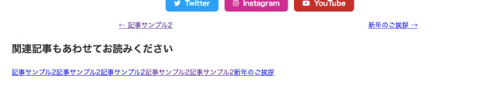
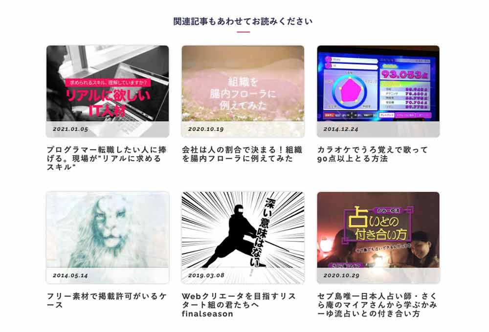

## 今までのGatsbyの記事と注意点
現在ここまで記載しています。<br>制作するまでを目標にUPしていくので順を追ったらGatsbyサイトが作れると思います。

1. [インストールからNetlifyデプロイまで](/blogs/entry401/)
2. [ヘッダーとフッターを追加する](/blogs/entry484/)
2. [投稿テンプレにカテゴリやらメインビジュアル（アイキャッチ）追加](/blogs/entry406/)
3. [ブログ記事、カテゴリー、タグ一覧の出力](/blogs/entry408/)
4. [プラグインを利用して目次出力](/blogs/entry410/)
5. [プラグインナシで一覧にページネーション実装](/blogs/entry413/)
6. [個別ページテンプレート作成](/blogs/entry416/)
7. [プラグインHelmetでSEO調整](/blogs/entry418/)
8. [CSSコンポーネントでオリジナルページを作ろう！！](/blogs/entry421/)
9. *関連記事一覧出力*（←イマココ）

このシリーズは[Github・gatsby-blog](https://github.com/yuririn/gatsby-blog)に各内容ごとにブランチごとで分けて格納しています。

今回のソースは[related-list](https://github.com/yuririn/gatsby-blog/tree/related-list)ブランチにあります。

### このシリーズではテーマGatsby Starter Blogを改造
この記事は一番メジャーなテンプレート、「*Gatsby Starter Blog*」を改造しています。同じテーマでないと動かない可能性があります。

## StaticQueryタグを使って同じタグとカテゴリーの記事を絞り込む
類似記事を絞り込む条件です。

* タイトルがかぶっていない
* カテゴリーが一緒
* タグが一緒

上記の条件の記事をPickupしランダムで6記事程度出力します。

今回触るファイルです。relatedList.jsを追加します。

```
/プロジェクト
  ├ components/
  |  └ related-list.js(追加)
  └ templates/
     └ blog-post.js(追記)
```
### 絞り込み機能を作る
`useStaticQuery` を使ってGraphQLをセットします。

```js:title=related-list.js
import * as React from "react"
import { Link, useStaticQuery, graphql } from "gatsby"

const Lists = ({ category, title, tags }) => {
  const { allMarkdownRemark } = useStaticQuery(
    graphql`
      query {
        allMarkdownRemark (
          filter: { frontmatter: { pagetype: { eq: "blog" } } }
        ) {
          edges {
            node {
              fields {
                slug
              }
              id
              frontmatter {
                cate
                hero
                date(formatString: "YYYY.MM.DD")
                title
                tags
                pagetype
              }
            }
          }
        }
      }
    `
  )
  return ""
}
export default Lists
```
「Gatsbyブログサイト移行物語」では記事にはタグとカテゴリを設けており、*カテゴリは1種類*、*タグは複数選択可能* というルールになっています。

あらかじめ関連記事を表示するコンポーネントを読み込んでおきます。

```js{5,16-20}:title=blog-list.js
import * as React from "react"
import { Link, graphql } from "gatsby"
// 省略

import RetatedList from "../components/retated-list"

const BlogPostTemplate = ({ data, location }) => {
  // 省略

  return (
    <Layout location={location} title={siteTitle}>
      {/*省略*/}
      <BlogPostNav>
        {/*省略*/}
      </BlogPostNav>
      <RetatedList
        category={cate}
        slug={post.fields.slug}
        tags={tags}
      ></RetatedList>
    </Layout>
  )
}

export default BlogPostTemplate

// 省略
```

関連記事では現在表示中の記事をのぞきたいので、blog-list.jsのGraghQLのスキーマにslugを追加します。

```js{7-9}:title=blog-list.js
# 省略
markdownRemark(id: { eq: $id }) {
  id
  excerpt(pruneLength: 160)
  html
  tableOfContents(maxDepth: 3)
  fields {
    slug
  }
  # 省略
```
filterで記事を絞り込んだ配列を作ります。
```js:title=related-list.js
let posts = allMarkdownRemark.edges.filter(post => {
  // 表示中の記事とslugが一緒じゃないものを絞り込み
  if (post.node.fields.slug !== slug) {
    // カテゴリが一緒かつ
    if (post.node.frontmatter.cate === category) {
      return true
    }
    // 同じタグを含むもの
    for (const tag of tags) {
      return post.node.frontmatter.tags.includes(tag)
    }
  }
})
```

### 関連記事が存在したらランダム出力する
関連記事の条件に一致するものがなければ処理を中断し、あれば一覧をシャッフルし6記事に絞り込みます。
```js:title=related-list.js
// 一致するものがなければ処理しない
if (!posts) return

// 関連記事が取得できたらシャッフル
function shuffle(list) {
  var i = list.length;

  while (--i) {
    var j = Math.floor(Math.random() * (i + 1));
    if (i === j) continue;
    var k = list[i];
    list[i] = list[j];
    list[j] = k;
  }

  return list;
}

// 関数実行
shuffle(posts)

// 6記事に絞りこむ
posts = posts.slice(0, 6);
```

### 結果を出力するコンポーネント作成

抽出結果をコンポーネントを通じて出力します。とりあえずは最小のデータで確かめてみます。
```js:title=related-list.js
return (
  <section>
    <h2>関連記事もあわせてお読みください</h2>
    <div>
      {posts.map(item => {
          return <List item={item.node.frontmatter} url={item.node.fields.slug} />
        })
      }
    </div>
  </section>
)
```

スタイルが当たってないので見た目はこんなもんですが出力できました。


見た目が貧弱なので、そのほかのデータを出力します。

サムネ画像を追加し、スタイルもstyled-componentsから追加できるようにします。

サムネ画像の追加方法は「[投稿テンプレにカテゴリやらメインビジュアル（アイキャッチ）追加](/blogs/entry406/)」を参考にしてください。

styled-componentsは以下コマンドでインストール可能です。

```bash:title=コマンド
npm i styled-components
```

```js:title=related-list.js
import Img from "../components/img"
import styled from "styled-components"

const Lists = ({ category, slug, tags }) => {
  // 省略
  const List = ({ item, url }) => {
    return (
      <article class="p-entryCard c-grid__item--md6 c-grid__item--lg4">
        <Link class="p-entryCard__img" to={url}>
          <Image filename={hero} /> : <Image filename="common/dummy.png" />}
          <div class="p-entryCard__date">
            {date}
          </div>
        </Link>
        <Link to={url} class="p-entryCard__body"><h3 class="p-entryCard__heading">{title}</h3></Link>
      </article>
    )
  }
export default Lists
```

### 関連記事を出力するコンポーネントのコードをまとめて書く

スタイルも当ててまとめたコードがこちらです。

```js:title=related-list.js
import * as React from "react"
import { Link, useStaticQuery, graphql } from "gatsby"
import Img from "../components/img"

import styled from "styled-components"

const Lists = ({ category, slug, tags }) => {
  const { allMarkdownRemark } = useStaticQuery(
    graphql`
      query {
        allMarkdownRemark(
          filter: { frontmatter: { pagetype: { eq: "blog" } } }
        ) {
          edges {
            node {
              fields {
                slug
              }
              id
              frontmatter {
                cate
                hero
                date(formatString: "YYYY.MM.DD")
                title
                tags
                pagetype
              }
            }
          }
        }
      }
    `
  )
  let posts = allMarkdownRemark.edges.filter(post => {
    if (post.node.fields.slug !== slug) {
      if (post.node.frontmatter.cate === category) {
        return true
      }
      for (const tag of tags) {
        return post.node.frontmatter.tags.includes(tag)
      }
    }
  })

  if (!posts) return

  if (posts.length > 5) {
    function shuffle(list) {
      var i = list.length

      while (--i) {
        var j = Math.floor(Math.random() * (i + 1))
        if (i === j) continue
        var k = list[i]
        list[i] = list[j]
        list[j] = k
      }

      return list
    }

    shuffle(posts)
    posts = posts.slice(0, 6)
  }

  return (
    <Related>
      <h2>関連記事もあわせてお読みください</h2>
      <RelatedList>
        {posts.map((item, index) => {
          return (
            <article key={`relative${index}`}>
              <Link className="p-entryCard__img" to={item.node.fields.slug}>
                </Img>
                <time datetime={item.node.frontmatter.date}>
                  {item.node.frontmatter.date}
                </time>
              </Link>
              <h3>
                <Link to={item.node.fields.slug}>
                  {item.node.frontmatter.title}
                </Link>
              </h3>
            </article>
          )
        })}
      </RelatedList>
    </Related>
  )
}
export default Lists

const Related = styled.div`
  max-width: 700px;
  margin: 0 auto;
  h2 {
    text-align: center;
    font-size: 2rem;
    margin-bottom: 30px;
  }
`
const RelatedList = styled.div`
  article {
    margin-bottom: 30px;
  }
  a {
    color: var(--black);
    text-decoration: none;
    position: relative;

    &:hover {
      opacity: 0.3s;
    }

    time {
      position: absolute;
      background: rgba(255, 255, 255, 0.3);
      left: 0;
      top: 0;
      line-height: 1;
      padding: 5px 15px;
      font-size: 1.4rem;
      font-weight: 700;
    }
  }
  h3 {
    font-size: 1.7rem;
  }

  @media screen and (min-width: 768px) {
    display: flex;
    flex-wrap: wrap;
    margin: 0 -15px;

    article {
      box-sizing: border-box;
      width: 33.33%;
      padding: 0 10px;
    }
  }
`
```
これで関連記事び一覧が出力できるようになりました！わーい。

読みこむたびに、ランダム表示されます。



## まとめ・関連記事一覧を実装するとユーザーも嬉しい
記事詳細読了後、関連記事が表示されることで回遊率はグンと上がります。

実はリニューアル前も関連記事機能あったんですがロジックが甘くてほぼ機能していませんでした。

現在はGatsbyに切り替えてしっかり作り込んだおかげで、適切な関連記事が表示されるようになりました。

Googleアナリティクスで見ても、記事の検索機能もつけたせいかもしれませんが、*平均ページ/セッション数が1.2ページからから1.83*になり、150%伸びました。嬉しい限り。

ぜひ、Gatsbyで興味ある方は関連記事の実装チャレンジしてください。

次回以前ちょっとツイッターで話題にしてもらった404ページの作り方をアイデアも含めて記事にします。

最後までお読みいただきありがとうございました。
