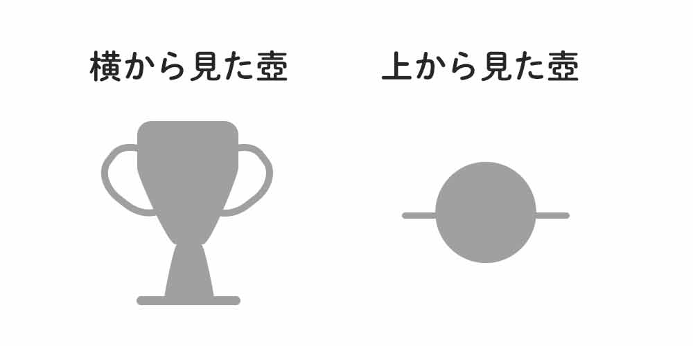
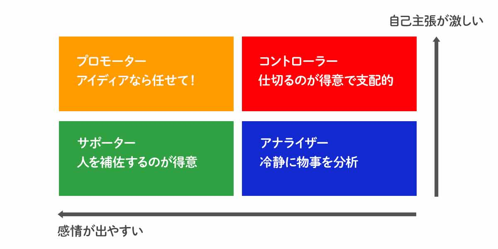
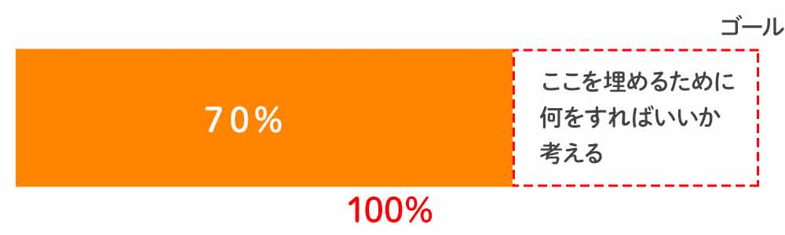

10年以上前のことですが、当時勤めていた会社でコーチングが導入され運よく研修メンバーの対象として選ばれました。","その頃、実は職場環境などで悩んでいました。

が、コーチングのマインドやメソッドが無かったら。。。と思うくらい救われました。 今でも参考にしていることが多いので、コーチングのマインドやメソッドを一部ご紹介します。

生きづらいな、しんどいなって思っている方はぜひ参考にしてください。

<prof></prof>

<toc id="/blogs/entry431/"></toc>

## 考え方をちょっと変えるだけで人と接するのが楽になる
当時、私は世界的有名な会社の子会社にいました。

ぶっちゃけ職場環境はよくなく、数字を追う日々で擦り切れる一方でした。

具体的にどんな会社だったかは、「会社は人の割合で決まる！組織を腸内フローラに例えてみた」をご覧ください。

<card id="/blogs/entry382/"></card>

その会社では少しでも人間関係を良くしようと、当時流行っていたコーチングを導入することになりました。

運よく研修メンバーに選ばれた私はコーチングを学ぶことができました。

コーチングとの出会いが私を救うことになります。

## 自発的な行動を促すメソッド・コーチングとは？
コーチングとは「*自発的な行動を促すメソッド*」でコーチはクライアント（コーチされる人）へ継続的にアプローチすることです。

*自発的に行動を修正*し、*成果を生む*ことができるようになります。

ポイントは「やらされてるなー」って思わずに行動できるところです。自分の責任で動くようになります。

コーチングは1990年ごろからアメリカを中心に広まり、2000年ごろから日本でも経営者やマネージャー研修などで用いられるようになりました。

では具体的に5つのメソッドをご紹介します。

### テクニックその1・角度を変えて物事を見る

壺のシルエットのイラストです。

正面から見たらなんとなく壺だなーって思いますが、上から見たらなんのこっちゃわかりません。

物って角度を変えるとよくも悪くも見えたりします。

 言葉も一緒。同じことを言っても良くも悪くも聞こえます。

コーチは否定的な言葉を使いません。

たとえば、こんな伝え方をします。

* × 小魚食べないと背が伸びないよ
* ◯ 小魚食べると背が伸びるよ

同じ意味ですよね？

 肯定的な言葉を使うだけで*伝わる印象がまったく変わります*。

 「**背が伸びるんだ！！！たくさん食べよう**」

 ワクワクするので思わず小魚食べたくなります。

 人は無意識のうちに**1日約7万回もマイナス思考**を繰り返しているそう。

最初はなかなか考え方のクセを変えるのは難しいです。

だから私は意識して、*定期的に自分の思考を観察する*ようにしています。

 現在マイナス思考に傾いていると気づけたらラッキーです！プラス思考へ切り替えるチャンスなんですから。

とはいえ、どうしてもプラス思考になれない時もあります。

そんな時はお決まりで「今日の晩ご飯何食べたいかなー」としょうもない、どうでもいいような考えに切り替えます。

#### 魔法の言葉「ちょうどよかった！」
私がよく実践している物事がうまくいかないときの視点の切り替え方です。

たとえば友達とご飯行く約束をしているとします。

すごく楽しみにしていたにもかかわらず、相手から「30分ほど遅れる」と言うような連絡を受け取ることがあります。

すごく楽しみにしていたのだから、通常なら残念な気持ちやさらに不機嫌になったりしますよね。

 物は考えよう。

そんな時、私は待ち時間にできそうなことを探します。

 クライアントにメッセージ返すとか、前から読みたかったブログ読んじゃうとか。

友達が遅れてくれたおかげで待ち時間ができ、すべきこと・やりたかったことなどが一個片付付きます！

 友達も大抵遅れたことを気にしていたり、とても悪く思って謝ってきます。

 なので、 
「遅れてくれたおかげで、〇〇をすることができた。**ちょうどよかった！**」って伝えます。  

お互い負の感情が拭えてハッピーです。  

物事には悪い面と良い面両方ある。デザインの気に入らない壺でもひっくり返してみたらステキな壺かもしれない。普段から良い面を見つける努力をする。

### テクニックその2・メソッドとしてのアクノリッジメント（承認）を実践する
昔は人の話を聞くのがニガテ。今もおしゃべりな方です。。。

ちゃんと話は聞いてるんですよ。

 日常どんな人でも、仏頂面だったり作業しながら片手間で「ちゃんと話を聞いてるよ！」ていうのが伝わらないことも多々あります。

 だからこそ「*あなたの話を聞いているよ！*」って態度や言葉で伝えることが大事なんです。

なので、私は人の話を聞くときはできるだけアクノリッジメント（acknowledge・承認）のメソッドを使うようにしています。  

* あいづち
* アイコンタクト
* うなづく
* オウム返し

これはブリッジSEやってた時、フィリピン人スタッフに対してももめちゃめちゃ有効的でした。話を聞いてもらえるだけで人って安心するんですよね。世界共通です。

#### 承認するならI & Youメッセージはさらに効果的！
これも私がブリッジSEをしていた時、チームメンバーに言っていた言葉です。

 「*私*は本当に嬉しいよ。*あなた*がいつもチームのことを考えて、意見したり行動してくれることが。」  

* Iメッセージ ... *私*があなたを通じて感じたことや思ったことを伝える
* Youメッセージ ... *あなた*の行動や振る舞いなどを率直に伝える

認められると、人のモチベーションは上がります。

同じ意味のことを伝えるなら、いい副作用のある言い方で伝える方がお得ですよね！  

「あなたの伝えたいこと・あなたの存在に気づいてますよ」と態度や言葉で伝える。すると受け取った人の承認欲求が満たされる。

### テクニックその3・タイプ分け
グラデーションはあるものの、人を4つのタイプに分けて接するようにしています。

ちなみに私は生粋のプロモーターです。

いいところは楽しいこと大好きでアイデアがいつも潤沢。その分、縛られるのが嫌いで、飽き性。

なので何かをやらせるときに細かい指示を出すと嫌がります。  

逆に、アナライザータイプは「なぜそれをするのか」を細かく説明してあげないといけないこともあります。

 コントローラーはそもそも指示されるのが嫌いだったり、シンプルにお願いしないとキレられたり。

 周りに*ひっそりと影であなたを支えてくれる人*っていませんか？

それはサポーターです。

実はもっともケアが必要なのはサポーターです。

「いつもありがとう」「◯◯のおかげで助かってるよ」というようなメッセージを送り続けてください。  

タイプをざっくり4つに分けて接し方を変える。 ただしタイプはあくまで目安。完璧でないということをお忘れなく。

### テクニックその4・頭を空っぽにして相手の話を聞く
みなさん、いつも人の話を聞いていますか？  

一番難しいのが**傾聴**です。  

*脳みそってとっても賢い*んで、つい先読みしちゃうんですよね。

 相手の話を聞きながらも、「いつ話を割って自分の意見を言ってやろうか」とか「結局こういうことがいいたんでしょ？」って常に思っています。

小賢しいですね。

 そんなときこそ、黙って話を聞く。沈黙が続いても放っておいてください。

 話を聞いているのは聞き手だけではないのです。話している本人自身も聞いているのです。

なので、自分で話しているうちに*気づいていなかった問題点を発見*できたり、*考えが整理される*こともあります。

 答えってその人が持ってるもの。

*良かれと思ってやるアドバイスほど傲慢なものはない*と思います。

 頭を空っぽにして話を聞くのってなかなかできません。何年経っても超ムズイです。 ぶっちゃけできませんw

せめて私は、「**この人の話から何が学べるだろう**」って思いながら話を聞くようにしています。

傾聴できてるかわかりませんが、少なくとも自分の脳みそのおしゃべりは止みます。  

沈黙は金。ひたすら耳を傾けると、本当にその人が伝えたいことが分かる。

### テクニックその5・目標と現状のギャップを数値化
何か目標があるとします。わかりやすくシェイプアップの話をします。

「2年前に購入したワンピースを着るために痩せたい」とします。

まずは現状と目標のギャップがどのくらいあるかを数値化してみてください。

私が自分に投げかける質問はこんな感じ。  

「*ワンピースをエレガントに着れる体型が100だとしたら今何パーセントの体型？*」

「数値じゃ測れないよ！」って思うかもしれないです。

でも自分の肌感でいいです。できているかできてないかは自分のさじ加減を信じてください。  

大切なのは*目標までどれだけのギャップ*があるか感覚的に把握することと、それを埋めるためには*何をすればいいか具体化*することです。  

食事制限、エクササイズ、どのくらい努力したら目標達成できるかが肌感でわかればいいんです。

そして人に提案してもらうまでもありません。*答えは「自分の中」にある*んです。

食べるのがやめられないなら運動ですればいいし、運動が苦手なら食事でカバーなど個人差があるはずです。

あくまでシェイプアップを例にあげましたが他の場合も同様です。

自分で何ができるかを探ってください。

#### ToDoの数は減らす。日時を決める。
目標達成のためには、どんなに解決策が思いついてもやることを*増やしすぎない*こと。

たくさんあると手いっぱいになってできなくなります。

一番大切なのは継続できることです。

諦めたくなるようなタスクはやると徒労に終わるだけですよ。

そして*期日を決める*。一度区切り、目標に及ばなければやり方を変えればいいんです。

できなければ計画を練り直せばいいんです。  

目標と現状のギャップを埋めるために何をすればいいか自分で決める。期日を決める。

## コーチングで大切なのはメソッドよりマインド

コーチングでもっとも大切なのはマインドです。考え方です。  

* 視点を変えて、美点を探すこと
* 諦めないこと
* 「*批判*」ではなく「*学ぶ*」姿勢でいること

コーチングにつきものな存在は**コーチ**です。

コーチとは「あなたを認めて、諦めずにゴールまで帆走してくれる人」です。

あなたに寄り添って目標達成をお手伝いしてくれます。  

ただ、コーチングのマインドさえあれば、*自分の中のコーチ*が手伝ってくれます。

他人よりも自分が自分のことをよく知っているはずです。  

自分を俯瞰してみれるようになれば*あなた自身があなたの最高のコーチ*になれるはずです。

## さいごに
そして、ここまで5つのメソッド＋マインドをお伝えしました。

私はこのコーチングを学ぶことで、人との関わり方がとてもラクになりました。  

この記事が皆さんの人生の一助となれば幸いです。

最後までお読みいただきありがとうございました。

### 元ネタはこちら

こちらは2013年10月14日に公開したスライドです。

ありがたいことに公開して以来3,000PV以上見てもらっているスライドです。

<small>※ スライドではアクノリッジメント（承認）の表記が間違えてます。</small>

<iframe src="//www.slideshare.net/slideshow/embed_code/key/2RMJg6dZJ1rysh" width="595" height="485" frameborder="0" marginwidth="0" marginheight="0" scrolling="no" style="border:1px solid #CCC; border-width:1px; margin-bottom:5px; max-width: 100%;" allowfullscreen> </iframe> 
 <strong> <a href="//www.slideshare.net/yurikamimori/ss-39881805" title="コーチングから学んだこと" target="_blank">コーチングから学んだこと</a> </strong> from <strong><a href="https://www.slideshare.net/yurikamimori" target="_blank">Yuriko Kamimori</a></strong> 

