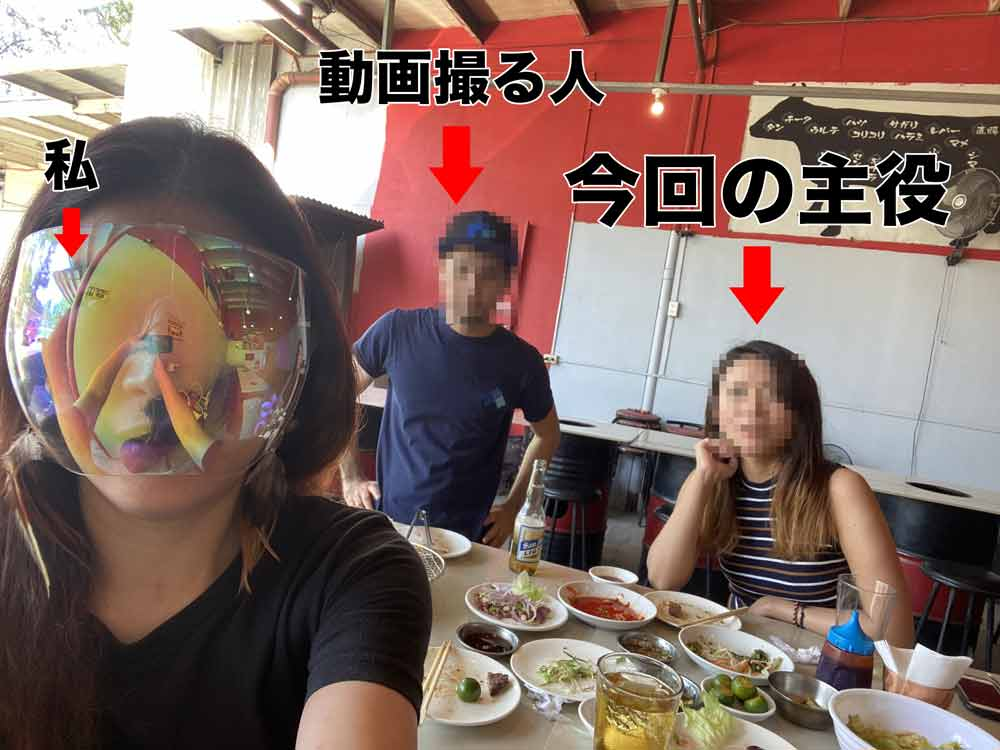
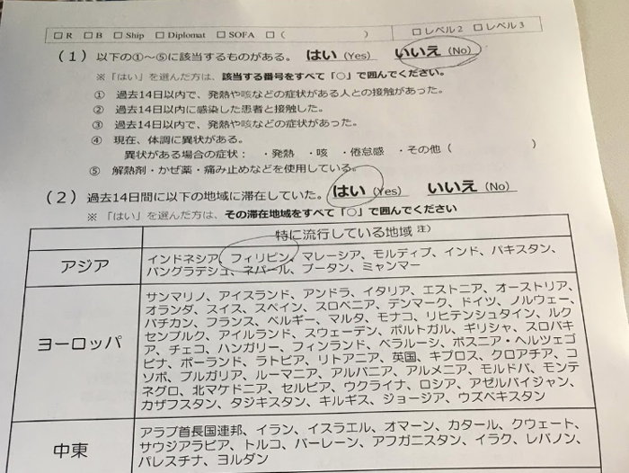
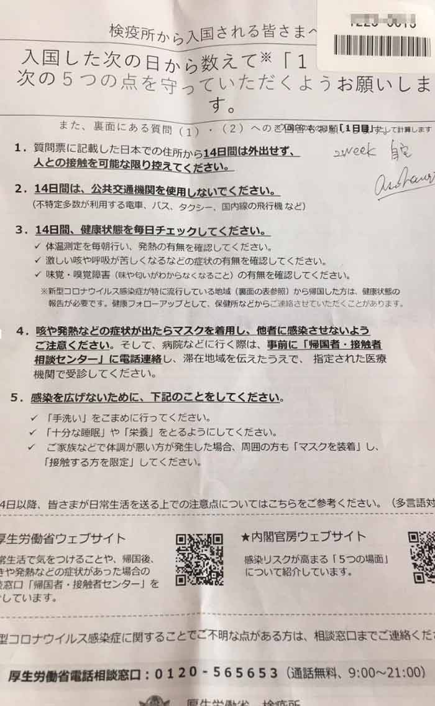
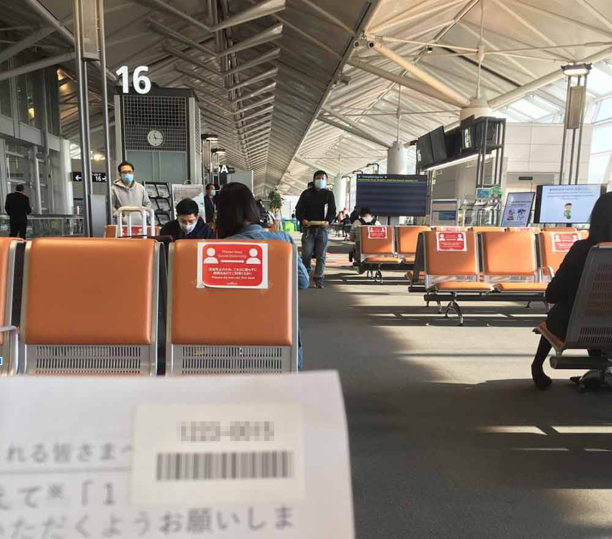
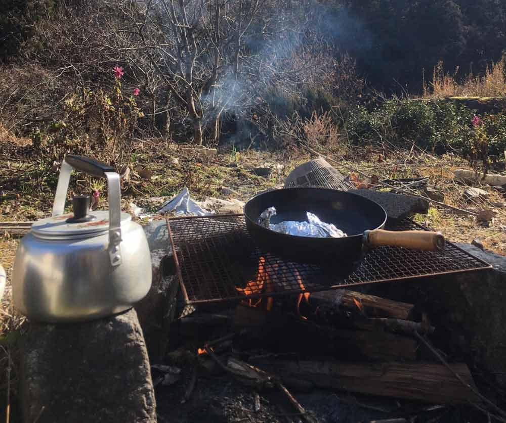
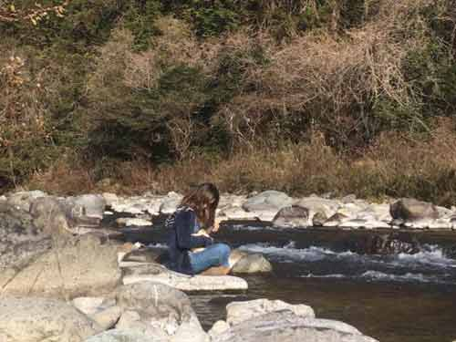

親愛なる人がフィリピンセブ島から日本に帰還するまでの手記を託してくれました。

今回は最終回、「帰国後編」。日本帰国後必要な諸手続きなどを綴ってます。今から成田以外で日本の空港に帰る方、参考にしてください。

<toc id="/blogs/entry433/"></toc>

## 手記を書いたのは元同僚。ざっくりどんな人かご紹介
この記事は私の元同僚による手記です。

ロックダウンの影響もありフィリピンから航空券購入が大変だったようで、*今後日本へ帰る人たちに気をつけて欲しい点などを伝えたい*という思いで寄稿いただきました。

ちなみに彼女のパーソナリティです。

自然豊かな日本の中部地方でのびのび育った元教員。オーストラリアに留学したり、働いていたので英語はペラペラ。

<small>※ プライバシーに配慮してモザイク処理をしてます。</small>

セブでは一緒に買い物したり、昼から一緒に呑んだくれることができる重要な人でした。

1. [VISA手続き編](/blogs/entry422/)
2. [航空券購入 + バランガイ編](/blogs/entry429/)
3. [渡航編](/blogs/entry427/)
4. 帰国後編（←イマココ）

ここからは託してくれた手記をほぼそのまま掲載します。

## 日本到着！！！！
日本にやっと帰れる〜とウキウキでしたが日本はコロナ感染者瀑増中でみんな超神経質になってました。

でも行政の対策はゆるゆるや〜ん。そんなお話です。

日本到着前に機内で用紙の記入を求められます。この用紙を機内で書いておきましょう。

ちなみにフィリピンはもちろん入国制限対象地域です。

<small>※ ↑面面</small>

<small>※ ↑裏面</small>

## いよいよPCR検査
飛行機から降りたあとはPCR検査を受けます。

検査に必要なものは*パスポート*と*上記の用紙*と*マニラで取得したQRコード*の3つです。

セントレア（中部国際空港）ではとても丁寧に案内されたので、正直ここに書くほどの留意点ははないです。

が、ひねり出すとしたら検査前に帰宅方法や、帰宅後はどこで過ごすかかなどを聞かれるのでそこだけ答えられるようにしておきましょう。

あとは係員の指示にしたがっていけばそのまま検査終わります。さすが日本！って感じの手際でした。  

セントレアは唾液を採取するタイプの検査でした。鼻に突っ込むタイプじゃなくてよかった。

試験管みたいな入れ物に2cmくらい唾液をいれます。結果が出るのに1時間かかると言われました。待機場所には掲示板があり、結果のでた番号が表示されていく仕組みです。

### PCR検査の待ち時間もNew Normal
待機中に、検査員数人で39番の人を探し始めたので、『*え、もしかして陽性者出た?！*』と一瞬ざわつきましたが、検査を受けてない人がいたので探してたみたいです。

空港で陽性が発覚する人は一定数いるので、この中に陽性者いるかもしれないのかーとか、私もすでにコロナに感染してるかもしれないんだなーとか、ここで働いてる人たちは毎日そういう人たちと対峙してるのかーとかしみじみNew Normalな世界を感じました。

案内通り1時間後に私の番号が表示されたので、どきどきしながら結果を聞きに行きましたが、結果報告はカウンターで「陰性です」と言われただけでした。あっさりしすぎて拍子抜けです。セントレアは証明書も何ももらいませんでしたが、成田だと結果証明もらえるらしいです。セントレアご利用の人は聞き逃さないように気をつけましょう。

## 検査結果が終わり、セントレア空港を後に
そこからトランクをピックアップして外に出たのは13時ごろでした。飛行機がセントレアに到着してから**2時間で自由の身**になれました！思ったより早かったです。

でも11月に17時成田着の便で帰国した人は、結果が出るまで7時間かかったと聞きました。私は午前中の便だったから空いてたのかもしれません。  

マニラで空港泊したのが報われました！  

フェイスシールドは到着ゲートを出て速攻捨てました。日本は着用義務じゃないんで！

清々しい気持ちになりました。

ゲートを出てからは本当に自由だったのでびっくりしました。

家族の迎えを4時間待っていましたが、その間空港内のレストランもコンビニもどこへでも行けました。

ただ、見回りの警察官に「何してるの？」って3回声をかけられて地味にショックでした。

『*大きなトランク2個抱えて座ってるんだから迎えを待ってるように見えませんか⁉*』って思いましたが、あちらはそれが仕事ですからね。

全力の愛想笑いで対応しました。

## 隔離開始！と、その前に
帰国したら、14日以内に自治体に転入届を出さなければいけません。

私は委任状を書いて家族に転入届の手続きをお願いしました。

正当な理由がない場合、期限を過ぎると罰金を課されることもあるそうなので気をつけてください！でもコロナでの自主隔離は正当な理由とみなされるみたいです。

参照：[新型コロナウイルス感染症の感染拡大の影響及び感染拡大の防止に伴う住民基本台帳事務等の取扱いについて（PDF）](https://www.soumu.go.jp/main_content/000674661.pdf)

あ、**ハンコは必ずいる**ので持っていきましょう。 
自治体レベルではハンコ廃止は進んでないそうです。*期待してたのに、残念*。

## いよいよ隔離開始！
祖母の家が空き家になっていたのでそこで過ごしました。

隣の家と50ｍは離れてる田舎なので誰にも会いませんでした。

庭で1人BBQしたり、川でウクレレ弾いたりできるので隔離は田舎に限ります！

でもめっちゃ寒いです。私は暑い国から寒い国へ行くと風邪を引くタイプなので、暖房器具フル稼働で過ごしました。

今はただの風邪でも大事になるので、*とにかく2週間は絶対風邪引かない！*をモットーに過ごしました。

隔離中は県の感染症拡大防止班の人から電話があり私の体温と体調を聞かれました。両親が対応しましたが、本人が電話に出なくても深追いされませんでした。その後メールで連絡くださいとお願いしたので、毎日メール連絡が来ました。

厚生労働省からも毎日体調確認の電話がきました。これは自動音声電話だったので、怪しい勧誘の電話だと思ってずっとガチャ切りしてました。でもフォローの電話やメールがくるわけじゃないので厚生労働省の電話だと気づいたのは、隔離10日目。

その電話で、そーいえば登録するとLINEでの体調確認に変更できるってどこかで見たなーと思い出してLINEのアンケートに回答しましたが、次の日も変わらず電話で連絡がきました。遅すぎたかのかもしれません。

参考：[厚生労働省からのお願い（PDF）](https://www.mhlw.go.jp/content/000630883.pdf)

## 自主隔離を終えて
日本では空港を出てからの行動は当人の良心に委ねられてます！

* 帰国後14日間は外出せず可能な限り人との接触を控えてください。
* 14日間は公共交通機関を使用しないでください

とお願いされますが、強制力もないし、もちろんチェック機能もありません。 国からのお願いを聞くか聞かないかはあなたの良心次第です！って感じでした。

正直、*いたるところで警察やガードがチェックしていたフィリピンと比べてなんて緩いんだろー*と思いました。ニュースでよく聞く「空港での水際対策」がこれなら、対策になってなくないか？っていうのが私の感想です。

人も足りてないし罰則化できない日本ではこれが限界なのかもしれませんが、*これは外国人観光客には通じないよなー*と思い、未来に一抹の不安を覚えました。

<small>※ コロナ変異種の流入を防ぐために帰国者向けの対応は厳しくなったと聞いたので状況は変わっているかもしれません。</small>

一方で、民間レベルでは感染者対策は厳しく行っているみたいです。

感染者がでると休業にしなきゃいけない企業もあるので、同居人にPCR検査を受ける人がでたら会社への報告義務を設けていたり、その人の隔離期間や方法も報告する必要があるみたいです。他にも会食禁止、社食でのおしゃべり禁止などルールを設けてるそうです。もちろん企業によりますが。  

帰国前、私の隔離場所や方法について家族からいろいろ制限を設けられたので、かなり不愉快な気持ちになりましたが、家族は家族で職場や親族から言われていたようです。

帰国予定の人は周りからいろいろ言われるかもしれませんが、日本社会全体から圧力がかかっているせいだと思って広い心で受け止めてください。

なにはともあれ、無事に帰国でき、コロナも陰性で誰に迷惑をかけることもなく、晴れて自由の身になれてよかったです。

帰国の準備を始めてから帰国して、*自由の身になるまでに約4ヶ月かかりました！* 
ホント長かったー。これがNew Normalです！

私が帰国できたのは、何度も手続きにくじけそうになって、年内の帰国は諦めようかと弱気になる私を叱咤激励して励ましてくれたかみーゆさんや素敵なセブ友がいてくれたおかげです。（大げさｗ） 
しばらくは海外への渡航はどこもこんな感じかと思うとしんどいですが、コロナ収束したらまたセブ行きたいなーとか、次はピラミッド見に行きたいなーとか性懲りもなく考えたりしてます。

それまでに旅行資金貯めなければ！！！！！

## さいごに、管理人（かみーゆ）から
彼女は2020年12月23日、無事日本に帰還しました。

日本に無事帰れたのがめちゃくちゃ嬉しいです。

異文化をめちゃくちゃ理解して執拗なまでにメールを送り続け、、、、めちゃ尊敬しました。

詳しくは[VISA手続き編](/blogs/entry422/)をご覧ください。

勇姿です。

<small>※ 帰国後に送られてきた川辺でウクレレを弾く彼女。謎ですが。</small>

 海外に住むことは「***自分の常識って非常識かも*と疑う気持ちでないと生きていけない**」なあって。そんなことを学べたのは彼女のおかげとも思ってます。

後続する日本人のために空港などで睡魔に襲われつつ手記を書いて託してくれ、感謝してます。

またセブに戻ってくるのを楽しみしてます。

 また飲もうで！！待っとるで！！！！

 この記事がフィリピンから日本に帰るみなさんのお役に立てたら彼女もきっと本望です。

最後までお読みいただきありがとうございました。

<prof></prof>
