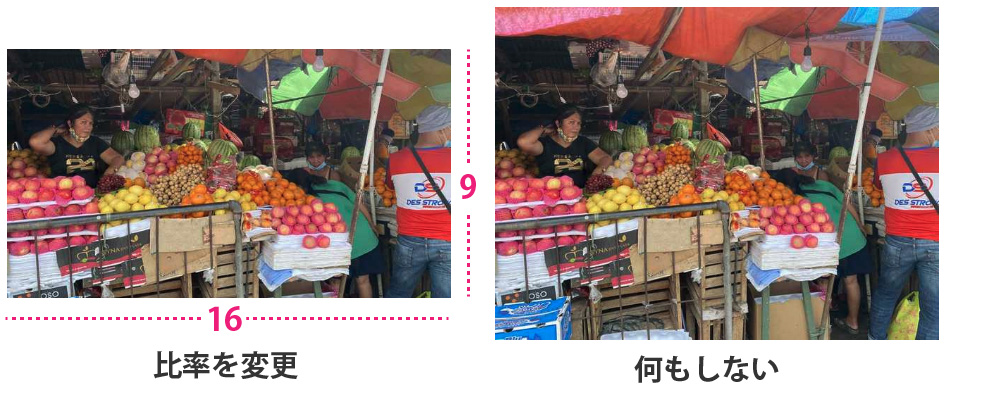
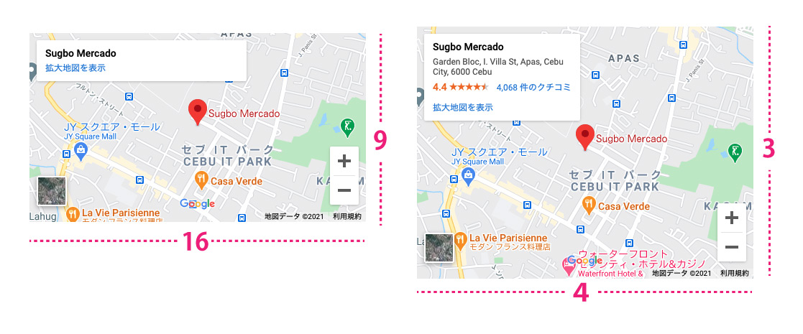

## 美しいものは比率がカギ！！アスペクト比率とは？なぜ比率が重要なの？
アスペクト比とは映像（映画、テレビ、動画）などの縦横比のことをいいます。

この比率の均整の法則が決まっているとものは美しく感じます。

Web制作ではこの画像サイズなどをきちんと揃えるとそれだけで見た目がグッと美しくなります。

### 比率色々
アスペクト比は黄金比、白銀比などすでに見やすい・美しいと言われる比率があります。

* *1 : 1.618（約5:8）黄金比*<br>紀元前古代ギリシャで発見されて以来、人間がもっとも美しいと感じる比率。名刺、Appleのロゴ、モナ・リザなどがこの黄金比が使われていることで有名。
* *1 : 1.414（約5:7）白銀比*<br>五重塔などの日本建築からハガキやA4,B4用紙など日本人には古くから馴染みのある比率として使われています。
* *3 : 2*<br>一眼レフからフィルムカメラなどで使われている比率。
* *4 : 3*<br>コンパクトデジカメからパソコンのディスプレイなど。個人的にはよく使うサイズです。
* *16 : 9*<br>デジタルテレビのハイビジョン映像。

余談ですが黄金比を利用して作られる*黄金螺旋*は自然界に存在するすべてのものがこの比率です。オウムガイなどもそうですね。太古からいろんなデザインに活かされてます。


ちなみに画像のサイズを決める時の計算です。

幅1200pxの縦を4:3で作りたい時は以下のように計算します。

```
4 : 3 = 1200 : ?
3 × 1200 / 4 = 900
```
多分記憶するに中学レベルの計算ですが重宝しています。

## プロパティaspect-ratioの使い方
さて、本題です。プロパティaspect-ratioを早速使ってみましょう。

ブラウザのサポート状況ですが現在最新のChrome88のみです（後述します）。

使い方は以下の通りです。

```css
aspect-ratio: 縦比率 / 横比率
```

たとえば、以下のような画像を4:3に切り抜きたい時はこのように書きます。

```css
img {
  aspect-ratio: 16 / 9;
  object-fit: cover;
}
```



`aspect-ratio`は比率を変えられない、Google Mapのiframeなんかで威力を発揮します。



埋め込みタグの`width`と`height`は取っ払います。

```html
<iframe src="https://www.google.com/maps/embed?pb=!1m18!1m12!1m3!1d3925.122371116283!2d123.90344001452674!3d10.332090870063556!2m3!1f0!2f0!3f0!3m2!1i1024!2i768!4f13.1!3m3!1m2!1s0x33a99921c900ebc3%3A0x66f02283ad1bcaf4!2sSugbo%20Mercado!5e0!3m2!1sja!2sph!4v1612605096930!5m2!1sja!2sph" frameborder="0" style="border:0;" allowfullscreen="" aria-hidden="false" tabindex="0" class="map"></iframe>
```
CSSで整えるだけ。

```css
.map {
  aspect-ratio: 16 / 9;
}
/*または*/
.map {
  aspect-ratio: 4 / 3;
}
```
計算しなくていいので超楽チンです！！！

## おまけ・アスペクト比を保つ旧やり方
今絶賛使ってますが、`div`などでラップしてアスペクト比を保つ方法があります。

縦方向のpaddingを%で設定すると横幅から値が算出される特性を生かすやり方です。

ワイドサイズ（16:9）のアスペクト比を保ったマップを埋め込みたい時は、`padding-top`か`padding-bottom`を*56.25%*にすればいいわけです。
```
1 : ? = 16 : 9
1 × 9 / 16 = 0.5625

A. 56.25%
```

まとめて書くとコードは以下のようになります。

```html
<div class="wrapper">
  <iframe src="https://www.google.com/maps/embed?pb=!1m18!1m12!1m3!1d3925.122371116283!2d123.90344001452674!3d10.332090870063556!2m3!1f0!2f0!3f0!3m2!1i1024!2i768!4f13.1!3m3!1m2!1s0x33a99921c900ebc3%3A0x66f02283ad1bcaf4!2sSugbo%20Mercado!5e0!3m2!1sja!2sph!4v1612605096930!5m2!1sja!2sph" width="600" height="450" frameborder="0" style="border:0;" allowfullscreen="" aria-hidden="false" tabindex="0"></iframe>
</div>
```

`padding`を使ったアスペクト比のラップの中にiframeを縦横目一杯広げて`position:absolute`で固定すれば完成です。

```css
.wrapper {
  width: 100%;
  position: relative;
  height: 0;
  padding-top: 56.25%;
  overflow: hidden;
}

.wrapper iframe{
  position: absolute;
  left: 0;
  top: 0;
  height: 100%;
  width: 100%;
}

```

タグを1個挟まないといけませんし、コードも長くなってイヤですね。。。

けど、今のところこれが一番どのブラウザも対応できる手法です。

## まとめ・早く他のブラウザもサポートして
間もなく使用できる次世代のCSSプロパティ`aspect-retio`を紹介しました！

私はデザイナーではありませんが、こういう比率にちゃんと気を使ってる人を見ると大好きって思います。

美しさ、機能美って結局理論的だと思うんです。

先人がすでに美しい比率を見つけてるのだから利用すればいいだけですね！

`aspect-ratio`が他のブラウザでもサポートされたら面倒な計算もしなくてよくなるし、CMSなどの動的サイトで遺憾無く力を発揮しそうです。

この記事がみなさんのコーディングライフの一助となることを願います。

最後までお読みいただきありがとうございました。
