## 臭みを気にせず食べることができるTuslob Buwa（トゥスロブワ）はDonkatsuレストランで！

フィリピン・セブ州マクタン島にある*Donkatsuレストラン*では**Tuslob Buwa（トゥスロブワ）専門店**で、臭みを最大限に減らしたものを食べることができます！

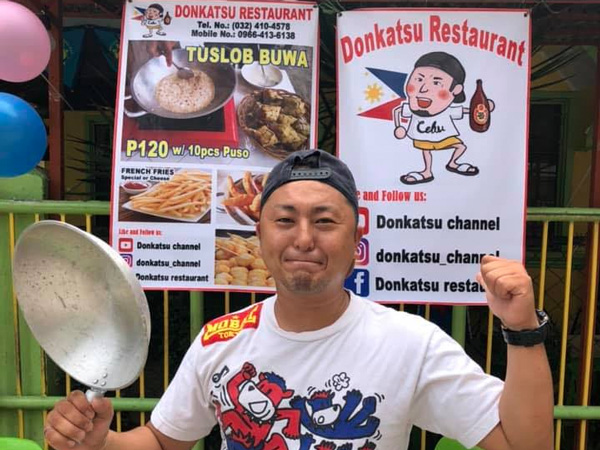

*日本人マクタン島マスターのドンカツさん*が、2021年2月21日ご自身のおうち兼職場を改修しレストランとしてオープンしました。

<h4>ドンカツさんてどんな人？SNSもチェックしよう！</h4>
<ul>
  <li>牛タンをさばかせたら絶品（Donkatsuレストランでも食べれるみたいよ！事前問合せしてね！！）</li>
  <li><a href="https://www.instagram.com/donkatsu_channel/" target="_blank" rel="noopener">インスタグラム</a></li>
  <li><a href="https://www.youtube.com/channel/UCZ_hb3hw2tm4RnWuJ8M6l8Q" target="_blank" rel="noopener">YouTube：ドンカツ チャンネル</a></li>
</ul>

 お店の情報はこちら！！マクタン島・Maribago（マリバゴ）のセブンーイレブン近くです。

* お店詳細：Facebookページ（[Donkatsu Restauront/](https://www.facebook.com/donkatsuchannel)）
* 場所：[Google Map](https://www.google.com/maps/dir/10.2771352,123.9861484/10.2835462,123.9961502/@10.2805299,123.9865309,16z/data=!3m1!4b1!4m4!4m3!1m1!4e1!1m0)
* 営業時間：毎日16時よりオープン

私たちが行ったのは2月28日。たまたまマクタンエリアで公共の場での飲酒禁止（リカーバン）が解除された日でした。

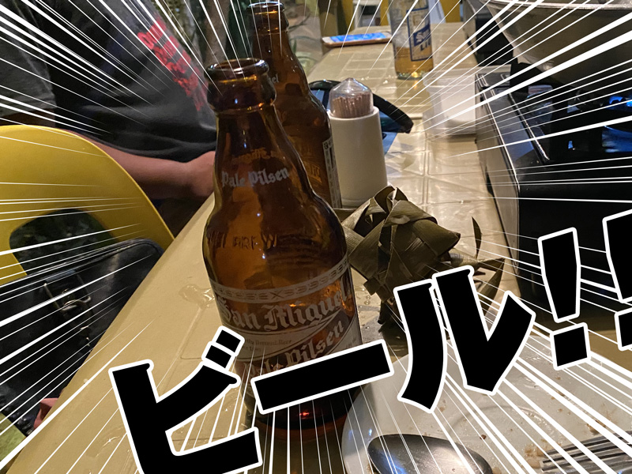

ビール、ビール！！！！テンション爆上がり！生き返る！

### そもそも、セブのストリートフード、Tuslob Buwa（トゥスロブワ）とは？

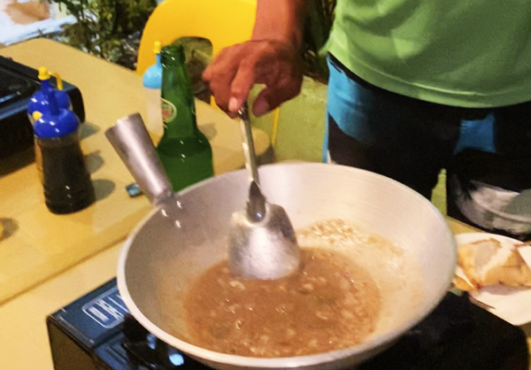

*Tuslob Buwa（トゥスロブワ）*とは1980年代に生まれた**セブ発祥のストリートフード**で、豚の脳みそと薬味（ニンニク・玉ねぎなど）、スパイスなどを専用フライパンで炒め、豚骨スープを加えて煮詰めた料理です。

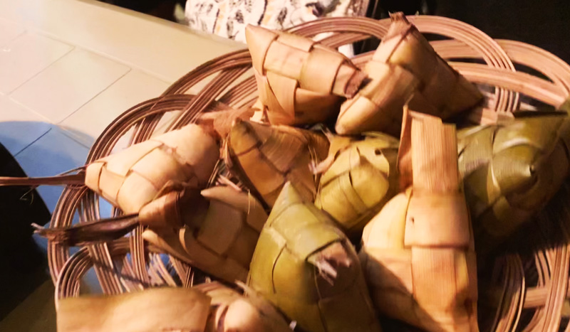

鍋に煮詰まった汁をディップのようにして*Puso（プソ）*というココナッツの葉に包んで蒸して作ったもち米に付けて食べます。

1つの鍋を囲って、みんなで食べるのが一般的です。

### ぶ、豚の脳みそ？？？グロいの？匂い大丈夫？

日本人であればそんなことをおそらく思い浮かべるのではないかと思います。

確かに通常我々**日本人には臭みが気になって食べにくい**らしいです（中には平気な人もいるかも）。

私は思わず映画「インディー・ジョーンズ/魔宮の伝説」に登場した*猿の脳みそシャーベット*を思い出してしまいました。。。

自国以外の料理って気候、風土や感覚が違うので仕方ないのですが、我々にとって食べ物が臭かったり、味や油分がくどかったりします。

余談ですが、昨年カーボンマーケットで健康を意識してRed Rice（赤米）を購入しました。炊いてみたものの匂いが私には我慢できず断念しました。。。。

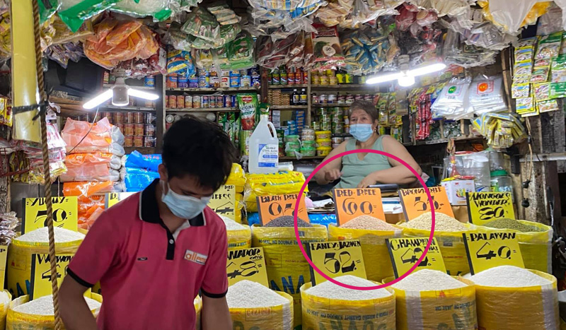

<card id="/blogs/entry389/"></card>

健康にいいからといって勧められたRed Rice（赤米）。とくに高血圧に良いらしいですが、そもそも私は低血圧だったとも気づきました。。。。

 さておき！！フィリピン人にとっても*日本人の気づかない匂いや風習が気になる*かもなので**お互い様だということを忘れないでほしい**です。

## 早速 Tuslob Buwa（トゥスロブワ）にチャレンジ
Donkatsuレストランの*Tuslob Buwa（トゥスロブワ）*はたった120ペソでPuso（プソ）が10個も付いてきます。

<small>※ 2ペソ約1円です。</small>

スープはおかわり自由。*めっちゃ安くないですか？*

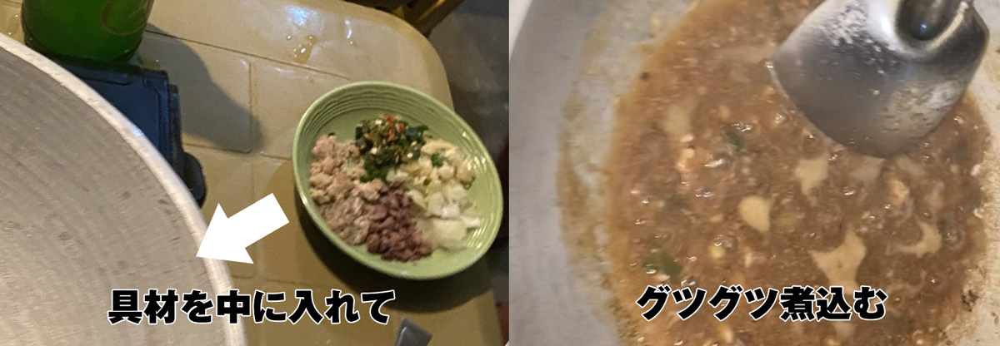

こちらのお味は豚骨醤油ベース。豚の脳みその強い臭みを抑えるためか絶妙にニンニクやスパイスが効いています。

どちらかというとフィリピンではどこでも食すことのできる料理Sisig（シシグ）に味付けが近いそう。

Sisig（シシグ）は醤油ベースで日本人も抵抗ない味だし、もちろんフィリピン人も大好きな料理。

私の感想ですが、DonkatsuレストランのTuslob Buwa（トゥスロブワ）はSisig（シシグ）よりは*油分が少なく、サッパリしたイメージ*でした。  

グツグツ煮ているうちに*鍋の表面に煮詰まった濃厚なスープの塊が溜まってる*ので、そこにPuso（プソ）をつけて食べます。**ウマイ!!!**です。  

*Puso（プソ）*はあらかじめ包んである葉っぱごとカットしてありました。

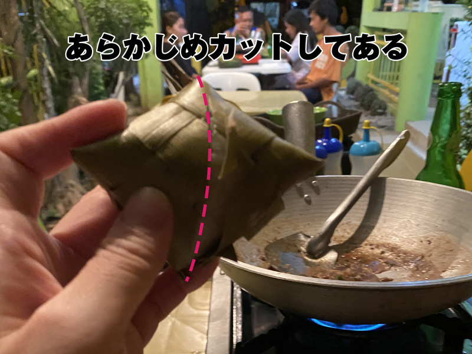

多少ココナッツの葉の香りがしますが*Puso（プソ）*には味はありません。なので**よく煮詰めた濃厚なTuslob Buwa（トゥスロブワ）と相性抜群**です！！  

スープの中からは*そぼろのようなさっぱりしたひき肉を感じます*。

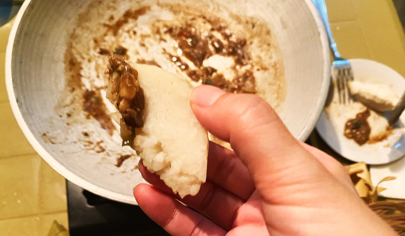

が、**きっとこれが*脳みそ*なんだなー**と思うと感慨深かったです。  

ちなみに女性へのアドバイスです！！

*Puso（プソ）*は保存食なので水分少なめに蒸されてます。

**サイズの割にはカロリー高め**なので（通常のお茶碗1.5 ~ 2杯分くらいのカロリーと予測）*食べ過ぎ注意*です。

警告ですがフィリピン料理を何も考えずに日本人が食べ続けると*太る可能性大*です（日本人じゃなくても太りそうだけど）。

## せっかくなので、サイドメニューやお酒とともに！

*Donkatsuレストラン*の魅力は何と言っても、**サイドメニューやお酒もとてもリーズナブル**。

ビールのサンミゲル・ライトが70ペソ、サンミゲル・ピルセンが65ペソでした。

ちなみにフィリピンでのビールの平均の値段はモールなどのレストランで80ペソ、バーで100ペソくらいなので**超良心的**です！！

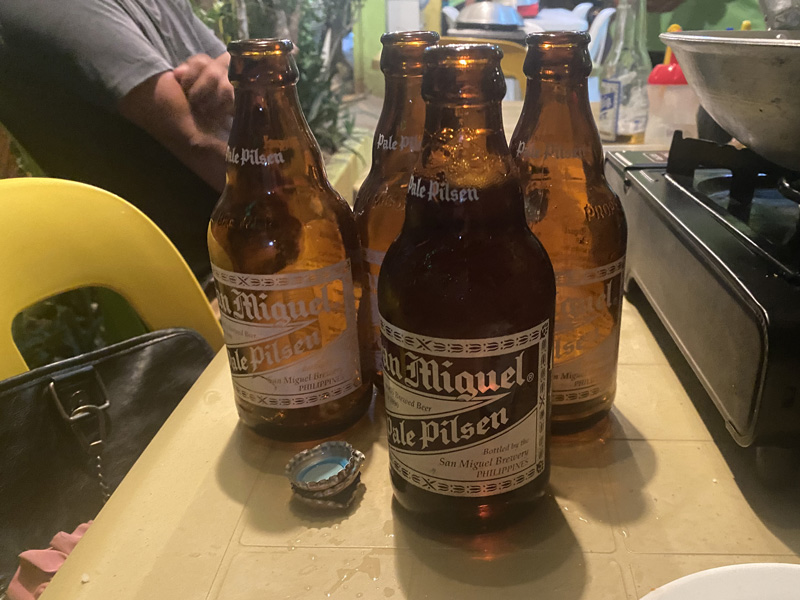

思わず1人でビール5本も開けちゃいました（写真の時はまだ4本目）。

### サイドメニュー・スクイッドロール/30ペソ・3本入り（写真なし）

フィリピンではお馴染みのイカ料理・*スクイッドロール（イカの練り物のフライ）*です。

こちらのソースはスギちゃん監修です（写真撮り忘れたのでソースに関しては次のLumpia（ランピア）で参考にしてください！）。

ちなみにスギちゃんはDonkatsuレストランのヘッドシェフ。日本語が話せます。

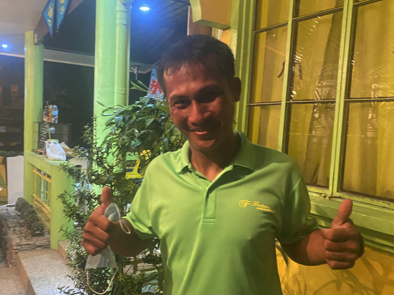

<small>※ スギちゃんの地元の島は水道も電気も通ってないそう。なので地元にとても帰りたくないらしいです。</small>

### サイドメニュー・Lumpia（ランピア）/25ペソ・4本入り
こちらはドンカツさんオススメのフィリピン風揚げ春巻き・*Lumpia（ランピア）*です。

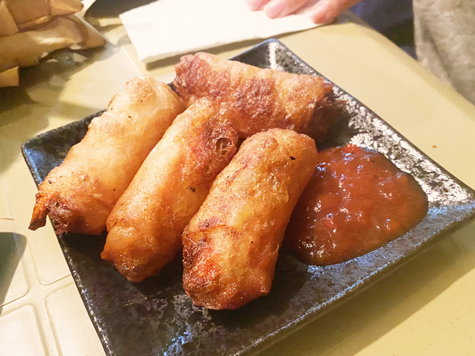

中身は冬瓜（とうがん）みたいなやつとニンジンです。

ソースはスクイッドロール同様スギちゃん監修でケチャップにスパイスやハーブを混ぜて少しピリ辛です。美味しかったです！

悲しいかな、フィリピンではあまりがっつり野菜のローカル料理を見かけることができないです。出会ったらラッキー。ぜひ食べましょう。

<h4>南国では同じ野菜でも日本と様子が違う</h4>
フィリピンは一般的に日本の<strong>5倍から7倍の紫外線量</strong>があると言われています。フィリピンにももちろん野菜は売っていますが、日本で見かけるものと形や大きさ、皮の硬さが違うものが多いです。 
たとえばトマトやピーマンの皮がやたら硬くなるなどあり、フィリピン人は好んで野菜を食べないようです。代わりにフルーツを食べる人が多いようです。

### シメ・Batchoy（バッチョイ）というフィリピン風ラーメン/85ペソ

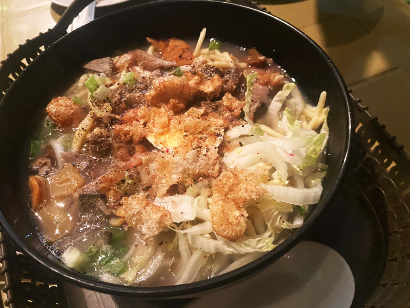

*Batchoy（バッチョイ）* はフィリピン風ラーメン。DonkatsuレストランのBatchoy（バッチョイ）は豚ベースで薬味とチャーシュー、野菜、上に小さく砕いた *Chicharron（チチャロン）* が乗っかってました。

スライスされた白菜がシャキシャキ！とても美味しかったです！

<h4>スーパーでも売っている<em>Chicharron（チチャロン）</em>とは？</h4>
フィリピンに来たらChicharron（チチャロン）という油で揚げた豚の皮は必食！以前の職場では、同僚がスーパーなどで買ってきておやつ感覚で一緒に食べていました。しょっぱくてパリッとした動物臭のするスナックなイメージです。 酒の肴にぴったり！お土産にもオススメ。

この頃にはビールを5本飲み、かつ、はじめてBalut（バロット）の内側を見てしまった衝撃で*記憶障害*が起こりました。また追記事項があれば加筆します。

### おまけ・衝撃のBalut（バロット）との遭遇

*Balut（バロット）* とはフィリピンの伝統料理で**鶏の有精卵を調理したもの**です。育成具合は16日、18日、20日と選べて、最近20日はあまり売られてないようです。  

私は2年近くフィリピンに住んでますが、Balut（バロット）だけは断固拒絶して生きてきました。

補足しておくとフィリピン人ですら若いと食べたこがない人がいるくらいの食材です。  

今回Donkatsuレストランに付き合ってくれた友人・占い師マイアさんが *Balut（バロット）* に以前からちょっぴり興味を持っていた模様。

<card id="/blogs/entry387/"></card>

ヘッドシェフスギちゃん。。。さすが、とても仕事ができる人。

わざわざチャリンコで近くのバロット屋さん（セブ島ではあちこち路上で売られている）まで買いに行ってくれました（ここまでは酔払ってたので多分）。  

しかもなぜか大量に。。。。  

購入仕立てのBalut（バロット）は*ホカホカ*。殻を割って中のスープを飲んだ後ゆで卵感覚で殻をむきながら食べていきます。

お好みで塩や薬味をつけていただきます（購入時にもらえます！）。

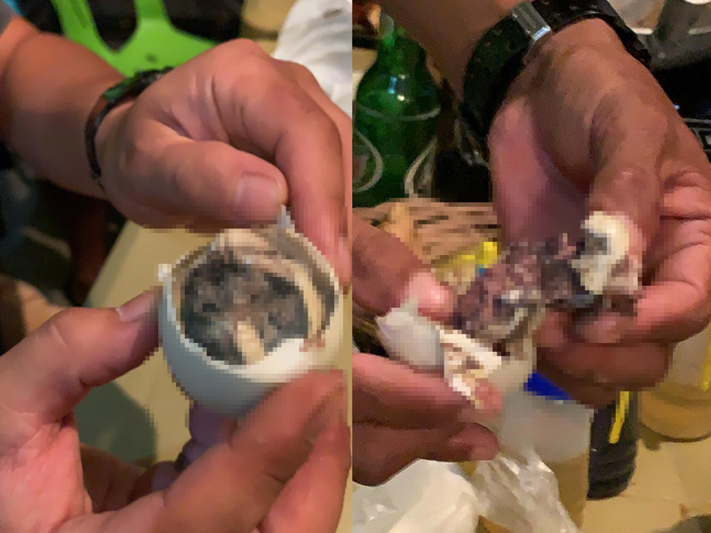

<small>※ 個人的に耐えかねたので軽くモザイクをかけさえていただきました。 ※ 興味、、、むしろ勇気がある方は、<a href="https://www.google.com/search?q=%E3%83%90%E3%83%AD%E3%83%83%E3%83%88&sxsrf=ALeKk03URdi9RNzLffQapfI-MRalaCdSTA:1614594174930&source=lnms&tbm=isch&sa=X&ved=2ahUKEwiy1oKC8I7vAhViNKYKHYMJA30Q_AUoAXoECAgQAw&biw=1440&bih=709">こちら</a>をご覧ください。 ※ 私が食べ物の見た目を気にして苦手なだけなので、興味のある方はぜひチャレンジしてください。きっと美味しいはずです！！</small>

 おかげさまで*衝撃的すぎて酔いが覚めました*。

私は食べてませんが、スギちゃんもドンカツさんも美味しそうに食べていました。  

**羽化しかけの雛の羽が歯に挟まる**そうなので食後のフロス（糸ようじ系）をお忘れなく。

## Donkatsuレストランができたワケ

そもそもドンカツさんの所属する会社では元々観光客向けにクルージングのサービスを提供していました。

去年3月からコロナ禍の影響で**フィリピンは世界最長のロックダウン**に見舞われました。

日本も同じだとは思うのですがとくに旅行・観光業は壊滅的です。

例外なくコロナのダメージで観光客に対する船の仕事はなくなりました。

*セブ島って、リゾートのイメージ*です。セブ島から観光業がなくなったらどれだけのダメージがあるか簡単に想像できますよね？

従業員のお給料を作るための手段のひとつとして生まれたのが*Donkatsuレストラン*です。

元々のおうち兼職場を低予算で改築し、レストランとして使えるようにテラスに屋根をつけたり、手洗い場も完備されました！！  

地元の人にとっても違和感なく馴染みの味の料理が味わえ、安心価格のレストランでした。  

私たちが行った日も、フィリピン人のお客さんがたくさん来ていました。

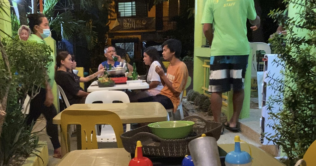

私たちも地元の人とのちょっとした交流も楽しめました！！

## まとめ・Donkatsuレストランは日本人でも安心してローカルフードが堪能できます！

日本人にとってカレンデリア（フィリピンの大衆食堂）などでローカルフードを食べるのはわりと敷居が高いもの。

たまに知り合いのフィリピン人にですら衛生面を考慮してローカルフードを食べに行くのを止められます。

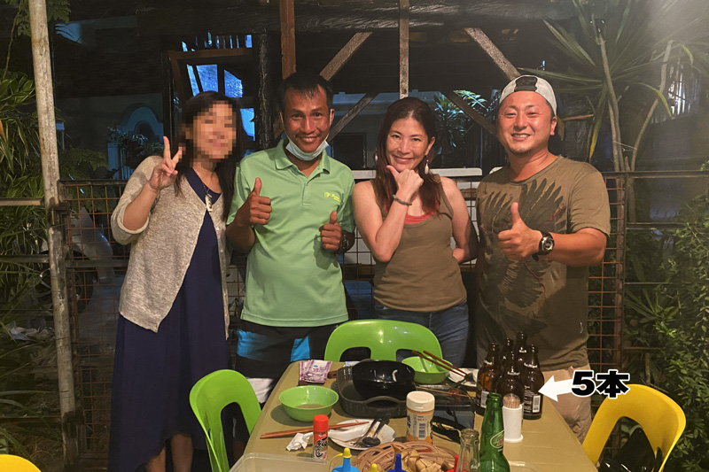

とは言え、せっかくフィリピンに来たり暮らしたり、そんな中ローカルフードを食べないとかフィリピンの生活に触れないのは、どんなにお腹が繊細な日本人でも少しもったいないと思うんです。

Donkatsuレストランは日本語の通じるスタッフもいるし治安や衛生面も安心して入れます！  

美味しい料理をごちそう様でした^ ^

ドンカツさん、ヘッドシェフ・スギちゃん、Donkatsuレストランのスタッフの皆さん、めーーっちゃありがとうございました！！  

日本人もぜひ、足を運んでみて欲しいです。

今回も最後までお読みいただきありがとうございました。
