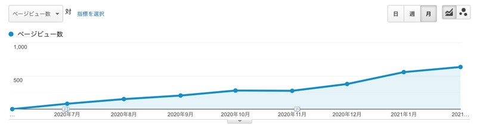
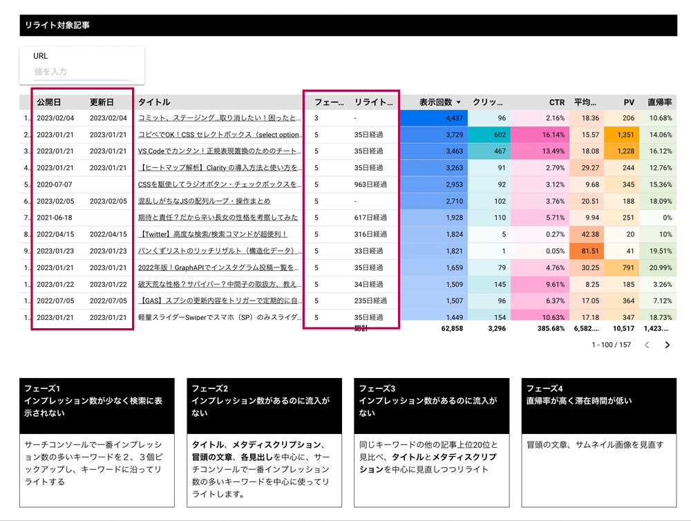
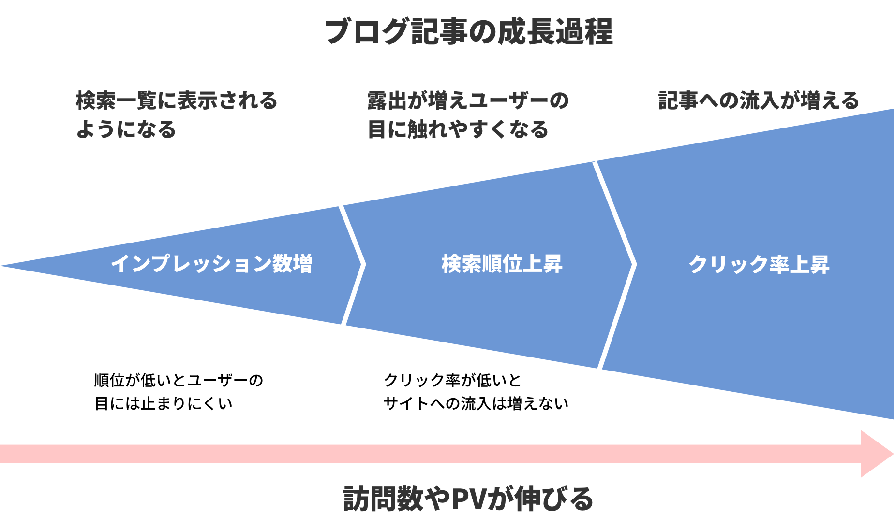
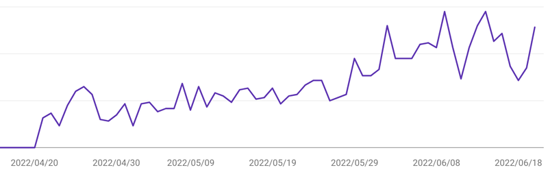
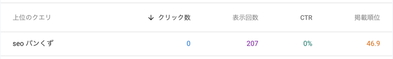
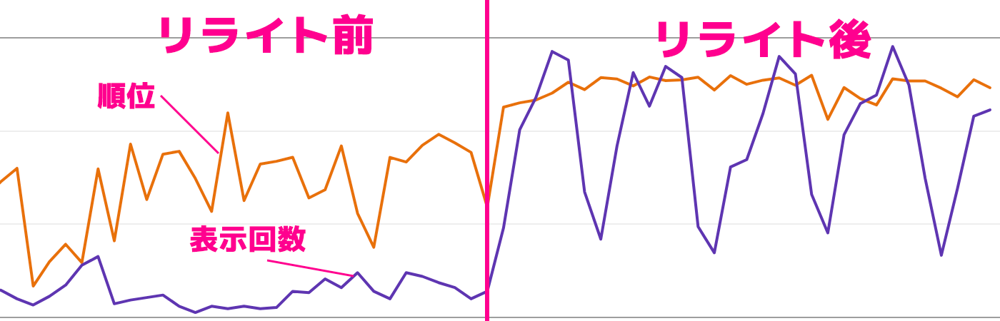
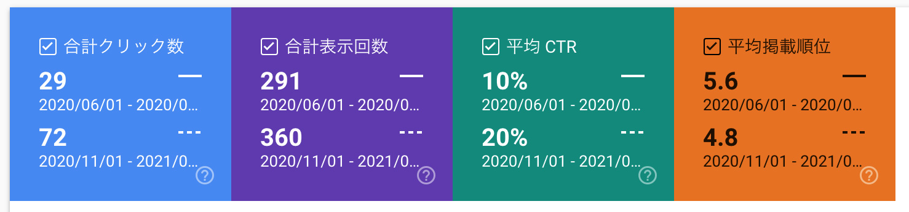
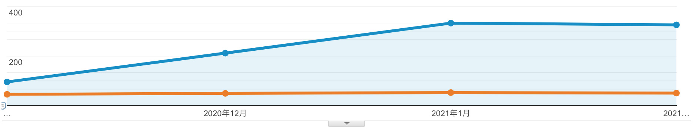
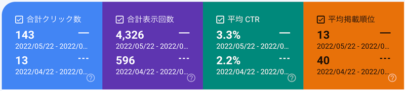

なんとなくブログのリライトをするのは卒業したい。データを元に根拠あるリライトがしたいですよね？

そこでデータを生かしたリライト記事の選定とフェーズごとのリライトの仕方をご紹介します。

ブログを始めてPVが伸び悩んでる初心者の方、何を基準にどの記事をリライトしたらいいかわからない人でも何を基準にリライトすればいいか解説しています。

<p><small>この記事は2022年6月に大幅にリライトしました。</small></p>
<prof></prof>


## なぜ、SEO対策にリライトが効果的か

<msg txt="リライトがSEO対策に効果的な理由は、0から80点を取るより30点から80点のレベルにする方がカンタン！だからです"></msg>

* ブログは一から書くのはしんどい
* 一度書いた記事ならGoogle アナリティクスやサーチコンソールでのデータ分析可能

改善すべきが点を発見しやすく、新たに記事を書くよりも格段に労力もかかりません。

<br>もちろんリライトするためにはすでに書いた記事があることが前提条件です。

* ブログを始めて3か月以上経ちGoogle アナリティクスやサーチコンソールのデータがある程度溜まっている
* PVが伸び悩んでるけど、どうしていいかわからない
* 何を基準にリライトしたらいいかわからない

ちなみに新規で記事書いてオーガニックサーチから安定して流入されるまで、私の肌感では3か月ぐらいかかります。



## 具体的なリライトする記事の選び方

リライト記事を選びます。

リライトの基準は記事の成長フェーズごとに決め、直感に頼らず、データで判断します。

私はデータポータルでGoogle アナリティクスやサーチコンソールのデータを統合して記事の状態ごとにどんなリライトが必要か分類しています。



データポータルの使い方はこちらで紹介しています。

<card id="/blogs/entry500/"></card>

もちろん、無理にデータポータルを使わなくてもGoogle アナリティクスやサーチコンソールにアクセスさえできればリライトは可能です。

### 記事ごとの成長フェーズを知り、分類する
リライトする記事を選ぶためには、データを元に記事ごとの成長フェーズを見極めます。どの記事もスピードは違えど、一般的には段階を踏んで伸びていきます。



この銀ねこアトリエでのフェーズごとのチェック項目と目安です。

|フェーズ|チェック箇所|目安|ツール|
|-|-|-|-|
|フェーズ１|インプレッション数|月間100以下|サーチコンソール|
|フェーズ２|順位|平均20位以下|サーチコンソール|
|フェーズ３|クリック率|平均3%以下|サーチコンソール|
|フェーズ４|直帰率/滞在時間|90%以上/0秒|アナリティクス|

フェーズ2、3を中心に行うと負担が少ないです。

もちろん、サイトごとにユーザーや特性が違うので目安は変えたほうがいいです。

<div class="box"><h4>インプレッション数とは？</h4>検索キーワードで表示された回数。順位が低くてユーザーに見られなくても１回と数えられる</div>

検索されて上位に浮上し、クリックされないことには、記事は読まれることがありません。

<msg txt="読まれない記事は存在していないのと一緒！"></msg>

なので一番最初のフェーズは **なんとしてでもインプレッション数を上げること** です。

フェーズ1をクリアしたら記事の成長段階に応じてリライト方法を変えます。

### フェーズ1.インプレッション数を上げるためのリライト

<p class="gray-box">サーチコンソールで一番インプレッション数の多いキーワードを<em>２、３個ピックアップ</em>し、キーワードに沿ってリライト</ｐ>


大抵の記事はこちらのグラフのように公開後、徐々にインプレッション数が上がっていきます。



上がってこない場合は、インプレッション数を上げるためのリライトをします。

<p class="box"><em>目安：公開1ヶ月から3ヶ月後に月平均100以上行かない場合</em></p>

以前SNSシェアで反響があったり、周囲から評判の良かった記事も対象にします。

* キーワードプランナーで月間の検索ボリュームを確認
* 一番インプレッション数の多いキーワードと記事の内容がキーワードに沿っているか確認

<small>※ 検索ボリュームがそもそも少ない場合は、リライトする意味がない場合があります。インプレッション数が少なくてもキーワードに沿った記事でクリック率が高いようであれば放置しておきます。</small>

<br>もしここで狙っていないキーワードが多くある場合は、狙っていないキーワードを取り除くなどする必要があります。

このリライトがうまく行けばインプレッション数だけでなく、順位もクリック率も上がります。

### フェーズ2.順位を上げるためにキーワードの質を高めるリライト

<div class="gray-box">インプレッション数があるのに流入がない記事をリライト</div>

インプレッション数はある程度あるのに順位が低い場合はクリック率が上がりません。

<p class="box"><em>目安：20位以下でインプレッション数が200以上</em></p>

以下画像を見てください。月200以上インプレッション数があるのに順位は46位です。



検索結果の1ページに表示されるのは10位までです。この場合、その記事にたどり着くためには4ページ遷移する必要があります。

<msg txt="ページ遷移するのは面倒ですよね？このままだと記事を見てもらえません"></msg>

たいてい20位ぐらいまでであれば見られる可能性がありますが、どんなにインプレッション数があっても順位が低いとユーザーの目に触れることは稀（まれ）です。

サーチコンソールで一番インプレッション数の多いキーワードを中心に使ってリライトします。

具体的にはページ上部にできるだけ、狙いたいキーワードを増やします。もちろん不自然にならないように気をつけます。

主に見直す場所です。

* タイトル
* メタディスクリプション
* 冒頭の文章
* 各見出し

<msg txt="順位が上がってくると、たいていインプレッション数も上がります。しかもガツンと！"></msg>



### フェーズ3.順位は上がったのにクリック率が低い

<div class="gray-box">同じキーワードの他の記事上位20位と見比べ、「タイトル」と「メタディスクリプション」この2つを中心に見直しつつリライト</div>

サーチコンソールで順位が上がったのにクリック率があまり上がらない場合は、*単純に「タイトル」と「メタディスクリプション」が他の記事に比べて魅力的じゃない* ということになります。

フェーズ3を脱却できれば、かなり安定的にPVを稼ぐ記事になります。

<p class="box"><em>目安：500以上のインプレッション数で20位以上なのにクリック率が3％以下の記事</em></p>

とにかく検索キーワードを目立たせるためにタイトルは【】（大括弧）などを使って装飾を入れる程度に書き換えます。書き換えすぎると逆に順位が落ちてしまう場合があります。特にキーワードを残すように気をつけます。

ディスクリプションやタイトルはGoogleが勝手に書き換えることもあるので、実際に検索してどんなメタディスクリプションになっているか確認します。

ページ内の変なフレーズ等拾っている場合があれば、部分を書き直す必要があります。

<msg txt="月1000インプレッションの記事が3％から5％に上がるとPV30から50にUPします。100記事改善すれば2000PV増です。"></msg>

### フェーズ4.直帰率が高く滞在時間が低い
フェーズ3をクリアしている記事のリライトです。

<div class="gray-box">直帰率の高いの記事の冒頭の文章、サムネイル画像を見直す</div>

ユーザーの直帰率が高い場合、考えられるのは *検索内容と記事の内容が思ったものと違った* と考えられます。

<p class="box"><em>目安：離脱率90%以上で滞在時間10秒以下</em></p>

ページを訪問した瞬間一番最初に目に飛び込んでくるのはサムネイル画像です。記事と沿ってないサムネイルの場合は作り直します。

そして、冒頭の文章がちゃんとユーザーに刺さる内容なのか読み直します。他の同じキーワードの記事とも比較します。

必要があれば、Clarity（Microsoft社の提供するヒートマップ解析ツール）などでどの程度スクロールされているか確認します。


<card id="/blogs/entry510/"></card>


### 見られてない記事はもったいぶらずに削除もしくは「noindex」処理
長い間インプレッション数0、クリック率0、PV10以下の記事は思い切って削除します。

もしくは `head` タグ内に検索エンジンにクロールされないように処理（noindex）してしてしまいます。

```html
<meta content="noindex" name="robots"/>
```

## 事例の紹介
データを生かしたリライトでどのように数値が変わったか、2つの事例をご紹介します。

### 検索キーワードで上位の記事のリライト
こちらは3年前に書いてがっつりリライトした記事の例です。

この記事を選んだ理由は、サーチコンソールの検索キーワードで上位に浮上していたからです。悲しいかなPVは月30くらいでした。

フェーズ3と4を中心に行いました。
* タイトルとディスクリプションの変更
* 他の競合類似記事と比較
* サムネの変更
* 導入文をとくに力を入れてリライト

<card id="/blogs/entry315/"></card>

改善前と改善後の3か月ごとの表示回数と流入を比較です。クリック率は2倍以上とわかりやすく改善しています。


それまで30前後だったPVが月間200まで成長しました。

オレンジはリライト前のPVです。



現在は月間PV300超えるまでになりました。


### リライトでクリック率は10倍以上に上昇
ちなみに、こちらは先月5月にフェーズ２に沿ってリライトした記事です。

インプレッション数はそこそこ取れているのに、順位が低いのでクリックされていなかった記事です。

<card id="/blogs/entry267/"></card>



サーチコンソールで一番インプレッション数の多いキーワードを中心に使ってリライトします。

具体的にはページ上部にできるだけ、狙いたいキーワードを増やしました。

* タイトル
* メタディスクリプション
* 冒頭の文章
* 各見出し

全体の大きなリライトはしてませんが、効果はしっかり出ています。

<msg txt="たったそれだけで順位が20位以上UP、クリック率は10倍以上に上昇しました！"></msg>

## おまけ・毎日ブログ書く必要性は？

私の友人でクライアントでもある方のお話です。

ブログのコンサルタントに毎日ブログを書くように言われ、3年近く毎日記事を書いていました。

正直PVの伸びも悪いと思ってましたが、私が下手に口を出すのも、、、と躊躇していました。

毎日書いてたったこれだけのPV。。意味ある？

労力に対してのリターンを感じなかったので思い切って「辞めましょう。しばらくはコンテンツの見直しに力を入れましょう」と伝えました。

よくよく話を聞くと毎日書くのが苦痛だったそうです。<br><br>

<msg txt="疲弊してコンテンツの質が落ちてしまうくらいなら評価も下がるだけなのでやめましょう。"></msg>

私も思い切って言って良かったと思いました。

### 補足・ブログを毎日書くのがいい時期もある
ライティングスキルがないうちはブログを毎日書くことでレベルアップします。

むしろどんどん記事を書いて欲しいです。要はPDCAを回すことが大切です。

## まとめ・リライトはSEO対策でとても有効的
リライト方法とリライトの基準についてお伝えしました。

データを元にリライトの基準を決めれば、さほど大変ではないです。

* 記事の成長過程を知る
* フェーズごとにリライト方法を変える

せっかく時間をかけて書いたのだから書いて終わりにするのはもったいないですよね。

<br><br>この記事がブログ初心者のSEO対策の一助となりますように。

最後までお読みいただきありがとうございました。


