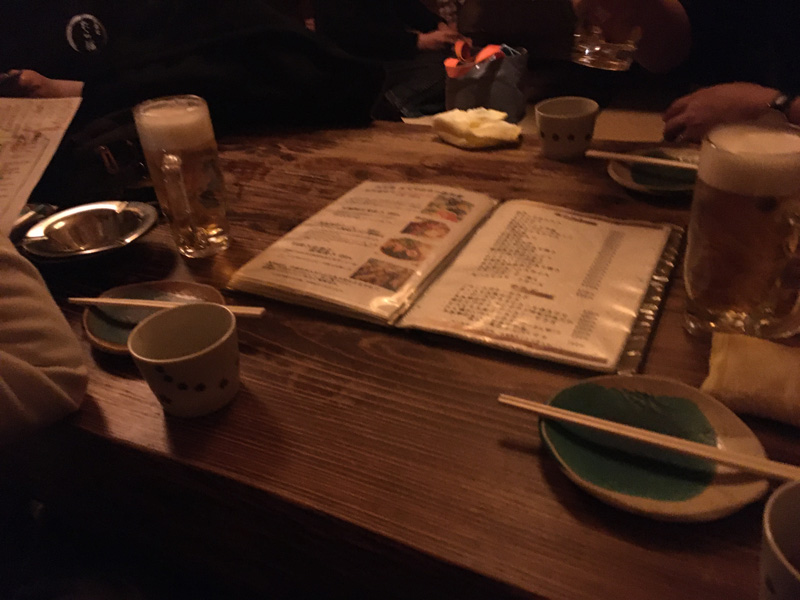
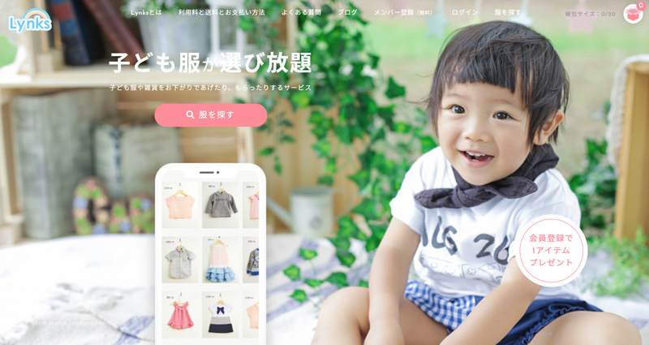
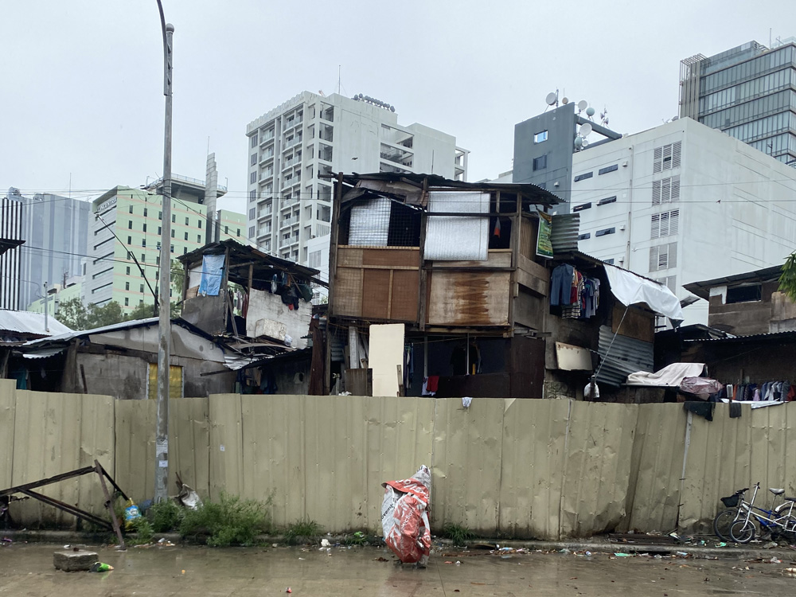

フィリピンの子どもたちに日本のおさがりの子ども服を届けるプロジェクトを始めます。

やろうと思ったきっかけや、私の眼に映るフィリピンの貧困について、そして皆さんへのお願いをつづりました。ご協力をお願いします。
<prof></prof>

<toc id="/blogs/entry445/"></toc>

## セブ島に洋服を送ろうと思ったきっかけ

福岡にあるWeb制作会社・Blue Styleの代表・外谷さんとはECキューブ関連の共通の知り合いがいたことで、知り合いになりました。

去年日本に帰った時、やっと念願のお酒を一緒に飲む事もできました。一緒に楽しく酒を飲めたらどんな人でもだいたい友達ですw

今年に入って（去年の末だったかも）さらにYouTubeがきっかけでメッセージをもらえ、ビジネスの話をさせていただくことになりました。

その際外谷さんのやっておられる、子どものおさがりサービス「Lynks」について詳しく知ることになりました。

### 「もったいない」気持ちから始まった子ども服のおさがりを着たい人に託すサービス「Lynks」

[Lynks](https://www.lynks.jp/)

日本人ってまだまだ着ることができても洋服すぐ捨てるんですよね。

セブ島ボランティア体験記でもらったものをすべてリユース、リサイクル、捨てるくらいなら「もったいない」から誰かにあげようという発想で生まれたのがサービスLynksです。

### 多少のシミ、穴。。。おさがりできない洋服もある。これがまた「もったいない」
ここでも「もったいない」が発生します。

Lynksに届く洋服の中にはまだ着ることができるのに、ちょこっと穴が開いていたりシミがあったりするせいでお下がりできないそうです。

せっかく「もったいない」を減らすために始めたサービスなのに。

外谷さん曰くまとめて回収業者にリサイクルの依頼をするそうです。洋服は布として海外に出ていきます。

### セブ島のNGOに引き取ってもらえないだろうか

セブ島にはいくつもの慈善団体があります。たとえば貧困層の子どもの生活や教育を支援している団体です。

せっかくだったらお下がり洋服も*行き先がわかるところに届けたい*。  

だったら**セブ島の慈善団体に洋服をセブ島ボランティア体験記**したらいいんじゃない？  

もし日本でおさがりできなくても、フィリピンの子供達に洋服を着てもらえたらいいなあと思い、調べてみることにしました。

## フィリピンがどのくらい貧困なのか
何も知らずに洋服を受け取るわけにはいかないので私もフィリピンの貧困について勉強しました。

フィリピン人の平均年収は約50万円。日当の平均は1300円（2020年 国家統計局国際労働機関（ILO）参考）。

ビジネス街で働く大卒のフィリピン人でも節約して生活しています。

もちろんみんな貧困なワケではありません。富裕層は高級車を何台も持っていたりと、生活格差が半端ないのも事実です。

### 私の眼に映るフィリピン

この写真は私の家の近くITパークで撮りました。ITパークの薄い壁の向こうにスラム街が隣接しています。

掘っ建て小屋越しにITパークの高層ビルが建ち並んでいます。  

とても不釣り合いな風景ですが、こんな風景がセブ島のいたるところにあります。

雨の日には子供達がすっぽんぽんで外に飛び出してきます。彼らの目的は天然のシャワーです。ペットボトルに雨をためて頭にバシャバシャかけてます。

路上でゴミを素手で漁っている人も見かけます。売り物になるものを探しているのでしょう。ジャンクショップでリサイクル品を売るとお金になると元同僚のフィリピン人が言っていました。

路上にもたくさんホームレスがいます。物乞いもそこら中にいます。日本に比べたらそんな人たちの割合は圧倒的に多いです。  

最初は怖かったけど今ではすっかり見慣れた風景になってしまいました。

### 貧困の上をいく最貧困層の存在。お墓に住んでいる人たちもいる

貧困の上をいく最貧困層の人たちはお墓に住んでいるそうです。

私は恥ずかしながら知りませんでした。

## 1着でも洋服があれば。。。
不勉強すぎたのもありますがとあるNGOの代表の方にヒアリングさせていただきました。  

墓地に住む人たちや子供達に服を着せる重要性など色々お話いただきました。

フィリピンにはゴキブリ、ネズミ　、野良犬や野良猫がそこら中にいます。スラム街はとくに多いです。外には害獣や害虫の排泄物がそこら中に転がっています。

下水もないから人間もそこら中で排泄します。  

**想像を絶するほど不潔**です。  

スラムの子どもは洋服すら着ていないことがあります。

実際去年、カルボンのウォーターマーケットへ行った時です。

小さい子は下半身裸でした。

子供たちはネズミなどがいる中遊びまわっていました。

伝染病はもちろん、ちょっとした怪我ですら破傷風になる恐れもあります。  

洋服を一枚着ているだけで子どもたちの怪我や病気を防げるそうです。

それを聞いて、もし**自分の子供だったら**と思うと胸が苦しくなりました。

そもそもスラムに住む大人の教育が行き届いていれば洋服を着せる努力をするはずです。けど、きっと同じように育ってそれが当たり前なのでしょう。

個人的な願いですが**どの国の子供にも健康や安全が平等に与えられて欲しい**です。

大人になるまで健康でいるだけで少しでも貧困から脱却するチャンスもあるかもしれませんし。

## できることをやろう
私は恥ずかしながら今までフィリピンに来て一度もボランティア活動に参加したことがありません。

今までは仕事が忙しくてそんな発想も起こりませんでした。

私も人間なので誰かの役には立ちたい。

とはいえ正直言いますが、他のボランティアやってる方たちのようにご飯の炊き出しなど直接的なボランティア活動を定期的にする自信はありません。根性もないです。。  

そんな私でも直接できなくても間接的に手伝えることはあります。

1着でも洋服があれば洋服や怪我から子供たちを守ることができるんだって知った時、絶対届けたいと思いました。  

私にもできるから。  

*どの国でも子どもは宝*です。生まれた場所や環境は選べませんが少しでも平等や優しさが世界にあったら。。。

少しでも子どもの健康を守れるなら本望です。

### 私たちがセブと日本をつなぎます。ご協力お願いします

私たちができることはセブ島と日本をつなぐことくらいです。

ということで、送料のセブ島ボランティア体験記を募ることにしました。

負担にならないよう「1口:1,000円」でお願いすることにしました。

個人・企業どちらでもお申し込み可能です。

14,000円で50kg程度の洋服を送れます。到着まで3か月くらいかかりますが。

セブ島にいる私たちがつなぐのでどうか少しだけ協力してください。

### セブ島ボランティア体験記していただいた方へのお礼

LynksのHP内にて活動報告としてお名前を掲載します。

またこのブログや、「[かみーゆちゃんねる](https://www.youtube.com/channel/UCbSgjkCIPucux8cFTuQcdcw/)」などで露出します。

申し込みはGoogleフォームからとなります。お申し込みに際していくつか注意点がありますので、詳細はこちらのスライドをご覧ください。

<iframe src="//www.slideshare.net/slideshow/embed_code/key/b1aMq11nBKLh6f" width="595" height="485" frameborder="0" marginwidth="0" marginheight="0" scrolling="no" style="border:1px solid #CCC; border-width:1px; margin-bottom:5px; max-width: 100%;" allowfullscreen> </iframe>

## さいごに
「子どもたちの健康を少しでも守りたい」。そんな気持ちでこの活動を始めました。

「1着でも洋服があれば、子供たちの健康が守れる。どの国の子供にも健康や安全が平等にあって欲しい。」と気持ちがブレないようお洋服をNGOに届けますのでどうぞ応援よろしくお願いします。

最後までお読みいただきありがとうございました。
