## まずは下準備から。インスタとフェイスブックを連携してアクセストークンを取得
下準備がマジで*しちめんどくさい*です。しかもインスタってFacebookに買収されて、仕様変更がコロコロ変わり、、、私もWeb制作人生で実装するたびに振り回されて、涙を流してきました。

と、いうことでSNS連携から実装方法までを詳し〜〜く説明します。

まずは下準備。Facebookページを作って、インスタをプロアカウントに変え、Facebookと連携させます。

### Facebookページを用意
Facebookページを作成します。ログインして、ページを作成しておきます。

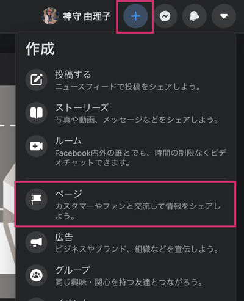

すでにページを持っているようであれば、アカウントが管理者かアナリストである必要があります。

### インスタはクリエーターないしはプロアカウントへ変更
インスタのアカウントを変更します。私はスマホから取得しました。

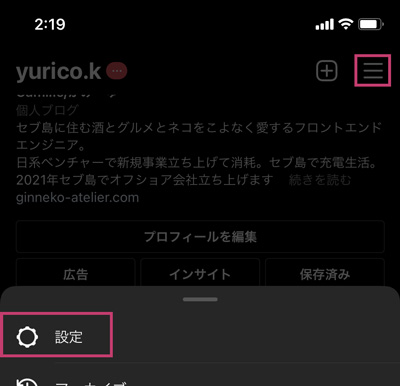

設定からプロアカウントに切り替えます。

クリエイターかビジネスを選べます。ケースバイケースで選びましょう！

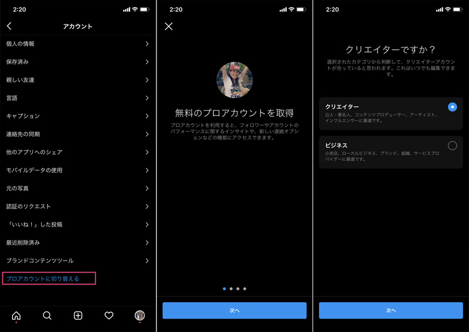

### Facebookと連携させる
インスタ側からfacebookと連携させます。

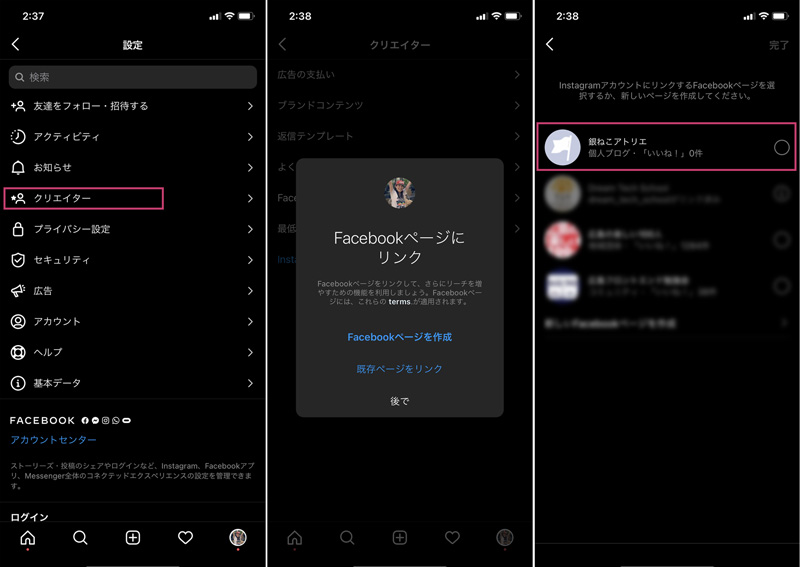

連携できたら、Facebookページ側から確認します。必ず**リンクが連携できているか確認**しましょう。


## ディベロッパー用のアカウント作成・アクセストークン等取得
この先は、一覧を表示するために必要なアクセストークンなどを取得します。

META for DeveloperはFacebookアカウントを持っていることが前提条件です。

[META for Developer](https://developers.facebook.com)

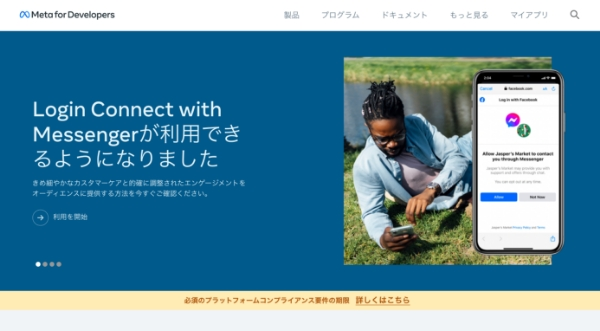

ここで重要なのは*アクセストークン*と*インスタのビジネスアカウントID*を取得することです。

### アプリ作成

「マイアプリ」から新規で「アプリを作成」から新規のアプリを作ります。

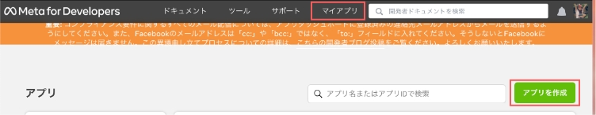

アプリタイプを選択し、
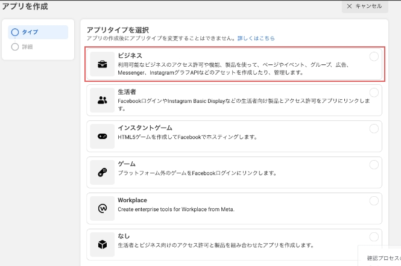

表示名を入力、アプリの目的を選択し、アプリを作成します。

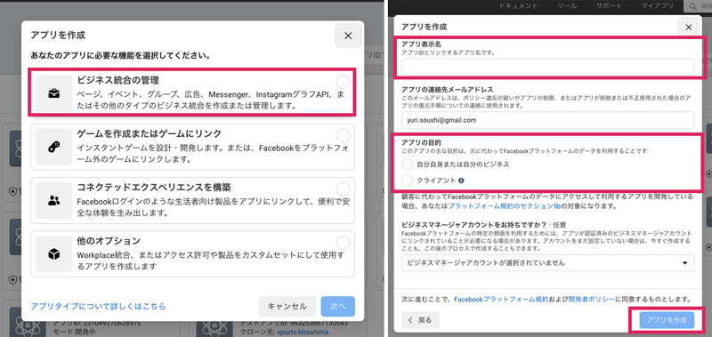

ちなみにアプリ名に「insta」を含むとエラーになり作成できません。おそらく盲点なので注意です。

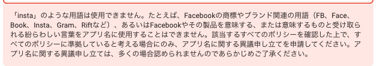

#### あらかじめ「アプリID」、「app secret」をメモっておく！

サイドメニューのアプリの設定>ベーシックから「アプリID」、「app secret」を必ずメモっておきましょう。マイアプリから対象のアプリを選択、設定のベーシックから *アプリID* と *app secret* を確認できます。

*app secret* は表示するときにFacebookのパスワードを求められます。

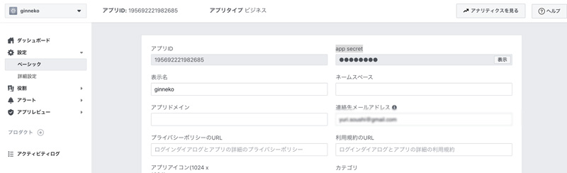

公開して使用する予定があるのであれば、*プライバシーポリシーのURL* 、さらに必要があれば *利用規約のURL* も登録しておきましょう。登録がないと突然、表示されないなどの問題が起こる可能性があります（詳しい理由は[突然のエラーデータが取得できない](#突然のエラーデータが取得できない2021-12-24追記)を参照）。

### Graph APIアクセストークン取得
アクセストークンを作成します。グローバルメニューのツールから「グラフAPIエクスプローラ」を選択します。

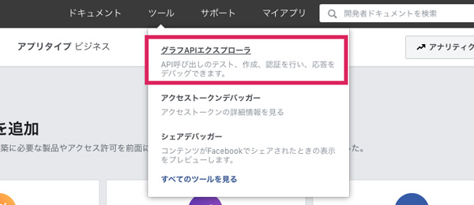

「グラフAPIエクスプローラ」に移動したら、先ほど作成したFacebookアプリを選択します。

「Generate Access Token」ボタンを押すと、ログインしろって言われるかもしれませんので（パスワードとか忘れないでね）その際はログインします。これでアクセストークンを発行できます。

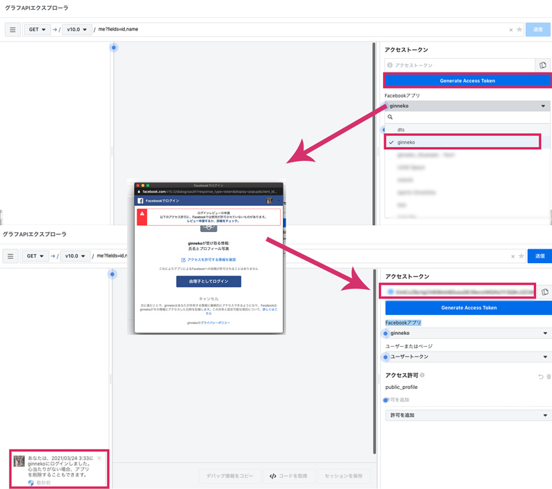

「ユーザーアクセストークン」から、どんな許可を得たいかを選択します。

| Events Groups Pages|内容|
|-|-|
|`pages_show_list`|アクセス許可を使用すると、利用者が管理しているページのリストにアクセス可能になる。|
|`business_management`|ビジネスマネージャAPIを利用した読み取りや書き込み可能になる。|

| そのほか|内容|
|-|-|
|`instagram_basic` |プリがInstagramアカウントのプロフィール情報やメディア可能になる。|
|`instagram_manage_comments`|ページにリンクしたInstagramアカウントに代わって、アプリがコメントを作成する、削除する、非表示にすることができるようになります。また、ある事業主が写真にタグ付けされたり@メンションされたりした公開メディアや公開コメントをアプリが読み取り、返信可能になる。|
|`instagram_manage_insights`|FacebookページにリンクされたInstagramアカウントのインサイトにアプリがアクセス可能。また、他のビジネスプロフィールのプロフィール情報やメディアをアプリが発見し読み取ることも。|

さらに詳しい許可の種類は[こちら](https://developers.facebook.com/docs/permissions/reference)から確認できます。


### 無期限アクセストークンに変更
先ほど発行したトークンでは1時間で期限が切れてしまうので延命します。

アクセストークンの入力フォーム左の!マークをクリックするとアクセストークン情報が開けます。

アクセストークンデバッガーに移動するのでアクセストークンツールで開くをクリックします。

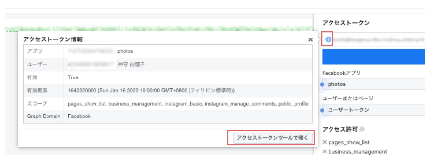

アクセストークンを延長をクリック。

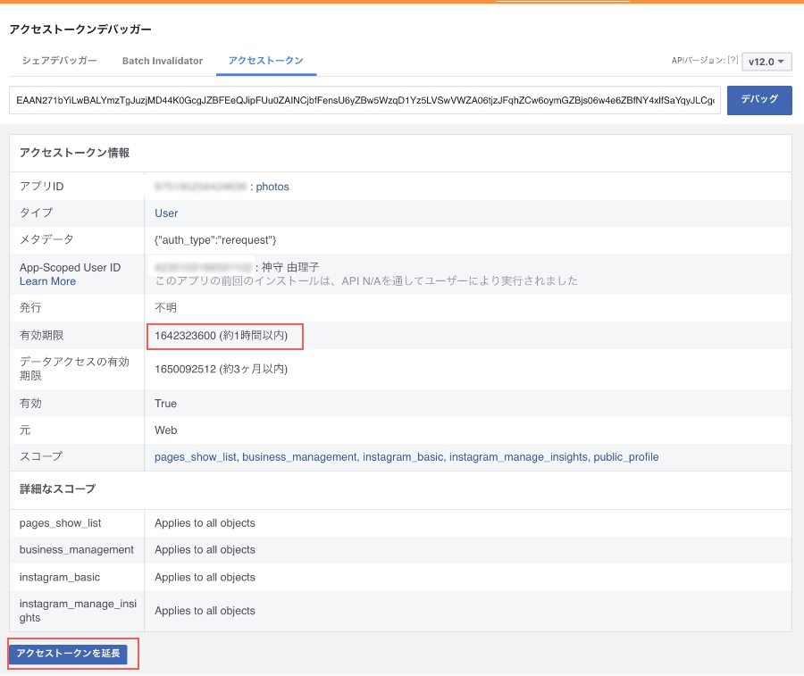

デバッグをクリックします。
<af size="horizontal" genre="web-developer"></af>

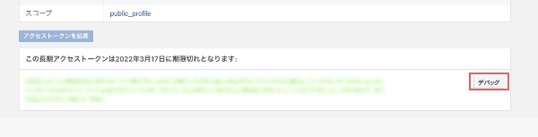

2か月に延長されたことを確認したら新しく発行されたアクセストークンをコピーします。

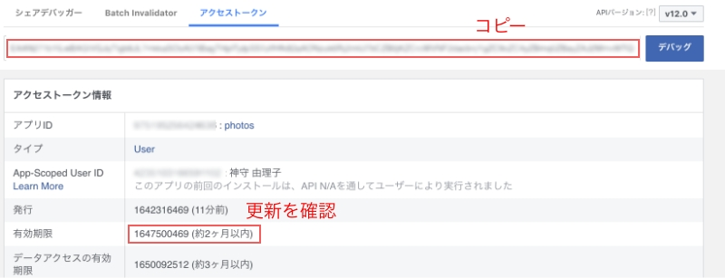


グラフAPIエクスプローラーのアクセストークンのフォームに先ほど取得したアクセストークンを貼り付け、再びアクセストークン情報を開きアクセストークンツールを開きます。
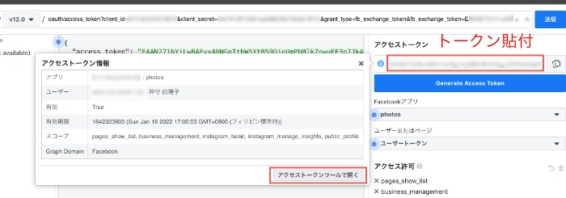


有効期限は **受け取らない** になっているはずです。
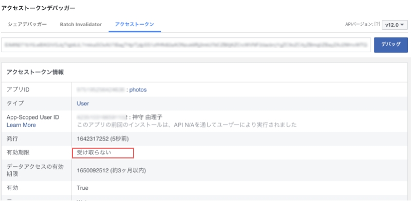


### インスタアカウントIDを取得
グラフAPIエクスプローラでインスタのビジネスアカウントIDを調べます。

```
me?fields=accounts{instagram_business_account}
```
必要なものは*instagram_business_account*のidです。

人によっては無限に取得してしまうので、


idの値をクリックしてfacebookアカウントを調べます。
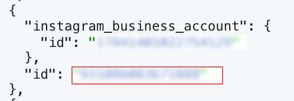


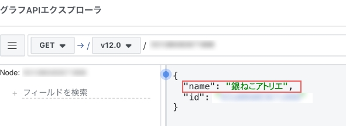

それどころじゃないくらい数が多い場合は、facebookページからIDを調べて該当するinstagram_business_accountを調べましょう。

先ほど取得した*アクセストークン*と今取得した*ビジネスアカウントID*でやっとインスタの投稿一覧表示できます！

<msg txt="たかだか2つの値を取得・調べるまでが超長かったですね。。。"></msg>

## インスタ投稿の一覧を表示してみよう
では、早速インスタ投稿の一覧を取得したいのでリクエストを投げてみましょう！

|値|概要|
|-|-|
|`{instagram_business_account}`|インスタのビジネスアカウントID|
|`{count}`|数|
|`{user_access_token}`|アクセストークン|

以下コードの`{}`のところをご自身のものに書き換えてください。


```
https://graph.facebook.com/v12.0/{instagram_business_account}?fields=name%2Cmedia.limit({count})%7Bcaption%2Cmedia_url%2Cthumbnail_url%2Cpermalink%7D&access_token={user_access_token}
```

`https://graph.facebook.com/v12.0/~`のv〇〇がGraphAPIのバージョンです。

<small>※ 2022年1月時点最新はv12.0でした。</small>

ブラウザーの検索窓に入力し、データ取得できるか確認してみます。

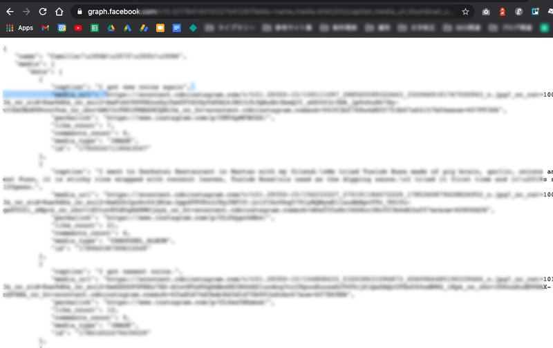

わーい！データが配列として返ってきましたね！

ちゃんとが取れているか念の為確かめておきましょう。`media_url`の値をブラウザー検索窓に入力してみましたが画像データがちゃんと取れました。


ここまでできたらカンペキ。JSにもPHPでも表示可能です！！

取得できる値の一覧です。動画の時は要注意。

今回は分岐してサムネイル画像を代わりに表示することで対応しました。

|取得できる項目|説明|
|-|-|
|*caption*|投稿内容|
|*id*|投稿ID|
|*like_count*|いいねの数|
|*media_type*|メディアのタイプ。IMAGEとVIDEOがある。|
|*media_url*|メディアのURL|
|*permalink*|インスタへのリンク|
|*thumbnail_url*|サムネイル|

好き放題カスタマイズ可能です。

<div class="box">
<h4>値が返ってきたかを必ず確認してから次の作業しよう！</h4>
結構、こういったAPIの値が取得できてるかできていないかわからないまま作業している人がいます。ちょっと手間でも毎回、こういったポイントを通過することでミスやバグを潰せます。必ず確認しましょう。
</div>

#### 共通CSS

以下コードはあくまで参考です。

<af size="horizontal" genre="web-developer"></af>

アイコンはFontAwesomeを活用しました。自分の好みでスタイリングしてください。


```css:title=CSS
ul {
  display: flex;
  flex-wrap: wrap;
}
li {
  list-style: none;
  width: 20%;
}
img {
  max-width: 100%;
  height: auto;
  display: block;
}
li a {
  position: relative;
  display: block;
}
li a .like {
  position: absolute;
  width: 100%;
  height: 100%;
  left: 0;
  top: 0;
  display: flex;
  align-items: center;
  justify-content: center;
  font-size: 40px;
  color: #fff;
  opacity: 0.6;
  text-shadow: 0 0 7px #000;
}
h1 {
  text-align: center;
  font-size: 30px;
  font-weight:bold;
  padding: 30px;
  color:#333;
}
```

### JSコードサンプル（jQuery）
JavaScriptサンプルコードです。jQuery使ってサクッと取得しました。

```html
<script src="https://ajax.googleapis.com/ajax/libs/jquery/3.6.0/jquery.min.js"></script>
```

今回はCDNからライブラリを取ってきました。

値を取得できるか試してみます。

```js:title=jQuery
$(function(){
  const limit = 10; //表示件数
  const accessToken = {user_access_token}; // アクセストークン
  const businessID = {instagram_bussiness_account_ID}; //instagram_business_accountのID
  const url = `https://graph.facebook.com/v10.0/${businessID}?fields=name,media.limit(${limit}){caption,media_url,thumbnail_url,permalink,like_count,comments_count,media_type}&access_token=${accessToken}`;
  $.ajax({
    url: url
  }).done(function(res) {
    console.log(res.media);
  });
});
```
コンソールログで確認すると、ちゃんとデータ取れています。わーい。

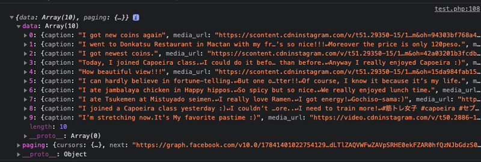

取得したインスタ投稿データ一覧を格納する`div`タグを作っておきます。

```html:title=HTML
<div id="insta"></div>
```
さっきの`div`タグに格納します。

```js:title=jQuery
$(function(){
  let list = '';
  const limit = 20; //表示件数
  const accessToken = {user_access_token}; // アクセストークン
  const businessID = {instagram_bussiness_account_ID}; //instagram_business_accountのID
  const url = `https://graph.facebook.com/v10.0/${businessID}?fields=name,media.limit(${limit}){caption,media_url,thumbnail_url,permalink,like_count,comments_count,media_type}&access_token=${accessToken}`;
  $.ajax({
    url: url
  }).done((res)=> {
    const data = res.media;
    $.each(data, function(index, val) {
      $.each(val, function(i, item) {
        console.log(item);
        if(item.media_url){
          //メディアのタイプがビデオの場合、サムネを取得
          media = (item.media_type == 'VIDEO' ? item.thumbnail_url : item.media_url);

          // 一覧を変数listに格納
          list +=
          `<li>
            <a href="${item.permalink}" target="_blank" rel="noopener">
            
            <span class="like"><i class="fa fa-heart"></i>${item.like_count}</span></a>
          </li>`;
        }

      })
    });
  $('#insta').html(`<ul>${list}</ul>`);
  }).fail(function(jqXHR, status) {
    $('#insta').html('<p>読み込みに失敗しました。</p>');
  });
});
```

### PHPコードサンプル
こちらはPHPのサンプルコードです。

今回は*cURL関数*を使います。この関数を使うとPHPで、HTTPリクエストによる外部サイトとの送受信処理が可能です。

PHPでは以下のように実行してみました。

1. セッション初期化
2. 送用オプション設定
3. セッションを実行<br><small>（CURLOPT_RETURNTRANSFERを設定するとサーバから取得した情報を保存可能）</small>
4. ハンドルのセットを閉じる

<af size="horizontal" genre="web-developer"></af>

```php:title=PHP
curl_setopt ( CurlHandle $handle , int $option , mixed $value )
```
[curl_setopt | php](https://www.php.net/manual/ja/function.curl-setopt.php)


```PHP:title=PHP
$list      = "";
$instagram = null;
$id        = {instagram_bussiness_account_ID};
$token     = {user_access_token};
$count     = {表示数};
$url       = 'https://graph.facebook.com/v10.0/' . $id . '?fields=name,media.limit(' . $count. '){caption,media_url,thumbnail_url,permalink,like_count,comments_count,media_type}&access_token=' . $token;

$curl      = curl_init();
curl_setopt( $curl, CURLOPT_URL, $url );
curl_setopt( $curl, CURLOPT_CUSTOMREQUEST, 'GET' );
curl_setopt( $curl, CURLOPT_RETURNTRANSFER, true );

$response = curl_exec( $curl );
curl_close( $curl );

//エラー
if ( $response ) {
  $instagram = json_decode( $response );
  if ( isset( $instagram->error ) ) {
    $instagram = null;
  }
}

foreach ( $instagram->media->data as $value ) {
  //メディアのタイプがビデオの場合、サムネを取得
  if ( $value->media_type === 'VIDEO' ) {
    $src = $value->thumbnail_url;
  } else {
    $src = $value->media_url;
  }

  $list .= '<li><a href="' . $value->permalink . '" target="_blank">caption . '"><span class="like"><i class="fa fa-heart"></i>' . $value->like_count . '</span></a></li>' ;
}
echo '<ul>' . $list . '</ul>';
```

### WordPressのブロックエディターにも対応してみました！（2022-01-15追記）
ブロックエディターでもインスタグラムを埋め込めるように対応してみました。

実装方法などはこちらに紹介しています。

<card id="/blogs/entry490/"></card>

## 突然のエラー。データが取得できない（2021-12-24追記）
プライバシーポリシーが無効だと、開発モードに戻されてしまいます。

> Facebookでは、データの使用状況の年次確認を行うことになりました。
<small>2021年時点。Metaに変わったはずだが、テキストの改修に間に合ってない模様。。。</small>

再三のメールのお知らせがあったにもかかわらず、気づかなくてページがエラーを吐いた状態になりました。

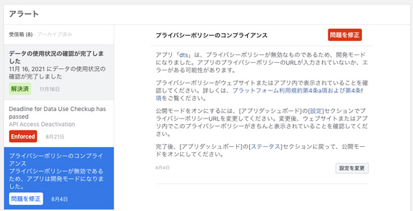
アプリのダッシュボードから*プライバシーポリシーのURL*と*利用規約のURL*を入力し、変更しておきましょう。

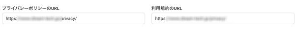

しばらくしたらすぐもとどおりになりました。

## まとめ
長くなりました。インスタ投稿の一覧取得方、PHPとJSのサンプルコード両方紹介しました。

ウェブサイトにインスタの一覧を表示できたら超いいですよね！サイトを更新しなくても画像が常に更新されるのでリッチに見えますし、クライアントも喜びます。

また仕様変更に気づいたらメンテ入れます！

最後までお読みくださりありがとうございました。感謝！
### FAQ
<faq id="/blogs/entry448/"></faq>
