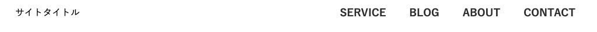

Web制作をしていると、グロナビのホバーアニメの持ちネタが尽きます。そこで、グロナビのためのCSSアニメーションスニペット集を作ってみました。

おしゃれだけど実務で使えること前提に用意しました。コピペで使えるので参考にしてください。
<prof></prof>

<toc id="/blogs/entry448/"></toc>

## グロナビ（グローバルメニュー）のホバーアニメを作る前提条件

* リセットCSSを必ず読み込んでください
* サンプルのフルコードはCode Pen内に置いてあります！
* 基本的にコピペでもイケますが、ある程度CSSやHTMLを理解していいた方がアレンジできて楽しいです。
* スマホはホバーアニメしないので考慮していません。
* あまりグロナビのアニメが凝りすぎると、全体のトンマナを損ないます。わりと控えめで実践を考慮したサンプルが多め

## ベースのコードとグロナビ アニメ・コードスニペット初級編
まずは基本から！ヘッダーをコーディングしています。

困った時はスタンダードなデザインするのが◯。




下記コードでサイトタイトルとナビゲーションといったような、一般的なヘッダーができます。

```html:title=HTML
<header>
  <h1>サイトタイトル</h1>
  <nav>
    <ul>
      <li><a href="#">SERVICE</a></li>
      <li><a href="#">BLOG</a></li>
      <li><a href="#">ABOUT</a></li>
      <li><a href="#">CONTACT</a></li>
    </ul>
  </nav>
</header>
```
```css{35}:title=CSS
body {
  font-family: 游ゴシック体, YuGothic, 游ゴシック, "Yu Gothic", "Hiragino Kaku Gothic ProN", "Hiragino Sans", メイリオ, sans-serif;
}

header {
  max-width: 980px;
  margin: 0 auto;
  display: flex;
  justify-content: space-between;
  height: 50px;
  align-items: center;
}

nav ul {
  display: flex;
  height: 50px;
}

nav ul li {
  padding: 0 10px;
  height: 100%;
}

nav ul li a {
  text-decoration: none;
  color: #333;
  display: block;
  height: 100%;
  display: flex;
  align-items: center;
  transition: .3s;
  font-weight: bold;
  position: relative;
  padding: 0 10px;
  transition: .3s;//アニメーションすることを想定して追加しておきます
}
```
ホバーアニメーションをつける理由ですが、**ここはリンク**と知ってもらうためです。

通常は最低ホバーで文字色を変えるぐらい書いておけばいいと思います。

アニメーションをなめらかにするため`transition`を付与します。

今回easingはデフォルトのまま使います。

```css:title=CSS
//アニメーション
nav ul li a:hover {
  color: #ff1787;
}
```
### グロナビ アニメその1・下線を横に広がる
文字色が変わるだけだとなんだか寂しい。

そんな時は下線をつけるのですが、それだけだと芸がないので横に広げます。シンプルで使いやすいです。

<figure class="animation"></figure>

```css:title=CSS
nav ul li a::after {
  content: '';
  display: block;
  height: 1px;
  width: 80%;
  background: #ff1787;
  position: absolute;
  bottom: 0;
  left: 10%;
  transform: scale(0, 1);
  transition: .3s;
}

nav ul li a:hover {
  color: #ff1787;
}

nav ul li a:hover::after {
  transform: scale(1, 1);
}
```
[グロナビ・下線が横に広がる|Code Pen](https://codepen.io/lscamille/pen/NWdGOad)

### グロナビ アニメその2・下線が左からにゅっと伸びる
先ほどのアレンジバージョンです。左から右へ伸びると*ページ遷移するんだ*感が出ます。

<figure class="animation"></figure>

```css:title=CSS
nav ul li a::after {
  content: '';
  display: block;
  height: 1px;
  width: 0%;
  background: #ff1787;
  position: absolute;
  bottom: 0;
  left: 10%;
  transition: .3s;
}

nav ul li a:hover {
  color: #ff1787;
}

nav ul li a:hover::after {
  width: 80%;
}
```
[グロナビ・下線が左からにゅっと伸びる|Code Pen](https://codepen.io/lscamille/pen/WNRQaZp)

### グロナビ アニメその3・背景色をガツンと変える
カンタンですが色の変わる面積が広いのでデザインによっては使わないほうがいいかもしれません。

もしくは色を調整してください。

<figure class="animation"></figure>

```css:title=CSS
nav ul li a:hover {
  background:  #ff1787;
  color: #fff;
}
```

[グロナビ・背景色をガツンと変える|Code Pen](https://codepen.io/lscamille/pen/YzNyRvV)

## グロナビ アニメ・コードスニペット中級編
見た目を変えたり、少し難易度を上げていきます。

### グロナビ アニメその4・色を変える
やってることは単純ですが、各リンクの色を変えるだけでポップになります。

サイトによっては事故が起こるデザインなので要注意。

<figure class="animation"></figure>

```css:title=CSS
li:nth-child(1) a{
  border-bottom: 2px solid #2b2bb3;
}

li:nth-child(2) a{
  border-bottom: 2px solid #20674e;
}

li:nth-child(3) a{
  border-bottom: 2px solid #d6b501;
}

li:nth-child(4) a{
  border-bottom: 2px solid #da6811;
}

li a:hover{
  border-width: 8px;
}

li:nth-child(1) a:hover {
  color: #2b2bb3;
}

li:nth-child(2) a:hover {
  color: #20674e;
}

li:nth-child(3) a:hover {
  color: #d6b501;
}

li:nth-child(4) a:hover {
  color: #da6811;
}
```
[グロナビ・色を変える|Code Pen](https://codepen.io/lscamille/pen/qBROLOj)

### グロナビ アニメその5・矢印がにゅっと伸びる
`transform` のプロパティ `skew()` を使って要素をナナメることができます。
それを利用して矢印を作り、ぴゅっと伸ばします。

詳細はこちら的なリンクのあしらいとして使ってもかっこいいです。

<figure class="animation"></figure>

```css:title=CSS
nav ul li a::after {
  content: '';
  display: block;
  height: 2px;
  width: 0%;
  background: #ff1787;
  position: absolute;
  bottom: 10px;
  left: 10%;
  transition: .3s;
}

nav ul li a::before {
  content: '';
  position: absolute;
  bottom: 10px;
  left: 5%;
  height: 8px;
  width: 2px;
  background: #ff1787;
  transform: skew(42deg);
  transition: left .3s;
  opacity: 0;
}

nav ul li a:hover {
  color: #ff1787;

}

nav ul li a:hover::after {
  width: 100%;
}

nav ul li a:hover::before {
  left: 105%;
  opacity: 1;
}
```
[グロナビ・矢印がにゅっと伸びる|Code Pen](https://codepen.io/lscamille/pen/eYgpQbY)

### グロナビ アニメその6・アイコンをくるくる回す
アイコンもCSSで作成します。

三角はborderで作ります。私は素材を取ってくるのがめんどうな時、素材をCSSで作ることがあります。

本来はSVGがいいんでしょうけど。。。

<figure class="animation"></figure>

```css:title=CSS
nav ul li a::after {
  content: '';
  display: block;
  position: absolute;
  bottom: 0;
  border-bottom: 8px solid #ff1787;
  border-left: 8px solid transparent;
  border-right: 8px solid transparent;
  left: calc(50% - 8px);
  transition: .6s;
  opacity: 0;
}

nav ul li a:hover {
  color: #ff1787;
}

nav ul li a:hover:after {
  opacity: 1;
  transform: rotateY(360deg);
}
```
[グロナビ・アイコンをくるくる回す|Code Pen](https://codepen.io/lscamille/pen/XWpmyob)

### グロナビ アニメその7・マッチ棒っぽいものを伸ばす
このサイトのPCのグロナビでも採用しています。

YouTubeでマッチ棒パズルなるものを知った結果こうなりました。。。。

<figure class="animation"></figure>

```css:title=CSS
nav ul li a::after {
  content: '';
  display: block;
  height: 1px;
  width: 0%;
  background: #ff1787;
  position: absolute;
  bottom: 0;
  left: 10%;
  transition: .3s;
}

nav ul li a::before {
  content: '';
  width: 5px;
  height: 5px;
  display: block;
  background: #ff1787;
  position: absolute;
  bottom: -2px;
  left: 10%;
  border-radius: 50%;
  opacity: 0;
  transition: .3s;
}

nav ul li a:hover::after {
  width: 80%;
}

nav ul li a:hover::before {
  left: 90%;
  opacity: 1;
}
```
[グロナビ・マッチ棒っぽいものを伸ばす|Code Pen](https://codepen.io/lscamille/pen/wvgMGGK)

### グロナビ アニメその8・グラデ背景を重ねる
グラデ背景を文字下に敷きます。この時のポイントは親の`a`タグの重なり順を調整すること。`z-index: 1`で上に持っていき、下に重なる要素（この場合擬似要素）を`z-index: -1`で下げます。

地味なテクニックですが重宝します。

<figure class="animation"></figure>

グラデーションは色と色の境目を0にすることでぱきっと色を分けることができます。

```css
background: linear-gradient(to left, #fff 34%,#3392af 34%,#3392af 66%,#01465a 66%);
```

```css:title=CSS
nav ul li {
  padding: 0 2px;
  height: 100%;
  width: 130px;
  overflow: hidden;
}

nav ul li a {
  width: 100%;
  text-decoration: none;
  color: #01465a;
  display: block;
  height: 100%;
  display: flex;
  justify-content: center;
  align-items: center;
  transition: .3s;
  font-weight: bold;
  position: relative;
  padding: 0 10px;
  position: relative;
  z-index: 1;
  box-sizing: border-box;
}

nav ul li a::after{
  position: absolute;
  content: '';
  right: 0%;
  width: 300%;
  height: 100%;
  background: linear-gradient(to left, #fff 34%,#3392af 34%,#3392af 66%,#01465a 66%);
  z-index: -1;
  transition: 0.6s;
}

nav ul li a:hover {
  color: #fff;
}

nav ul li a:hover::after{
  right: -200%;
}
```

[グロナビ・グラデ背景を重ねる|Code Pen](https://codepen.io/lscamille/pen/wvgMGqG)

### グロナビ アニメその9・にゅっと伸びるグラデ下線
こちらは先ほどの応用版。

今回はパキッとさせてますが、グラデはお好みで滑らかにしてもいいかもです^ ^

<figure class="animation"></figure>

```css:title=CSS
nav ul li a::after{
  position: absolute;
  content: '';
  right: 0%;
  width: 300%;
  height: 3px;
  bottom: 0;
  background: linear-gradient(to left, #fff 34%,#ff0033 34%,#ff0033 70%,#000 70%);
  transition: 0.6s;
}

nav ul li a:hover::after{
  right: -200%;
}
```
[グロナビ・にゅっと伸びるグラデ下線|Code Pen](https://codepen.io/lscamille/pen/ExZPymq)

## グロナビ アニメ・コードスニペット上級編
`attr()`関数を使いたい！

`attr()`は*カスタムデータ（data）属性*などをCSS側で取得できる便利な関数です。

<small>※ カスタムデータ（data）属性に関する記事はコチラ。</small>
<card id="/blogs/entry267/"></card>

<br>たとえばhtmlで*data属性*を設定すると...

```html:title=HTML
<p data-text="サンプル2">サンプル</p>
```
CSS側でcontentプロパティに渡すことができます。
```css:title=CSS
p::before {
  content: attr(data-text);
}
```


[attr()|MSN Web Docs](https://developer.mozilla.org/ja/docs/Web/CSS/attr())

ということで、こちらを使ったサンプル3つご紹介します。

### グロナビ アニメその10・文字をグラデに
`-webkit-background-clip`を使って文字をグラデにします。

ベタ塗りからのグラデーションはアニメーションが効かないので、最初から上に透明（`opacity`）な擬似要素を重ねておき、`opacity: 1`にしてアニメーションさせます。

<figure class="animation"></figure>

```html:title=HTML
<li><a href="#" data-item="SERVICE">SERVICE</a></li>
<li><a href="#" data-item="BLOG">BLOG</a></li>
<li><a href="#" data-item="ABOUT">ABOUT</a></li>
<li><a href="#" data-item="CONTACT">CONTACT</a></li>
```

```css:title=CSS
a::before {
  content: attr(data-item);
  position: absolute;
  top: 0;
  height: 100%;
  width: 100%;
  display: flex;
  align-items: center;
  background: -webkit-linear-gradient(0deg, #da805a, #ff1787);
  -webkit-background-clip: text;
  -webkit-text-fill-color: transparent;
  opacity: 0;
  transition: .3s;
}

a:hover::before {
  opacity: 1;
}
```
[グロナビ・文字をグラデに|Code Pen](https://codepen.io/lscamille/pen/YzNyRqW)

### グロナビ アニメその11・文字をグラデかつ下線のアニメ追加
先ほどの応用版。

グラデは左から徐々に右に広がります。下線も追加してさらにリッチに。

<figure class="animation"></figure>

```css:title=CSS
a::before {
  content: attr(data-item);
  position: absolute;
  top: 0;
  height: 100%;
  width: 0%;
  display: flex;
  align-items: center;
  background: -webkit-linear-gradient(0deg, #da805a, #ff1787);
  -webkit-background-clip: text;
  -webkit-text-fill-color: transparent;
  transition: .3s;
  white-space: nowrap;
}

a::after {
  content: '';
  width: 0%;
  position: absolute;
  background: -webkit-linear-gradient(0deg, #da805a, #ff1787);
  bottom: 0;
  left: 10%;
  height: 2px;
  display: block;
  transition: .3s;
}

a:hover::before {
  width: 100%;
}

a:hover::after {
  width: 80%;
}
```
[グロナビ・文字をグラデかつ下線のアニメ追加|Code Pen](https://codepen.io/lscamille/pen/vYgNQGX)


### グロナビ アニメその12・文字の入れ替え
英語だとかっこいいけどちょっと日本人には意味不明になりがちです。

なのでホバーした時に`attr()`関数を使って日本語表示を表示します。
```html:title=HTML
<li><a href="#" data-item="サービス">SERVICE</a></li>
<li><a href="#" data-item="記事">BLOG</a></li>
<li><a href="#" data-item="私たちについて">ABOUT</a></li>
<li><a href="#" data-item="お問い合わせ">CONTACT</a></li>
```

<figure class="animation"></figure>

```css:title=CSS
nav ul li a {
  text-align: center;
  width: 150px;
  text-decoration: none;
  color: #333;
  display: block;
  height: 120px;
  line-height: 60px;
  display: block;
  transition: .3s;
  font-weight: bold;
  position: relative;
  padding: 0 15px 60px;
  box-sizing: border-box;
}

nav ul li a::after {
  position: absolute;
  left: 0;
  bottom: 0;
  width: 100%;
  display: block;
  line-height: 1;
  content: attr(data-item);
  height: 60px;
  line-height: 50px;
  background: #333;
  text-align: center;
}

nav ul li a:hover {
  margin-top: -60px;
  color: #fff;
}
```

[グロナビ・文字の入れ替え|Code Pen](https://codepen.io/lscamille/pen/wvgKOop)

## まとめ・モバイルファーストだけどまだまだPCで閲覧している人はいる

最近、ユーザー属性について考えます。

私のブログは内容がニッチなので、あまりスマホで見られることはないです。実務を考えた記事が多いので月曜日から金曜日平日の絵閲覧多めです。

そこで皆さん考えて欲しいんです。

スマホファーストはあくまで一般論。わりとPCで閲覧している人も結構いるということ。

ユーザーに合わせるとPCにどんなものを実装するかなどまだまだ脳みそをひねる必要があると思います。

今回は実践的に使えそうなスニペットをピックアップしました。参考にしていただければ幸いです。

最後までお読みいただきありがとうございました。

サイトのカスタマイズが楽しくなるコードをご紹介！あわせてお読みください。

<card id="/blogs/entry370/"></card>

<card id="/blogs/entry393/"></card>


