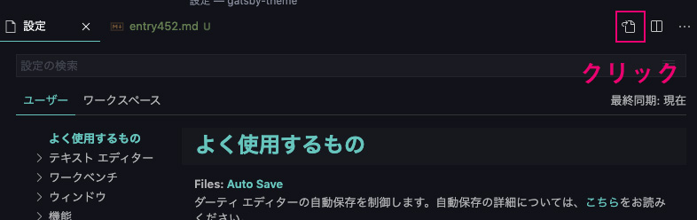
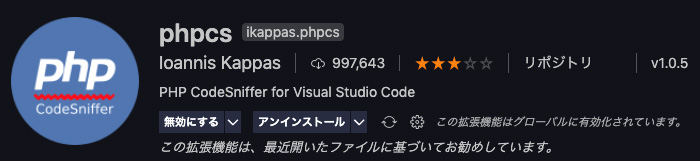
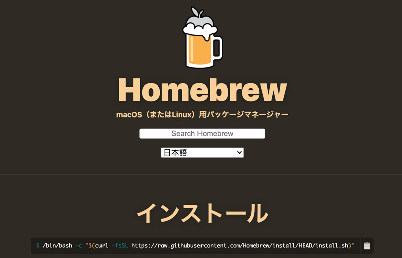
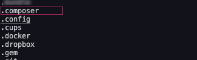
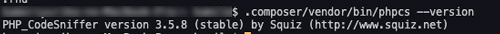
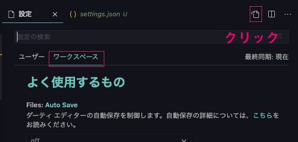
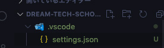
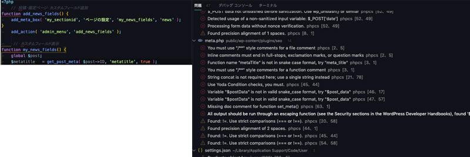
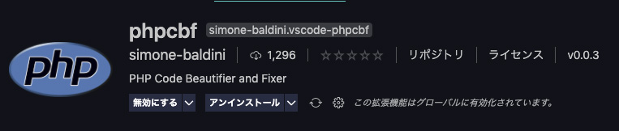
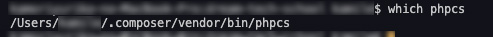

WordPressってPHPとhtmlが混在するし、コードが煩雑になりがちなのでphpcsでコードをチェックできる環境を作ってみました！","思った以上の収穫があったので導入方法などを綴ります。

具体的なコードの書き方については別記事に綴りました。

<prof></prof>
この記事は前半と後半に分かれてます。

前編では環境設定のお話、後編はよくあるエラーの直し方です。

* Macでしか検証していません
* VS Codeを使うことが前提です
* phpcsのエラーに困っている方は[WordPress phpcsでコーディング規約を守るコード](/blogs/entry452/)へ

<br>PHPでは一般的にインデントがタブ（4つ）なので設定（`Cmd+,`）> settings.jsonにコードを追記しておきます。



```json
"[php]": {
  "editor.tabSize": 4,
  "editor.insertSpaces": false,
},
```

## phpcsをインストールしてみよう！！
この記事ではできるだけ初学者にもわかりやすいよう説明します。

### VS Codeにphpcsの拡張機能インストール

拡張機能から[phpcs](https://marketplace.visualstudio.com/items?itemName=ikappas.phpcs)を検索してインストールします。



入れなくても使えますが、あったほうがエラーを視覚化できて便利です。

### composerをインストール

拡張機能にはWordPressのコーディング規約が入ってないので、コマンドからも設定します。

VS Codeを開いてCtrl+Shift+@でターミナルを開きます。

もし、何かのプロジェクトを開いている場合は以下コードで場所を移動してください。

```
cd ~
```

まずはコンポーザーをhomebrewでインストールするのですが、homebrewインストールしてない方は先にインストールします！



[Homebrew](https://brew.sh/index_ja)

現在コードは以下になってますが、必ず最新のものを確認してください。

```
/bin/bash -c "$(curl -fsSL https://raw.githubusercontent.com/Homebrew/install/HEAD/install.sh)"
```

homebrewインストールしたら、コンポーザーもインストール。

```
brew install composer
```

### PHP CodeSniffer(phpcs)インストール
composerでPHP CodeSniffer(phpcs)をインストールします。

インストールするときはcomposer.jsonに書き込み権限がなくて怒られたらsudoをつけてください。本来は好ましくないです。

```
composer global require "squizlabs/php_codesniffer=*"
```
バージョンを確かめます。<br>
が、一度以下コードで自分のいるディレクトリーを調べてみましょう！

```
ls -a
```

中に、`.composer`ディレクトリがあったらOK！



以下コードでバージョンを調べます。

```
.composer/vendor/bin/phpcs --version
```



### phpcsコマンドを使えるようパスを登録

次に`.bash_profile`にphpcsコマンドが実行できるようパスを登録します。

`.bash_profile`はユーザー直下にあります。

以下コマンドを実行します。

```
echo 'export PATH=$HOME/.composer/vendor/bin:$PATH' >> ~/.bash_profile
source ~/.bash_profile
```

以下コマンドでバージョンを確認しましょう。
```
phpcs --version
```

### WordPressコーディング規約インストール

Composerでコーディング規約をインストールします。

```
git clone -b master https://github.com/WordPress-Coding-Standards/WordPress-Coding-Standards.git ~/.composer/vendor/squizlabs/php_codesniffer/Standards/WordPress
```

PHP CodeSniffer(phpcs)にコーディング規約を設定します。

```
phpcs --config-set installed_paths ~/.composer/vendor/squizlabs/php_codesniffer/Standards/WordPress
```

インストールされたことを確認します。

```
phpcs -i
```
インストールされました^ ^

```
The installed coding standards are PEAR, Zend, PSR2, MySource, Squiz, PSR1, PSR12, WordPress, WordPress-Extra, WordPress-Docs and WordPress-Core
```

## グローバル環境へ規約をセッティング

デフォルトのコーディング規約として設定可能です。

```
phpcs --config-set default_standard WordPress
```

通常はPSR2あたりに戻しておくのが良いと思います。

```
phpcs --config-set default_standard PSR2
```

### コマンドから実行可能

エラー確認は以下のコマンドで実行可能です。

```
phpcs ディレクトリ/ファイル名
```

もしWordPressで独自テーマを作っている場合は、以下コマンドでまとめてテーマファイル以下を確認しましょう。

```
phpcs (ディレクトリあればここに追加/)wp-content/themes/（theme名)/.

例)
phpcs htdocs/wp-content/themes/your-theme/.
```

### プロジェクトごとに設定



プロジェクト用のsettings.jsonを作ります。作り方は設定から（`Cmd+,`）ワークスペースを選び、ファイルマークをクリックします。ワークスペース用のsettings.jsonを作ってコードを編集します。

```json
{
    "phpcs.standard": "Wordpress"
}
```

以下のようにファイルが生成されます。



ファイルを覗くとごっそりエラーが確認できます。

問題からも確認できます。

エラーは赤線と黄線があります。

赤線は規約違反。普段からキレイにコード書く癖をつけないといけないですね。



## 自動整形

phpcsをインストールするとPHP Code Beautifier and Fixer(phpcbf)も一緒にインストールされます。

### コマンドで形成
phpcbfコマンドで自動整形してくれます。

```
phpcbf ディレクトリ/ファイル名
```

なので、テーマ内のファイルに対してコマンドを実行すればOK！

```
phpcbf (ディレクトリあればここに追加/)wp-content/themes/（theme名)/.

例)
phpcbf  htdocs/wp-content/themes/your-theme/.
```

こういう配列のコードは美しくフォーマットしてくれます。嬉しい❤️

```php
'order'       => 'DESC',
'type'        => 'post',
'cnt'         => -1,
'author_name' => '0',
'pager'       => false,
'slider'      => false,
```

ひどいとたまに手直しが必要なこともあります。

### 保存するたびに自動フォーマットを適用

自動フォーマットを適用するためには[phpcbf](https://marketplace.visualstudio.com/items?itemName=simone-baldini.vscode-phpcbf)という拡張機能が必要なのでインストールしておきます。



いつもWordPressのサイトを作っているわけではないですよね？

ということで、[プロジェクトごとに設定](#プロジェクトごとに設定)で作成したプロジェクトごとのsettings.jsonにコードを追記します。

```json
{
  "phpcs.standard": "Wordpress",
  "editor.formatOnSave": true,
  "phpcs.executablePath": "/Users/[username]/.composer/vendor/bin/phpcs",
  "phpcbf.standard": "WordPress",
  "phpcbf.executablePath": "/Users/[username]/.composer/vendor/bin/phpcbf",
  "phpcbf.onsave": true,
  "editor.defaultFormatter": "simone-baldini.vscode-phpcbf",
}
```
<small>※ [username]は書き換えてください。</small>

もし、`phpcs.executablePath`のパスが違うよってエラー吐いたときは以下コマンドで調べます。

```
which phpsc

which phpcbf
```



`"editor.defaultFormatter": "simone-baldini.vscode-phpcbf",`は、他にたくさんフォーマッターを持っているときにphpcbfを使うように設定しています。

`"phpcbf.onsave": true,`があれば`"editor.formatOnSave": true,`が不要という記事を見かけましたが、ないと*動きません*ので注意しましょう。

WordPressしかやらない人は、このコードをゴッゾリ[前提条件](#前提条件)で編集したVS Code全体のsettings.jsonの`"[PHP]"`内に追記します。

```json
"[php]": {
  "editor.tabSize": 4,
  "editor.insertSpaces": false,
  "phpcs.standard": "Wordpress",
  "editor.formatOnSave": true,
  "phpcs.executablePath": "/Users/kamile/.composer/vendor/bin/phpcs",
  "phpcbf.standard": "WordPress",
  "phpcbf.executablePath": "/Users/kamile/.composer/vendor/bin/phpcbf",
  "phpcbf.onsave": true,
  "editor.defaultFormatter": "simone-baldini.vscode-phpcbf",
},
```

## まとめ・コードを躾（しつけ）てハッピーコーディングライフ
<msg txt="郷に入っては郷に従え。フレームワークやCMSのルールに従いましょう。"></msg>

今回はphpcsを入れて、だいぶWordPressのお作法を知ることができました。<br><br>

コーディング規約の大きな目的は*保守性*、*品質*の確保です。

とくに**可読性**、読みやすさは*保守性*や*品質*を高めるためにも必要です。<br><br>

*誰が読んでもわかりやすくルールに則（のっと）っていく決まりがコーディング規約*です。

ちなみに、ルールに則ってないぐちゃぐちゃなコードはスパゲティーコードって言いますね。。。<br><br>

WordPressは世界的に人気のCMSですしWebクリエイターとしてはルールに沿った書き方を習得したいと思い、この記事をまとめました。

この記事が皆さんのコーディングライフの一助となれば幸いです。

最後までお読みいただきありがとうございました。

### 参考
* [[WordPress]PHPCodeSniffer(phpcs)でWPコーディング規約をチェック＆自動整形できるようにする](https://qiita.com/super-mana-chan/items/401eb5cf06bbacddb5d3)
* [PHP_CodeSniffer(phpcs) のチェックを一部無効にする）](https://qiita.com/inouet/items/690fefa8a20dff886f30)
