最近Googleスプレッドシートにクライアント側でデータを入力してもらい、ウェブサイトに表示する処理をやりました。

スプシ側の設定、データの取得方法、PHPの処理方法を記載しておきます。WordPressでの対応方法も紹介しています。

スプシの設定が細かいので不要な方は目次の「[スプシをウェブ公開してJSONデータを取得しよう！](#%E3%82%B9%E3%83%97%E3%82%B7%E3%82%92%E3%82%A6%E3%82%A7%E3%83%96%E5%85%AC%E9%96%8B%E3%81%97%E3%81%A6json%E3%83%87%E3%83%BC%E3%82%BF%E3%82%92%E5%8F%96%E5%BE%97%E3%81%97%E3%82%88%E3%81%86)」から飛ばし読みしてください。

<prof></prof>


## 今回この実装をしたきっかけ

複数のブランチを持つクライアントがいて、データをまとめてWordPressに登録するのがしんどい！でも各担当者にそれぞれ書かせたら、書式がバラバラになるのはイヤ。。。。
ということで、各担当者にデータをスプシ上決まった書式で入力してもらったら楽なんじゃないかと思いスプシ管理が実現しました。

*ご注意！*<br>
**2021年8月頃よりGoogleの仕様** が変わり、以下の方法は使えなくなりました。<br>
[下準備・スプシ側の設定](#下準備・スプシ側の設定)だけ参考にして別記事に紹介しています。

<card id="/blogs/entry481/"></card>


## 下準備・スプシ側の設定

まず新規でスプレッドシートを作成します。

今回は各ブランチのイベントなどの日程を一箇所に表示するような機能を作ってみます。

まずは各ブランチ用のシートを作ります。

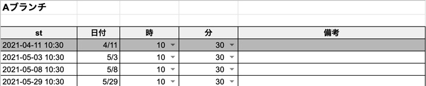

### B列に日付
日付は入力規則で制限をかけます。

セルを選んだ状態で、右クリックしたらデータの入力規則という項目を選びます。
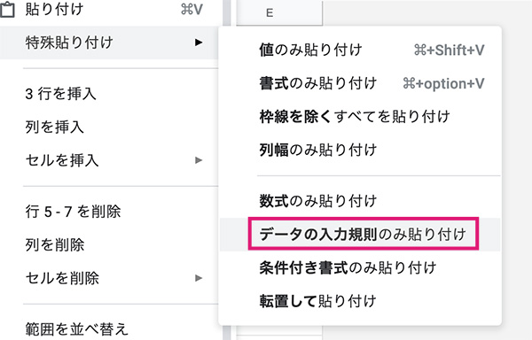

書式を狂わせないために条件を日付にし、入力拒否。

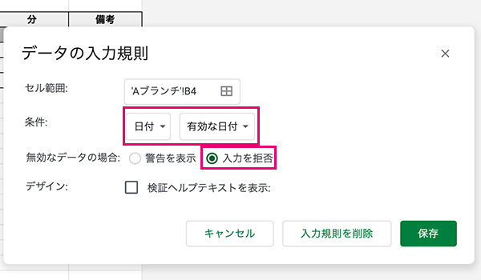

### C、D列に時間を設定
C、D列には時間を入れます。この項目は別セルに共通の時間を入力しておき、データを引っ張ってくるやり方もあるんですが面倒なので直入力しました。

これで決まった時間しか入力できなくなりました。

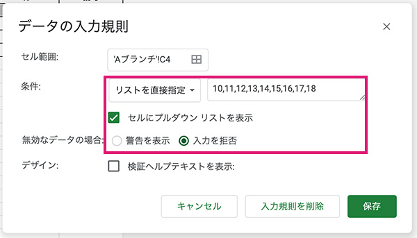

スプシにはデータが蓄積されていきますが、当月とその先の日程のみの日程をA列に出力します。

```vb
=if(and(B4>=date(year(today()),month(today()),1),B4<>""),year($B4)&"-"&text(month($B4),"00")&"-"&text(DAY($B4),"00")&" "&text(C4,"00")&":"&text(D4,"00")&":00","")
```
日にちが過ぎたかつ、出力しない行はグレーアウトします。条件式書式の設定を利用します。
```vb
=and($B4<today(), $B4<>"")
```
ここまでできたら、入力規則・書式と条件式書式をコピーしてすべてのセルにコピーします。

ブランチの数だけシートをコピーしてシート名とタイトルだけ変更します。

### すべてのデータの作成
タブの一番左にすべてのデータをまとめるシートを作ります。

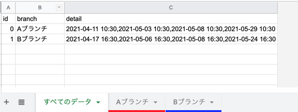

GASであれこれ自動化することもできそうですが、今回はデータも少ないので手入力です。

B列を参照してAブランチ、Bブランチのデータを`,（カンマ）`区切りで連結します。

このデータは受け取った側でバラします。

```vb
=TEXTJOIN(",",true,INDIRECT(B3&"!$A$4:A"))
```

### 担当者に自分のシートと決まった範囲しか編集させない

他ブランチのスタッフには閲覧権限だけつけておきます。
担当ブランチの編集できないように各シートの日付、時間、備考のみに範囲の編集権限をつけます。

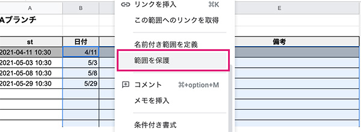

編集権限をつけます。

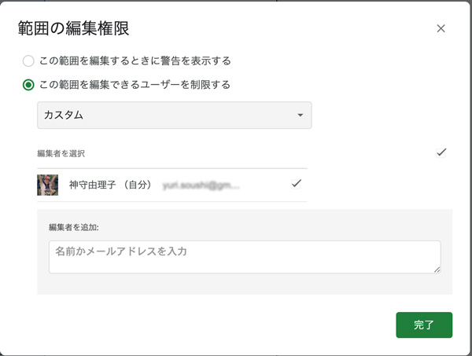

### スプシをウェブ公開してJSONデータを取得しよう！
スプシに「リンクを知っている全員」に閲覧権限をつけます。

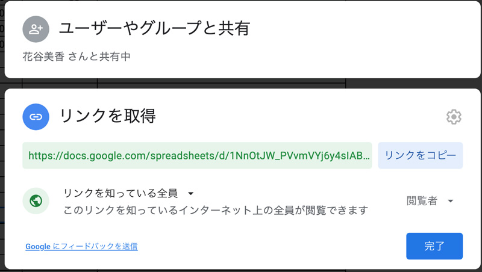

「ファイル」から「ウェブに公開」を選び、Webページとしてすべてのデータのみ公開します。
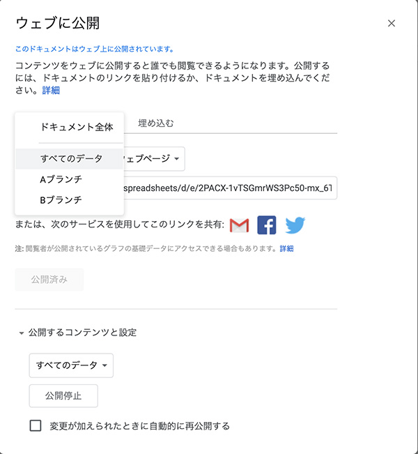

ちなみに、 *「変更が加えられたときに自動的に公開する」* も選ぶとシートを更新したらデータも更新されます。

今回は事故防止のためにあえてチェックを外しました。

ではデータを取得してみましょう。


|ページのID|ページの順番|
|-|-|
|{sheet_id}|{sheet_order}|

スプシのURLからID取得します。
```
https://docs.google.com/spreadsheets/d/{スプシのid}/edit#gid={なんかのID}
```


`{sheet_id}`にはスプシのID、1枚目のシートなので`{sheet_order}`には1と入れます。

```html
https://spreadsheets.google.com/feeds/list/{$sheet_id}/{$sheet_order}/public/values?alt=json
```
URLを叩いてみましょう。

JSONデータが返ってきました！！

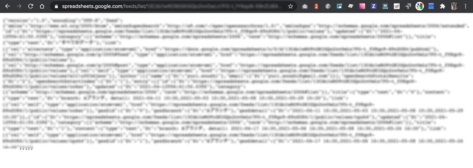

データにはGMailなど結構な個人情報も入っています。取扱注意ですね。。。。

## 実装とコードサンプル
すんごいダサいですが仕上がりイメージはこんな感じです。

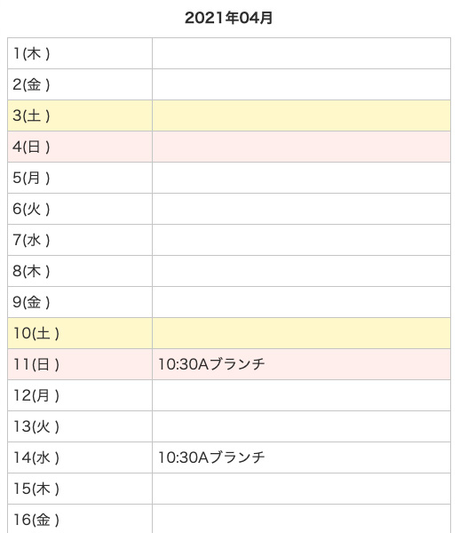

```php
function get_event_deta() {
	$sheet_id    = '{スプシのID}';
	$sheet_order = '1';
	$data        = "https://spreadsheets.google.com/feeds/list/{$sheet_id}/{$sheet_order}/public/values?alt=json";
	$curl        = curl_init();
	curl_setopt( $curl, CURLOPT_URL, $data );
	curl_setopt( $curl, CURLOPT_CUSTOMREQUEST, 'GET' );
	curl_setopt( $curl, CURLOPT_RETURNTRANSFER, true );
	$response = curl_exec($curl);
	curl_close( $curl );

	if ( ! $json->errors ) {

		$json_decode = json_decode( $response );
		$events      = array();
		foreach ( $json_decode->feed->entry as $value ) {
			$branch         = $value->{'gsx$branch'}->{'$t'};
			$schedule        = explode( ',', $value->{'gsx$detail'}->{'$t'} );
			$events[ $branch ] = $schedule;
		}
	} else {
		$events = 'error';
	}
	return $events;
}

$events  = get_event_deta();
$lastday = gmdate( 'd', strtotime( 'last day of this month' ) );
$c_year  = gmdate( 'Y' );
$c_month = gmdate( 'm' );
$d       = array( '日', '月', '火', '水', '木', '金', '土' );

if ( 'error' === $events ) {
	echo '<p class="text-center mt-5">カレンダーの読み込みに失敗しました。<p>';
} else {
	echo '<table>';
	echo '<caption>' . $c_year . '年' . $month .'月</caption>';
	for ( $i = 1; $i <= $lastday; $i++ ) {
		$c_date   = $c_year . '-' . $c_month . '-' . str_pad( $i, 2, 0, STR_PAD_LEFT );
		$week     = date( 'w', strtotime( $c_date ) );
		$bg_color = '';

		if ( 0 === (int) $week ) {
			$bg_color = ' class="bg_sun"';
		}
		if ( 6 === (int) $week ) {
			$bg_color = ' class="bg_sat"';
		}

		echo '<tr' . $bg_color . '>';
		echo '<td>' . $i . '(' . $d[ (int) $week ].' ) '. '</td>';

		$branch = '';
		foreach ( $events as $name => $items ) {
			foreach ( $items as $date ) {
				$event_date = strtotime( $date );
				if ( $c_date === gmdate( 'Y-m-d', $event_date ) ) {
					$branch .= '<span>' . gmdate( 'H:i', $event_date ) . $name . '</span>';
				}
			}
		}
		echo '<td>' . $branch . '</td>';
		echo '</tr>';
	}
	echo '</table>';
}
```

### WordPressに対応したい場合

`get_event_deta()`のcurlのところを書き換えます。

`wp_remote_get()`を使わないと怒られますので気をつけてください。

```php
/**
 * Get event data.
 *
 * @return $events
 */
function get_event_data() {
	$sheet_id    = '{スプシのID}';
	$sheet_order = '1';
	$data        = "https://spreadsheets.google.com/feeds/list/{$sheet_id}/{$sheet_order}/public/values?alt=json";
	$json        = wp_remote_get( $data );
	if ( ! $json->errors ) {

		$json_decode = json_decode( $json['body'] );
		 $events      = array();
		foreach ( $json_decode->feed->entry as $value ) {
			$school            = $value->{'gsx$branch'}->{'$t'};
			$schedule          = explode( ',', $value->{'gsx$detail'}->{'$t'} );
			 $events[ $branch ] = $schedule;
		}
	} else {
		 $events = 'error';
	}
	return  $events;
}
```

```php
/**
 * Show event schedule
 *
 * @return $table
 */
function show_event_schedule() {
	$events  = get_event_deta();

	if ( 'error' === $events ) {
		return '<p class="text-center mt-5">カレンダーの読み込みに失敗しました。<p>';
	}

	$lastday = gmdate( 'd', strtotime( 'last day of this month' ) );
	$c_year  = gmdate( 'Y' );
	$c_month = gmdate( 'm' );
	$d       = array( '日', '月', '火', '水', '木', '金', '土' );

	$table  = '<table>';
	$table .= '<caption>' . $c_year . '年' . $c_month . '月</caption>';
	for ( $i = 1; $i <= $lastday; $i++ ) {
		$c_date   = $c_year . '-' . $c_month . '-' . str_pad( $i, 2, 0, STR_PAD_LEFT );
		$week     = gmdate( 'w', strtotime( $c_date ) );
		$bg_color = '';

		if ( 0 === (int) $week ) {
			$bg_color = ' class="bg_sun"';
		}
		if ( 6 === (int) $week ) {
			$bg_color = ' class="bg_sat"';
		}

		$table .= '<tr' . $bg_color . '>';
		$table .= '<td>' . $i . '(' . $d[ (int) $week ] . ')</td>';
		$branch = '';

		foreach ( $events as $name => $items ) {
			foreach ( $items as $date ) {
				$event_date = strtotime( $date );
				if ( gmdate( 'Y-m-d', $event_date ) === $c_date ) {
					$branch .= '<span>' . gmdate( 'H:i', $event_date ) . $name . '</span>';
				}
			}
		}
		$table .= '<td>' . $branch . '</td>';
		$table .= '</tr>';
	}
	$table .= '</table>';

	return $table;
}
add_shortcode( 'show_event_schedule', 'show_event_schedule' );
```
`add_shortcode`でショートコードとして登録してあるので、記事などにも出力できます。

```html
[show_event_schedule]
```
ちなみにエラーで苦しんだらこちらを参考にしてください。

<card id="/blogs/entry452/"></card>

## まとめ・スプシをJSONで取得したら気軽にデータをウェブサイトに使える
今回スプシをJSONデータで取得し、Webサイトに埋め込む方法を紹介しました。

注意点もあります。

残念なことに読み込みも多少重いのと何度かに一度読み込みを失敗します。

あまり精密に使いたい場合はsheet APIとかに変えて、利用しないほうがいいかもです。

みなさんのコーディングライフの一助となれば幸いです。

今回も最後までお読みいただきありがとうございました。
