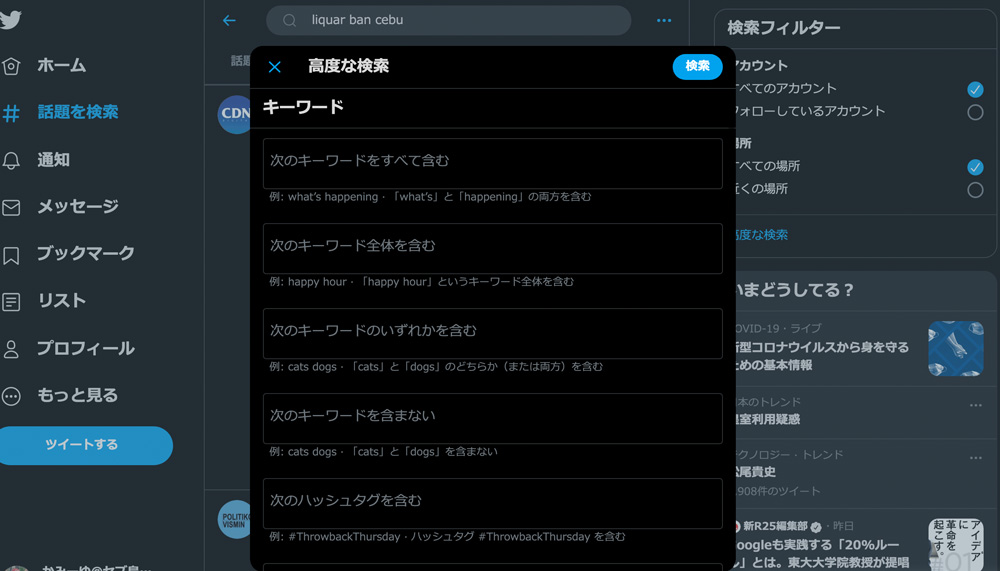
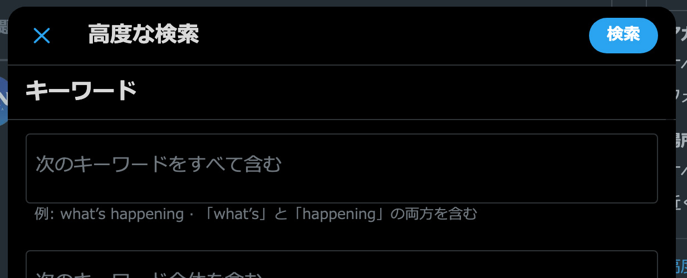
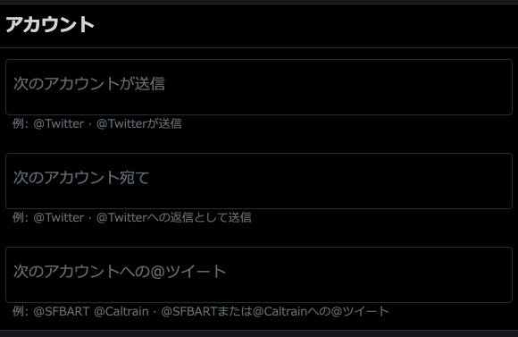
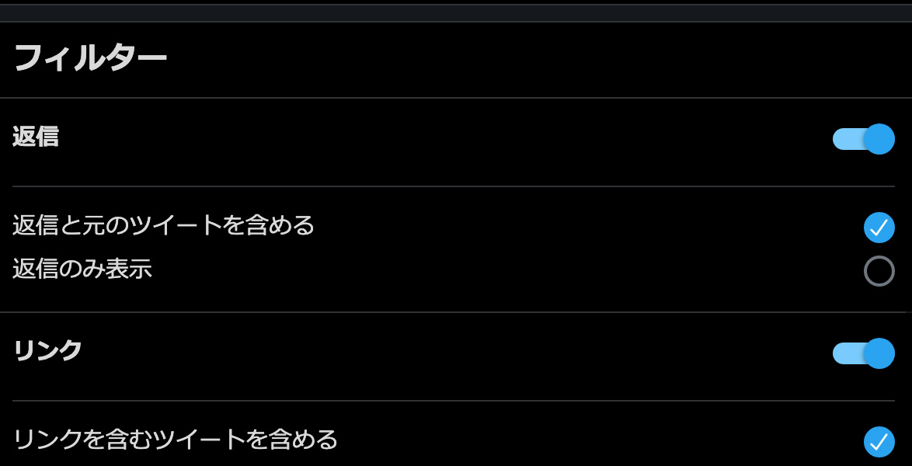
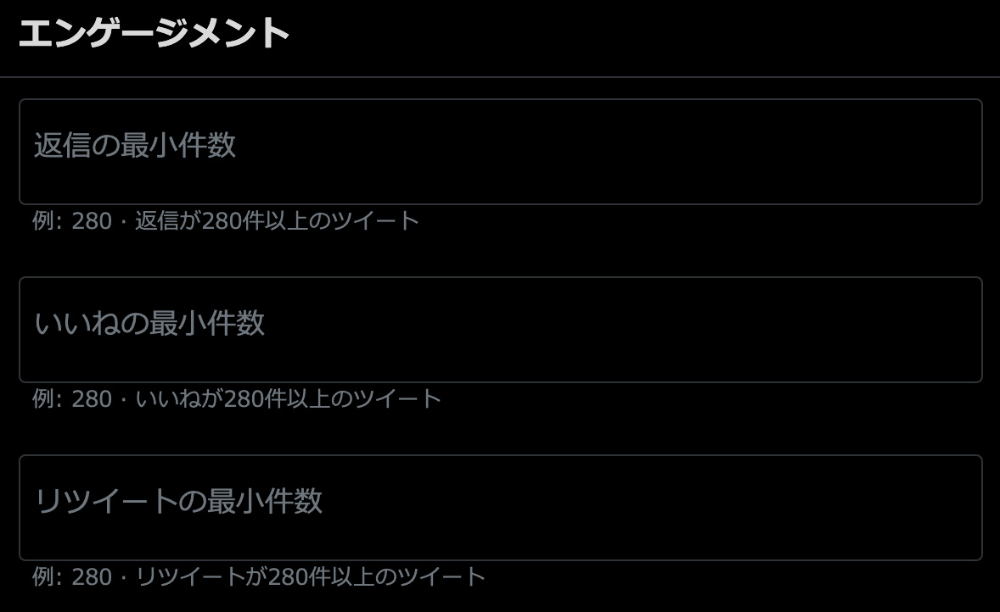
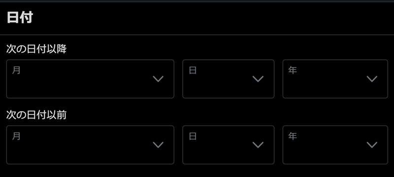
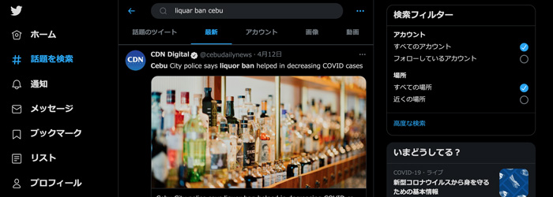
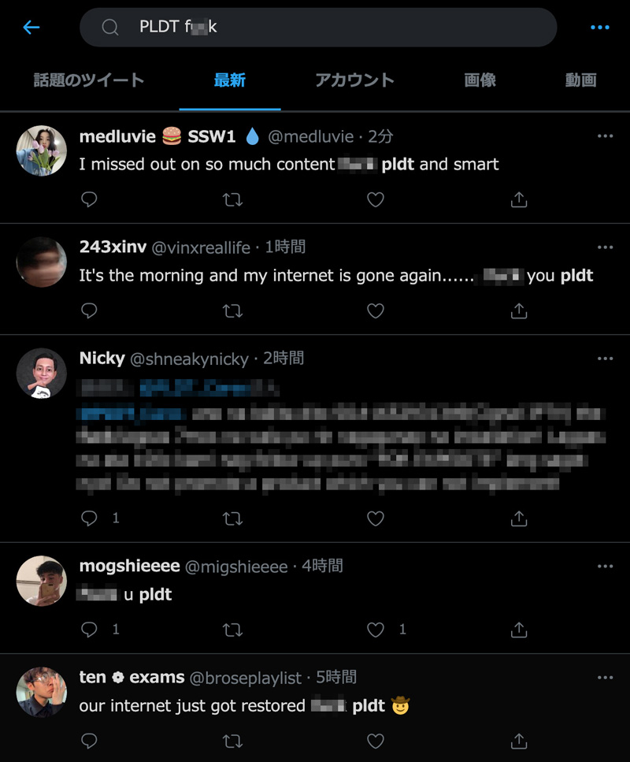

## Twitterの検索窓で直入力（検索コマンド）で絞り込未検索する方法

Twitterの検索窓はこちら。絞り込みたいキーワードなどを半角スペースで区切って組み合わせていきます。


<small>※ 著作権を考慮してモザイクかけてます。</small>

### キーワードでの絞り込み
|キーワード検索|方法|例|
|-|-|-|
|*キーワードAND検索*|キーワードそのまま入力|ノマド 海外|
|*キーワード完全一致*|"（ダブルクォーテーション）で囲む|"liquor ban"|
|*キーワードOR検索*|ORを挟む|フリーランス OR 海外ノマド|
|*キーワード除外*|-を接頭辞として付与|-社畜 -家畜|
|*ハッシュタグ*|(#キーワード)|(#海外ノマド)|
|*言語の絞り込み*|lang:+言語|lang:ja,lang:en|

### アカウントでの絞り込み
|アカウント|方法|例|
|-|-|-|
|*誰から？*|from:アカウント名|from:@lirioy|
|*誰宛？*|to:アカウント名|to:@lirioy|
|*誰の？*|アカウント名|@lirioy|

### 日付
|日付|方法|例|
|-|-|-|
|*指定した日付以降*|since:|since:2020-08-01|
|*指定した日付まで*|until:|until:2020-12-01|

### エンゲージメントで音絞り込み
minなので一定の数値を超えるTweetを取得できます。

|エンゲージメント|方法|例|
|-|-|-|
|*リツイート数*|min_retweets:|炎上 min_retweets:100|
|*リプライ数*|min_replies:|モンハン min_replies:100|
|*いいね数*|min_faves:|飯テロ min_faves:100|

`min`の前に`-`つけたらmax（最大〇〇まで）も取れます！

「モンハン」キーワードで100以上のTweet取得
```
モンハン min_replies:100
```

「チャーハン」キーワードで100以下のTweet取得
```
チャーハン -min_replies:100
```

### フィルター
いろんな絞り込みができます。

|種類|方法|例|
|-|-|-|
|*リプライ*|filter:replies|@lirioy filter:replies|
|*リンク*|filter:links|seo filter:links|
|*画像*|filter:images|イケメン filter:images|
|*動画*|filter:video|youtube filter:video|
|*動画と画像*|filter:media|ねこ filter:media|
|*認証済みアカウント*|filter:verified|アイドル filter:verified|
|*認証済みアカウント*|filter:verified|小説 filter:verified|
|*リプライ含む*|include:replies|おはよう include:replies|
|*リプライ除外*|exclude:replies|こんばんは exclude:replies|
|*リツイート含む*|include:retweets|@twiiter include:retweets|
|*リツイート除外*|exclude:retweets|@lirioy exclude:retweets|

```
@lirioy filter:replies
```
`-`+`filter`で除外もできます。
```
@lirioy -filter:replies
```
## フィルターなどを組み合わせたリンクを作成し、絞り込む方法

[基本の検索窓で直入力で絞り込む方法の紹介](#基本の検索窓で直入力で絞り込む方法の紹介)で紹介したキーワードを組み合わせて以下URLにくっつけてChromeなどで検索しても絞り込みできます。

```html
https://twitter.com/search?q=
```

たとえば、モンハンでビデオ、最新で調べたい場合は以下のようにします。お尻に`&f=live`を付与すると最新から絞り込めます。

```html
https://twitter.com/search?q=モンハン filter:videos&f=live
```
## PCだったらGUI操作で絞り込み可能
Webバンであれば上記のようなコードっぽいものが苦手な人でも画面操作で詳細に絞り込むことが可能です。

検索窓に何かしら入力したらアドバンスフィルターへ飛べます。

[高度な検索](https://twitter.com/search-advanced)

ちなみにディスクトップアプリ、iPhoneアプリからはここまで高度な検索はできませんでした。。。



<br>キーワード絞り込み

* 次のキーワードを全て含む
* 次のキーワード全体を含む
* 次のキーワードのいずれかを含む
* 次のキーワードを含まない
* 次のハッシュタグを含む

<br>アカウントでの絞り込み

* 次のアカウントが送信
* 次のアカウント宛て
* 次のアカウントへの@ツイート

<br>フィルターでの絞り込み

* 返信
* リンク

<br>エンゲージメントでの絞り込み

* 返信の最小件数
* いいねの最小件数
* リツイートの最小件数

<br>日付での絞り込み

* 次の日付以降
* 次の日付以前

## 余談・Twitter検索方法を覚えたのはフィリピンでリカーバンが突然施行されたり、とにかく最新情報が欲しかった
2020年2月2日より、コロナのせいでリカーバン（外でお酒飲めません）が続いてましていつ解除されるかわからず毎日チェックしています。

私からお酒を取り上げたら、なんの楽しみもなくなります。。。。

いつ明けるかと毎日チェックしてるものの、最近知ったのは「*セブのポリスがリカーバンのおかげでコロナ感染者減ったよ*」とのこと。



大好きなお酒が悪者にされてイヤですが、コロナが減ったのはよかったと思います。

切実に。。。。**早く外で酒飲みたい！**

### さらにフィリピン・海底ケーブル損傷事件でネットが死ぬ
フィリピンにはPLDTという市場独占キャリア（日本でいう旧ド●モ状態）があるんですが、これがまー酷いw

普段からひどいのにさらに最近海底ケーブルが損傷してフィリピン全体のネットがつながりにくくなりました。

私の家はGlobeですが住んでる地域もあり何とか繋がってましたが、私のビジネスパートナーはPLDT使用していたせいで音信不通になりました。

なので数週間前、*PLDT*がトレンド入り。

ちなみにいまだにこんなツイートが。。。



ピノイの怒りが見受けられます。。。やばい&やばそうな文章はビサヤでもモザイクかけました。。。

## まとめ・賢くTwitterの検索コマンドを使ったら超便利！
ある種、情報が早いTwitter。

海外に住むと一番ネックになるのが情報収集。

Google検索よりコンパクトでニッチ、特化した情報を得やすいです（偏ったものも多いので注意は必要）。

TVを見たとしてもタガログだったら1ミリも理解できませんし、海外に住むと情報収集にピッタリです。

もちろん、日本にいた時も災害などの情報収集でめちゃ役に立ってました。

まとめてみると[Togetter](https://togetter.com/)などのサービスもこういう機能を利用して作られてるんだと改めて感心しました。<br><br>

昨今、便利になりましたが情報過多。情報を絞り込んでうまく欲しい情報を手に入れてください。

この記事がみなさんのSNSライフの一助となれば幸いです。

最後までお読みいただきありがとうございました。
