WordPress使ってみたいけどテーマや機能（プラグイン）どうすればいいの?!

そんなお悩みありませんか？

デザイン面や機能がバランスよく揃っていると、ブログってとても始めやすいです。

この記事ではWordPressに追加しておくとすぐにでも快適にウェブサイトを運用できるテーマや機能（プラグイン）を紹介します。 難しいことはしませんのでご安心を。<small>最新のWordPress（2021年5月時点）で検証済みです。</small>

<prof></prof>

## WordPressを少しカスタマイズしたい人に捧げる

この記事は、こんな人にオススメの記事です。

* 初心者かつWordPressでブログ始めたい
* 収益化も視野に入れ友達と小さなオウンドメディア（情報発信）を始めたい
* ウェブ担で社内のWordPressに何かしら機能を追加したい（もしくはしなければならない）

 
HTMLやCSSなどの知識はなくてオッケーです！  

|概要|詳細|
|-|-|
|*前提条件*|テーマやプラグインのインストールはなんとかできそう レンタルサーバーを借りてインストールまでできてある|
|*環境*|WordPress version5.7.1  PHP7.4.1|
<small>※ プラグインは2021年5月時点で動作確認済みです。</small>

### WordPressサーバー取得からインストールがまだの方
サーバー設定・ドメイン取得、WordPressインストールまではこちらに紹介しています。参考にしてください。

<card id="/blogs/entry379/"></card>

## テーマやプラグイン選びのコツ
プラグインやテーマって何を追加していいかわかりませんよね？

だから、**何でもかんでもインストール**してしまいがちです。

あれこれインストールしてしまい**痛い目にあった人**を何人か知っています。

実はできるだけ痛い目に合わないコツがあります。  

WordPressのテーマやプラグインを選ぶコツは*作者も重要*ですが**DL数と更新頻度**をしっかりチェックすること。

更新日が1年以上前のものなどは、インストールしても動かないことがありますのでご注意ください。

  <h4>さらにWordPressのプラグイン追加の注意点</h4>
  プラグインのインストールは、必要最小限（10までを推奨します）にとどめてください。 パフォーマンス低下や不具合の原因になります。 プラグインを無駄にインストールしないコツは<strong>上手にテーマを選ぶ</strong>こと。 テーマによってはプラグインを入れなくても<strong>機能が充実し、さほどプラグインのインストールが必要ない</strong>ものもあります。 ただ、テーマ変更時に同様の機能が使えなくなることもあるのでご注意ください。

## お金をかけたくない方＆とにかくブログを始めたい初心者さんへオススメのテーマはCocoon
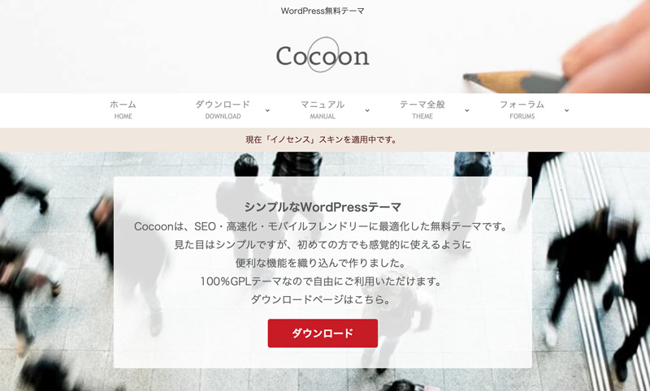

[Cocoon](https://wp-cocoon.com/downloads/)

お金をできるだけかけたくない方にはテーマCocoon一択でオススメしています（私は回し者ではない）。

Cocoonは無料なのに機能も充実。スキンといって変更すると見た目もある程度変えられます。

* SNS連携
* 目次追加
* Analyticsやサーチコンソール連携
* Amazonなどのアフィリと連携
* 吹き出し機能
* 高速化
* ランキング作成

 そして、初心者の方ってWordPressの管理画面触っているだけでなぜかパニックになることもあります。

ですが、
 
そんな人に**Cocoonは優しい**です。

サイトの設置をCocoon設定というメニューの中をいじるだけで完結することができ、機能を探し回る必要がありません。

さらにフォーラムで質問することも可能です。

[フォーラム|Cocoon](https://wp-cocoon.com/read-me-for-using-fourm/)

  <h4>将来、Cocoonからテーマを変える可能性のある方へ</h4>
  テーマを乗り換えると、せっかく設定したタイトルやメタディスクリプションが消えてしまう可能性があります。 デフォルトのSEO変更を使わず、SEO Packなどのプラグインで対応することをオススメします。

### 無料なのにモバイルを高速表示させることができるAMPが使える！
最近、何か検索する時に使うのはみんなスマホですよね。

せっかく検索したのにページがなかなか表示されないと、ユーザーはイライラ。

*やっぱやーめた*って 記事を読むのをやめてしまいます。

Cocoonは無料テーマにもかかわらず、**AMP対応**しています。

AMPは表示を早くするため、Google・Twitterなどが共同開発したフレームワーク（仕組み）です。

AMPを使うと**モバイルページでの表示が早くなります**。

Google曰く、AMPページ**は読み込み時間を*15％～85％減少***させることができるとのこと。

無料なのに、高機能。AMPが試したい方は、Cocoon設定からAMP機能をOnにしましょう。

  <h4>どんなサイトでもAMP対応する必要ある？</h4>
  私はAMP推しですが、コンテンツ次第で対応する必要ないと考えてます。 すべての人がモバイルで閲覧するとは限らないからです。 ちなみに、私の各記事のほとんどがテック記事（Web制作に関するチップス）なので2/3以上がPCで閲覧しています。
  なので現在PCで閲覧することを優先したサイトにリニューアルし、AMP対応もやめました。

## お金をかけてもいい！ハイセンス、高機能なテーマが使いたい
もっと機能やデザインにこだわりたい人は少しお金をかけて有料テーマをオススメしています。 

有料テーマを使う大きなメリットがあります。

機能面やデザインはもちろん、メンテナンスが定期的に行き届いていたり、手厚いサポートを受けられることが多いからです。

そこで、私が仕事で関わったり実際に使ったもので、いいなーとか安定感があったテーマをご紹介します。

<small>※ ステマではありません。もし、そのほかいいテーマを見つけたら追加する予定です^ ^</small>

  <h4>海外の無料でかっこいいだけのテーマはオススメしません（ほんとヤバかった。。）</h4>
  昔サーバー移行の依頼がありました。クライアントは素人。調べまくって海外の無料テーマをうまく駆使してキレイにウェブサイトを作成していました。 ところがフタを開けてみるとスパムの温床。 結局テーマを変え、クライアントさんは手作業で記事を移行することになりました。 
  タダだと、見た目はキレイでも<strong>セキュリティーホールは穴だらけ</strong>ということもあります。ちゃんと後悔しないウェブサイト運用をしたい人は有料テーマの方が安心です。

### 豊富なテンプレート。ビジュアルの安定感はTCD
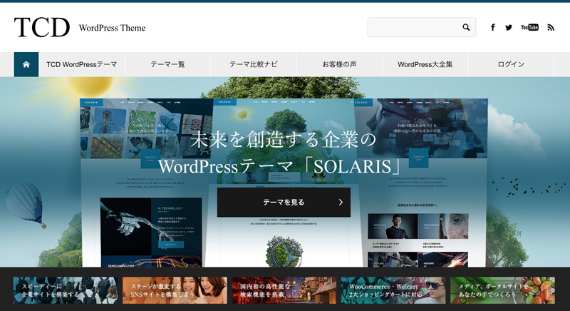

TCDテーマをコーポレートサイトとして採用している会社多いです。

実は昔いた会社のコーポレートサイトもTCDでした。そのほか、IT系の会社でも結構好んで使っているところ多い気がします。

鉄板のコンテンツ構成がカンタンに作れますし、管理画面からちょっと色やフォント（文字の種類）を変えただけでオリジナリティが出ます。

|テーマ名|TDC各テーマ|
|-|-|
|*価格*|¥30,000円前後|

[TCDWordPress Theme](https://tcd-theme.com/)

### シンプル。だけど記事が装飾でき、ワクワクしながらブログを書けるSWELL
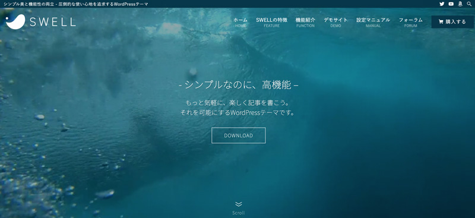

知り合いが気に入って使っているテーマです。ブログといえば記事が主役。

記事の文字やリストをカッコよく装飾し、読みやすくしたいですよね？

柔軟性はピカイチな気がします。QAなど、特殊な装飾もできます。

|テーマ名|WordPressテーマ SWELL|
|-|-|
|*価格*|¥17,600-（税込）|
|*ライセンス*|一度購入するとライセンス制限なしで複数サイトで利用可能|

[SWELLダウンロード](https://swell-theme.com/download/)

### ブログ×マーケに特化したテーマSeals ver.1.5

プロのデジタルマーケッターがプロデュースしたSeals ver.1.5。

最近試してみましたが、とにかく表示が早く感動しました。

SWELL同様、記事を装飾でき、ランディングページ用テンプレートもあります。

ブログで集客したい人、サイトを使ってメシ食っていきたい人にオススメです。

|テーマ名|WordPressテーマ Seals ver.1.5|
|-|-|
|*価格*|¥21,600-（税込）|

[Seals ver.1.5](https://fanfare-co-ltd.com/seal/)

## 合わせて使いたい無料で使えるプラグイン7つ
テーマが決まったら、サイトに応じてプラグインを追加しましょう！

WordPressの管理画面、プラグインの新規追加から検索し、インストールできます。

インストールする前に、*更新日*と*ダウンロード数*のチェックを忘れないようにしましょう。

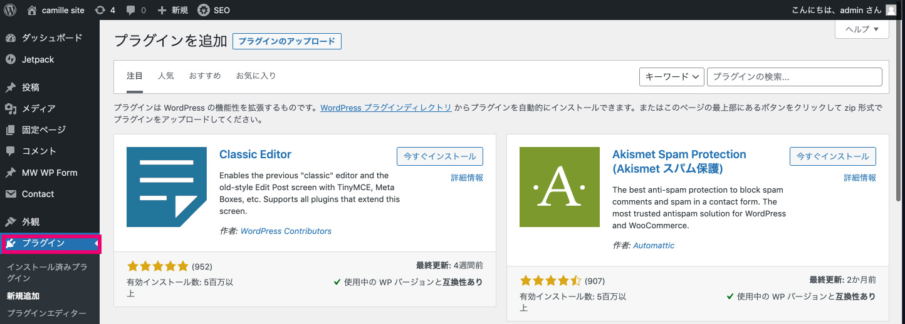

<small>※ 今回表示速度で優秀なテーマが多いのでスピード対策系のプラグインは端折ってます。</small>

### 1.SiteGuard WP Plugin・セキュリティ対策
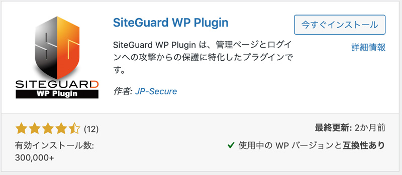

[SiteGuard WP Plugin](https://www.jp-secure.com/siteguard_wp_plugin/)

WordPressは世界一シェアされているCMSであると同時に、世界一クラッカー（悪い人）に狙われやすいCMSです。

管理画面に侵入さえすれば、クラッカーはコードを書き換えることができます。

私は実際にコードの改ざんやマルウェアがあるサイトに遭遇したことがありますが、まあ。。。悲惨です。

カンタンにセキュリティ対策できるラグイン・SiteGuard WP Pluginは、主に以下の攻撃を予防できます。

* 不正ログイン
* 管理ページ（/wp-admin/）への不正アクセス
* コメントスパム

### 2.contact form 7 or MW WP Form オススメ二大お問い合わせフォーム
お問い合わせフォームの鉄板はcontact form 7かMW WP Formです。

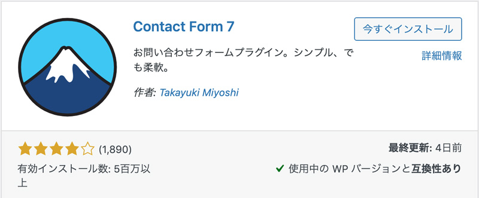

[contact form 7](https://contactform7.com/)

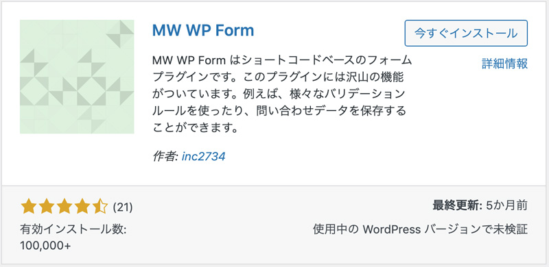

[MW WP Form](https://plugins.2inc.org/mw-wp-form/)

私は個人的にContact Form 7の方が好きですが、コードとかまったくわからない人にはMW WP Formをオススメしています。

理由は以下の通り。

* 設定がとてもカンタン
* 必須などの設定も楽チン
* サンクス、確認画面の設置がカンタン

 ただ、スパム対策hCantcha（次のオススメプラグインとして紹介してます）を設置したい場合はcontact form 7じゃないと併用できないのでご注意を。

<small>※ 2021年4月時点。MW WP FomもいつかhCantchaへの対応をするかもしれません。</small>

### 3.hCaptcha for WordPress・reCAPTCHAの代わりに使えるスパム対策
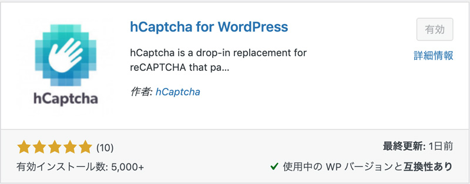

[hCaptcha for WordPress](https://www.hcaptcha.com/)

reCAPTCHAが有料化しましたね（課金されなくても支払い登録が必要）。

実はhCaptchaというものがあり無料でスパム対策ができます。  

実装の仕方はカンタンですが、実装方法は割愛します。興味ある方はこちらを参考に。

[reCAPTCHAが有料化!?WordPressのreCaptchaをhCaptchaに移行する方法](https://acceliv.com/recaptcha-to-hcaptcha/)

### 4.All in One Migrationでサーバー引っ越し
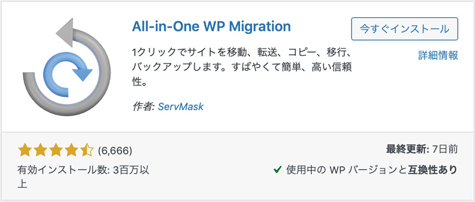
[All in One Migration](https://servmask.com/)

サーバーを引っ越したい時に手軽に使えるプラグインです。バックアップなんかでも使えます。

* データのバックアップ
* テキスト・コンテンツの置換（`http://aaa.com` >> `https://bb.com`）

### 5.Search Regex コンテンツ内の文字列を複数ページにまたがってまとめて修正可能
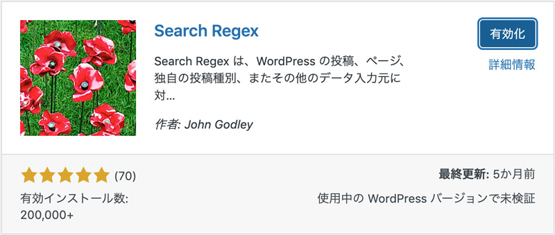
[Search Regex](https://searchregex.com/)

文言などをまとめて変更・削除する時にオススメです。正規表現にも対応しています。

テーマに依存した機能を使っていると、新たなテーマにした時、ショートコードなどがむき出しになることがあります（実際ありました）。

記事が多い場合は手作業で修正するなんて地獄。Search Regexでまとめて削除ないしは置換して対応しましょう。

### 6.Custom Post Type UI ブログ記事や固定ページ以外を追加
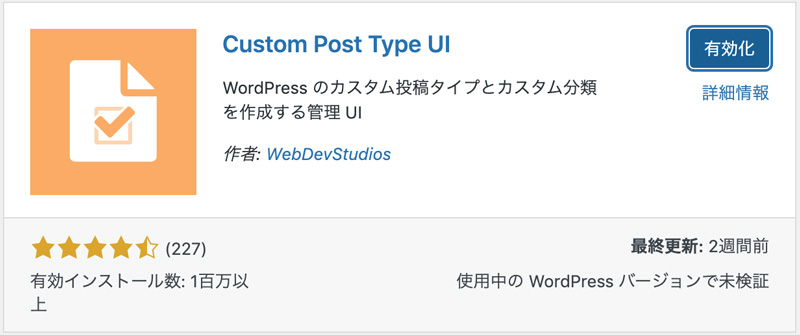
[Custom Post Type UI](https://github.com/WebDevStudios/custom-post-type-ui/)

管理画面上でカンタンにカスタム投稿タイプを追加できます。

WordPressは便利！コーポレートサイトにも利用したいですよね？

実績やニュース、ブログ記事以外のジャンルの投稿を増やしたい時に役立ちます。

### 7.Easy Table of Contents 記事に目次をつける
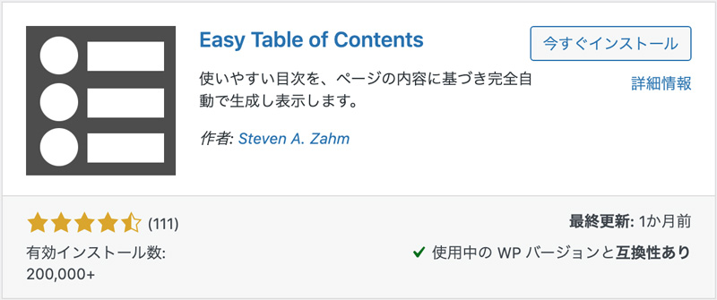
[Easy Table of Contents](https://connections-pro.com/)

このプラグインを使うと、記事に目次を追加できます。

最近Heat Map（サイト上でユーザーがどんな動きをしているか計測できるツール）を設置して気づいたのが**目次ってめっちゃ大事**。

私の記事ではこんな感じで、目次のところはたくさんクリックされています。

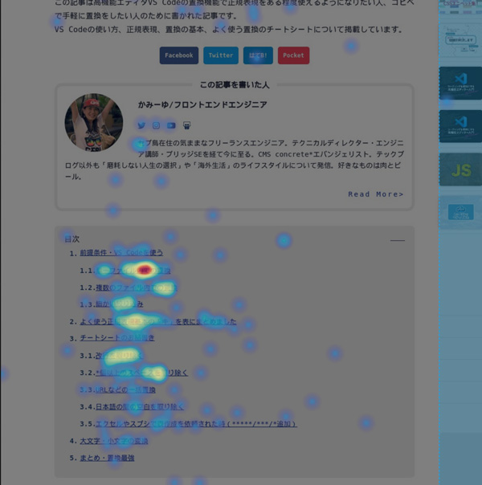

## まとめ・WordPressサイトはプラグインとテーマを上手に選ぶとすぐに快適にブログを始められます！
今回たまたまブログを始めたい子から相談を受けたのをきっかけにこの記事を書きました。

できるだけ小難しいことをせずWordPressを始めるにはどうすればいいか。 必要なテーマやプラグインをまとめてみました。

まとめているうちに、最低限ブログ発信やマーケティング用コンテンツ作っていくだけなら、コードを書く必要ないし十分事足りるとも感じました。

もちろん、お持ちのサービスによっては既存の機能やテーマだけでは事足りないこともあります。

WordPressは、普段使っているスプレッドシートなどのツールと連携することもできます。 皆さんが使いやすいよう柔軟にカスタマイズしていくこともできます。

もし、今のプラグインなどで機能が事足りないようであればWeb制作のプロなどに相談するのもアリですよ。

この記事がみなさんのブログライフの一助となれば幸いです！ 
最後までお読みいただきありがとうございました。
