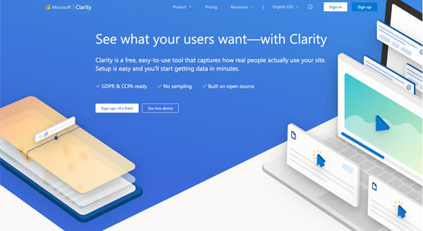
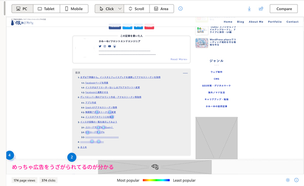
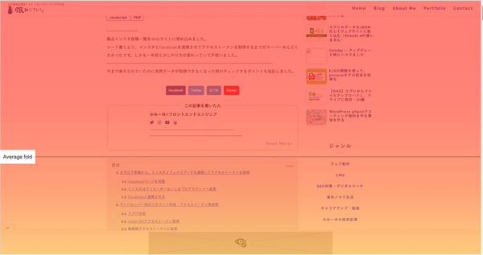
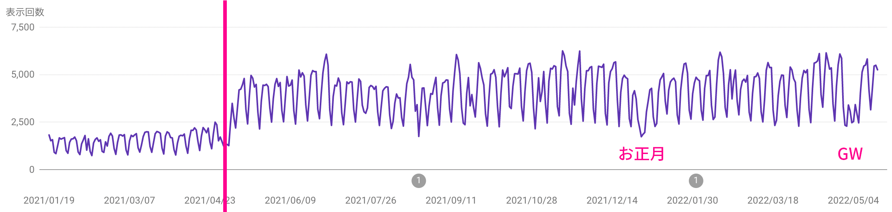

## Webマーケティングの勉強を始めるきっかけはお客さんが困っていたから
私の主な仕事はウェブサイト制作。ウェブサイト制作の目的のほとんどが「**集客**」です。

とあるプログラミング教室を運営しているお客さんがコロナで仕事が激減しました。

何度もお仕事でお世話になっている方。今年に入って集客を手伝いたいと強く感じるようになりました。

<msg txt="私にはWebマーケティングの知識が必要。。。 Webマーケティングを勉強してもっとを助けたい！"></msg>

しかし問題がありました。

私は「*マーケティングがニガテ*」なんです。

## とりあえず、知識をアップデートするためにWeb解析の勉強をしてみたものの。。。
最初はマーケティングのことはあまり考えず、Web解析から勉強し始めました。

Web解析士の受験は7年前くらいにしました。だから解析に関するある程度の知識は持っています。

「**7年も経てば知識は陳腐化する**」ので、テキストを入手して再度勉強してみたものの、大嫌いな「*SWOT分析*」や「*3C分析*」が出てきました。

ガマンして一周は教科書読んだものの、拒絶反応が出はじめました。

<h3>SWOT分析</h3>

SWOT分析とは、競合や法律、市場トレンドといった自社を取り巻く外部環境と、自社の資産やブランド力、さらには価格や品質といった内部環境をプラス面、マイナス面にわけて分析することで、戦略策定やマーケティングの意思決定、経営資源の最適化などをおこなうための、有名なフレームワークのひとつ。

<ul>
<li>Strength（強み）</li>
<li>Weakness（弱み）</li>
<li>Opportunity（機会）</li>
<li>Threat（脅威）</li>
</ul>

<h3>3C分析</h3>

3C分析とは、マーケティング環境分析のフレームワークです。

<ul>
<li>Customer（市場・顧客）</li>
<li>Competitor（競合）</li>
<li>Company（自社）</li>
</ul>

### ブログ・YouTubeを漁ってアプローチの方法を模索
向いてないことを続けるほど、私は辛抱強くないです。

なので、YouTubeやブログを漁るようになりました。

最初は「Web解析」を中心にコンテンツを探していましたが、YouTubeを漁るうちにWeb解析だけじゃなくマーケの動画がたくさん出てきました。

知り合いがちょっと前までマーケ系？の有名なオンラインスクールに入っていました。たまたまその運営者の方のYouTubeを見つけたんです。

<msg txt="早く結果を出してあげたいし、この際オンラインサロンとか通って自分に投資してみようかな。。。 スキルや経験は価値だし。"></msg>

拝見しました。 やっぱり連発します、マーケの専門用語。

<msg txt="有名な人の設立したオンラインスクールで学べばそれなりにステータスが上がるかもしれないけど、生理的に無理だわ。"></msg>

そんな時、息子のとのケンカでのやりとりを思い出しました。
 私が息子と口論になり、アリババの創立者・ジャックマーの言葉を引用した時、息子にこんなこと言われました。

<msg txt="はぁ？？？ ぶっちゃけそんな世界的超有名人の言葉、まったく響かんし。 生きている世界が違いすぎるし、同じことできるわけないじゃん。" img="common/son.jpg" name="息子" cls="msg-baloon--right"></msg>

## 無理せずに学ぶには、親しみやすさが大事
あれこれYouTubeを見ていたら、なぜかサジェスト（オススメ動画）で[デジタルマーケッタージュンイチ](https://junichi-manga.com/)さんの動画が出てきました。

昔はよくジュンイチさんのブログ読んでました。Google アナリティクスの使い方もブログで学びました。

普段どんな人が記事を書いているか気にしていないんですが、その時は珍しく[ジュンイチさんのプロフィール](https://junichi-manga.com/profile/)を読み、

「会社員で苦労し、デジタルマーケティングで独立した人」

という記憶がありました。

<msg txt="そうだ、YouTubeライブ配信しているみたいなので今度見てみよう。"></msg>

確か最初に見たのは「トップページ診断がどうの」っていう内容だったと思います。

## 動画を見て早速お客さんに提案した
ライブ配信後、改めてお客さんのサイトのトップページを見てみました。

 ファーストビューにフルサイズ動画、流動体デザイン（当時流行っていた）、 肝心な「*どんなサービスが提供されている*」が、まったく伝わってない気が。。。

<msg txt="トップページで伝わってないのかも...。そりゃ、申し込みないよね。 そうだ、提案してみよう！！"></msg>

## デジタルマーケティングを学びながらこの2か月やってみたこと
*お客さんの思いやサービス*があってはじめてウェブサイトに載っけられるんですよね。

思いやサービスの良さをこのウェブサイトで前面に出すためにはどうするのがいいだろうって考えました。

当たり前っちゃ当たり前なんですが、大切なのは数字やデータ。

「**本当にトップページがイケてないのか？**」を検証するためにヒートマップ(Clarity)を導入しました。

[Clarity Microsoft](https://clarity.microsoft.com/)

ヒートマップは導入するとスクロール量やクリック箇所が計測できるのですが、一番流入されているトップページのファーストビュー（ページにアクセスして最初に見えているところ）以降あまりスクロールされていないことが発覚。

### データを計測しつつ、改修してみた
以下のようなことをやってみました。

* トップのファーストビューの改修
* 申し込みへの導線を増やす
* コンテンツを増やすために、お客さんの声設置
* キーワード選定やブログの書き方講座実施

 データを見ながらやってみると、不思議とわずかでも結果が出るんですよね。嬉しかったです。

そのサイトの目的である申し込みが増えたこと。副産物として**お客さんのモチベーションが上がった**こと。

収穫はたくさんありました。

### あわせて当サイトも改善を行った

実際のお客さまのものはお見せできないのもあるので、当サイトのヒートマップの状態をご紹介しておきます。

片手間にやっているので、忙しいとテコ入れできませんがリライトやコンテンツの位置の改善だけで、サーチコンソールでの*インプレッション数は2〜3倍*まで増えました。

細かいやり方に関しては別にブログ記事を書こうと思います。

## まとめ・Webマーケティングは難しく考える必要なし

よく、Webのマーケティングでは数字やデータが大事って言います。
 でも、はじめて勉強する人にとって*どの数字やデータが重要か分からない*し、もっというと何やっていいか分からないんです（本音）。

そこにフレームワークとか難しいモノを上乗せするから、余計難しくなる。

少しでも近道する手法としてフレームワークがあるだけで、目的にマッチしなければ使う必要ない。

フレームワークばっかり覚えさせるのってちょっと目的がズレてない？

やってみると気づきます。 だから私はマーケティングが嫌いだったことも。

 最初重要なのはシンプルに「*どんなユーザー*」に「*何を売りたいか*」を決める。

あとは、提供したいサービスに対して必要な数字やデータを元に、ユーサー視点で価値が伝わるようPDCAをひたすら回す。

<msg txt="Webサイトのオーナーにもサービスを使うユーザー視点を持ってもらうことが大切。 サービスを選ぶのはユーザーだから。"></msg>

想像以上にシンプルでした。

 この記事がマーケティングを今から勉強したい人の一助となれば幸いです。

最後までお読みいただきありがとうございました。
