「子ども服をセブに送るプロジェクト」始動！第一弾の洋服がもうすぐ届きます！ みなさんのご支援のおかげです。心から感謝です。

実は私、スラム街の近くを通る程度で、中に深く入り込んだことがないんです。フィリピンのスラム街って危険？不衛生？見てもないことは語れないので、実際に最貧困層の住む地区にお邪魔してきました。 私の目に映ったリアルを、ありのままを伝えたいので記事にしました。
<prof></prof>

## セブ島の最貧困層の住むスラム街についてざっくり
セブ島にはお墓とゴミ山に、いわゆる*最貧困地区*が存在します。

今回はセブ島NGO団体・DAREDEMO HERO Inc.さんのご好意でこの2大スラム街に同行させていただきました。見たことを可能な限り、ありのままお伝えします。

<small>※ スタディーツアーではありません。単なる同行です。</small>

 洋服を送るきっかけはこちら。

<card id="/blogs/entry445/"></card>

### YouTubeも作りました！！
YouTubeでも配信しています！併せてご覧ください。

<iframe width="560" height="315" src="https://www.youtube.com/embed/4wPJBmtcAjo" title="YouTube video player" frameborder="0" allow="accelerometer; autoplay; clipboard-write; encrypted-media; gyroscope; picture-in-picture" allowfullscreen></iframe>

## お墓に住む人たち
セブ島にはお墓に住んでいる人たちがいます。 私は、そのうちのひとつにお邪魔しました。

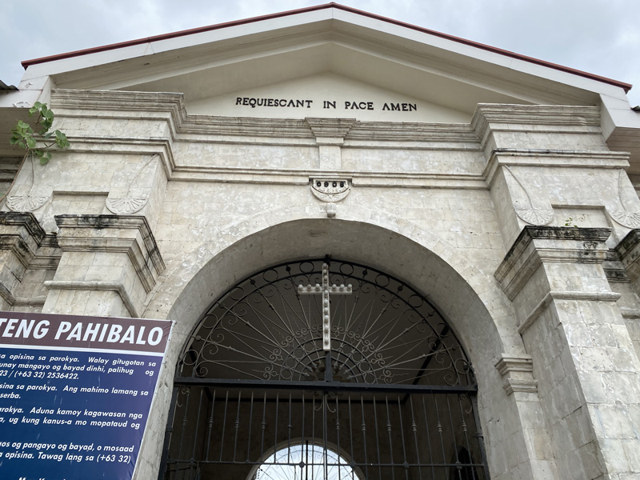

この墓の一区画とかに管理費をもらいながら家族で住んでいるそうです。

<msg txt="不法占拠しているのかと思った！！ 知らなかった！"></msg>

フィリピンの国民のほとんどがカトリック。お墓はもちろん西洋式で4面のうちまともな壁は一個くらいで残りは鉄格子です。

各おうち（お墓）の正面はこんな感じで、プライベートゼロです。

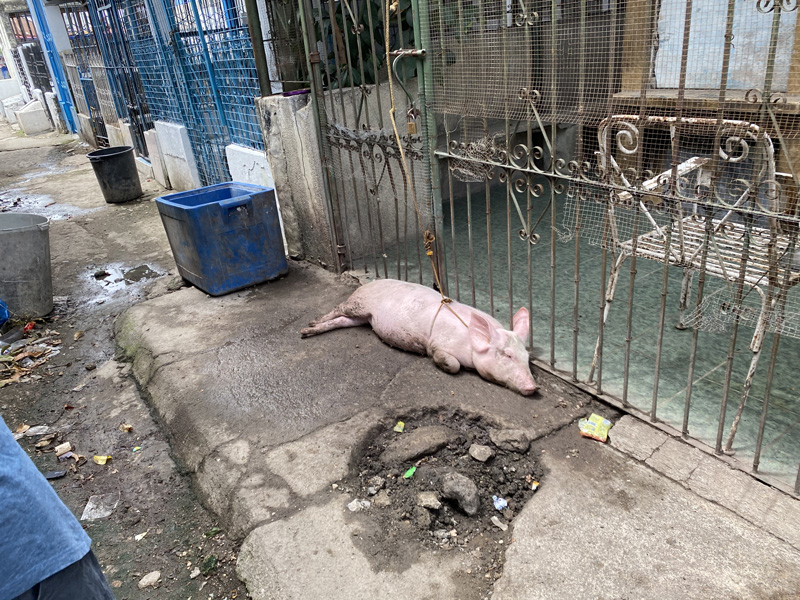
<small>※ 食用としてブタを飼われていました。。。</small>

最貧困スラム街の住人ももちろん、仕事を持っています。たまたま遭遇したお父ちゃんは墓石を彫ってました。 
「写真撮らせてくれ」ってお願いしたらめっちゃ恥ずかしがってましたが、最終的にはぎこちない笑顔で撮らせてもらえました。

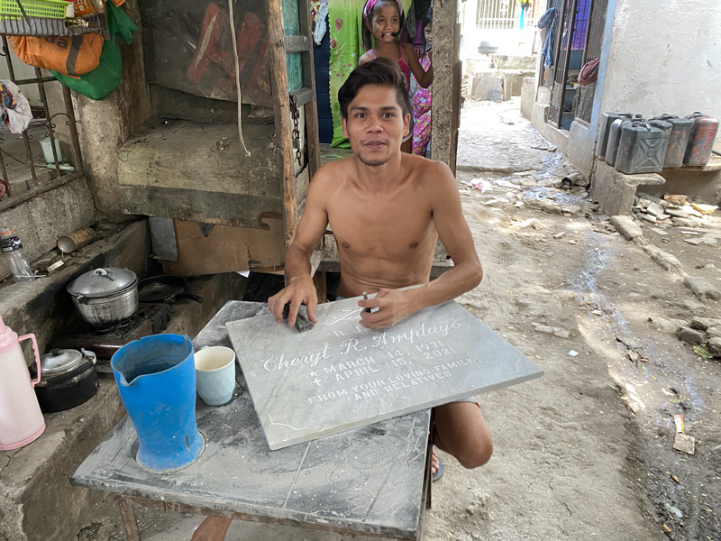

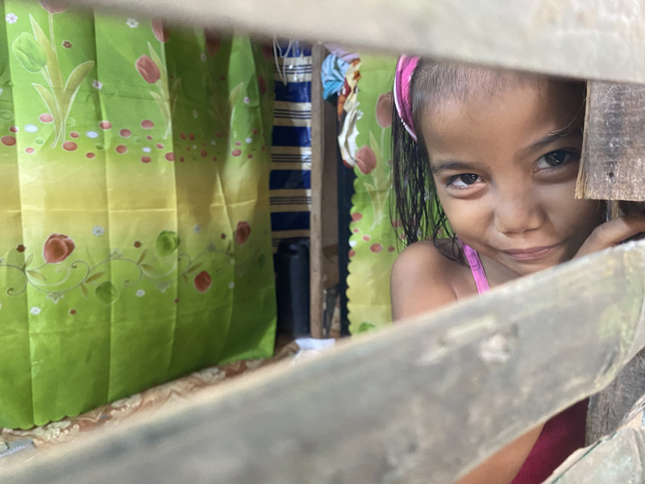
<small>※ 墓石職人の娘。おうちでおままごとらしきことをしていました。</small>

 子どもたち。カメラを向けられると嬉しいのか楽しいのか、必ずポーズを取ってくれます。

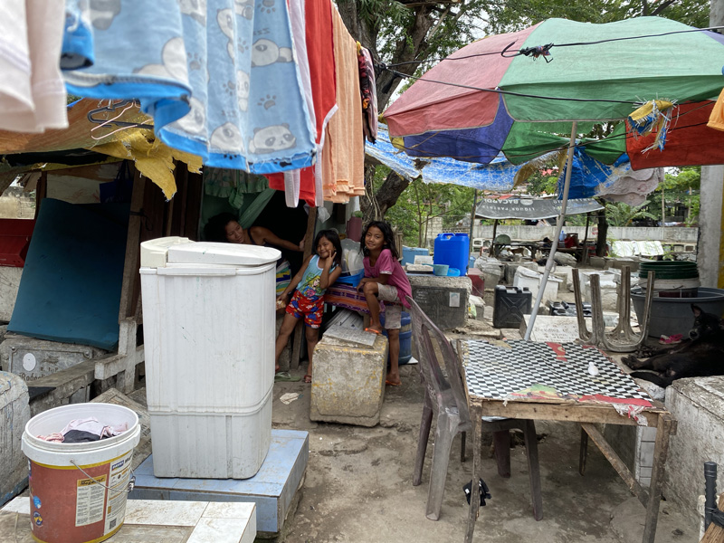

## ゴミを拾って生計を立てる人たち
フィリピンには*ゴミ山<small>(※1)</small>*付近に住み、ゴミをあさって（有価物回収で）生計を立てている人たちがいます。

ちなみにゴミ山に住む人たちは*スカベンジャー<small>(※2)</small>*と呼ばれています。

<small>※1 ゴミ山は元々ゴミ集積所。 ※2 語源はあまり良い意味ではないですが興味がある人は調べてみてください。</small>

 フィリピンのゴミ山と言えば首都マニラにあるスモーキーマウンテンが有名です。 [Wikipedia](https://ja.wikipedia.org/wiki/%E3%82%B9%E3%83%A2%E3%83%BC%E3%82%AD%E3%83%BC%E3%83%BB%E3%83%9E%E3%82%A6%E3%83%B3%E3%83%86%E3%83%B3)にも掲載されています。

ゴミ山に関する映画（ドキュメンタリー）もあります。

[BASURA バスーラ](https://amzn.to/3f9lOHl)

<small>※ BASURAとはタガログ語でゴミという意味です。</small>

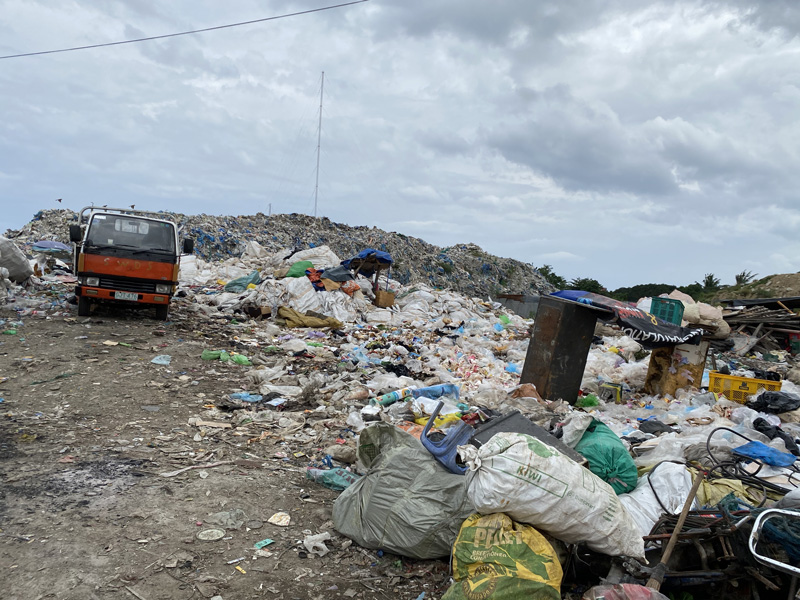

セブ島にも同様にゴミ山があります。私もそのひとつにお邪魔させていただきました。

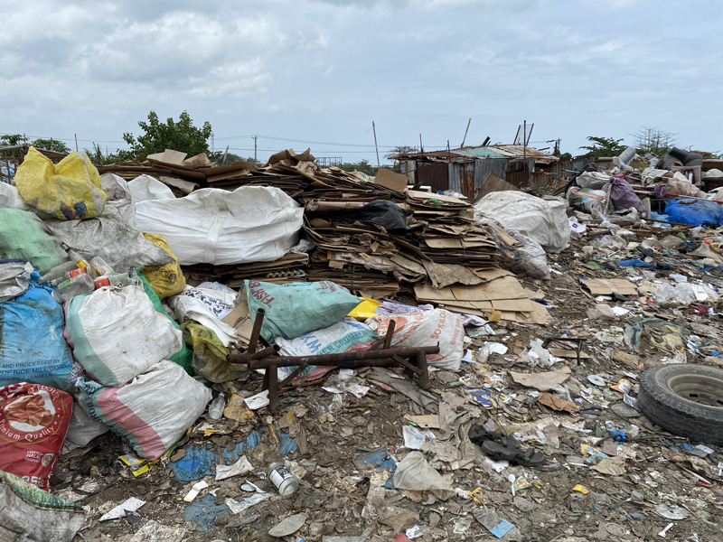

バン（車）を降りた瞬間、マスクの上からも悪臭を感じウゥッとなりました。

彼らはゴミを捨てられる前に、ダンボールや金属など売れるものを探します。 大人だけでなく、子どもたちもゴミ収集車に集っています。

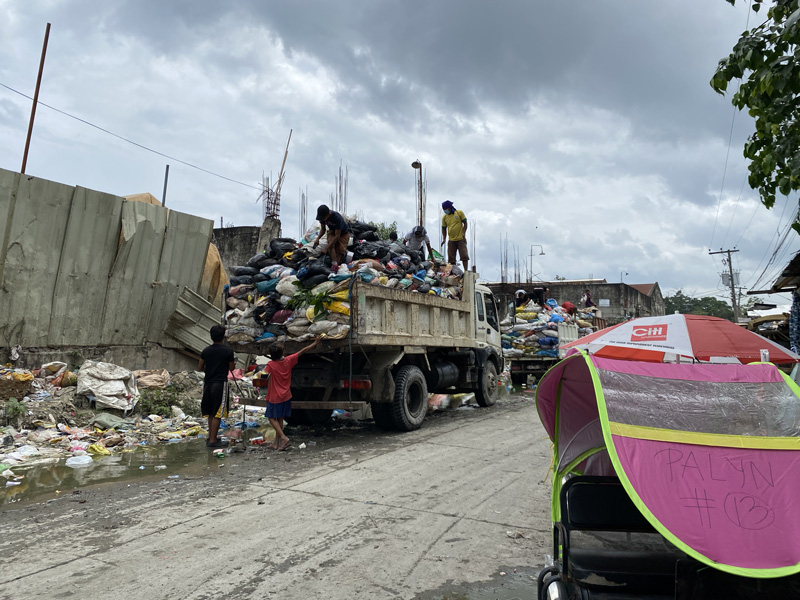

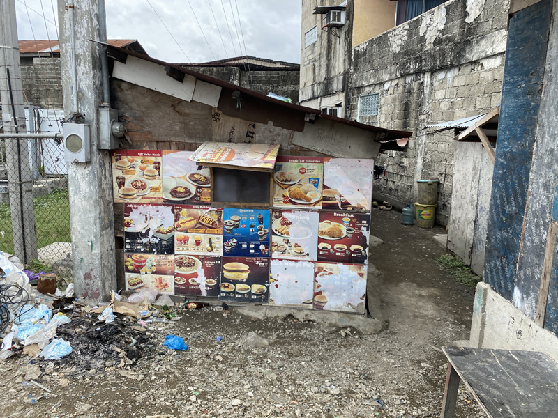

フィリピンではゴミをちゃんと分別しないので、有害ゴミや残飯も一緒くたに捨てられています。 彼らは売るものだけではなく、なんと*食物*も探します。

ファストフードなどの残飯を、油で揚げて（殺菌？）再利用して食べているそうです。

<msg txt="えええ〜〜〜〜〜〜！！ そんなもの食べてるの？？！！"></msg>

 **衝撃** でした。

理由は*食べ物がない*から、だそうです。

また勉強不足発覚だったのですが知りませんでした。。。。

 生活用水・排泄物ももろとも地面に流すせいかめっちゃ汚い水たまりがあちこちにありました。 もちろん、水道は通ってないので下水もありません。

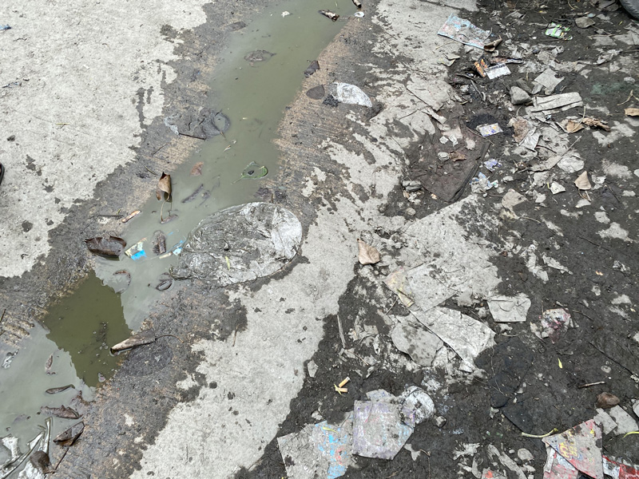

<small>※ この写真はまだマシなものを採用しています。</small>

 ちなみに生活用水は基本*井戸水*か*ためた雨水*を使うそうで、各家の前にでっかい樽がありました。

どこに行っても子どもたちは超笑顔。カメラを向ければ必ずポーズ。 この日はおままごと中でした。

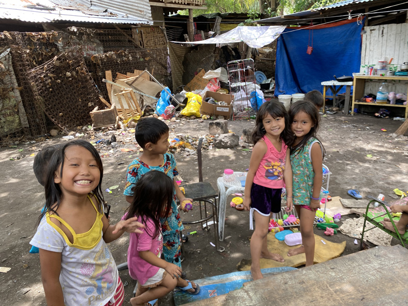

日本人からすれば劣悪な環境ですが、彼らはできることを精一杯しているように見えました。

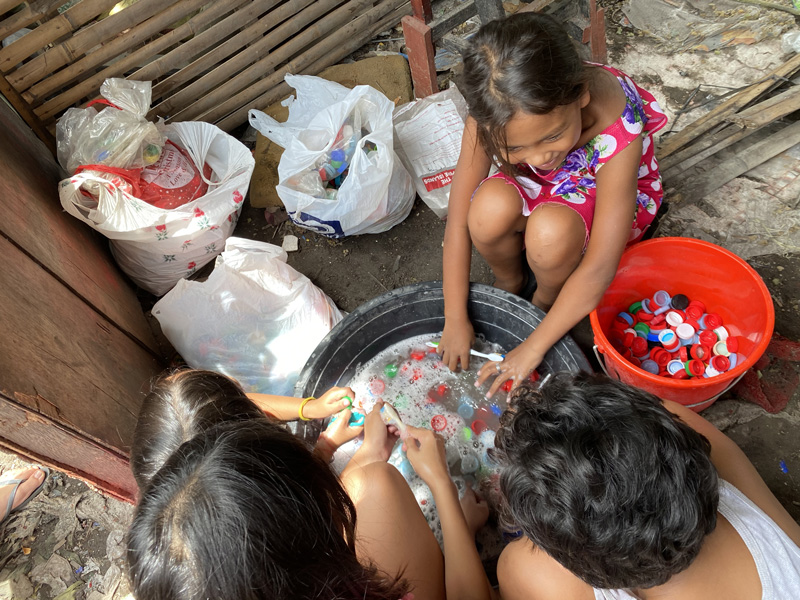

<small>※ 近日できる（現在完成）ラーニングセンターの飾り付けをお手伝いする子どもたち。</small>

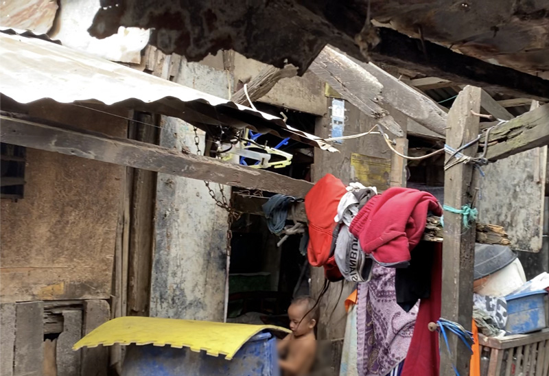

<small>※ 住宅の中の様子。乳幼児などの小さい子供はほとんど服を着ていない。</small>

この日、ゴミ山では子どもたちへサンダルを配布をしていました。

彼らはこの不衛生な中、裸足で過ごします。サンダルなどの靴類もありがたい物資です。

新しく新調したサンダルだからか、足を洗って履いている子どもたちがいました。

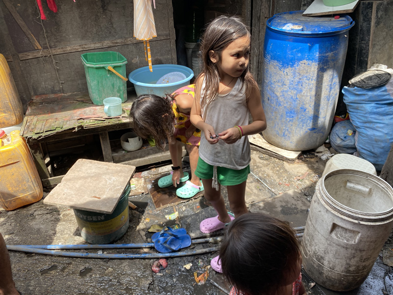

おばあちゃんやお母さんも子どもに新しいサンダルを履かせることができ、笑顔でした。

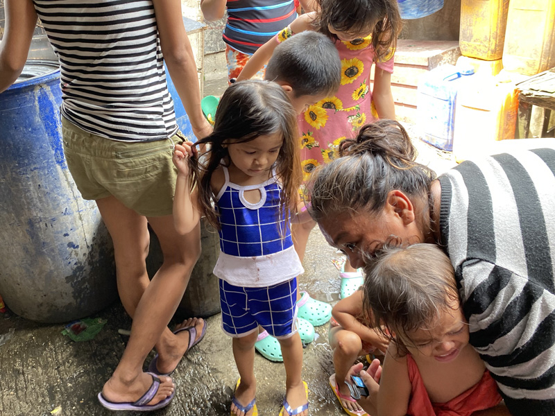

ちなみに何気に子どもたちがおしゃれな服を着ているのは、支援された洋服を着ているからだと思われます。

実際、この環境にミスマッチな洋服を着ている子どもとそうでない子、半裸から全裸まで混在していました。

## スラム街ではたくさんの子どもたちに出会った
同行中、たくさんの子どもたちに出会いました。

フィリピンではコロナのせいで2020年4月くらいから対面授業が禁止されています。

フィリピンは高校まで（13年間）は義務教育なので授業料タダです。

現在、子供達への授業はオンライン授業やプリント配布で対処しているみたいですが、ほとんどの最貧困層の家庭ではネットやパソコンなど授業を受けるための環境を用意できません。

今までかろうじて学校に通えた最貧困層の子どもたちは、オンライン授業を受けることができないので、ただ家にいるのです。

## この記事で伝えたいこと
今回感情をできるだけ排除して見たままを伝える努力をしました。

こんな記事を書いた理由があります。

ちまたで流れてる情報を鵜呑みにして「**フィリピン危険！**」の一言で片付けて欲しくないです。

少なくとも私は屈託のない笑顔の子どもたちを実際に見て、そんなこと言う気にはなれませんでした。

 もちろん、安全とも言いません。

 私もたった3年しか住んでませんので伝え方が正しいのかも分かりません。

この記事を読んで、フィリピン・セブ島をどう思うかはみなさん次第です。

ただ率直に、私の目に映ったセブ島の最貧困層の住むスラム街をご紹介しました。

## 最後に
**世界の一人でも多くの子どもたちが健康に大人になれたらいい**と思い「*子ども服をセブに送るプロジェクト*」を始めました。

私ができることは周りにいる人を手伝うことぐらいです。

私がこの活動をする目的はあくまで、**世界の一人でも多くの子どもたちが健康に大人になれたらいい**です。

どのNGO団が、とか体関係なく私の小さな力でもお役に立てるなら協力します。

そういう一個人の気持ちでこの活動していることだけ知ってもらえたら幸いです。

最後までお読みいただきありがとうございました。

  <h4>「子ども服をセブに送るプロジェクト」支援者の皆様</h4>
  
送料を送るためにご支援いただきましたみなさまありがとうございます！

  <ul>
    <li><a href="https://www.ec-cube.net" rel="nofollow noopner" target="_blank">株式会社イーシーキューブ 様</a></li>
    <li>ヤマモト コウ 様</li>
    <li>中村 亜夜 様</li>
    <li>満井 美恵 様</li>
    <li><a href="https://kdl.design/" rel="nofollow noopner" target="_blank">栗原デザイン室 様</a></li>
    <li><a href="https://tantan.work/" rel="nofollow noopner" target="_blank">TanTan 様</a></li>
    <li><a href="https://www.dream-tech.jp/" rel="nofollow noopner" target="_blank">ハッピーちゃい夢 様</a></li>
  </ul>
  <h4>洋服の支援元</h4>
  <ul>
    <li><a href="https://www.lynks.jp/t" rel="nofollow noopner" target="_blank">Lynks 様</a></li>
  </ul>

### おまけ・現在セブ島にある日系NGO団体
もし何か支援をしたいなと思った方は各団体のサイトを見てみてください。

* [Anya's HOME](https://sites.google.com/anyas.page/ngo-anyas/%E3%83%9B%E3%83%BC%E3%83%A0)
* [DAREDEMO HERO INC.](https://daredemohero.com/)
* [セブンスピリット](http://seven-spirit.or.jp/)
* [Glolea Cebu](https://gloleacebu.com/)

<small>※ 支援を斡旋している訳ではありません。支援活動をされる方はあくまで自己責任でお願いします。</small>

