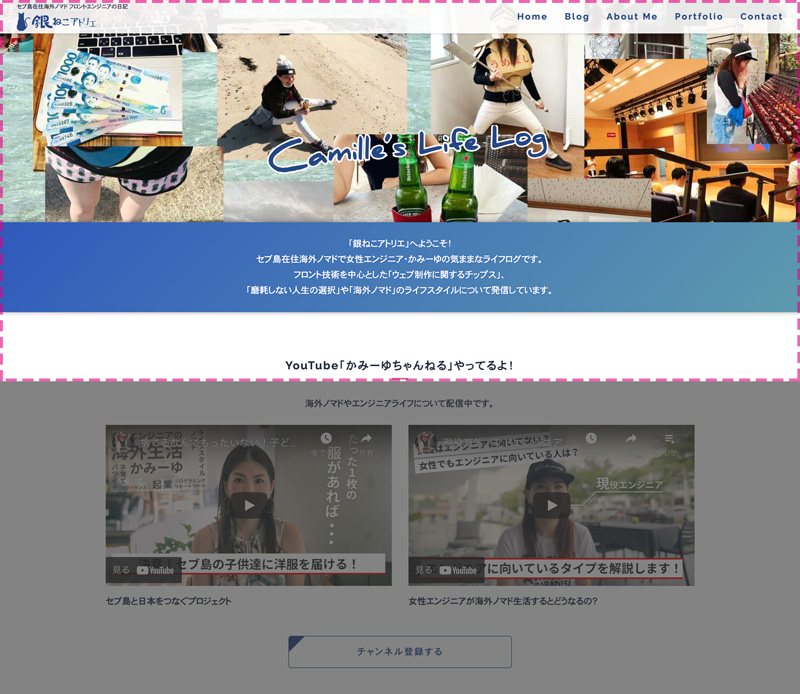
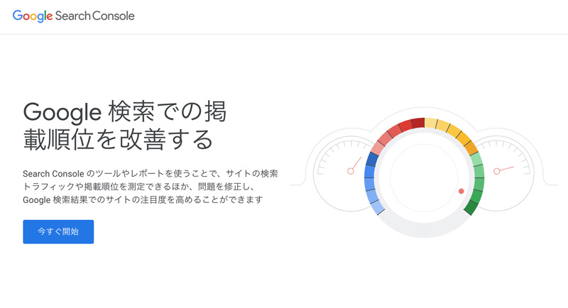

IT業界用語。

自分が正しく使えてるかも気になるところですが、一番感じるのはコレ。

かみーゆ

こんなわかりにくい言い回し、わざわざ使う必要ある？

10年業界いますが、最近「私はかぶれてないだろうか？」って不安に感じるようになりました。

と言うことでかぶれたIT用語10連発を紹介します！

## かぶれたIT用語10選

「重要度」「必要性」「使用頻度」を私の独断と偏見で評価してみました。

### ファーストビュー
*ファーストビュー*はWebサイトへ訪問した時に見ることができる、最初の可視領域です。

コンテンツの続きを読んでもらえるかに影響を与えます。だから、目を引く写真やキャッチコピーなど工夫する必要があります。

この説明、一般の方にはわかりづらい！

なので私はこんな感じで伝えるように配慮しています。

かみーゆ

ホームページ開いたら最初に画面いっぱいに見える部分です！

伝わりました？

  重要度: <em>★★★★★</em> 
  必要性: <em>★★★★★</em> 
  使用頻度: <em>★★★</em>

### エビデンス
証拠・根拠、証言、形跡などを意味する英単語・*evidence*。 
使い方はそのまんま「*エビデンスを残す*」です。

証拠を残すって言えば誰でもわかるのに、いつの間にかこんな小難しい使い方をするようになりました。

「証拠を残す行為」はめちゃ大事。

そういや、「*証拠を残す*」と「*エビデンスを残す*」だと言葉の意味がボヤけ、後者の方が多少柔らかい気もしないでもない。。。。

かみーゆ

なるほど！！ だから頻発しちゃうんだ！

そんな気づきもありました。

  重要度: <em>★★★</em> 
  必要性: <em>★★★</em> 
  使用頻度: <em>★★★★★</em>

### ITリテラシー
意味はITの読解記述力（literacy）という意味です。

「ITリテラシーがある、ない、高い、低い」のような使い方をよくします。

ざっくりいうとITリテラシーとは大きく3つの知識や技術の理解力を示します。

1. 情報を正しく使う能力や知識
2. コンピューターの知識や技術
3. ネットワークやセキュリティに関する技術的な知識

かみーゆ

どのくらいこの3つの基準を満たせば、ITリテラシーが高いって言えるんだろう。 あまり信用できないなあ。

「コンピューターの知識や技術」と「ネットワークやセキュリティに関する技術的な知識」がどんなに長けた人間でもSNSで情報漏洩するような場合、ITリテラシーが必ずしも高いと言えないかもしれませんしね。

個人の感覚や意見に左右されそうなので、あまりあてにできない基準とも思いました。

  重要度: <em>★★★</em> 
  必要性: <em>★★</em> 
  使用頻度: <em>★★★</em>

### EC
EC（eコマース）とは*Electric Commerce*の略で**電子商取引**のことを指します。

基本この言葉は同業者同士とかでない限り私は使いません。

疎い方には*ネットショップ*とざっくり伝えるようにしています。

 ところが、これすら私のおかん世代は分からないんですよね。。。

なので、以前はインターネットで物を買うと言っていました。

最近は配送の箱にAmazonと書いてあるので*アマゾン*と言うようになりました。

ちなみに英語で「インターネット検索すること」を「*google it*」と言いますが、いつか「*amazon it*」という日も来るかもしれませんね！

  重要度: <em>★★★★</em> 
  必要性: <em>★★★</em> 
  使用頻度: <em>★★★</em>

### アサイン
*asign*とは割当という意味です。

IT業界では何かのプロジェクトに人を投入するときに使います。

私は職業柄普段からソースコードを見ているせいか、個人的には*height*とか*align*など、間に発音しないgが入る単語が好きです。

私は飲み会や合コン（最近ではライトな飲み会って言うそうですね）の計画でも使います。

  重要度: <em>★</em> 
  必要性: <em></em> 
  使用頻度: <em>★★★★★</em>

### アジェンダ
会議で論ずる事項（議題）の表。最近では課題項目のことを指します。

アジェンダという言葉が使われるようになったのは、1992年にブラジルで開催された地球サミットだといわれています。

現在ではこぞって使うようになりました。

ぶっちゃけ「**議題でいいじゃん**」って思います。なんで無理くりこんな小難しい言葉使うんですかね？

余談ですが洋菓子と一緒に並べて言ってみると違和感ないことにも気付きました。

かみーゆ

クイニーアマン、アジェンダ、ミルフィーユ、ザッハトルテ、タルトタタン...

  重要度: <em>★</em> 
  必要性: <em></em> 
  使用頻度: <em>★★★</em>

### アサップ、なるはや
「**ASAP**」=「*as soon as possible*」

「**なるはや**」=「*なるべく早く*」

と意味です。

定量的じゃないこの言葉、個人的には*法律で禁止すればいい*と思っています。

「ASAPでやります」という人で、早くやってる人をぶっちゃけ見たことないですもん。

  重要度: <em></em> 
  必要性: <em></em> 
  使用頻度: <em></em>

### デスマーチ（デスマ）
直訳すると「*死の3月*」。

日本のWeb制作業界では3月は決算期で予算を使うため、繁忙期になりがち。

ゆえに、仕事の終わらない日々が続きます。

言い方を変えると「**炎上**」ですが、時期関係なくそんな状態が続くことも*デスマ*って言う事もあります。

かみーゆ

プログラマーやエンジニアやってると一度は体験するツラいシチュエーションです。。。

ついでに言うと、*25時*と言う言葉もあります。

世の中から*デスマ*がなくなったら幸せになれそうです。

  重要度: <em>★★★★★</em> 
  必要性: <em></em> 
  使用頻度: <em>★★★★★</em>

### レスポンシブ
iPhone、パソコンなど機体（ディバイス）が違っても、HTMLコードは1つ。幅の大きさに応じてデザイン（CSS）を切り替える手法を*レスポンシブ対応*と言います。

このレスポンシブの説明、超長くなるので、理解してもらえるとその後の話がしやすくなりますね。

勢い余ってレスポンシブ*ル*、と言ってしまう人もいます。

  重要度: <em>★★★★★</em> 
  必要性: <em>★★★★★</em> 
  使用頻度: <em>★★★★★</em>

### ジョイン
*join*。中学生ぐらいで習う単語だと思いますが、参加するって意味です。

これも入社や参加でいいんじゃないでしょうか。。。

みなさん、、、要ると思う？？？

  重要度: <em></em> 
  必要性: <em></em> 
  使用頻度: <em></em>

### 番外だけどおまけ・サチコ

[Google Search Console](https://search.google.com/search-console/about)

サチコとはGoogleの提供するサービス・サーチコンソールの略です。

Webサイトがどんなキーワードで検索されているか、そのキーワードで検索順位どのくらいかを調べることができるツールです。とても便利です。

ちょっと長いのでサチコと呼ばれるようになりました。

ちなみに*Google社員はサチコと呼ばない*そうです。

それでも私は愛着を込めて常に「サチコ」って呼んでいます。

  重要度: <em></em> 
  必要性: <em></em> 
  使用頻度: <em>★★★★★</em>

## まとめ・恥ずかしさを認めて「脱・かぶれ」
私が普段使っていて、よくよく考えると伝わりにくいなーと思っている言葉を厳選して紹介しました。

独断と偏見も入ってますが改めて評価してみると、ほとんどの用語に必要性を感じられませんでした。

とくにアサイン、アジェンダ、ジョイン、エビデンスあたりは頻発しちゃうとかぶれっぷりが炸裂しますね。

かみーゆ

私、めっちゃ使ってるわ。。。 ダサい人間だったなぁww

集めてみて、ただでさえ分かりにくい業界なのに日本語で済む言葉を横文字にするから、とっつきにくい業界になるんだろうとしみじみ思いました。

 私のプログラミングの師匠によく言われていたのが「*用語を正しく使う*」、です。

おかげさまで、「本当に意味があってるの？」と思ったら即調べるようになりました。

かっこいいからという理由でなんとなく使ってる人、「アレ？意味間違ってるよ」って思われちゃうかもので注意です。

もちろん私も気をつけます。

最後までお読みいただきありがとうございました。
