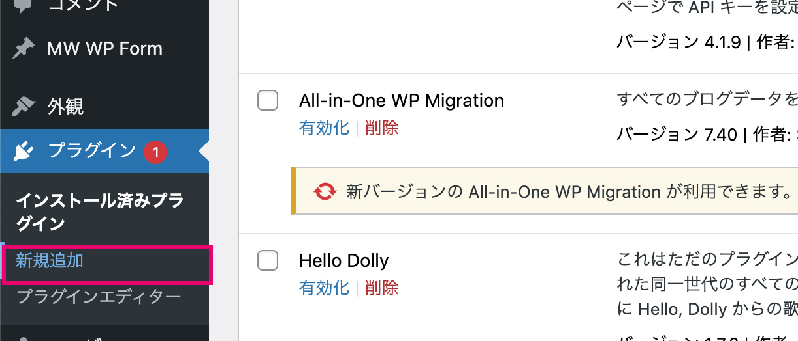
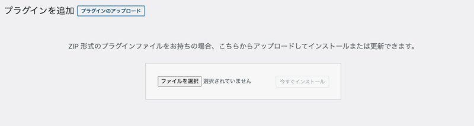
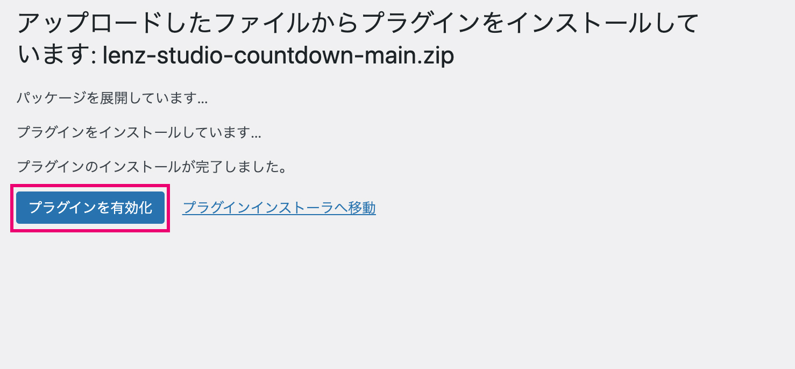
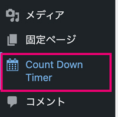
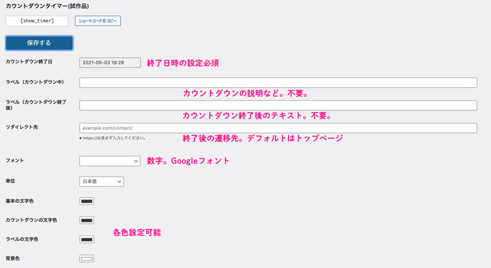
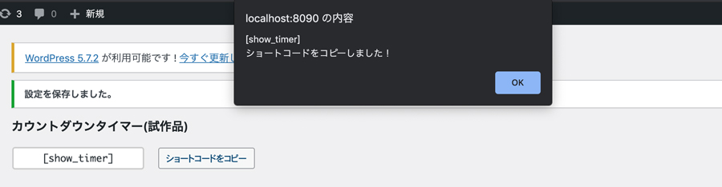
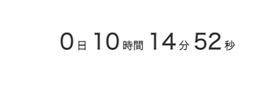
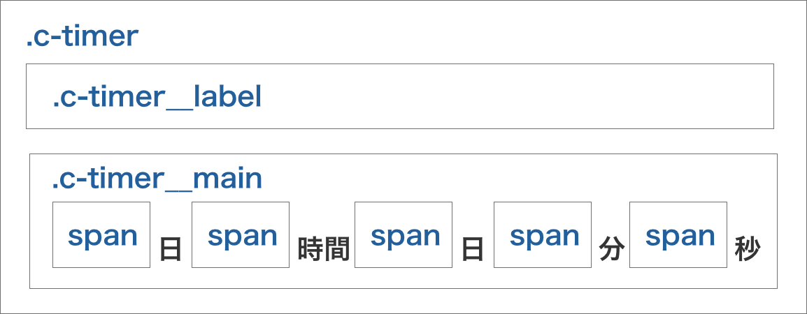
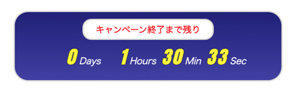

WordPressのプラグイン・カウントダウンタイマーの試作品を作りました！無料でご利用いただけます。この記事では使い方の他、プラグイン誕生秘話なども綴ってます。

<prof></prof>

<toc id="/blogs/entry468/"></toc>

## どんなことができるプラグイン？
カウントダウンタイマーは終了時間を設定し、ショートコードを貼るだけでカウントダウンタイマーを設置できるWordPress専用のプラグインです。

コードが書けなくてもフォントの種類や文字の色など、気軽に編集してオリジナルのタイマーを作成できます。

終了したら、任意のページにリダイレクトされます。


<small>※ 終了後、カウントダウンタイマーを設置したページにユーザーはアクセスできなくなります。</small>

まだプロトタイプ（試作品）段階です。いろんな人に使ってみて欲しいのでとりあえず無料で配布します。

<msg txt="使ってみて、いろんな意見ください！！！"></msg>

<small>※ IE未対応です！！※ 多少バグがあるかもしれません！※ 個人の責任で使ってね❤️</small>

## カウントダウンタイマー使い方
カウントダウンタイマーの使い方です！！

インストール方法から説明します。


### GitHubからダウンロード
まずはGitHubからZipファイルをダウンロードします。

[GitHubリポジトリ|yuririn/lenz-studio-countdown Timer](https://github.com/yuririn/lenz-studio-countdown)

[カウントダウンタイマー DL](https://github.com/yuririn/lenz-studio-countdown/archive/refs/heads/main.zip)

WordPressの管理画面、プラグイン、新規追加をクリック。



プラグインの追加から、プラグインのアップロードをクリック。ZipファイルをそのままUploadします。



プラグインのインストールが完了したらプラグインを有効化します。



プラグインが有効化されたらWordPress管理画面のメニューに「Count Down Timer」の項目が追加されます。



### 各種設定
現在の機能は以下の通りです。



|項目|説明|
|-|-|
|カウントダウン終了日|終了日時を設定可能|
|ラベル（カウントダウン中）|カウントダウン中に表示する文字です。不要な場合は空にしておいてください。|
|ラベル（カウントダウン終了後）|カウントダウン終了後に表示する文字です。不要な場合は空にしておいてください。|
|リダイレクト先|カウントダウン終了後に遷移させたいページを設定します。設定していない場合はトップページに遷移します。|
|フォント|Googleフォントからいくつかフォントを選べます|
|単位|時間の単位の表示方法を選べます|
|基本の文字色|基本の文字色です。#333333がデフォルト。|
|カウントダウンの文字色|数字の文字色です。#333333がデフォルト。|
|背景色|カウントダウンタイマーの背景色です。#ffffffがデフォルト。|
|高度な設定|CSSでスタイル変更できます。|

### 設置したいページにショートコードを貼り付け

ショートコードをコピーし、お好きなページに貼り付けてください。


デフォルトのデザインはこんな感じです。


[各種設定](#各種設定)の項目を参考にお好みで、ラベルを追加したり、色やフォントを変更してみてください。


### 上級者向けCSSのカスタマイズ
CSSが書ける方はスタイルを追加することもできます。

htmlはこんな感じで組んであります。



下の方にCSSのコードを追加できます。

テキストエディターを導入しているので多少は書きやすいかと思います。`"`や`'`などは使えないので注意してください。


ちょっとダサいけど、カスタマイズ例です。



グラデーションしたいときは、ジェネレーターを使うと便利ですよ。

[CSS Gradient](https://cssgradient.io/)

CSSの実装サンプルはこちら。

```css
.c-timer {
  background: rgb(34,34,134);
  background: linear-gradient(180deg, rgba(34,34,134,1) 0%, rgba(72,72,176,1) 100%);
  border-radius: 30px;
  box-shadow: 0 0 5px rgba(0,0,0,.5);
}
.c-timer__main {
  font-style: italic;
}
.c-timer__label {
  display: inline-block;
  border-radius: 20px;
  background: #fff;
  box-shadow: inset 0 0 5px rgba(0,0,0,.5);
  color: red;
  padding: 5px 30px;
  font-weight: bold;
}
.c-timer__main span {
  text-shadow:0 0 2px rgba(0,0,0,.9);
  letter-spacing: .1em;
}
```

## なんで「カウントダウンタイマー」プラグインができたの？
3月ごろからマーケティングの勉強のために、YouTubeチャンネル・[ジュンイチの【デジマ研究所】](https://www.youtube.com/channel/UCPxJNYI1RbIz0znMvlzJ5CA)を視聴するようになりました。

どの回だったか忘れましたが、「もっと便利なカウントダウンタイマー欲しいなぁ」ってジュンイチさんが言っていたのがヒントになりました。

<msg txt="へーーー！こんな要望があるんだ！！<br>じゃあプロトタイプ（試作品）作ってみたらおもしろそう。<br>よっしゃ作ってみよう！"></msg>

実は目からウロコでした。

開発側では思いもよらない物がユーザーは欲しいんだって気づきました。

何よりも実際作ってみたらとても楽しかったです！！

## ということで、かみーゆ開発工房始めます
クリエイターは「こんなのいいな」、「あったらいいな」の要望に答えることはできます。

ただ個人などでがっつり頼むとちょっとした機能でもお金がめっちゃかかるじゃないですかww？

かといってフリー（無料）のプラグインだとちょっと機能的にマッチしないというか、物足りないというか。

そこである程度の人が使いたいものを作ったら、安く提供できるかと思った次第です。

<msg txt="ということで、WordPressのプラグインやWebパーツを販売する「かみーゆ開発工房」始めます！！"></msg>

みんなの要望に応えて、「あったらいいな」「こんなの欲しいな」を開発します。

要望があれば[Twitter](https://twitter.com/LirioY)や[お問い合わせフォーム](/contact/)から受け付けます！

* 欲しいもの：
* 欲しい理由：
* ニックネーム：

もちろん、期間・難易度などの関係で「こりゃ開発無理！」ってのもありますのでご了承ください。

中から作れそうなもののみ、プロトタイプ（無料）を作るのでぜひ使ってください。

また、このサイト内にかみーゆ開発工房のコーナーも作りますので少々お待ちください。

## まとめ・プラグイン開発は楽しかった！
自分1人の考えだったら「こんなの欲しい？」って思っちゃいますが、いろんな人の意見を聞いて何か作るのって楽しいですね！！

引き続き、ユーザーの声を拾っていろんなものを「かみーゆ開発工房」で作成していこうと思います。

最後までお読みいただきありがとうございました。
