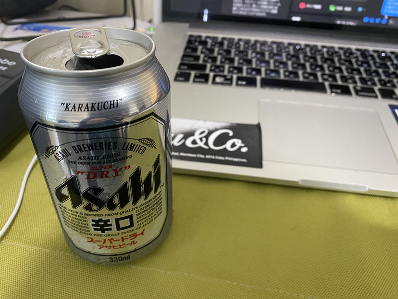
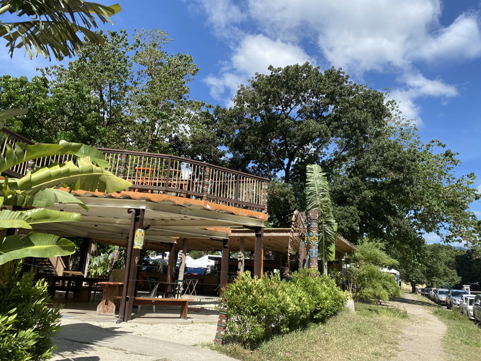
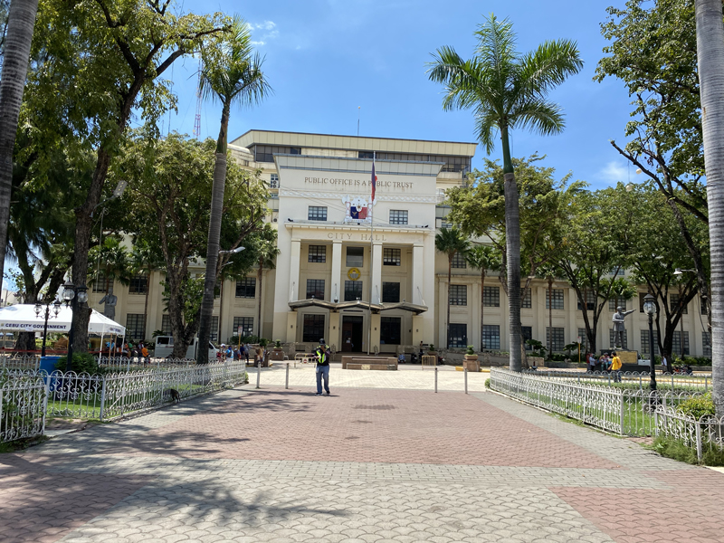
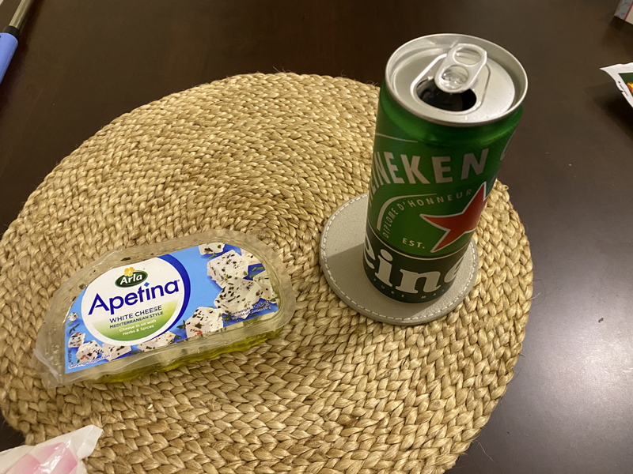

## 海外ノマドを始めて変わったこと
会社を退職し3か月のんびりして、今年になって仕事をし始めました。

3か月プーをしている間には、もちろん日本に帰って就職しようかなーとかも考えました。

帰るの面倒だしもう少しこっちにいようかなーって思ってる時に、こっちでビジネスをしよう話がありました。

あ、ちなみに現在のフィリピンからの日本への帰国は地獄です。

<card id="/blogs/entry422/"></card>

 とりあえずビジネスが始まるまでの準備期間、食べるだけ働こうと思って始めたのが、
 ・
 ・
 ・

いわゆる**海外ノマド**です。 

と言うことで、まだのびのびマイペースにセブ島で暮らしています。

 振り返ると日本での人生って

*忖度*、*評価*、*競争*。

とかの「*ねばならない*」の繰り返しだった気がするんですよね。

 私、まだまだ40歳そこそこですが

<msg txt="ぶっちゃけその繰り返しで、死ぬほどうんざりしたのよね。 なんか、日本戻りたくないなあ。"></msg>

今はこちらでビジネスの準備中なので、現状できる範囲で仕事をしています。

結構焦らず、のんびり。

 惰性でなんとなく始めた海外ノマドですが、良かったと思うことがあったのでご紹介します。

### 思い込みから解放された
会社や組織にいてコミュニケーション取り続けていた頃は、「*ねばならない*」「*普通こうすべき*」とか、よくわからない思い込みで頭がいっぱいになってました。

 ところが今の私はこんな感じ。

* 1日8時間拘束されることはほぼない
* 寝癖のまま仕事
* 疲れたら仕事中でも寝る
* 仕事で煮詰まったら、あーー！って言いながらベッドにダイブ
* 平日仕事の合間に仲間や友達と昼から酒も飲む

 怠惰極まりないと怒られてしまいそうですww

今まで「**すべき**」って思いっていたことは、*何1つしなくても生きていける*ことだったと気付かされます。

### 評価されないから気が楽（ラク）になった
会社だと査定されたり評価されるから、お金のために頑張らないといけないですよね？

だから、私の**大嫌いな競争**もしないといけない。

バツイチ子持ちで育児中をしている若い頃は、とくに息苦しかったです。

 そんな中気づいたことがあります。

<msg txt="あれ？ちょっと待って。評価って人間が決めませんか？ 本当にその評価定量的？本当に公平なんですか？"></msg>

私の偏見もあるかもですが、総じて評価って**評価する人の利害につながることが多かった**気がします。
 だから評価される側の*ほとんどの人が忖度しちゃう*んでしょうね。

昔から私それがイヤで「**ご機嫌とりしながら競争するレールから外れたくて仕方なかった**」です。

 案の定、やめた瞬間見事に解放されました。

### 付き合える人が選べるようになった

会社や社会だと苦手な人とも付き合わないといけないけど、付き合う必要がなくなりました。

私めっちゃ苦手なタイプがあります。

* 搾取する人
* マウントする人
* 実害のある人

 悲しいかな大きな組織に行くと、絶対とは言いませんがこの3タイプの誰かいます。

過去の自分は、理不尽に腹が立っていつも反抗していました。

でも気づきました。

**誰かを変えることができると、思い上がってること自体が*愚か***です。

  自分が変えられるのは自分くらい。

<msg txt="苦しい状況に甘んじるのも自分の責任。 現状が耐えられないなら、耐える必要もないし、イヤなら自分が去ればいいんです。"></msg>

結果闘う必要もなくなり、解放されました。

変な憤りにエネルギーを使う必要がない分、前向きな方に力が注げるようにもなりました。

 エネルギーはいい方向に使いたいですよね！

エネルギーが余った分、他の周りの人をより大切にできるようになりました。

### いい仕事ができるようになった

海外ノマドを始めて、人だけじゃなく仕事も選べるようになりました。
 無理しないから体もしんどくないです。

いいことはそれだけじゃないです。

実は大好きなクライアントのために仕事をするって*めっちゃ貢献してる実感がある*んですよ。

ダイレクトに感謝されたり、喜ばれたりするのは、**お金以上の報酬**だったりします。

仕事が楽しくなりました。

<msg txt="人生のほとんどの時間って仕事してますよね？ その間が幸せだったらサイコーじゃないですか？！！"></msg>

## おわりに

元々、MacBookプロとスーツケースだけで生きていこうと日本を飛び出しました。

この先は*手放す人生*と決めていましたが、
物だけでなく人間関係も手放せば雑音が聞こえなくなる。

海外ノマドをしなければ気づかなかったかもしれません。

 誰かの言うことに翻弄されたり、ねばならないとか思い込んで、**人生を複雑にしているのは自分**なんですよ。

 会社を辞めて少し経済的に不安でたが、

そんなくらいじゃ**人生は終わらない**です。

大した問題じゃないんですよね。

 人間ってどうにか生きていけるもんです。 
高卒、若くしてデキ婚、30代バツイチ子持ちでエンジニアに転身できたんだから、多分できる。

 なんとなく惰性で海外ノマド始めましたが、 
人付き合いをギュッと減らした結果、穏やかで充実した日々を送れています。

 人生も仕事も想像以上にシンプル。

 こんなことに気づかせてくれたセブでのたくさんの出会いに感謝します。

最後までお読みいただきありがとうございました。
