## セブ博物館とは？
セブ博物館は、ビジネスパークのアヤラモールから車で10分くらいのところにあるセブの州立歴史博物館です。

*Sugbo（スグボ）*とはセブの古い呼び方です。 Museo Sugbo（ミューゼオ スグボ）という名前は*スペイン語でセブ美術館という意味*で、スペイン統治時代の名残です。

元々刑務所で囚人が収容しきれなくなったから、博物館として生まれ変わったそうです。

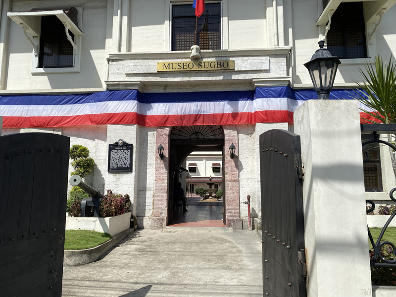

現在（2021年6月時点）では平日の10時〜15時までしか開いておらず、来館前にフォームを送る必要があります。1時間しか滞在しちゃいけない、とか来館に際して注意点はたくさんあります。

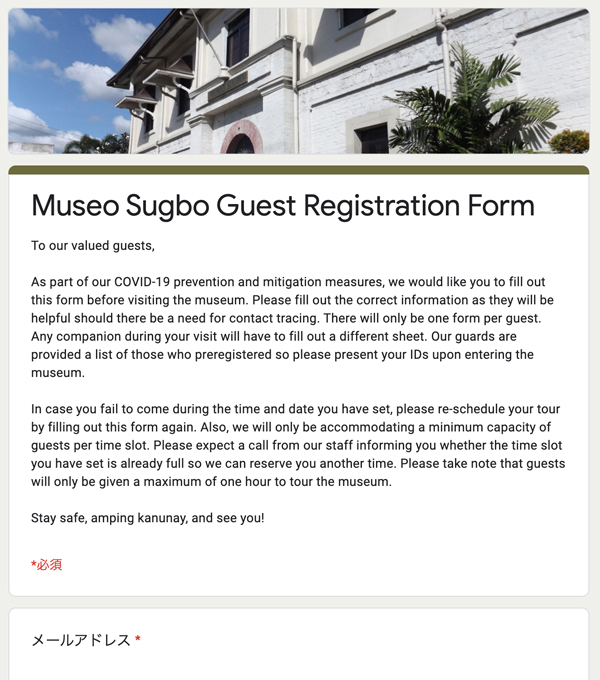

<iframe src="https://www.google.com/maps/embed?pb=!1m18!1m12!1m3!1d3925.4747563900437!2d123.90454381479664!3d10.3038377926432!2m3!1f0!2f0!3f0!3m2!1i1024!2i768!4f13.1!3m3!1m2!1s0x33a9995d0cc81291%3A0x738f7a9587e3cb62!2z44K744OW5Y2a54mp6aSo!5e0!3m2!1sja!2sph!4v1623844117266!5m2!1sja!2sph" width="600" height="400" style="border:0;" allowfullscreen="" loading="lazy"></iframe>

 当日、たまたま運良くジプニーが通っていて、アヤラ付近から10ペソでいくことができました。

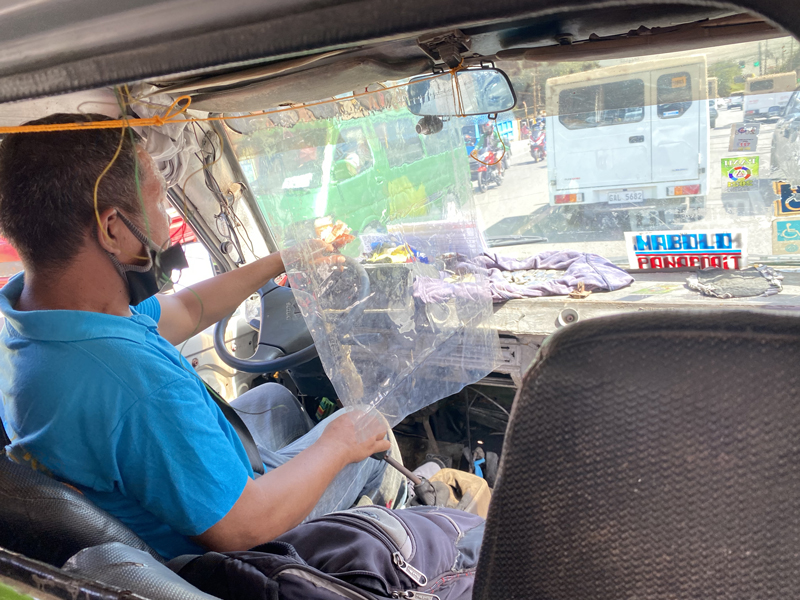

以前ジプニーといえばすし詰でしたが、現在はソーシャルディスタンスで快適に乗車できます。 ビニールで仕切られてます。

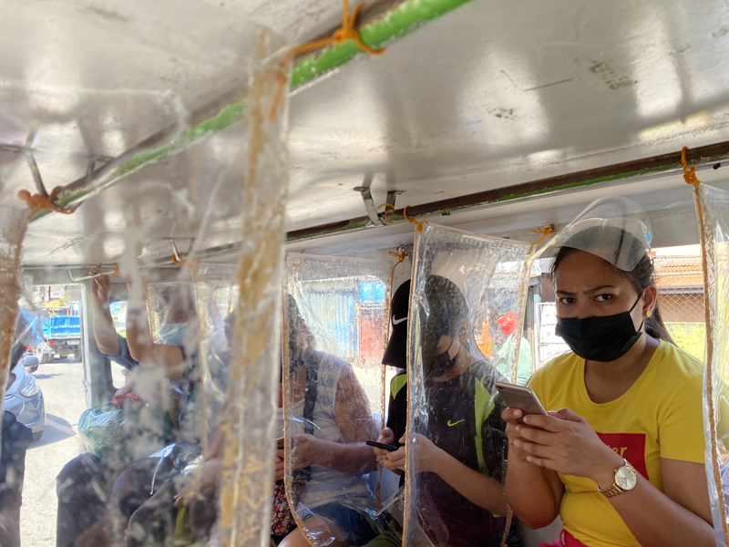

### フィリピンの大衆的乗り物ジプニーについて
ジプニーは大きなバンのようなフィリピン大衆的乗り物で、冷房はなく座り心地も最悪です。ただ安いです。1回の乗車わずか10ペソ前後です。

スリなど小さな犯罪などに巻き込まれやすいので、私はあまり1人で乗らないようにしています。もちろん、治安がぐっと悪くなる夜は使いません。

コロナでロックダウンになりしばらく走ってませんでしたが、最近ようやく乗れるようになりました。

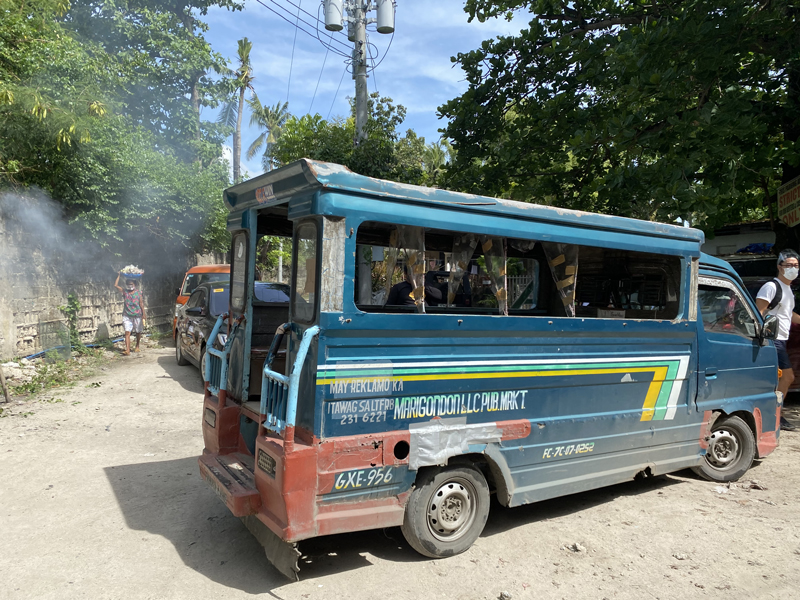

## フィリピンの歴史は大きく分けて4つ

セブ博物館で見られるのはフィリピンの歴史は大きく分けて4つです。

4つの部屋に展示が分けてあります。

* *植民地前* ... 植民地前の古代の時代
* *スペイン植民地時代* ... マゼランが来た後。フィリップ2世による統治。
* *アメリカ植民地時代* ... 近年フィリピンの英雄が生まれる
* *日本植民地時代* ... 第二次世界大戦で日本が統治していた時代

こうみるとフィリピンって支配され続けられてるんですよね。。。

### 古代フィリピンは金などの鉱物が眠った豊かな国だった

古代フィリピンにも石器や土器が眠っていて出土しています。

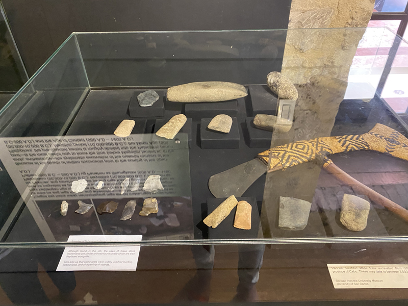

右側にあるめっちゃ綺麗な斧は石製です。

かみーゆ

私、こういうのが見たかった！！！

出土した土器はBC（紀元前）1500年から900年のもの。

ちなみに日本の縄文時代はBC3000年、弥生時代がBC100年くらい。

豊富な鉱物（ミネラル）、とくに金と近隣の中国やベトナムなどと貿易をしていたそうです。陶器や仏っぽいものがやたらあります。

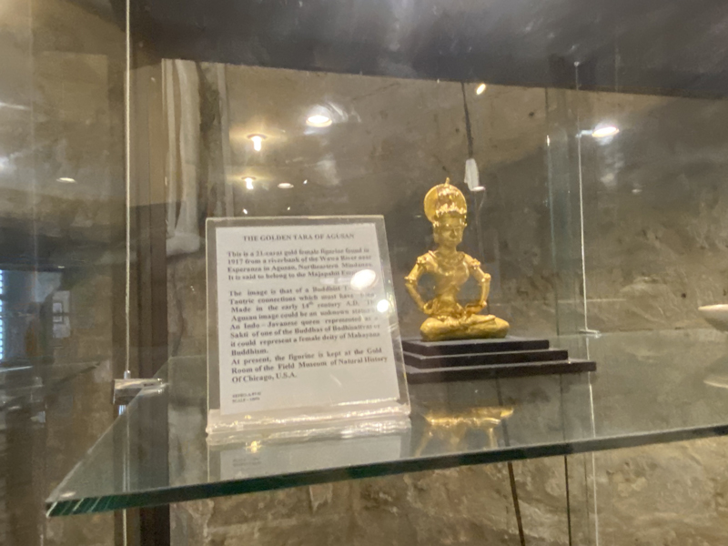

<small>※ ゴールデン アグサン像。めっちゃ仏教っぽい。</small>

 こちらはフィリピンの伝統的な家・Bahay kubo（バハイ・クボ）です。竹製のお家です。

高床式住居です。

この構造の理由は家を移動するためと、床の下で家畜を飼うから、だそうです。

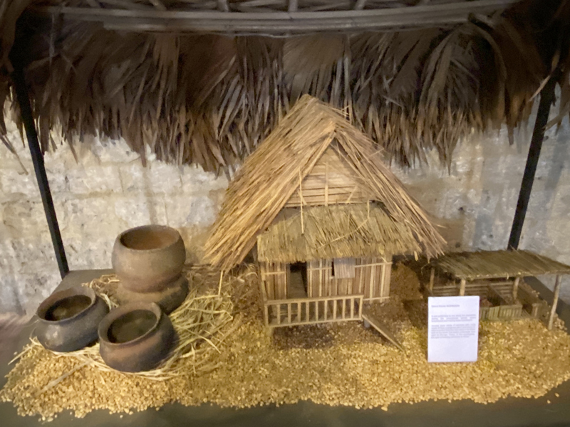

Bahay kubo（バハイ・クボ）・家を持ち運ぶことをBayanihan（バヤニハン）というんだとか。20人程度で運ぶらしいですけどもう廃れてしまった風習で今は行われてないそうです。

 こちらはKabog（カボク）という雑穀です。今みたいにお米がなかった頃の主食です。

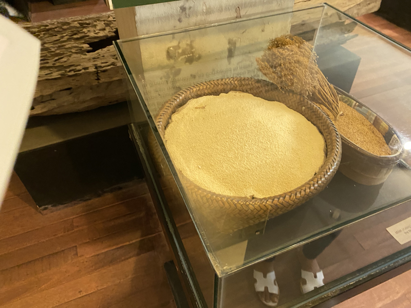

 そしてこれは船？かと思いきや人が死んだら川や海（？）に流すためのものだそう。土着の宗教や文化があったんでしょうね。

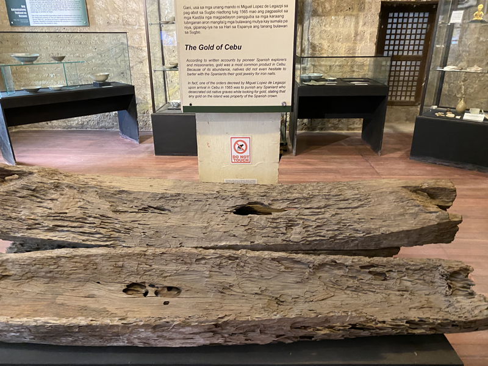

スペイン植民地時代が長かったせいか、記録があまり残っていないので残念です。でも、古代ロマンを感じました。

### 2人の現フィリピンの王（族長）とスペイン統治
大公開時代（1500年前後）ですね！私の大好きな時代です。

セブ島はかの有名なマゼラン（セブ島でマゼランと言ったら100%通じません）が果てたちでもあります。

私は世界史で習ってるかもですが、マゼランがどこで死んだとかすっかり忘れてました。

1521年マゼラン率いるスペインは一度、セブ周辺を支配しようと試みたけど、ラプラプ王率いる現地の部族に戦いで負けました。

 この時代、東南アジアはヨーロッパ人によるコロニズム（植民地化）が盛んでした。

なので**アジア侵略に対して立ち上がった最初の東南アジア人・*ラプラプ王***は英雄とされています。

 一方同じように族長の1人フマボン王という人物もいます。彼は逆に血の誓い（お酒かなんかにお互いの血を混ぜて飲むやつ）とともにスペイン人を迎え入れました。

フマボン王の王妃Juana（フアナ）にはSanto Nino（サントニーニョ）・子供のキリストをマゼランから授かったと言われてます。

この出来事を讃えるのがシヌログ祭りです。セブ1大きなお祭りです。サントニーニョは崇拝され、フマボン王ととファナ王妃2人とも未だフィリピン人には慕われています。

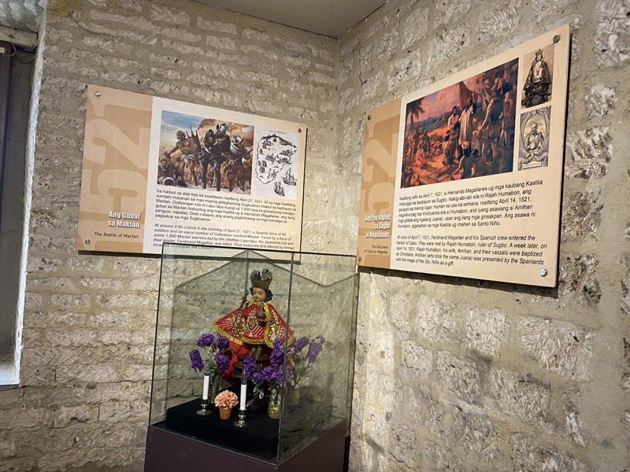

マゼラン襲来から約20年後、スペイン人がまたやってきて本格的に植民地化されてしまいます。

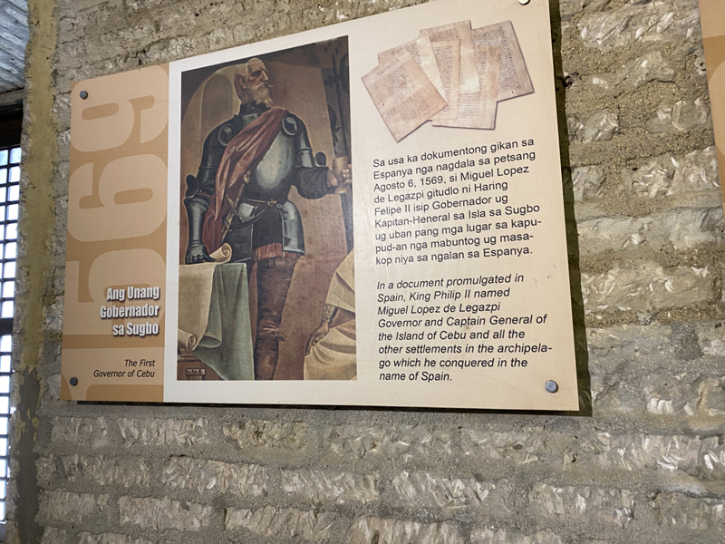

ここからフィリピンは300年以上のスペイン統治時代が続きます。プランテーション。多くのフィリピン人は小作人として重労働を課せられます。

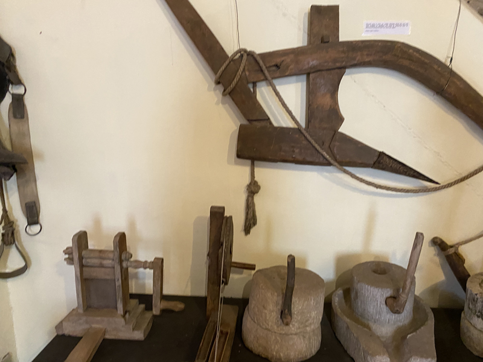

### KKK、スペインからの独立。そしてアメリカ時代。
セブシティーのマボロという地区にボニファシオという街があります。

革命の英雄アンドレス・ボニファシオから由来しています。

彼は19世紀スペインから独立するために*KKK*「Kataastaasang Kagalanggalangang Katipunan ng mga Anak ng Bayan （カタアスタアーサン、カガランガランガン、カティプナン・ナン・マガ・アナック・ナン・バーヤン）」を設立しました。

通称カティプナンです。フィリピン人で*KKK=カティプナン*と言って知らない人はいないはずです。

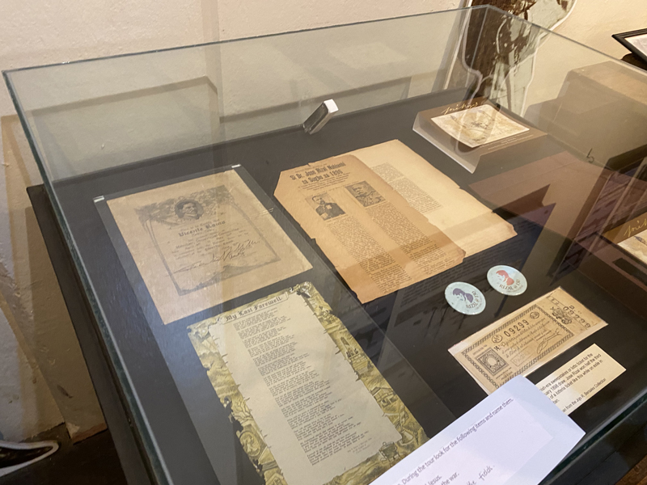

この頃の英雄はたくさんいますが、1ペソコインのホセ・リサールなどもいます。

 スペインから独立？と思ったらアメリカからの支配の時代が始まります。

アメリカのフィリピン支配は穏やかで機関車や文化の発展が印象的な時代です。昔コロンでは機関車が走っていました。

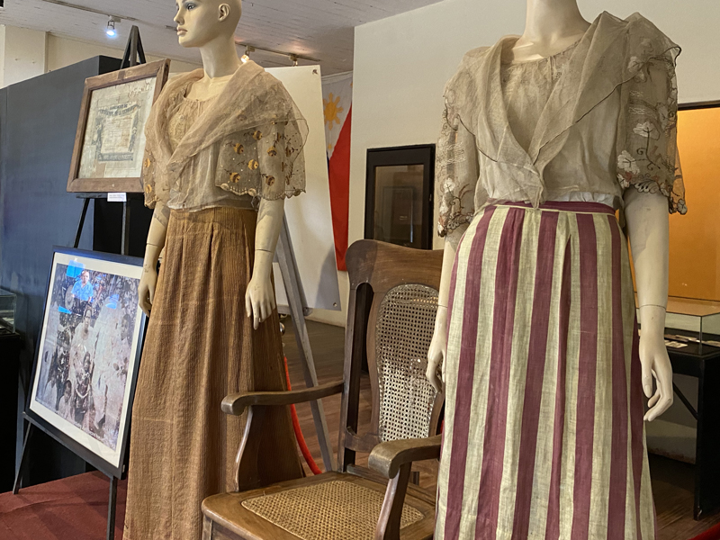

ちなみにこちらは現在民族衣装と言われている「マリアクララ」です。アジア感ゼロです。

### 第二次世界対戦。日本の支配
第二次世界大戦に突入し、フィリピンは日本の統治下に置かれます。

日本が発行したお金、おもちゃのお金と揶揄（やゆ）された「ミッキーマウスマネー」があります。日本軍はたくさん紙幣を発行しインフレを起こします。

当時71ペソでガチョウの卵をやっと1個買えるほどまで物価は高騰しました。

<small>※ ちなみに現在うずらの卵が1コ2ペソで購入できます。</small>

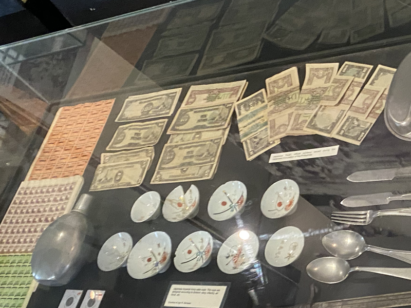

日本の都合で紙幣刷られまくり、フィリピン人の生活は圧迫します。それに対抗して作られたのが「ゲリラマネー」。フィリピン政府が秘密裏に作った紙幣だそう。

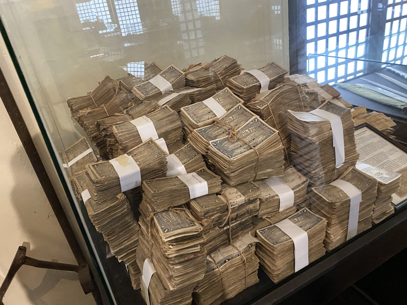

かみーゆ

どんな時代でも戦争が起こるかぎり、誰もが被害者。 現地友達の言葉に感謝します。

## おまけ・セブ博物館のそのほかの4つの展示ルーム（現在3つ）について
主要時代の展示ルーム以外にも、セブ博物館では4つの展示ルームがあります。現在1ルームはコロナのせいで閉じています。

フィリピンは第二次世界単線後、やっと独立を果たします。

有名な政治家一族Rama家についての展示されている部屋もありました。

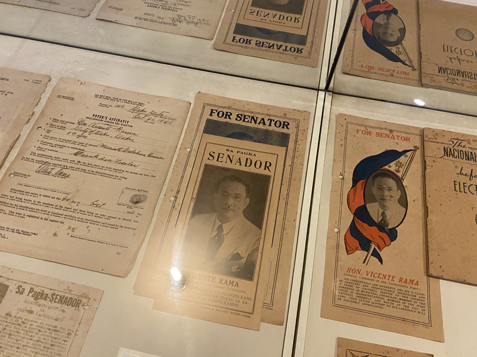

 そして、自由になったフィリピンではさらに報道が始まります。

セブ史上はじめての新聞も発刊されます。

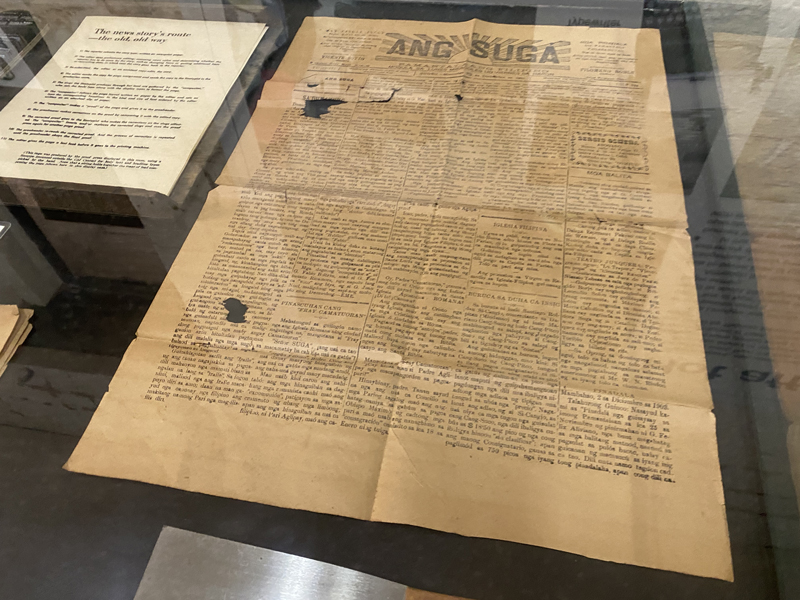

<small>※ 新聞Ang Suga。Sugaは光という意味。</small>

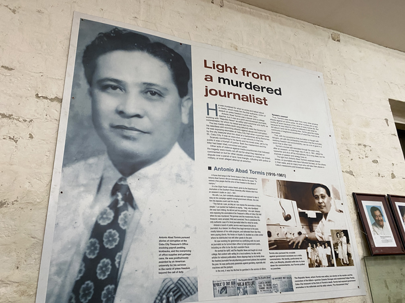

戦争が終わっても、終わらない戦いがあるんでしょうね。マルコス政権下ジャーナリストが殺されたり、きな臭いことも起こったそう。

### 増設された記念展示ルーム。フィリピンはスペイン支配から500年経った
セブ博物館には以前なかった施設ができていました。スペインが来てから500年の記念で作られた展示ルームです。

ここでは植民地化までの歴史を集約して紹介されています。

 TagboとはMeet（会う）という意味だそうです。この時代がなかったら、文化は入り混じってなかったってことでしょうかね。 
 表現がフィリピンらしいです。

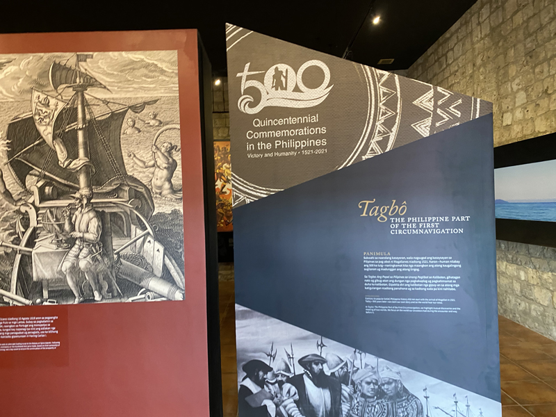

キング（族長）たち。中心は英雄ラプラプ王。その左がフマボン王だそう。かつてセブ周辺を治めてきた長たちです。彼らは自分を強く見せるために全身刺青を掘っていたそうです。

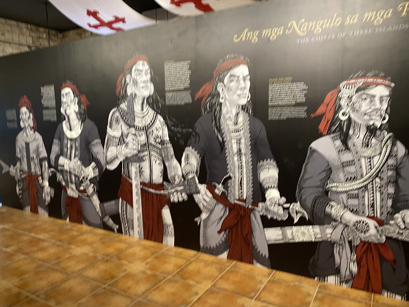

<small>※ 同行した友達が右から2番目の王（族長）がイケメンだと言っていてツボりました。</small>

 当時の様子をイラストで表現しています。

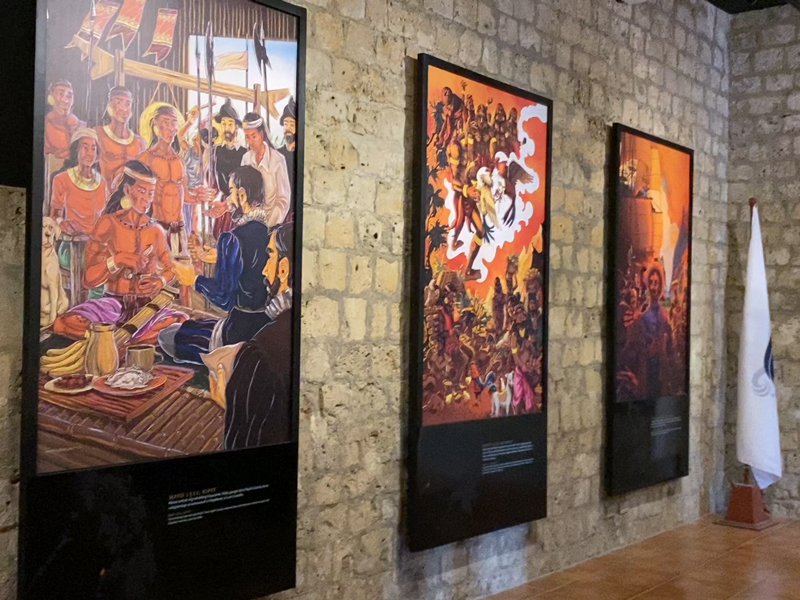

マゼランは「*なぜ島の種族はみな刺青だらけなんだ？*」と思っていたとのことでした。

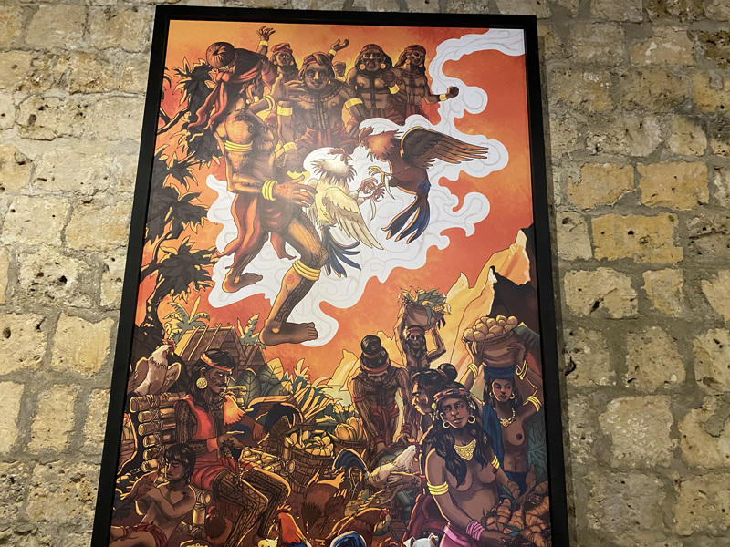

Cock fight（闘鶏）は500年経った今でもフィリピン人の娯楽の1つ。路地で練習の様子を見かけることもあります。

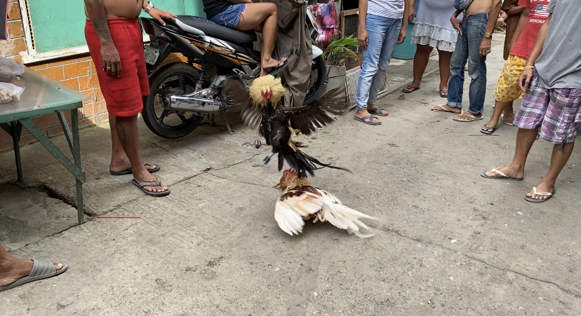

## まとめ・どの国にも豊かな文化がある
現在フィリピンにはコロニズムの影響で現存するコロニズム前の文化遺産は日本に比べると数少ないと思います。

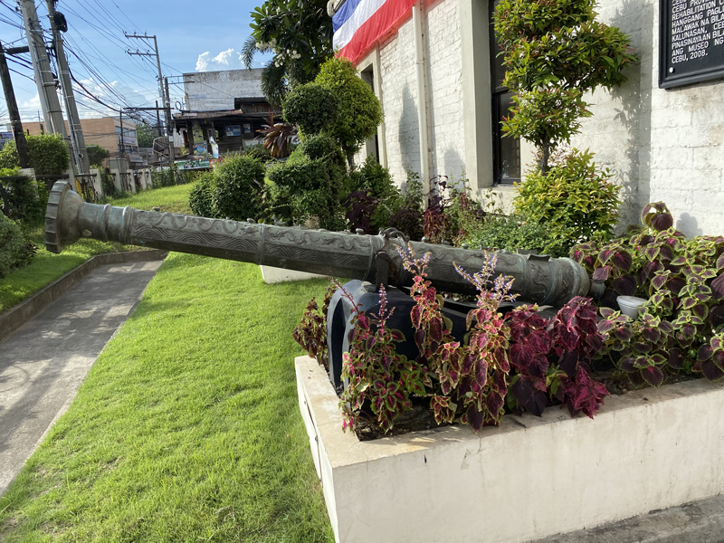

 海外に住むということは、その土地の文化をわかる範囲で学び受容するのも大切かと思い、今回の記事を書かせていただきました。

セブ島といえば「青い海、白い砂浜」と思いがちですが*古代*、*3つの植民地時代*、*近代*があってはじめて「今」があると改めて思います。

今回できるだけ日本語で出回っている情報は参考にせず、フィリピン人の友達の話のみを参考に、記事にしました。

ひょっとしたら間違いや表現の微妙なところがあるかもしれませんので、都度修正・加筆する予定です。

この記事がフィリピンの歴史や文化に興味がある方の一助となれば幸いです。

最後までお読みいただきありがとうございました。
