プログラミングで自動化してヒューマンエラーを減らしたい！<br>Google Apps Scriptを使うとスプシ（Googleスプレッドシート）からドライブへリネームしたファイルを保存したり、保存したファイル情報をスプシに自動で記録しておくことができます。

今回は、
1. スプシ上にフォーム（UI）を表示
2. スプシの値をフォーム側に出力
3. ファイルのタイプや容量制限するコード

を紹介します。

*はじめに。こんなお悩みがある方へ*

* Googleドライブ内のあの書類どこ行ったけ？
* ファイル名の書類が何個もある！どっちだっけ？
* ドライブのフォルダー内が汚くてイライラ

<br>JavaScriptが分かって、Googleアカウントさえあればこのお悩みを解決できます。

今回はGoogle Apps Script（GAS）を使って、請求書など分類としては一緒だけど**命名規則やファイル形式が違う書類を*スッキリ整理する方法***を具体的に紹介していきます。
<toc id="/blogs/entry475/"></toc>

<msg txt="人間ほど間違えるイキモノっていないよね？<br>だったらルールを決めてしまって、ルール通りにファイルを管理しよう！！"></msg>

ちなみにフォルダー管理を自動化したい方はこちらの記事を参考に。

<card id="/blogs/entry470/"></card>


### スプシからファイルをアップロードしてドライブに保存するまでの大まかな作業の流れ
ファイルアップロード用のコードを書きます。手順としては以下の流れです。

1. *スプシを準備*
1. *GASのプロジェクト作成*
2. *アップロード用のモーダルパーツを作成（UI追加）*
3. *バリデーション・保存するファイルのサイズやタイプを判定*
4. [Googleドライブでファイルを保存しリネーム（次回）](/blogs/entry476/)
5. [スプシにファイル情報を書き出す（次回）](/blogs/entry476/)
6. [メニュー操作で保存処理を常に実行できるようにする（次回）](/blogs/entry476/)

<small>※ （次回）は次回の記事で紹介します。</small>

<br>*ファイルがフォルダーに格納されるイメージ*
```
請求書/
 ├ invoice-00001.pdf
 ├ invoice-00002.png
 ├ invoice-00002.jpg
 │   ・・・
 └ invoice-00008.png
```

## スプシを準備
まずは1こ、スプシを準備します。スプシ名は今回*請求書管理*とかにしておきましょう。

今回は案件ごとに管理するため、*請求書*と*データ*の2つのシートを用意します。

### 「データ」シートに案件名、顧客名、ステータスを登録しておく
データには「案件名」、「顧客名」、「ステータス」を登録しておきます。

本来はシートを分けたほうがいいのですが、今回「ファイルをGoogleドライブに保存する方法のご紹介」なので、便宜上まとめています。

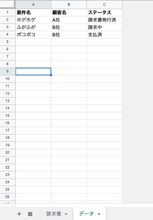

C列に以下請求書のステータスを入力しておきます。

* 請求書発行済
* 請求中
* 支払済

### 「請求書」シートに見出しなど登録
「請求書」シートをつくり、一行目にid、案件名、顧客名、ステータス、請求日、支払日を見出しとして登録しておきます。

「データの入力規則」から、データシートのC列（$C$2:$C）の値を条件に設定しておきます。無効なデータの場合に「*入力を拒否*」にチェックを入れておきます。

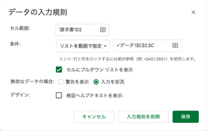

これでシートの下準備は完成です！

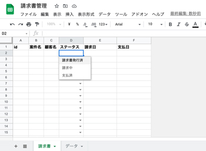

## GASのプロジェクト作成
Google Apps Script（GAS）のプロジェクトを作成します。

先ほど作ったスプシから「メニュー」 > 「ツール」 > 「スクリプトエディタ」を開きます。

このままだと左上のタイトルが「無題のプロジェクト」なっているので、そこをクリックしてプロジェクト名を管理上変更します。ここでは「請求書作成」としておきます。

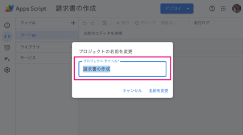

### Chrome V8 ランタイムを無効にする（2021年6月現在）
Chrome V8 ランタイムが有効だとファイルがアップロードできません。設定から、チェックを外しておきます。

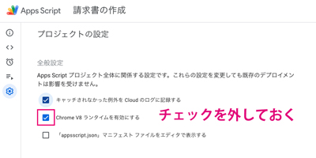

ただ、チェックを外すとテンプレートリテラルやletなど新しめのコードが書けなくなります。

## アップロード用のモーダルパーツを作成（UI追加）
フォームアップロード用のHTMLファイルを追加します。追加の仕方はスクリプトエディタの左のメニュー、「ファイル」から「HTML」を選びます。

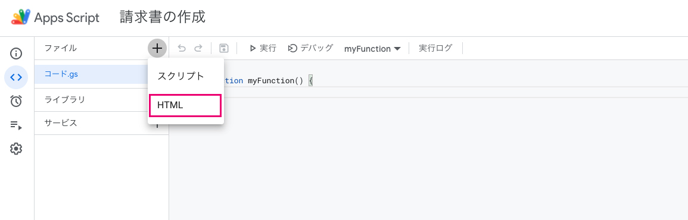

今回はファイル名を「upload」としておきました。これでUIパーツ用の「upload.html」ファイルができます。

ファイル作成直後のデフォルトコードはこんな感じ。

```html
<!DOCTYPE html>
<html>
  <head>
    <base target="_top">
  </head>
  <body>

  </body>
</html>

```

このフォームで入力した日付、案件、ファイルをサーバー側へ送信できるようにします。

各パーツを表示するためのコードを書きます。

案件のプルダウン用の部分は、シートからデータを取ってくるので後ほどコードを追加します。

```html
<!DOCTYPE html>
<html>
  <head>
    <base target="_top">
    <link rel="stylesheet" href="https://ssl.gstatic.com/docs/script/css/add-ons.css">
  </head>
  <body>
    <form>
      <p>
        発行日：<input type="date" name="date">
      </p>
      <p>
      プロジェクト名：<select name="project">
      <!--項目は後で追加-->
      </select>
      </p>
      <p>
      ファイル：<input type="file" name="file"/>
      </p>
      <button type="button">ファイルをアップロードする</button>
    </form>
  </body>
</html>
```
<small>※ ここではinputのtype=dateを使っていますが一部のブラウザで機能しません。Chromeを利用することを前提で進めています。</small>

<br>モーダルを表示するため「コード.gs」に以下関数を追加。


```js
function showModal() {
  const spreadsheet = SpreadsheetApp.getActiveSpreadsheet();
  const output = HtmlService.createTemplateFromFile('upload');
  const html = output.evaluate();
  spreadsheet.show(html);
}
```

関数名が「showModal」になっているのを確認して実行します。

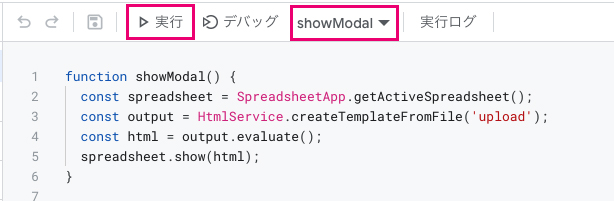

#### 権限の許可

権限を求められるので、許可します。

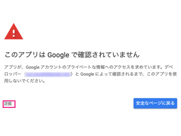

左下の「詳細」を押して、「プロジェクト名（安全じゃないページ）に移動」をクリックします。

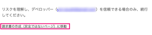

あとはアクセスの許可をすればOK。

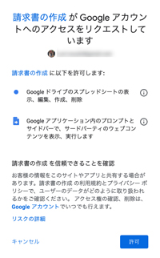

これでスプシ側にファイルアップロード用のフォーム（UI）が表示できるようになりました。
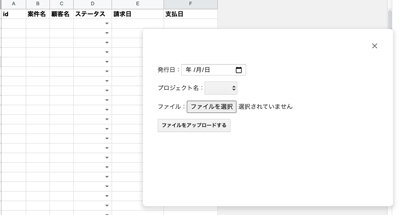

### 値がGAS（サーバー側）で受け取れるかチェック
フォームの値がGAS（サーバー側）に送れるかチェックします。

ボタンのコードを書き換えます。<br>
`google.script.run.関数名`でGAS側にデータを送信できます。

ボタンの親タグである`form`タグのデータを送信したいので引数を`this.parentNode`とします。

```html
<button type="button" onclick="google.script.run.sendForm(this.parentNode)" >ファイルをアップロードする</button>
```

さらに「コード.js」側にも`sendForm`関数を追加し、データの取得を確認します。

```js
function sendForm(form) {
  console.log(form)
}
```
関数「showModal」を実行し、スプレットシート側でファイルや日付を入力し、「アップロード」ボタンをクリックします。

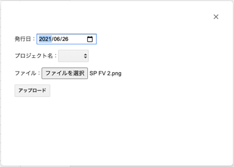

左メニューの「*実行数*」から最新の関数「sendForm」を確認します。値が取得できていたらOK！

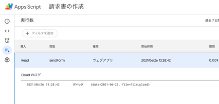


### 日付のデフォルト値と案件一覧のプルダウンを追加するコードを書く
`showModal`にコードを追記します。

日付のデフォルト値を追加します。今日にします。値はゼロパティングで`0000-00-00`年は4桁、月と日は2桁になるように調整します。

```js
//省略
const output = HtmlService.createTemplateFromFile('upload');//元々あるコード
//省略
const date = new Date();
output.date = date.getFullYear() + '-' + ("0"+(date.getMonth() + 1)).slice( -2 ) + '-' + ("0" + date.getDate()).slice( -2 );
//省略
```
<small>※ JSの月を取得するgetMonthメソッドは0始まりなので1プラスする必要があります。</small>

<br>案件名一覧をスプシから取得します。データのA列です。


```js
//省略
const spreadsheet = SpreadsheetApp.getActiveSpreadsheet();//元々あるコード
const data = spreadsheet.getSheetByName('データ');
//省略
const projectsLastRow = data.getRange(1, 1).getNextDataCell(SpreadsheetApp.Direction.DOWN).getRow();
output.projects = data.getRange(2, 1, projectsLastRow - 1).getValues();
//省略
```
取得したい列の最終行を取得し、一気に`getValues`メソッドでシートのデータを一気に取得します。

<small>※ getValueとgetValuesがあるので間違えないように注意してください。</small>
```js
シート.getRange(行の始まり, 取得したい列).getNextDataCell(SpreadsheetApp.Direction.DOWN).getRow()
シート名.getRange(取得したい行の先頭, 取得したい列の先頭, 行数(,列数)).getValues();
```

`getValues`で取得した値は2次元配列になります。
```js
[[A2], [A3], [A4]]
```

HTML側で値を出力します。[EJSちっく](/blogs/entry459/)な書き方です。

```html
<p>
  発行日：<input type="date" name="date" value="<?= date?>">
</p>
<p>
プロジェクト名：<select name="project">
  <?= projects.forEach(function(option) { ?>
  <option value="<?= option[0] ?>"><?= option[0] ?></option>
  <? }); ?>
  </select>
</select>
```
これでフォーム上でGASから取得した値が表示できるようになりました！！

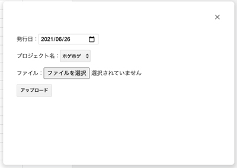

## バリデーション。保存するファイルのサイズやタイプを制限
なんでもポンポンアップロードされても困るので、ファイルのアップロードできるサイズと種類を制限します。

合わせてファイルがない時もフォーム送信できないようにしておきます。

今回はHTML側のJSで制御します。

### 初期状態で送信ボタンを押せないようにしておく
ボタンに*name属性*と*disbled属性*を付与します。初期状態では`disbled=true`をセットし、ボタンを押せないようにしておきます。

```html
<button type="button" onclick="google.script.run.sendForm(this.parentNode)" disabled=true name="send">アップロード</button>
```

### アップロードファイルに制限をかける
ファイルのinputタグに*onchange属性*と関数`fileChange`を追加します。

値が変わった時に判定を入れ、処理します。

`fileChange`の詳細は`script`タグ内に記述します。

```html
<p>
ファイル：<input type="file" name="file" onchange="fileChange(this)"/>
</p>
省略
<script>
  function fileChange(e){
    if ((e.files[0]['type'].indexOf('pdf') !== -1 || e.files[0]['type'].indexOf('jpeg') !== -1 || e.files[0]['type'].indexOf('png') !== -1) && e.files[0]['size'] < 1000000) {
      e.parentNode.parentNode.send.disabled = false;
    } else {
      alert('適切なファイルをアップロードしてください。');
      e.value = '';
    }
  }
</script>
```

`要素.files[0]`でファイル情報が取れます。今回は`type`と`size`の値を判定します。

#### ファイルアップロードの条件
|種類|条件|
|-|-|
|*サイズ*|10Mバイト以下（1000000バイト）|
|*タイプ*|MIMEタイプが「pdf」、「png」、「jpg」のみ|

それ以外は警告文を出力し、`value`に格納されたファイル情報も削除します。

<br>ボタンの二度押し防止処理を入れます。`onclick`に直書きしていた関数を外に出します。

```html
<button type="button" onclick="sendData(this)" disabled=true name="send">アップロード</button>
```
クリック後`didabled=true`でクリックができない状態にした上で、サーバーにデータ送信します。
```js
function sendData(e){
  e.disabled = true;
  google.script.run.sendForm(e.parentNode);
}
```
<div class="box">
<h4>name属性の値と関数名が被らないように気をつける</h4>
name属性の値と関数名が一緒だと関数が動かないことがあります。関数とname属性が被らないように気をつけましょう。
</div>

### データの取得を確認
GAS側（サーバー側）でデータを受け取れたか確認します。

`sendForm`には`console.log`を仕込んだままになっているので、そのまま使います。

```js
function sendForm(form) {
  console.log(form)
}
```

実行数を確認します。フォームから飛んできた値が取得できましたね！！
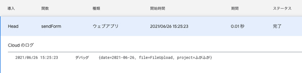

## ここまでの全ソースはこちら
### GAS
```js
/**
 * スプシ側にUI表示
*/
function showModal() {
  const spreadsheet = SpreadsheetApp.getActiveSpreadsheet();
  const data = spreadsheet.getSheetByName('データ');
  const output = HtmlService.createTemplateFromFile('upload');

  //カスタマー取得
  const projectsLastRow = data.getRange(1, 1).getNextDataCell(SpreadsheetApp.Direction.DOWN).getRow();
  const projects = data.getRange(2, 1, projectsLastRow-1).getValues();
  output.projects = projects;

  //デフォルトの日付
  const date = new Date();
  output.date = date.getFullYear() + '-' + ("0"+(date.getMonth() + 1)).slice( -2 )+ '-' + ("0" + date.getDate()).slice( -2 );

  const html = output.evaluate();
  spreadsheet.show(html);
}

/**
 * スプシのフォームからの値の受け取り
*/
function sendForm(form) {
  console.log(form)
}
```
### upload.html
```html
<!DOCTYPE html>
<html>
  <head>
    <base target="_top">
    <link rel="stylesheet" href="https://ssl.gstatic.com/docs/script/css/add-ons.css">
  </head>
  <body>
    <div>
      <form>
        <p>
          発行日：<input type="date" name="date" value="<?= date?>">
        </p>
        <p>
        プロジェクト名：<select name="project">
          <?= projects.forEach(function(option) { ?>
          <option value="<?= option[0] ?>"><?= option[0] ?></option>
          <? }); ?>
          </select>
        </select>
        </p>
        <p>
        ファイル：<input type="file" name="file" onchange="fileChange(this)"/>
        </p>
        <button type="button" onclick="sendData(this)" disabled=true name="send" class="action">アップロード</button>
    </div>
    <script>
      function fileChange(e){
        if ((e.files[0]['type'].indexOf('pdf') !== -1||e.files[0]['type'].indexOf('jpeg') !== -1||e.files[0]['type'].indexOf('png') !== -1) && e.files[0]['size'] < 1000000) {
          console.log(e.parentNode.parentNode)
          e.parentNode.parentNode.send.disabled = false;
        } else {
          alert('適切なファイルをアップロードしてください。');
          e.value = '';
        }
      }
      function sendData(e){
        e.disabled = true;
        google.script.run.sendForm(e.parentNode);
      }
    </script>
  </body>
</html>
```

## まとめ・UIを作るところまでは意外とカンタン
こんな便利な機能をタダで使わせてくれるなんてGoogleは神かと思いますw

一度作ってしまえば長く使えます！GASで仕事を効率化して、しっかり本業に集中しましょう！！

続きもありますのでぜひ合わせてお読みいただき、効率化ライフを満喫してください！

トリガーで定期的にメール送信したい方はこちらを参考にしてください。
<card id="/blogs/entry504/"></card>
<prof></prof>

### 続きの記事も合わせてお読みください
次は実際ドライブに保存し、ファイルの詳細を自動でスプシに追記します。

<card id="/blogs/entry476/"></card>

