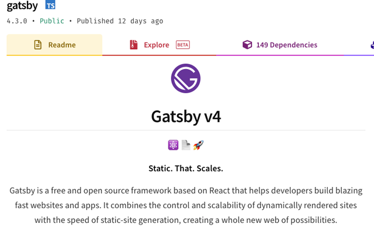
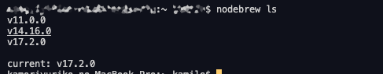
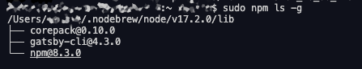

お久しぶりです!!!念願の久々更新です。<br>2021年7月から進めていたウェブサイトのリニューアルがようやく終わりました！涙<br>WebP対応しつつv3にアップグレードする予定たったのですが、

starter kit のインストールのエラーでハマってできませんでした。<br>この記事はGatsbyでブログなどを運用していてv4にアップグレードしたいけどエラーでハマってインストールできない方への記事です。<br>私がどうやってエラーを解決したかをご紹介します。

<prof></prof>

v5へのアップグレード方法はこちら。
<card id="/blogs/entry519/"></card>


## Gatsby v4がリリース！


Gatsby v4がリリースされましたね！(12日前とあるので2021/12/1リリースかな？)

当ブログも半年越しにようやくv4にと重い腰をあげることになりました！

> Gatsby is a modern web framework for blazing fast websites.<br>
> Gatsby 高速なウェブサイトを実現するためのフレームワークです

インストールしようにもコケる。猶予が土日しかなかったので焦りもあって、間違った方法ではありますがなんとかアップグレードにこぎつけました。
### Gatsbyブログサイト移行物語（現在12記事）もv4対応しました！

昨年から移行を機に書いている「Gatsbyブログサイト移行物語」もv4対応しました。v4から新たにGatsbyでブログを始めたい人方は「[インストールからデプロイまで](/blogs/entry401/)」からお読みください。

一覧出力、ページネーション、サムネイルの出力方法など紹介しています。

[Gatsby関記事](/blogs/tags/Gatsby/)も併せてどうぞ。

### アップグレード方法
**v4でgatsby starter blog のインストールが走らなかったのは単にnpmのバージョンが低いだけだと発覚し2021/12/12に執筆した記事を大幅に修正しています。**

この記事では私の反省も踏まえて、正しい方法をご紹介します。

## 単純にnpmのバージョンが足りなかったことが発覚

> #### Minimal Node.js version 14.15.0
> We are dropping support for Node 12 as a new underlying dependency (lmdb-store) is requiring >=14.15.0. See the main changes in Node 14 release notes.<br>
> [Migrating from v3 to v4](https://www.gatsbyjs.com/docs/reference/release-notes/migrating-from-v3-to-v4/)
*14.15.0以上じゃないと動きません*とちゃんと公式に書いてあるじゃん。。。

npm7を使う場合は結構面倒で、8が好ましいです。

Homebrewから最新のnodeをダウンロードして、切り替えます。

```bash:title=コマンド
nodebrew install-binary latest
nodebrew ls
```

使いたいバージョンを選択。


```bash:title=コマンド
nodebrew use v17.2.0
```
こちらの記事も参考にしました。

[macのnodeのバージョンが上がらない!?ブラックボックス化したmacのnode環境を作り直してみる。](https://blog.websandbag.com/entry/2018/01/21/000000)

補足。上記記事中にはシンボリックを貼る場所は`.bashrc`とありますが、私の環境下では`.bash_profile`に設定してあります。人によって環境が違うので気をつけてください。<br>
以下も参考に。

[.bashrc|「分かりそう」で「分からない」でも「分かった」気になれるIT用語辞典](https://wa3.i-3-i.info/word13649.html)

インストールされているか確認します（sudoいるかもです）。

```bash:title=コマンド
npm ls -g
```

### gatsby-cli をインストール
バージョンアップ後の nodebrew には gatsby-cli がないので改めてインストールします。

```bash:title=コマンド
npm i gatsby-cli -g
```

グローバルにインストールされているモジュールを確認。

```bash:title=コマンド
npm ls -g
```



### おまけ・古いnodeでもモジュールを追加したらgatsbyJSが構築できた

古いnodeでもモジュールを追加したらgatsbyJSが構築できます。

私は最初この方法で対応してしまいましたが、後からnodeをアップグレードすればいいだけと発覚しました。

手順だけ残しておきます。

gatsby cli を v4 用にアップグレードしたもののエラーをもとにググったら、グローバルの node module がいくつか足りないみたい。

```bash:title=コマンド
sudo npm -g i sharp
sudo npm -g i cordova-res
```

それでも走らないので、npmのキャッシュを強制的にクリア。
<br>キャッシュで不具合が起きてたのかはちょっと不明です。

```bash:title=コマンド
npm cache clean --force
```

これで走らなければ以下も入れてみてください。

```bash:title=コマンド
sudo npm install node-addon-api -g
sudo npm i
```

上記を入れた際にもキャッシュクリアしてください。

```bash:title=コマンド
npm cache clean --force
```

これで古いNodeでも走るようになりました。詳しくは調べてませんが、新しいNodeでの不足分のモジュールを入れたから動いたのだろうと思っています。

その後、すでにv4に対応済みの [gatsby starter blog](https://www.gatsbyjs.com/starters/gatsbyjs/gatsby-starter-blog/) を入れてみます。

```bash:title=コマンド
npx gatsby new gatsby-starter-blog https://github.com/gatsbyjs/gatsby-starter-blog
```

## Netlify にデプロイして動くか確認
このブログは Netlify を使ってます。

別にgithubでリポジトリを立てて、一旦デプロイして動くか確認。<br>ちゃんと動きました！！

githubとNetlifyの連携の仕方がわからない方はこちらをご覧ください。

<card id="/blogs/entry401/"></card>


## まとめ・Gatsby v4 に対応する際、インストール中エラーでコケる前に必須バージョンを確認しよう
仕事が忙しくて放置してたのもありますが、やっと更新できるようになりました！

面倒臭くて公式リファレンスをしっかり読んでなかったのが原因でかえって遠回りしてしまいました汗

Gatsby v4 は超便利になりました。<br>
v2から2世代のアップグレードで参考にならないかもしれませんが、逆にムダなコードをかなり書かなくても済んだり frontmatter の扱いなど変わっています。

今回markdown系の快適機能も追加しました！<br>以下に方法をまとめてます。

<card id="/blogs/entry489/"></card>

今回も、最後までお読みいただきありがとうございました。<br>
この記事があなたのコーディングライフの一助となれば幸いです。

