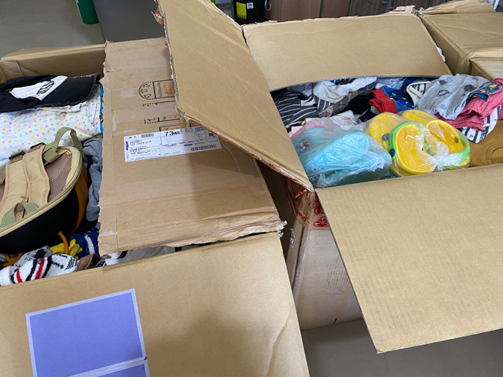
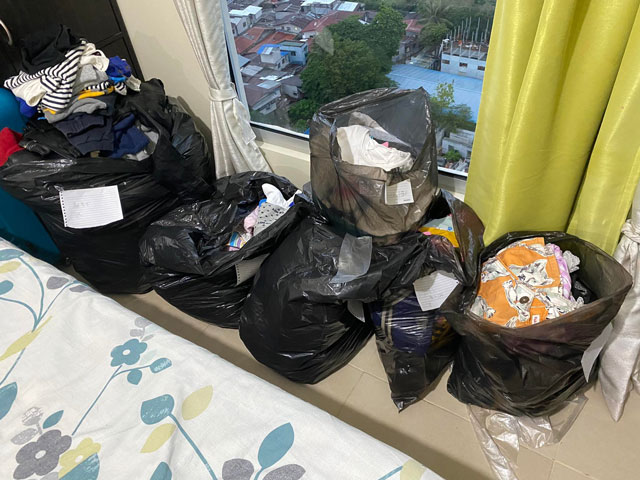
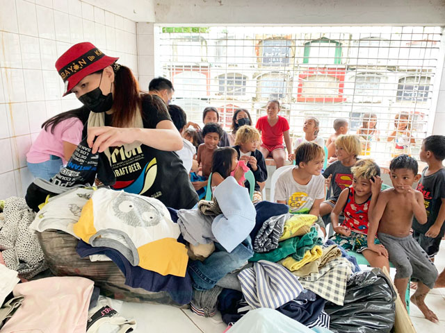
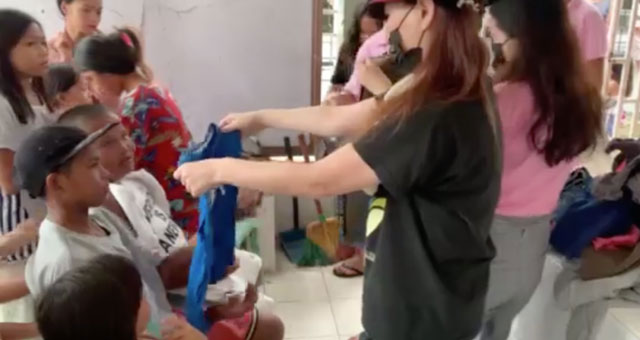
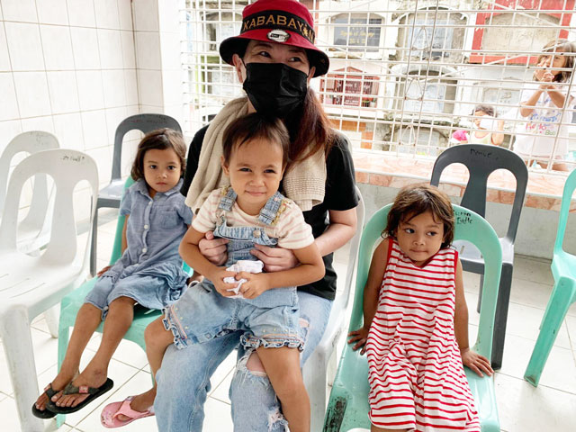
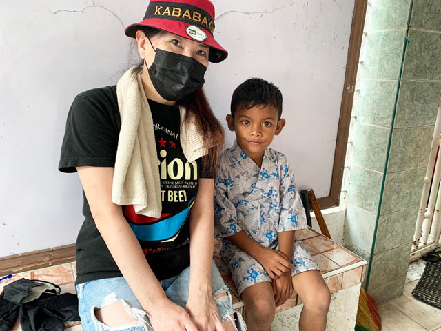
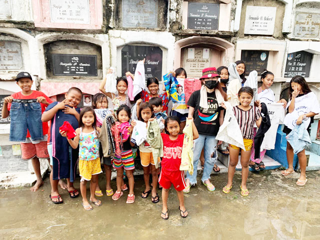
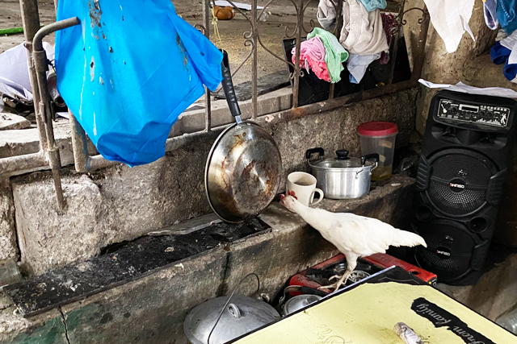

## セブ島で洋服を配るようになった経緯
「子ども服をセブに送るプロジェクト」は最近一緒にお仕事をさせていただいている Blue Style 代表外谷さんとのちょっとした雑談から始まりました。

外谷さんが運営している「[子ども服お下がりサービス Lynks](https://lynks.jp/)」でお下がりしたいけどちょっとしたシミや破損でお下がりできない服があるそうです。

元々洋服をムダにしたくないという想いから始まったサービスなので、出品できない洋服も廃棄はしません。リサイクル布として海外に出荷されます。

<msg txt="捨てたくないからお下がりされた洋服なんですよね"></msg>

誰かに着て欲しいですよね。

<msg txt="そうだ！セブ島のどっかのボランティア団体に掛け合ってもらってもらおう"></msg>

第一弾は無事配り終わりました。

## 第2弾では2箱もの洋服が届きました！！

11月末2箱届きました。私のせまーい部屋がでっかいダンボールで埋め尽くされました。

セブ島にはお墓とゴミ山に、いわゆる*最貧困地区*が存在します。カレッタには墓地があり、スラムの人々は墓地の管理、ロウソクを売るなどして生計を立てています。

以前同行させてもらいスラムに関してレポートさせてもらっています。こちらもご覧ください。

<card id="/blogs/entry449/"></card>

第2弾の洋服は前回もお世話になったセブ島NGO団体・[DAREDEMO HERO Inc.](https://daredemohero.com/)さんの支援地区カレッタ墓地で洋服を配らせていただきました。翌日は、QQイングリッシュさん主催のクリスマス会があると聞き、急遽配ることになりました。

<msg txt="子ども達にとって、きっと初めてのパーティ。 恥ずかしい思いをさせたくないな。"></msg>

前回、サイズ別などで仕分けておらず配るのがめちゃめちゃ大変だったので急いで仕分けました。

さながらゴミ屋敷になりました。。。

## 子ども、赤ちゃんにLynksさんからいただいた洋服を配る
当日はあいにくの雨。

真っ裸の子ども達がお風呂がわりに雨を浴びていました。

前は驚いていましたが、お墓に行くのも人様のお墓に入るのもなれてしまいました。

### Daredemo Heroさんのラーニングセンターで洋服を配布させていただきました
今回はご好意でDaredemo Heroさんのラーニングセンターで洋服を配布させていただきました。

早速棺の上に洋服を並べて、配布スタートです。

ビサヤ語（セブ島で話されている現地の言葉）で遠慮なく話しかけてくるのでまったくわかりません。
 アテ（お姉さん）以外はわかりません。 
今回の配布で *ララキ（男の子）* と *ババイ（女の子）* は覚えました。

市街地だとフィリピン人はほぼみんな英語喋れるので格差を感じます。

彼らなりに好みがあるので、できるだけ要望を聞くようにします。

立派なお洋服を着ると、フィリピンKidsはめっちゃ可愛いです！

甚平（じんべい）いただきました^ ^

 おかげさまでたくさんの子どもに洋服を配ることができました！

洋服を提供してくださったLynksさん、送料を提供してくださったみなさん（提供者はこの記事の最後に掲載）、心の底から感謝いたします。

今回の私の活動はあくまで現地NPO法人Daredemo Hero inc.さんのおかげで実現できています。

ありがとうございました。

## その後、日本の学生からの墓地の住民へ質問 -インタビューに同行-
その日はちょうど私の地元・広島にある修道大学とDaredemo Hero inc. さんが墓地の住民にオンランインタビューをするということで同行させてもらいました。

修道大学の通訳翻訳プログラム生と健康栄養学科の生徒さんと協力し、墓地の住民の栄養状況を改善するということで墓地の状況を中継しつつ食生活などを聞いて回るとのことでした。

**フィリピンはアジアで第2位の英語力** （[2021年EF English Proficiency Index調べ](https://www.efjapan.co.jp/epi/)）で世界でも18位です。

<small>※ ちなみに日本は78位で<em>世界的に能力レベルは低い</em>とのこと涙。</small>

 Daredemo Hero inc. の英語の先生を通じてインタビューしつつ、栄養指導もできるのであれば*実践的な英語の勉強*と*社会貢献*ができる誰もが Win Win になれる素晴らしい取り組みだと思いました。

インタビューやカレッタ地区の訪問を通じて知った内容を少しご紹介します。

### お墓の入り口には...?
お墓の入り口にはサリサリストアなどがありジャンクフード、参拝者向けの花やろうそくが売ってます。

売られているろうそくは実は子ども達などが墓場から使い古されたロウソクを集めて再生したものです。

参拝者が少なければ、ろうそくの作る量はもちろん減るそうです。

### あんな狭いところに ~ 8人ぐらいで住んでいる
フィリピンといえば大家族が多いのですが、もちろんスラムも一緒です。 
多くて8人ぐらいで住んでいて、プライバシーは布切れや板ぐらいでしか守れないです。

大抵お墓がベッドです。

もちろん住所などありません。出生届も大抵出してないそうです。

### カセットコンロや炭で料理
結構カセットコンロが各家庭にあります。中には炭火で調理する人もいるみたいです。

### 貧困で十分食べるものがないはずなのに肥満が多い
墓地には驚くことに、あちらこちらに肥満の子ども達がいます。とりあえずお腹が満たされればいいという感じで、米やジャンクフードばかり食べているそうです。

さらに、ある家庭では数日で350mlくらいの油を使い切るとのこと。なんか、納得。

意外とみんな隠れ栄養失調だそう。

### にっこりと笑うと目で見てわかるほど黒い歯...
すっごく可愛い女の子も、にこりと笑うと虫歯に蝕まれた黒い歯が。。。

もちろん歯磨きなんてしません。水なんて通ってないですもん。飲料水を買うのが精一杯です。

江戸時代では虫歯や歯周病で早死する人も多かったので、侮れない病気です。

## 最後に

*「子ども服をセブに送るプロジェクト」* は誰もためでもなく、自分のためにやっています。

<msg txt="この活動はあくまで私ができる社会への投資 微力ですが..."></msg>
社会が良くなれば巡り巡って私や私の周りの人間が幸せになれると信じています。

**一人でも多くの子どもたちが学べ、健康に大人になれたらその子ども達は将来社会に貢献する**と思っています。

どのNGO団体関係なく、私の小さな力でもお役に立てるなら協力します。

 私はあくまでスポットで個人的にお手伝いをしているだけです。

毎日活動しているNGO団体の方々には本当に感謝です。

最後までお読みいただきありがとうございました。

  <h4>「子ども服をセブに送るプロジェクト」支援者の皆様</h4>
  
送料を送るためにご支援いただきましたみなさまありがとうございます！

  <ul>
    <li><a href="https://www.ec-cube.net" rel="nofollow noopner" target="_blank">株式会社イーシーキューブ 様</a></li>
    <li>ヤマモト コウ 様</li>
    <li>中村 亜夜 様</li>
    <li>満井 美恵 様</li>
    <li><a href="https://kdl.design/" rel="nofollow noopner" target="_blank">栗原デザイン室 様</a></li>
    <li><a href="https://tantan.work/" rel="nofollow noopner" target="_blank">TanTan 様</a></li>
    <li><a href="https://www.dream-tech.jp/" rel="nofollow noopner" target="_blank">ハッピーちゃい夢 様</a></li>
  </ul>
  <h4>洋服の支援元</h4>
  <ul>
    <li><a href="https://www.lynks.jp/t" rel="nofollow noopner" target="_blank">Lyncs 様</a></li>
  </ul>

  支援に関する資料は[フィリピンセブ島の恵まれない子たちへ
支援物資送料寄付のお願い
](https://docs.google.com/presentation/d/1arV9Jb5vQHyKqKlpG0HS_nTLt4n9hdbw/edit?usp=sharing&ouid=117160028250625203295&rtpof=true&sd=true)をご覧ください。
