## セブ島マンダリンのスラムの大火災。約500世代が避難
2021年11月26日、マンダリンのスラム街で大規模火災が起きました。
現在、近くの小学校に被災した住人が避難しています。

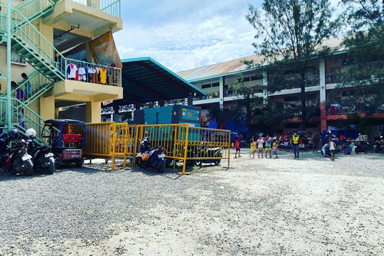

12月14日、DAREDEMO HEROさんがアイスと物資を配りに行くとのことで同行させていただきました。

### 小学校の教室には数家族、校庭？には無数のテント
私も[Lynks](https://lynks.jp/)さんからいただいた洋服を子どもたちに配らせていただきました。

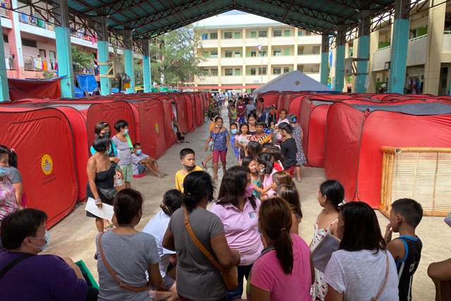

あっという間に支援物資をもらうための長蛇の列。

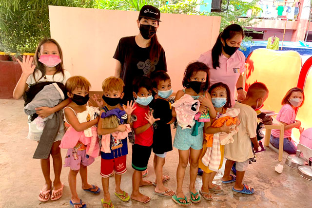

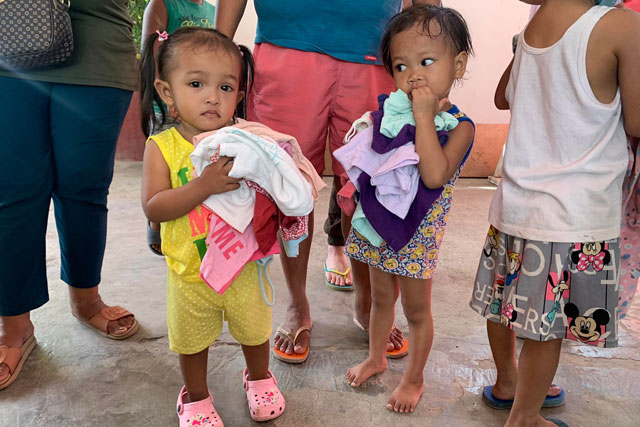

子どもたちに洋服を配るプロジェクトのきっかけはこちら。

<card id="/blogs/entry445/"></card>

微力ながら他の支援者様の物資の配布も手伝わせていただきました。

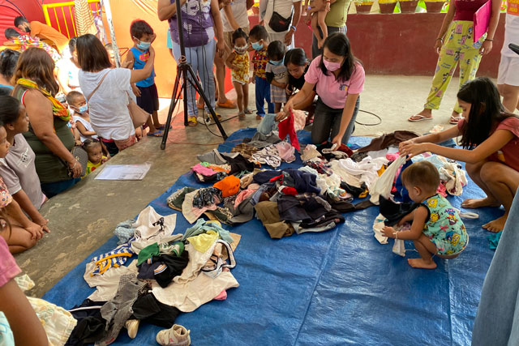

### 子どもはやはり子ども
支援物資の中にいいオモチャが見つかろうものなら、我先に奪い合っていました。

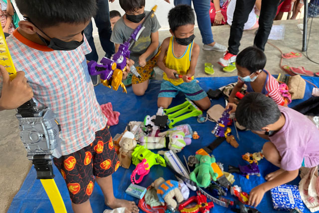

スラムの子どもたちも他の子ども同様、遊びたいんだなぁと。

大人にも同様に配布がありました。
ある男性は子供のおもちゃを数個も選んでました。

後で被災者の生活を視察した時に知ったのですが、その男性には小さい赤ちゃんがいました。

自分の必需品よりも子どもを優先。 
我が子を思う気持ちは国籍や人種は関係ないですね。

### アイスをもらってご満悦
アイスはマンゴーと紫芋のアイスを2樽ありました。

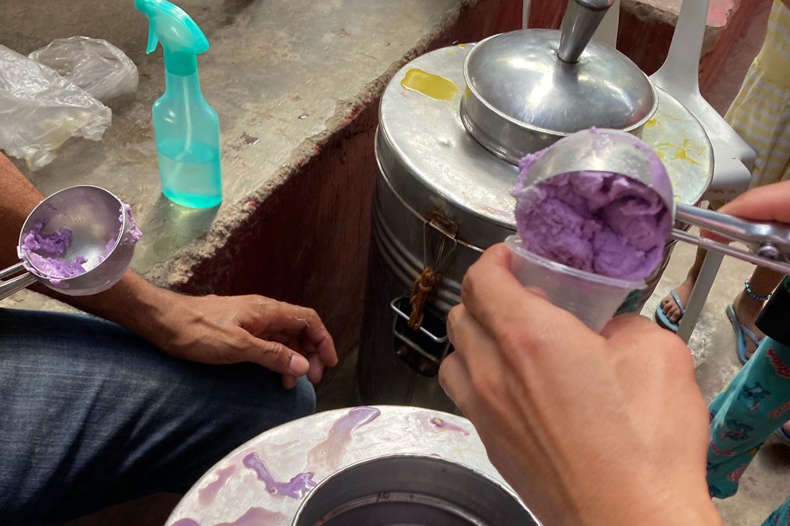

洋服をもらった後、カップいっぱいに入ったアイスをもらい、子どもたちは御満悦??

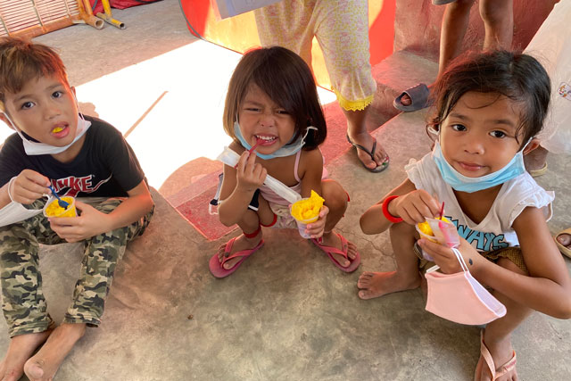

みんな、嬉しそう。

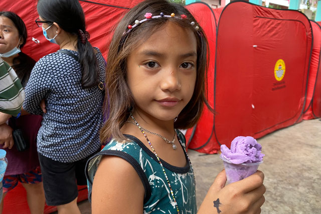

年中常夏のフィリピンですが、避難所も冷房などありません。 
ひんやり甘いアイスは最高のご馳走だったことと思います。

セブではチャリンコに乗ったおじいちゃんがよくアイスを売って回ってます。 昔はわずか1ペソ。今でもたった5ペソ(約14円くらい)です。 チロルチョコが昔10円だった頃を思い出しました。

## 被災中の住人の生活を視察
避難住民はテントや教室で暮らしてます。 
テントは1世帯、教室には3世帯ぐらいいました。

教室に行くと孫をあやすおばあちゃん。

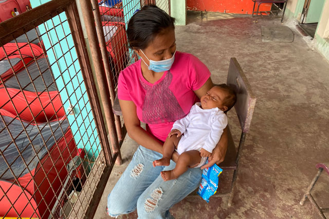

写真撮るよーというといろんな家族が集合してくれます。

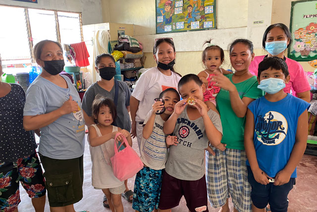

テントの中には親子で頭のシラミ取りをしているのを見かけました。

私が知ってるスラムは墓地とゴミ山です。 
トイレもないし水道も通ってません。 
おそらくどのスラムもそんな感じだと思います。

避難所はまだ仮設トイレもあるし、水も自由に使えるので従来の生活よりマシそうです。

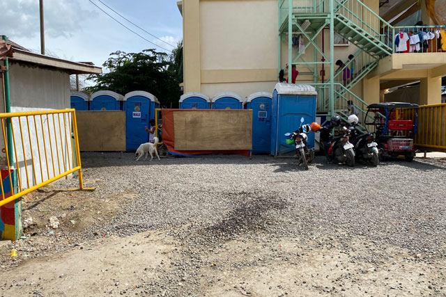

### 火災現場へ足を運ぶ
火災現場に行くと見事に平らになっていました。 
火災ですべて燃え尽きた感じがしました。

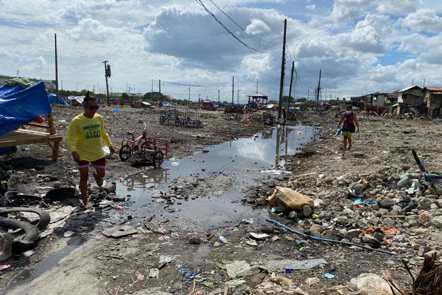

瓦礫の中で何かを必死に探す人も。

あわよくば売れるものが見つかれば！という感じなんでしょうか。。

## セブ島での火事は驚くほど頻繁に起こる
実は、私が初めてセブ島に来た時、火事の起きやすさに驚きました。

* スラムの家はベニア板など、とても燃えやすい軽い建材
* 小さくて狭い場所に家がひしめきあって建てられている
* 調理は炭火かカセットコンロなど
* イリーガルタッピング(盗電)

上記のような理由で、火が回りやすくあっという間に燃え尽きてしまいます。

### 父から聞いた戦後の話を思い出した
スラムの住人は元々違法で住み着いている人がほとんどです。 
彼らが立ち退けば、国は道路などの土地開発ができると言う話を聞きました。

戦後に生まれた父の話を思い出しました。

私の故郷、広島でも戦後復興したい市街地にはまだバラックが立ち並び、同様に火事で燃えやすかったそう。

もちろん当時の日本政府や地方自治体も違法に住み着いた住人に立ち退いてほしい。 
なので、火事が起こるとあえて遅れて消防活動をしたそうです。

日本にもそんな時代があったんですよ。

## お墓やゴミ山だけではない、スラムにはまだ支援が必要
今回思ったのはフィリピンには数えきれないほど貧困地区があると肌身で感じました。

フィリピンには日本以外にもたくさんのボランティア団体がいます。

彼らが支援しなければもっと状況は酷いかもしれないと思うこともあります。

### 世界一ボランティアをしない国•日本を考察
実は、日本は *最もボランティアをしない国* だそうです。 
たしかに、日本に住んでいた頃を思い出すと、周りにボランティアをしてる人は少なかったです。 
ただ聞いてみると、興味のある人は沢山います。

ボランティアをしたいと思っても実行できないのはなぜなんでしょうか。

私も昔、ボランティアしたいと思ってもやることはありませんでした。

昔の私を考察すると、*答えは **機会がない** から*、です。 
日々の忙しさにちょっとやりたいと思って忘れる、繰り返しです。

日本はなかなか後押しがないと、ボランティアに踏み切れないのが現実です。

## さいごに
今回もスポットで洋服配布手伝わせていただきました。 
日々活動をしているボランティア団体の方々には心から感謝します。

最後までこの記事をお読みくださり、ありがとうございました。

  <h4>「子ども服をセブに送るプロジェクト」支援者の皆様</h4>
  
送料を送るためにご支援いただきましたみなさまありがとうございます！

  <ul>
    <li><a href="https://www.ec-cube.net" rel="nofollow noopner" target="_blank">株式会社イーシーキューブ 様</a></li>
    <li>ヤマモト コウ 様</li>
    <li>中村 亜夜 様</li>
    <li>満井 美恵 様</li>
    <li><a href="https://kdl.design/" rel="nofollow noopner" target="_blank">栗原デザイン室 様</a></li>
    <li><a href="https://tantan.work/" rel="nofollow noopner" target="_blank">TanTan 様</a></li>
    <li><a href="https://www.dream-tech.jp/" rel="nofollow noopner" target="_blank">ハッピーちゃい夢 様</a></li>
  </ul>
  <h4>洋服の支援元</h4>
  <ul>
    <li><a href="https://www.lynks.jp/t" rel="nofollow noopner" target="_blank">Lynks 様</a></li>
  </ul>

  支援に関する資料は[フィリピンセブ島の恵まれない子たちへ
支援物資送料寄付のお願い
](https://docs.google.com/presentation/d/1arV9Jb5vQHyKqKlpG0HS_nTLt4n9hdbw/edit?usp=sharing&ouid=117160028250625203295&rtpof=true&sd=true)をご覧ください。

DAREDEMO HERO Inc.の支援に興味がある方は、直接[お問い合わせ](https://daredemohero.com/)ください。
