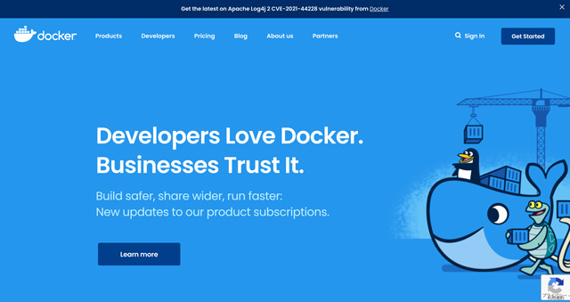
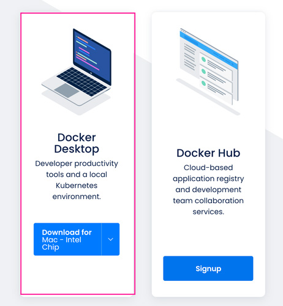
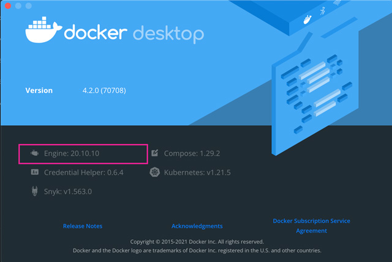
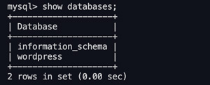
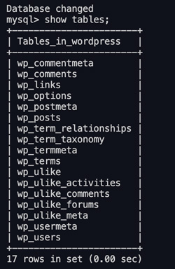

最近Dockerを使う機会が増え、自分でも構築する機会が増えました。以前はVagrantユーザーだったのですが、インストール後の立ち上げの速さはVagrantより良い気がし、乗り換えました。今回はDockerでWordPress環境を構築する方法をまとめます。

ちなみに、私の住む、フィリピン・セブは現在台風直撃し大被害でエライコッチャでまとめるのやっとなので、誤字脱字は大目にみてください。

<prof></prof>

<toc id="/blogs/entry480/"></toc>

## Dockerインストール
Dockerをインストールしていない方は、Docker公式サイトよりアカウントを作成し、インストールします。



[https://www.docker.com/](https://www.docker.com/)


Docker Desktop をインストールします。



Docker Desktop のメニューから About Docker Disctopからでも、以下コマンドでバージョンも確認できます。



```
docker -v
```

## インストールする環境を作成
インストールしたい場所にフォルダを作ります。

```
/wordpress
├ docker-compose.yml
└ .env
```

ここでは仮にWordPressをインストールしたいディレクトリ名を`wordpress`とします。

### docker-compose.yml 作成
`docker-compose.yml` を作成します。

```yaml:title=docker-compose.yml
version: '3' #　Composefileのバージョンを2に設定

services:
  wordpress:
    image: wordpress:latest
    ports:
      - "3000:80" # ポート番号
    depends_on:
      - mysql # mysqlを立ち上げた後にWordpressを立ち上げる
    env_file: .env
    volumes:
        - ./public:/var/www/html/ # マウントするディレクトリ

  mysql:
    image: mysql:5.7 # MySQL5.7公式イメージ
    env_file: .env
    ports:
      - "3306:3306" #ポート番号の設定
```
止むを得ず古いバージョンの物をインストールしたい場合は、以下のdockerhubからwordpressのイメージを探してみてください。

[dockerhub|wordpress](https://hub.docker.com/_/wordpress)

マウントするディレクトリは`wp-content`や`themes`だけでいいのであれば適宜書き換えてください。

#### mysql8でデータベースの接続ができなくなる問題
mysql8を試そうとしたところ、データベースが接続できなくなりました。

その場合は、`default-authentication-plugin`の設定を変える必要があります。

```yaml:title=docker-compose.yml
  mysql:
    image: mysql:8.0
    command: --default-authentication-plugin=mysql_native_password
    env_file: .env
    ports:
      - "3306:3306" #ポート番号の設定
```

### .envファイルを作成
.envファイルに定数を定義します。

`docker-compose.yml` で設定した wordpress と mysql の env_file に読み込まれます。

```env:title=.env
WORDPRESS_DB_NAME=wordpress
WORDPRESS_DB_USER=wp_user
WORDPRESS_DB_PASSWORD=hogehoge

MYSQL_RANDOM_ROOT_PASSWORD=yes
MYSQL_DATABASE=wordpress
MYSQL_USER=wp_user
MYSQL_PASSWORD=hogehoge
```
## dockerを立ち上げる
dockerを立ち上げます。

```bash:title=コマンド
docker-compose up -d
```
以下は`docker-compose up`のオプションです。

|オプション| |
|-|-|
|*-d*|デタッチド・モード: バックグラウンドでコンテナを実行し、新しいコンテナ名を表示<br>`--abort-on-container-exit` と同時に使えない|
|*--no-color*|白黒で画面に表示|
|*--no-deps*|リンクしたサービスを起動しない|
|*--force-recreate*|設定やイメージに変更がなくても、コンテナを再作成する<br>`--no-recreate` と同時に使えません||
|*--no-recreate*|コンテナが既に存在していれば、再作成しない<br>`--force-recreate` と同時に使えない|
|*--no-build*|イメージが見つからなくても構築しない|
|*--build*|コンテナを開始前にイメージを構築する|
|*--abort-on-container-exit*|コンテナが１つでも停止したら全てのコンテナを停止<br>`-d` と同時に使えない|
|*-t, --timeout TIMEOUT*|アタッチしている、あるいは既に実行中のコンテナを停止する時のタイムアウト秒数を指定 (デフォルト:10 )|
|*--remove-orphans*|Compose ファイルで定義されていないサービス用のコンテナを削除|
|*--exit-code-from SERVICE*|指定されたサービスコンテナの終了コードを返す<br>`--abort-on-container-exit` の指定を暗に含む|
|*--scale SERVICE=NUM*|SERVICE のインスタンス以下リンクからアクセス可能です。

無事に立ち上がったら、アクセスしてみましょう。<br>
[http://localhost:3000](http://localhost:3000)

フォルダ構成は以下のようになっています。
```
/wordpress
├ docker-compose.yml
├ public
└ .env
```

## dockerを終了

```bash:title=コマンド
docker-compose down -v
```
オプションなしで `docker-compose down`を実行すると`docker-compose up`で作成したコンテナ・ネットワーク・ボリューム・イメージ全て削除されてしまいます。
なので `-v`オプションつけます。
|オプション| |
|-|-|
|*--rmi type*|イメージの削除。type は次のいずれか:<br>'all': あらゆるサービスで使う全イメージを削除<br>'local': image フィールドにカスタム・タグのないイメージだけ削除|
|*-v, --volumes*|Compose ファイルの `volumes` セクションの名前付きボリュームを削除<br>また、コンテナがアタッチしたアノニマス・ボリュームも削除|
|*--remove-orphans*|Compose ファイルで定義していないサービス用のコンテナも削除|

オプションを駆使して[dockerを完全に削除](#dockerを完全に削除)もあります！

## データベースのリストア・ダンプ
今回は実にシンプルな方法をご紹介します。

他ブログでは自動で〜、という記事が散見されましたが、逆に自由度が低く不便でした。


`exec`でコンテナにコマンドを実行してデータベースの操作をします。

|オプション| |
|-|-|
|*-d, --detach=false*|デタッチド・モード: コマンドをバックグラウンドで実行|
|*--detach-keys*|デタッチド・コンテナに特定のエスケープ・キー・シーケンスを設定|
|*--help=false*|使い方の表示|
|*-i, --interactive=false*|アタッチしていなくても STDIN をオープンにし続ける|
|*--privileged=false*|コマンドに拡張 Linux ケーパビリティの追加|
|*-t, --tty=false*|疑似ターミナル (pseudo-TTY) の割り当て|
|*-u, --user=*|ユーザ名か UID (書式: <名前|uid>[:<グループ|gid>])|


### データベースのリストア
sqlファイルがあった場合のデータベースのリストア方法です。

```
/wordpress
├ docker-compose.yml
├ public
├ dump.sql
└ .env
```

`dump.sql` というファイルをリストアしたい場合、ルートディレクトリに直置きしてコマンドを叩きます。

```bash:title=コマンド
docker exec -i 【コンテナ名】 sh -c 'mysql 【データベース名】 -u 【sqlユーザー名】 -p【sqlパスワード】' < dump.sql
```
.env で設定した定数をはめるとこんな感じです。

```bash:title=コマンド
docker exec -i wordpress_mysql_1 sh -c 'mysql wordpress -u wp_user -phogehoge' < wordpress.sql
```

名付け方はまた追記します。


### データベースのダンプ
ダンプ方法です。

```bash:title=コマンド
docker exec -i 【コンテナ名】 sh -c 'mysqldump 【データベース名】 -u 【sqlユーザー名】 -p【sqlパスワード】'> latest.sql
```
.env で設定した定数をはめるとこんな感じです。

```bash:title=コマンド
docker exec -i wordpress_mysql_1 sh -c 'mysqldump wordpress -u wp_user -phogehoge' > latest.sql
```

以下のようなDBができているはずです。
```
/wordpress
├ docker-compose.yml
├ public
├ latest.sql(←これ)
└ .env
```

### データベースの確認や削除
Dockerからデータベースの確認をします。

```bash:title=コマンド
docker exec -it 【データベース名】 mysql -u【ユーザー名】 -p
```

実際のコマンドはこんな感じ。パスワードを聞かれたら入力します。

```bash:title=コマンド
docker exec -it wordpress_mysql_1 mysql -uwp_user -p
```
データベースを確認します。



```sql:title=sql
mysql> show databases;
```

```sql:title=sql
mysql> use wordpress;
```

テーブルを確認します。


```sql:title=sql
mysql> show tables;
```
削除したい場合はデータベース名を指定して`drop`。
```sql:title=sql
mysql> drop wordpress;
```

sqlの終了。

```sql:title=sql
mysql>  exit;
```

## コンテナ内に入る
Web用のサーバー用に立ち上げたコンテナ内に入って、あれこれ調べたり、設定ファイルを確認したいときがあります。

そんな時は以下コマンドで侵入します。

```bash
sudo docker exec -it [コンテナID] /bin/bash
```
## dockerを完全に削除

オプションの意味は[dockerを終了](#dockerを終了)を参考にしてください。
```bash:title=コマンド
docker-compose down --rmi all --volumes --remove-orphans
```

これで気軽に破壊したりできます。

## まとめ・Dockerやってみたらカンタンだった
imageも用意されていて `docker-compose.yml`にカンタンなコードを書くだけなのでDockerでWordPressを構築するのは楽勝でした。

<msg txt="個人的には管理もメンテナンスもVagrantよりカンタンです"></msg>

私の場合、どうしても古い php と WordPress で環境を作る必要があり、今回めちゃ重宝しました。

この記事がみなさんのコーディングライフの一助となれば幸いです。

最後までお読みいただきありがとうございました。

### おまけ・よく使うコマンド

```bash
docker-compose kill
```
ネットワーク一覧を取得
```bash
docker network list
```
指定したネットワークを削除
```bash
docker network rm ID
```
