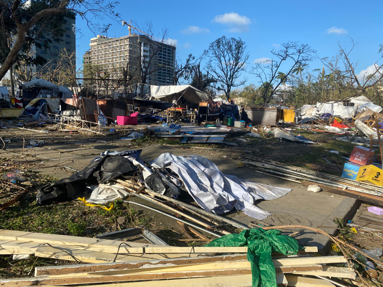
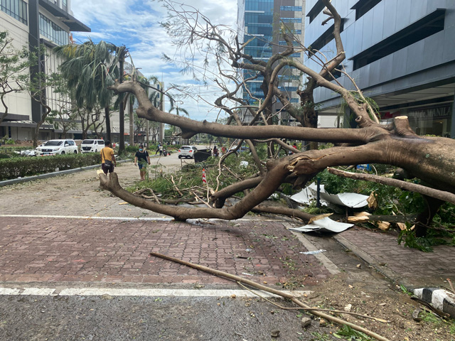
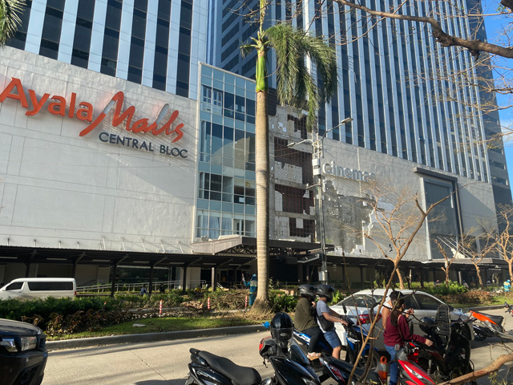
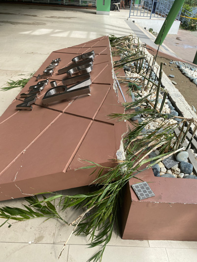

フィリピンで雇用を生みたい。ロックダウンで経済が悪化する様を経験し、そう思ったのは昨年。がむしゃらに仕事してきました。

再びロックダウン、年末には台風直撃、たくさんのことがありました。

何度も何度もくじけそうになりました。ちょっとネガティブなことも吐露しそうですが、後でこんなこともあったなぁって振り返る自分のために記事を残します。

<prof></prof>

## 昨年の充電生活を終え、真っ当に働き始めた1月
昨年ロックダウン中に会社を辞め、昨年はのんびりさせてもらいました。

<card id="/blogs/entry386/"></card>

日本に帰るか悩みましたが、この国で会社を設立するため残ることにしました。

<card id="/blogs/entry415/"></card>

健全に1年、安定した状態で会社を運営するためにある程度蓄えておく必要があると考えました。 理由はこの国、フィリピンで雇用を生みたいと思ったからです。

 私たちの方針は

* 無理しない
* 1年会社の経営を維持

だったので、1年分の資金を貯めてからスタートすることにしました。

### 働くのはやっぱり楽しい
1月からは知り合いからいくつか案件をもらえました。 
深夜まで作業するようなキツい案件もありましたが、案件をこなすうちに「働くのって楽しい」なあって。

<msg txt="充電生活で鈍った体には堪えましたがww"></msg>

私は根っから仕事好きなんだなあって実感しました。

## 7月ぐらいスタートアップにジョイン
生まれてはじめて？スタートアップにジョインしました。

新規サービスの立ち上げって想像以上にしんどいですねww

私にとって *大切なのは何をするか* ではなく *誰とするか* です。 

<msg txt="この人たちと仕事したら面白そう!"></msg>

そう思ったので、プロジェクトにジョインすると決めました。 
キツい環境下であればあるほど、人となりは見えます。

良い仲間に巡り合ったのは、今年一番の収穫でした。

## 洋服を配ったのをきっかけに、ボランティア活動に参加するようになる
日本のお下がり子供服を取り扱うLynksさんの洋服を配ったのをきっかけにボランティア団体を手伝うようになりました。
 詳しくは以下記事をご覧ください。

<card id="/blogs/entry445/"></card>

はじめてセブの貧困の現実を知りました。ただただ現実を知りました。

今までボランティアなんてまともにしたことのない私がボランティアを続ける理由があります。 
全体を見た時、世界中の子どもたちが少しでも教育を受けることができたら世の中は良くなるという理由です。

全体が良くなれば、巡り巡って私や私の周りの人たちも幸せになると信じています。

## セブ、コロナ陽性者増。8月、再びロックダウンとなる
8月フィリピンではコロナ陽性者が増え、再びロックダウンになりました。

昨年のロックダウンの様子はこちら。

<card id="/blogs/entry365/"></card>

9月中頃まで続きました。 
新しいプロジェクトに関わることにもなり、忙しいのも相まって、すっかり外出しなくなってしまいました。

**リカーバン（禁酒）** が一番キツかった。。。

<msg txt="ロックダウン開始初日の夜、100人ぐらいcurfew violator（門限違反者）が捕まって笑うしかなかった。"></msg>

### ロックダウンからの逆境を逆手に取る。時間ができた分勉強できた
どんな状況下でも自分のやらなければならないことは山のようにあります。

**エンジニアは勉強することも仕事の一環**。 
外に出ない、人付き合いが減った分、勉強のための時間が持てるようになりました。

DockerやShopifyなど新しい分野の勉強に時間を充てることができました。

### 世界中で起こったロックダウンってどれほど効果があったのだろうか
ところでロックダウンってどのくらい効果があったんでしょうかね？

私は昨年、はじめて若い夫婦と子どものホームレスを見かけました。 
今までそんな若いホームレスは見かけることが少なかったのでわりとショックを受けました。

あるスラム地区では「*コロナで死ぬ前に飢えて死ぬ*」と悲痛な声があったと聞きました。

経済が悪化して、人が疲弊して、子どもは教育がまともに受けられず。それでも感染が止まらなかったことを忘れてはいけない気がします。

## YouTube大学が一時更新されなくなったのを機に英語の勉強を始めた
性懲りも無く英語の勉強をまた始めました。始めたのはきっかけがあります。

ロックダウンの最中、仕事の後楽しみにしていたオリラジの中田淳彦さんの動画の更新頻度が減ったからです。

あっちゃんは都知事の小池百合子さんの紹介動画を紹介時直後急遽削除、1週間動画の更新をお休みされました。

 
総裁選前に、岸田さん、河野さん、高市さん候補者3名を紹介する動画で再生回数増え、ヒートアップしたあっちゃんは暴露本「女帝」をもとに小池さんについての動画を公開。

誰かを批判したり傷つける動画は作らないと決めていたのに小池さんの動画に関しては行きすぎた、とのことでした（本人談）。

運良く見れた感想を言うと、*めちゃくちゃおもしろかった*です。

ネット上では小池さんがあっちゃん潰しにかかったなど、諸説上がってます。 
変な憶測や勘ぐりはせず、いちファンとしてあっちゃんの主張を信じます。

 と言うことで、またもや仕事の後にやることがなくなり10月から英語の勉強を始めました。

結局、英語の勉強の方が楽しくなっちゃって、あっちゃんの動画はすっかり見なくなってしまいましたw

今年の10月から12月台風直撃まで人生で一番英語を勉強しました。

## 年末のトドメ。台風直撃で人生でもっとも大きな災害を体験（中）
12月16日夜・台風22号（比名：オデット）が私の住むビサヤ地方を直撃しました。

みんな台風に備えないから、大したことないだろうと思っていたら、翌朝被害のすさまじさに驚きました。

電柱、看板、街路樹はなぎ倒され、ひどい有様でした。新築のアヤラモールの外壁も剥がれてます。

私の部屋には大きな被害はなかったです。が朝起きると、閉めていた外開きの窓（ロックはしていない）が風圧で開き、横殴りの雨で床は水浸し。 
夜は相当風の音や建物の揺れが酷かったらしいのですが、それでもぐっすり眠れた自分が恐ろしいです。。。

自宅のコンドミニアムのエントランス。看板がバッキリ折れています。

* 2日モバイルのインターネットがつながりにくい状態
* 5日間の停電
* 水や食料不足はまだまだ深刻でコンビニの棚は空っぽ
* 死者378人（12/27時点）

 [アジア経済ニュース](https://www.nna.jp/news/show/2280715)によると、被害の状況はまだ全体が把握できておらず、死傷者はさらに増える恐れ、、、もう1週間経ってますけど。

毎日チェーンソーの音が外から聞こえます。倒れた木々を撤去し、道が通れるようにしています。

私はたまたま都心部に住んでいたので周囲の被害もマシですが、沿岸や他の島などの別の場所の被害はもっと甚大です。

山岳地帯の農家の被害も甚大で作物もやられてるので、しばらく野菜も高騰するんじゃないかと予想します。

完全復興には1〜2か月かかると言われています。

足元を見て食べ物やガソリンの値上げをする人たちもいます。 
行政は不当な値上げをやめるように呼びかけてますが、いつの時代も悪い人はいなくなりませんね。

長期ロックダウン、トドメの台風。 
フィリピン経済はこの先どうなるのだろうか、と思わずにはいられないです。

## まとめ
今年あったことや感じたことを振り返り、徒然に書きました。 

ロックダウン、トドメの台風。 
今年は本音を言うと、何度も絶望しかけ、くじけそうになりました。

しかし振り返ってみると、ロックダウンがなければ英語も新しい分野の勉強も十分できてなかったかもしれません。ボランティアもしなかったです。
 しかも新しい仲間にも出会えました。

悪い面だけ見るとしんどい一年のように思えますが、総じて素晴らしい一年だったと振り返ります。

 改めて初心にかえります。

私は **雇用を生むため、この国に残る** と決めました。

もう私は自分の野心のためにギラギラ燃えるほど若くもありません。残りの人生は人材育成に力を注ごうと40歳くらいから心に決めていました。

目標だった今年中の会社設立はできませんでしたが、やりとげるまで諦めるつもりはありません。

とりとめもない私の一年を徒然に綴りましたが、最後までお読みいただきありがとうございました。 
来年も引き続き頑張りますので、よろしくお願いします。

良い年末をお過ごしください。
