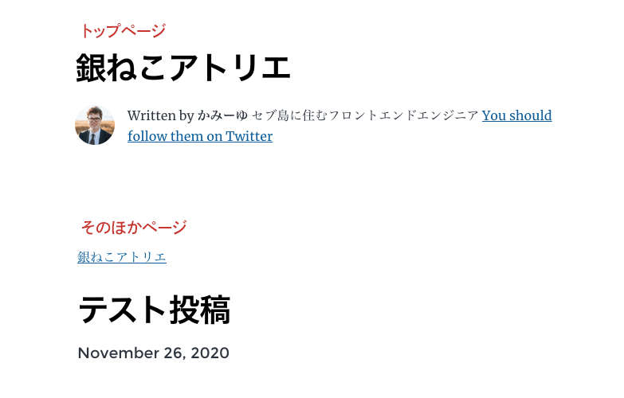
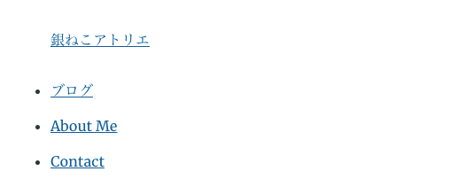
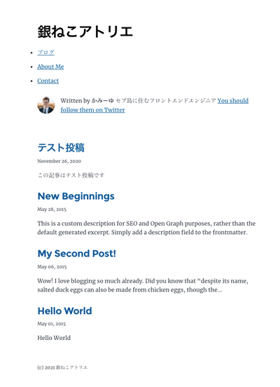
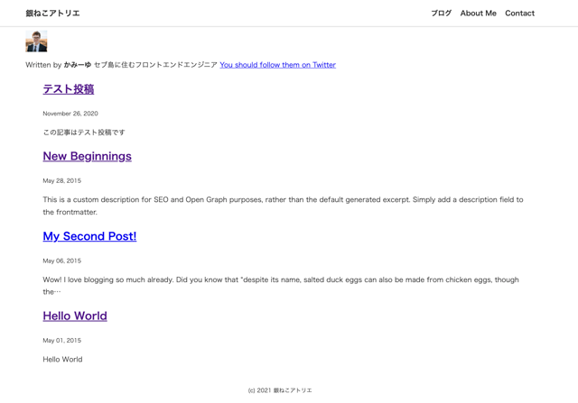

Gatsby Starter Blogを改造してヘッダーとフッターの追加の仕方について説明しました。今回はプラグイン・styled-componentsを使って装飾しつつコンポーネントを作って読み込む方法をご紹介します。

<p><small>※ v4バージョンアップに伴い追加した記事です。v4以外ではうまく動かない可能性があります。</small></p>
<prof></prof>


## 今までのGatsbyの記事と注意点
現在ここまで記載しています。<br>制作するまでを目標にUPしていくので順を追ったらGatsbyサイトが作れると思います。

1. [インストールからNetlifyデプロイまで](/blogs/entry401/)
2. *ヘッダーとフッターを追加する*（←イマココ）
2. [投稿テンプレにカテゴリやらメインビジュアル（アイキャッチ）追加](/blogs/entry406/)
3. [ブログ記事、カテゴリ、タグ一覧の出力](/blogs/entry408/)
4. [プラグインを利用して目次出力](/blogs/entry410/)
5. [プラグインナシで一覧にページネーション実装](/blogs/entry413/)
6. [個別ページテンプレート作成](/blogs/entry416/)
7. [プラグインHelmetでSEO調整](/blogs/entry418/)
8. [CSSコンポーネントでオリジナルページを作ろう！！](/blogs/entry421/)
9. [関連記事一覧出力](/blogs/entry430/)
11. [タグクラウドコンポーネントを作成する](/blogs/entry486/)
13. [記事内で独自タグ（コンポーネント）を使えるようにする](/blogs/entry489/)

<toc id="/blogs/entry484/"></toc>

このシリーズは[Github・gatsby-blog](https://github.com/yuririn/gatsby-blog/)に各内容ブランチごとで分けて格納しています。

今回は[add-header-footer](https://github.com/yuririn/gatsby-blog/tree/add-header-footer)にあります。

### このシリーズではテーマGatsby Starter Blogを改造します
この記事は一番メジャーなテンプレート、 Gatsby Starter Blogを改造しています。同じテーマでないと動かない可能性があります。

## 骨格になるコンポーネントにヘッダーとフッターを追加

```
プロジェクト/
  ├ gatsby-node.js（追記）
  └ src/
     └ components/
       ├ layout.js（編集）
       ├ footer.js（追加）
       └ header.js（追加）
```
Gatsby Starter Blog は layout というコンポーネントで全体のレイアウト管理されています。

今回はここにヘッダーとフッター用の子コンポーネントを追加します。

## header.js 作成
まずは、headerから作ります。components/配下に格納します。

```js:title=header.js
import * as React from "react"

const Header = ({ location }) => {}
export default Header
```

### headerにサイトの名前を表示できるようにする
トップページ以外はヘッダーのサイトタイトルにトップページに戻れるリンクを付与します。

リンクを貼るために `Link` コンポーネントを使います。

gatsby-config.jsから`siteMetadata`情報を取得。サイトタイトルを出力します。

```js:title=header.js
import * as React from "react"
// Linkコンポーネント追加
import { Link } from "gatsby"
//このサイトの基本情報を取得
import { siteMetadata } from "../../gatsby-config"

const Header = ({ location }) => {
  const rootPath = `${__PATH_PREFIX__}/`
  const isRootPath = location.pathname === rootPath
  let siteName

  //トップページ以外はトップへのリンク
  if (isRootPath) {
    siteName = <h1>{siteMetadata.title}</h1>
  } else {
    siteName = (
      <p>
        <Link to={rootPath}>{siteMetadata.title}</Link>
      </p>
    )
  }
  return <header>{siteName}</header>
}
export default Header
```
### Layout コンポーネントに子コンポーネントHeaderを読み込む
layout.jsを改造し、Headerコンポーネントをインポートします。

以下コードをすべて削除します。
```js:title=layout.js
let header

if (isRootPath) {
  header = (
    <h1 className="main-heading">
      <Link to="/">{title}</Link>
    </h1>
  )
} else {
  header = (
    <Link className="header-link-home" to="/">
      {title}
    </Link>
  )
}
```
全体のコードはこちら。
```js:title=layout.js
import * as React from "react"
import { Link } from "gatsby"
import Header from "./header"

const Layout = ({ location, title, children }) => {
  const rootPath = `${__PATH_PREFIX__}/`
  const isRootPath = location.pathname === rootPath

  return (
    <div className="global-wrapper" data-is-root-path={isRootPath}>
      <Header location={location} />
      <main>{children}</main>
      <footer>
        © {new Date().getFullYear()}, Built with
        {` `}
        <a href="https://www.gatsbyjs.com">Gatsby</a>
      </footer>
    </div>
  )
}
export default Layout
```
スタイルが入っていないので見た目は悪いですが、こんな感じになりました。


### ナビゲーションを作成
まだページはありませんが、ナビゲーションの追加方法を紹介しておきます。

```js:title=header.js
import * as React from "react"
import { Link } from "gatsby"

import { siteMetadata } from "../../gatsby-config"

const Header = ({ location }) => {
  const rootPath = `${__PATH_PREFIX__}/`
  const isRootPath = location.pathname === rootPath
  let siteName
  if (isRootPath) {
    siteName = <h1>{siteMetadata.title}</h1>
  } else {
    siteName = (
      <p>
        <Link to={rootPath}>{siteMetadata.title}</Link>
      </p>
    )
  }
  return (
    <header>
      {siteName}
      <nav>
        <ul>
          <li>
            <Link to="/blogs/">ブログ</Link>
          </li>
          <li>
            <Link to="/about/">About Me</Link>
          </li>
          <li>
            <Link to="/contact/">Contact</Link>
          </li>
        </ul>
      </nav>
    </header>
  )
}
export default Header
```
追加できました。


## フッターを追加

footer.js を追加し、header同様読み込みます。

```js:title=footer.js
import * as React from "react"

import { siteMetadata } from "../../gatsby-config"

const Footer = () => {
  return (
    <footer>
      <p>
        <small>(c) 2021 {siteMetadata.title}</small>
      </p>
    </footer>
  )
}
export default Footer
```
layout.jsに読み込む。
```js:title=layout.js
import * as React from "react"
import Header from "./header"
import Footer from "./footer"

const Layout = ({ location, title, children }) => {
  const rootPath = `${__PATH_PREFIX__}/`
  const isRootPath = location.pathname === rootPath

  return (
    <div className="global-wrapper" data-is-root-path={isRootPath}>
      <Header location={location} />
      <main>{children}</main>
      <Footer />
    </div>
  )
}
export default Layout
```

今回はシンプルに、コピーライトのみとしましたが、header.jsのコードを参考にお好みでナビゲーションやSNSのリンクを追加してください。

## せっかくなのでスタイルを入れてみる
仕上がったもののスタイルが当たってなくて限りなくダサいです。

せっかくなのでスタイルを当てます。



### 汎用スタイルをstyle.cssに書く
```
プロジェクト/
  ├ gatsby-browser.js
  └ src/
     └ style.css（編集）
```
cssはgatsby-browser.jsを通じて読み込まれています。必要な場合はこちらに追加します。
```js{7}:title=gatsby-browser.js
// custom typefaces
import "typeface-montserrat"
import "typeface-merriweather"
// normalize CSS across browsers
import "./src/normalize.css"
// custom CSS styles
import "./src/style.css"

// Highlighting for code blocks
import "prismjs/themes/prism.css"
```

今回はstyle.cssをいじるだけです。デザインがテンプレ臭いので中身をまるっと削除し書き直すだけ。

ここには共通で使う変数や汎用的に使うスタイルだけを書いていきます。

```css:title=style.css
:root {
  --font: font-family: "游ゴシック体", YuGothic, "游ゴシック", "Yu Gothic", "メイリオ", "Hiragino Kaku Gothic ProN", "Hiragino Sans", sans-serif;
  --black: #333;
}
html {
  font-size: 62.5%;
}
body {
  --font: var(--font);
  font-weight: 500;
  line-height: 1.8;
  font-size: 1.6rem;
  color: var(--black);
}

.container {
  max-width: 1180px;
  margin: 0 auto;
  padding: 10px 15px;
}
```
### プラグインstyled-componentsでheaderを装飾
せっかくなので *styled-components* をインストールしてスタイルを当てましょう。

```bash:title=コマンド
npm i styled-components
```

header.js にstyled-componentsをインポートし、`<header>`タグを`<HeaderWrapper>`に変更します。

スタイルを当てるためにいくつかコードを編集します。

styled.タグ名でタグを指定でき、指定したタグ以下にスタイルを当てることができます。

```js:title=header.js
// 省略
import { siteMetadata } from "../../gatsby-config"

//↓追加
import styled from "styled-components"

const Header = ({ location }) => {
const Header = ({ location }) => {
  const rootPath = `${__PATH_PREFIX__}/`
  const isRootPath = location.pathname === rootPath
  let siteName

  if (isRootPath) {
    siteName = <h1 className="logo">{siteMetadata.title}</h1>
  } else {
    siteName = (
      <p className="logo">
        <Link to={rootPath}>{siteMetadata.title}</Link>
      </p>
    )
  }
  return (
    <HeaderWrapper>
      <div className="container">
        {siteName}
        <nav>
          <ul>
            <li>
              <Link to="/blogs/">ブログ</Link>
            </li>
            <li>
              <Link to="/about/">About Me</Link>
            </li>
            <li>
              <Link to="/contact/">Contact</Link>
            </li>
          </ul>
        </nav>
      </div>
    </HeaderWrapper>
  )
}
export default Header

const HeaderWrapper = styled.header`
  //ここにcssを記述していく
`
```
cssを追記します。*styled-components* を使うとSASSチックにかけます。
```js:title=header.js
const HeaderWrapper = styled.header`
  box-shadow: 0 1px 3px rgba(0, 0, 0, 0.2);

  .container {
    height: 40px;
    display: flex;
    align-items: center;
    justify-content: space-between;
  }

  .logo {
    font-size: 18px;
    margin: 0;
    font-weight: bold;

    a {
      text-decoration: none;
      color: var(--black);
    }
  }

  nav ul {
    margin: 0;
    list-style: none;
    display: flex;

    li {
      padding: 0 0 0 20px;

      a {
        text-decoration: none;
        color: var(--black);
        font-weight: bold;
      }
    }
  }
`
```
上記コードはかなり簡易的なので、ちゃんと装飾したい人はこちらの記事も参考にしてみてください。

<card id="/blogs/entry449/"></card>
### mainタグのみ装飾
このシリーズでは、少しずつGatsby Starter Blogを改造していくので、メイン部分は暫定でクラスを付与しておくだけにとどめます。

layout.jsの `main` に `className="container"` を追記します。

```js:title=layout.js
  return (
    <div data-is-root-path={isRootPath}>
      <Header location={location} />
      <main className="container">{children}</main>
      <Footer />
    </div>
  )
```

### footer も装飾する

footerも軽く装飾します。

```js:title=footer.js
import * as React from "react"

import { siteMetadata } from "../../gatsby-config"
import styled from "styled-components"

const Footer = () => {
  return (
    <FooterWrapper>
      <p>
        <small>(c) 2021 {siteMetadata.title}</small>
      </p>
    </FooterWrapper>
  )
}
export default Footer

const FooterWrapper = styled.footer`
  text-align: center;
`
```

まあ、まだまだダサいですけどなんとか見れるようになりました汗



### まとめ・パーツをコンポーネント化して管理
今回はヘッダーやフッターをコンポーネント化して管理できるようにしてみました。

次は「[投稿テンプレにカテゴリやらキービジュアル（アイキャッチ）追加](/blogs/entry406)」」です。

このブログをgatsbyでリニューアルしたのは昨年です。v4になってからいい意味でかなり変わったので、現在記事をリライト中です。

みなさんが順を追ってGatsbyでブログが更新できるようにGatsbyブログが更新できるように改善していきますので、引き続きよろしくお願いします。

最後までお読みいただきありがとうございました。
