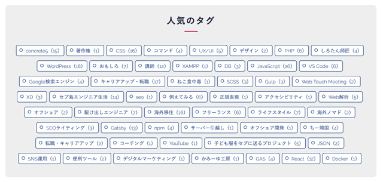
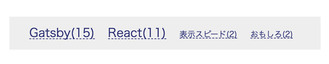
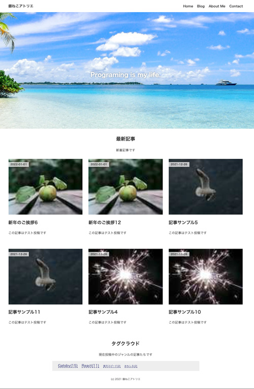

## 今までのGatsbyの記事と注意点
現在ここまで記載しています。<br>制作するまでを目標にUPしていくので順を追ったらGatsbyサイトが作れると思います。

1. [インストールからNetlifyデプロイまで](/blogs/entry401/)
2. [ヘッダーとフッターを追加する](/blogs/entry484/)
3. [投稿テンプレにカテゴリやらメインビジュアル（アイキャッチ）追加](/blogs/entry406/)
4. [ブログ記事、カテゴリ、タグ一覧の出力](/blogs/entry408/)
5. [プラグインを利用して目次出力](/blogs/entry410/)
6. [プラグインナシで一覧にページネーション実装](/blogs/entry413/)
7. [個別ページテンプレート作成](/blogs/entry416/)
8. [プラグインHelmetでSEO調整](/blogs/entry418/)
9. [CSSコンポーネントでオリジナルページを作ろう！！](/blogs/entry421/)
10. [関連記事一覧出力](/blogs/entry430/)
11. *タグクラウドコンポーネントを作成する*（←イマココ）
12. [パンくずリストを追加する](/blogs/entry487/)

このシリーズは[Github・gatsby-blog](https://github.com/yuririn/gatsby-blog/)に各内容ブランチごとで分けて格納しています。

今回は[add-header-footer](https://github.com/yuririn/gatsby-blog/tree/add-header-footer)にあります。

### このシリーズではテーマGatsby Starter Blogを改造します
この記事は一番メジャーなテンプレート、 Gatsby Starter Blogを改造しています。同じテーマでないと動かない可能性があります。

### 前提条件
> #### タグクラウドとは？
> タグクラウドとは、Webサイト上で各項目にメタデータとしてつけられたタグを、一挙に集めて視覚的に表示。
> 

この実装をするためには条件が必要です。

* 記事詳細のmarkdownファイルのfrontmatterに`tags`の設定があること
* タグごとに一覧が出力できること（[ブログ記事、カテゴリ、タグ一覧の出力](/blogs/entry408/)を参考にしてください）

## tag cloudを出力する用のファイルを追加

tag-cloud.jsを追加します。

```
プロジェクト/
  └ src/
     ├ template/
     |  └ blog-post.js（編集）
     └ components/
        └ tag-cloud.js（新規作成）
```
`Link`、`useStaticQuery`、`graphql`をインポートしておきます。
```js:title=tag-cloud.js
import * as React from "react"

import { Link, useStaticQuery, graphql } from "gatsby"

const TagCloud = () => {
  return ""
}

export default TagCloud
```
コンポーネントを読み込んでおきます。
```js{2,10}:title=tag-cloud.js
// 省略
import TagCloud from "../components/tag-cloud"

const BlogPostTemplate = ({ data, location }) => {
  // 省略

  return (
    <Layout location={location} title={siteTitle}>
      {/*省略*/}
      <TagCloud></TagCloud>
    </Layout>
  )
}
export default BlogPostTemplate
```
### QraghQLで必要なデータを取得しておく
```js:title=tag-cloud.js
const { allMarkdownRemark } = useStaticQuery(
  graphql`
    query {
      allMarkdownRemark(
        filter: { frontmatter: { pagetype: { eq: "blog" } } }
      ) {
        edges {
          node {
            frontmatter {
              tags
            }
          }
        }
      }
    }
  `
)
```

### 取得したデータをリスト出力するために加工
配列を形成し直します。リスト出力するために、配列を形成します。

こんな感じに形成したい。
```js
[{name: 'Gatsby', cnt: 15}, {name: 'React', cnt: 11}, {name: '表示スピード', cnt: 2}, {name: 'おもしろ', cnt: 2}]
```

なかなか複雑なコードになってしまいました。

1. `find`で同じ名前のタグがあるか調べ、あれば今あるキー:値の値のみを変更
2. 同じ名前のタグがなければ、新規でキー:値を`tags`に追加
3. `reduce`で配列の中身を加工しながら変数`tags`に格納

```js:title=tag-cloud.js
let tags = allMarkdownRemark.edges.reduce((tags, edge) => {
  const edgeTags = edge.node.frontmatter.tags
  if (edgeTags) {
    edgeTags.map(item => {
      if (tags.find(i => i.name === item)) {
        tags.filter(i => {
          if (i.name === item) {
            i.cnt += 1
          }
        })
      } else {
        tags = [...tags, { name: item, cnt: 1 }]
      }
    })
  }
  return tags
}, [])
console.log(tags)//デバッグして出力結果を確認
```
配列操作については以下記事にまとめてます。

<card id="/blogs/entry482/"></card>

HTMLを出力します。
```js:title=tag-cloud.js
if (!tags) {
    return <p>現在タグはありません。</p>
  }
  return (
    <ul>
      {tags.map(tag => {
        return (
          <li key={tag.name}>
            <Link to={`/blogs/tags/${tag.name}/`}>
              {tag.name}({tag.cnt})
            </Link>
          </li>
        )
      })}
    </ul>
  )
```

## 記事数に応じてタグのスタイルを変える
せっかくなので、タグの記事数に応じて文字サイズを変えてみます。

クラスを付与します。11以上あれば大きく見せ、3以下であれば小さくします。

```js
let size
if (tag.cnt > 10) {
  size = "lg"
} else if (tag.cnt < 4) {
  size = "sm"
}
```

styled-componentsでスタイリングする場合はプラグインをインストールしておきましょう。

```bash:title=コマンド
npm i styled-components
```
全体のコードです。

```js:title=tag-cloud.js
import * as React from "react"

import { Link, useStaticQuery, graphql } from "gatsby"

import styled from "styled-components"

const TagCloud = () => {
  const { allMarkdownRemark } = useStaticQuery(
    graphql`
      query {
        allMarkdownRemark(
          filter: { frontmatter: { pagetype: { eq: "blog" } } }
        ) {
          edges {
            node {
              frontmatter {
                tags
              }
            }
          }
        }
      }
    `
  )
  let tags = allMarkdownRemark.edges.reduce((tags, edge) => {
    const edgeTags = edge.node.frontmatter.tags
    if (edgeTags) {
      edgeTags.map(item => {
        if (tags.find(i => i.name === item)) {
          tags.filter(i => {
            if (i.name === item) {
              i.cnt += 1
            }
          })
        } else {
          tags = [...tags, { name: item, cnt: 1 }]
        }
      })
    }
    return tags
  }, [])

  if (!tags) {
    return <p>現在タグはありません。</p>
  }
  return (
    <TagCloudList>
      {tags.map(tag => {
        let size
        if (tag.cnt > 10) {
          size = "lg"
        } else if (tag.cnt < 4) {
          size = "sm"
        }
        return (
          <li key={tag.name} className={size}>
            <Link to={`/blogs/tags/${tag.name}/`}>
              {tag.name}({tag.cnt})
            </Link>
          </li>
        )
      })}
    </TagCloudList>
  )
}

export default TagCloud

const TagCloudList = styled.ul`
  list-style: none;
  background: #eee;
  padding: 10px 20px;
  max-width: 700px;
  margin: 0 auto;

  li {
    display: inline-block;
    padding: 5px 10px;
  }

  .sm {
    font-size: 1.2rem;
  }

  .lg {
    font-size: 1.8rem;
  }

  a {
    line-height: 1;
    color: rgb(41, 46, 114);
    display: block;
    text-decoration: none;
    border-bottom: dashed 1px rgb(41, 46, 114);

    &:hover {
      color: #bb1100;
      border-bottom-color: #bb1100;
    }
  }
`
```
タグクラウドがこんな感じで実装できました。



## おまけ・今までのGatsbyの11記事を参考にしつつトップページを整えた
Gatsbyでブログサイトを作る記事も11回目。そろそろ放置していたトップページも軽く整えました。

今まで紹介した方法で片付くので、詳しくは紹介しません。



ソースコードは[top-page](https://github.com/yuririn/gatsby-blog/tree/top-page)にありますので、そちらを参考にしてください。

## まとめ・タグクラウドも実装できた
配列操作のオンパレードでなかなか辛かったですがタグクラウドコンポーネントが完成しました！

次回は[パンくずリスト用のコンポーネント](/blogs/entry487/)を作ります。

最後までお読みいただきありがとうございました。


