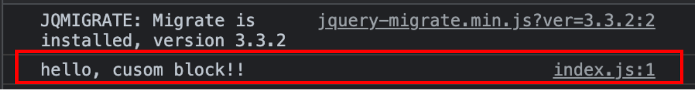
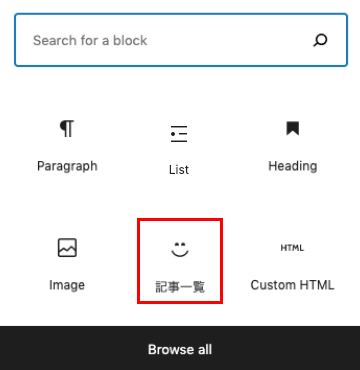
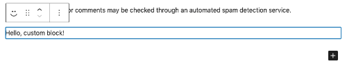
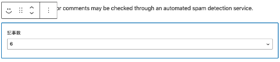
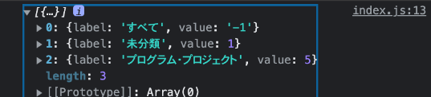
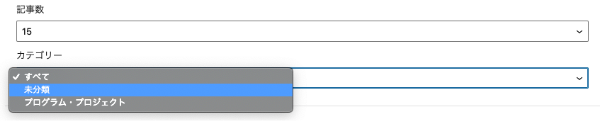
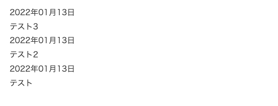

WordPressのテーマに組み込むブロックを作ってみました。

今回作ったのはGutenberg用の一覧出力ブロックです。ブロック用に環境構築し、WordPress管理画面（エディター側）は@wordpress/scriptsを使ってReactでREST APIでカテゴリーを取得したりしながら構築、フロント部分はPHPで出力してみました。

とーっても長いので目次を利用してすっ飛ばして読んでください。

<prof></prof>


## Gutenbergのブロックをテーマに組み込みます
たくさん探しましたが、巷では紹介されているのがプラグインとしてカスタムブロックを紹介されていたので今回はテーマに組み込むためのブロックとして紹介します。

### 前提条件
* WordPressでテーマやプラグインを構築したことがある
* React や JS は見よう見まねでもわかる
* npm、Webpack、gulpなんとなくわかる

## 環境を構築しよう！
まずはWorPress環境を構築しましょう！

WordPressはLocalなどのお手軽ツールでもいいのですが、Dockerでも作れます。

<card id="/blogs/entry480/"></card>

プレーンなコードを書いても実装できましたが、Reactを書くときイマイチだったので、今回は`@wordpress/scripts`を使って環境構築しました。
ちなみに`@wordpress/scripts`はWebpackベースです。

テーマ内にブロックを実装するためのディレクトリを作ります。
```
ルートディレクトリ/
  └ wp-content/
     ├ themes/
     └ your-theme/（実装したいテーマフォルダ）
      ├ functions.php（ブロックを読み込むため編集）
      └ new-block/（ここにブロックを作成します）
        ├ package.json（後ほどコマンドで作成）
        └ src/（新規追加）
          └ index.js（新規追加）
```
テーマを格納するディレクトリ`new-block`を自作テーマ内に作成し、ターミナルを開いてnew-blockまで移動します。
```bash:title=コマンド
cd new-block
```
package.json作成
```bash:title=コマンド
npm init -y
```

```json:title=package.json
{
  "name": "new-block",
  "version": "1.0.0",
  "description": "",
  "main": "index.js",
  "scripts": {
    "test": "echo \"Error: no test specified\" && exit 1"
  },
  "keywords": [],
  "author": "",
  "license": "ISC"
}
```
このディレクトリに`@wordpress/scripts`をインストールします。
> WordPress開発用に調整された再利用可能なスクリプトのコレクションです。便宜上、このパッケージで提供されるすべてのツールには、統合された推奨構成が付属しています。<br>
> [@wordpress/scripts | WordPress.org](https://developer.wordpress.org/block-editor/reference-guides/packages/packages-scripts/)


```bash:title=コマンド
npm i @wordpress/scripts -D
```

インストール後にnode_modules/が追加されます。

nodeのバージョンが17.xの場合インストールでWebpackとの相性でコケるかもです。

その際は以下コマンドで乗り切れます。次バージョンで解消されるはずです。

```bash:title=コマンド
export NODE_OPTIONS=--openssl-legacy-provider
```

上記でうまく動かない場合は、前述のコマンド後、`node_modules` ディレクトリを削除、以下コマンド後 `npm install` or `npm i` を実行してみてください。
```bash:title=コマンド
npm cache clean --force
```
### mini-css-extract-pluginでこける場合
下記のようなエラーが出た場合はmini-css-extract-pluginのバージョンが足りてないことがあるので、
```
[webpack-cli] TypeError: MiniCSSExtractPlugin is not a constructor
```
バージョン上げてあげてください。
```bash:title=コマンド
npm i -D --save-exact mini-css-extract-plugin@2.4.5
```

## ブロックをスクリプトで出力する
ブロックをスクリプトで出力するためには、いくつか設定し直す必要があります。

### package.json に npm スクリプトを登録する
インストールできたらWordPress開発用のnpmスクリプトを走らせるためのコード（script）を追記します。
```json{7}:title=package.json
{
  "name": "new-block",
  "version": "1.0.0",
  "description": "",
  "main": "index.js",
  "scripts": {
    "start": "wp-scripts start"
  },
  "keywords": [],
  "author": "",
  "license": "ISC",
  "devDependencies": {
    "@wordpress/scripts": "19.2.2"
  }
}
```
開発用コードです。デフォでは以下のように案内していることも多いですが
```json
"start": "wp-scripts start"
```

```bash:title=実行するコマンド
npm start
```
スクリプトは書き換えることも可能です。

```json:title=package.json
"block:live": "wp-scripts start"
```

```bash:title=実行するコマンド
npm run block:live
```
ファイルが登録できたら、`src`ディレクトリを作り`index.js`を格納しましょう。<br>
今回は、ファイルがバンドルされて出力されるところまで確認したいだけなので`index.js`には以下のようなコードを書いておきます。

```js:title=index.js
  console.log('hello, cusom block!!');
```
そして、コマンド実行してみましょう。build以下ディレクトリが作成されます。
```
ルートディレクトリ/
  └ wp-content/
    └ themes/
      ├ functions.php
      └ your-theme/
        └ new-block/
          ├ package.json
          ├ src/
          |  └ index.js
          └ build/（新規作成される）
             ├ index.js
             ├ index.js.map
             └ index.assets.php
```

#### ターゲットと出力するディレクトリを変えたい時
ターゲットと出力したいフォルダを変えたいときは以下のように書けます。開発モードの場合。

```json
"start": "wp-scripts start block/index.js --output-path=block/build"
```
製品（リリース）モードの場合。

```json
"wp:build": "wp-scripts build block/index.js --output-path=block/build",
```

### ブロックをプロダクション用に出力する場合
本番用の場合はコードを圧縮します。

package.jsonにスクリプトを追加しておきます。

```json:title=package.json
"build": "wp-scripts build",
```
以下コマンドで、コードは圧縮されます。
```bash:title=実行するコマンド
npm run buld
```

## 自作ブロックをテーマの一部として funcions.php に読み込む
ブロックのファイルをfuncions.phpに読み込みます。

```php:title=functions.php
/**
 * My New Block.
 */
function my_new_block() {
	$asset_file = include __DIR__ . '/new-block/index.asset.php';

	wp_enqueue_script(
		'my-new-block-script',
		get_theme_file_uri( '/new-block/build/index.js' ),
		$asset_file['dependencies'],
		$asset_file['version'],
		true
	);
}
add_action( 'enqueue_block_editor_assets', 'my_new_block' );
```
公式ではフックに `init`を使ってますが、`enqueue_block_editor_assets` はブロックエディターが読み込まれる際に呼び出され、`wp_enqueue_script` で指定したJSファイルをエンキューできます。

どこでもいいのでエディター画面でリロードし、開発者ツールなどでデバッグ内容が取得できているか確認します。



index.asset.phpにはブロック用のJSを使うために必要な情報が自動で出力されます。

```php:title=index.asset.php
<?php return array('dependencies' => array(), 'version' => 'c3eeb99a5f31cf29f838e513e0bdaf63');
```
現在はろくにコードを書いてないので`dependencies`は空ですが、出力した情報を取り出して使います。

```php
$asset_file['dependencies'],
$asset_file['version']
```
## エディター側のブロック出力
src/index.jsを書き換えてみます。

ポイントはブロック名が他のものと被らないよう、**ユニークな名前をつける**よう心がけてください。

```js:title=index.js
import { registerBlockType } from "@wordpress/blocks";

registerBlockType("mybloc/list-block", {
  title: "記事一覧",
  icon: "smiley",
  category: "layout",
  edit: () => <div>Hello, custom block!</div>,
  save: () => <div>Hello, custom block!</div>,
});
```

エディターにアイコンとラベルを確認できました。


実際動作確認をしてみます。まずは静的ですが、入力できました。


アイコンを変えたいときは、こちらを参考にしてください。
[Dashicons](https://developer.wordpress.org/resource/dashicons/)

アイコン名がdashicons-list-viewであれば *dashicons-* を取り除いて使えばOKです。

```js
icon: "list-view",
```

## 記事一覧をGutenberg側から登録するコードを書く
今回は、いくつかのコンポーネントを使って作成します。

条件は以下です。
* 1ページに表示するのは最大30ページ
* カテゴリーごとでも絞り込める

### 出力できる記事数の出力制限を設定
コードを大幅に書き換えます。

出力する記事数のデフォルトは6とします。

`InspectorControls`を使って、サイドバーからページ数やカテゴリーを操作できるようにします。
`PanelBody`、`NumberControl`を使って見た目を整えます。

```js:title=index.js
import { registerBlockType } from "@wordpress/blocks";
import {
  PanelBody,
  __experimentalNumberControl as NumberControl,
} from "@wordpress/components";
import { InspectorControls } from "@wordpress/block-editor";

registerBlockType("mybloc/list-block", {
  title: "記事一覧",
  icon: "smiley",
  category: "layout",
  attributes: {
    cnt: {
      type: "number",
      default: 6,
    },
  },
  edit: ({ attributes, setAttributes }) => {
    return (
      <>
        <InspectorControls>
          <PanelBody>
            <NumberControl
              label="表示数"
              isShiftStepEnabled="true"
              shiftStep="1"
              min="1"
              max="30"
              value={attributes.num}
              onChange={(value) => setAttributes({ num: parseInt(value) })}
            />
          </PanelBody>
        </InspectorControls>
        <p style={{ padding: `20px`, backgroundColor: `#eee` }}>ここに{attributes.num}記事の一覧が出力されます。</p>
      </>
    );
  },
});

```
エディターのサイドバーと記事入力部分はこんな仕上がりになりました。



挿入されたブロックは動的に値が変化します。

少し解説です。blockから動的に値を設定するために `attributes` を設定する必要があります。

デフォ値も設定しておきます。

```js
attributes: {
  cnt: {
    type: "number",
    default: 6,
  },
},
```

type（型）は以下から選択可能です。
|値|意味|
|-|-|
|*null*|値なし|
|*boolean*|ブール、真偽値(true or false)|
|*object*|オブジェクト型|
|*array*|配列|
|*string*|文字列|
|*integer*|9桁または10桁の精度の整数|
|*number (same as integer)*|integerと一緒|

<br>値はセレクトボックスを通すと型がstring（文字列）に変わるので、`perseInt` で `number`（整数）に戻しています。**型が一致しないと保存できないので注意です**。

```js
parseInt(value)
```

`NumberControl` は、数字入力専用のコンポーネントです。ここではざっくりしか紹介してないので、プロパティの使い方は *Block Editor Handbook* を見てみてください。

[NumberControl](https://developer.wordpress.org/block-editor/reference-guides/components/number-control/)

```js:title=NumberControl
<NumberControl
  label={ラベル}
  isShiftStepEnabled={シフト（十字キーとか）入力できるようにする}
  shiftStep={シフトで進む数}
  min={最小}
  max={最大}
  value={値}
  onChange={変更があった時の処理}
/>
```

値がエディター側で保存できるか確認しておきましょう。

### @wordpress/api-fetchを使ってカテゴリーを取得して絞り込めるようにする
`@wordpress/api-fetch`を使ってカテゴリー一覧を取得します。

```js{6}:title=index.js
// 省略
import {
  PanelBody,
  __experimentalNumberControl as NumberControl,
} from "@wordpress/components";
import apiFetch from "@wordpress/api-fetch";
// 省略
```
`apiFetch`を呼び出し、REST APIを利用してカテゴリー一覧を取得できるようにします。

取得した値を必要なものだけ`categories`に`SelectControl`の`option`に合ったキーの配列にして格納します。
```js{3-8}:title=index.js
import apiFetch from "@wordpress/api-fetch";

const categories = [{ label: "すべて", value: -1 }];
apiFetch({ path: "/wp/v2/categories?_fields=name,slug,id" }).then((cates) => {
  cates.forEach((cate) => {
    categories.push({ label: cate["name"], value: cate["id"] });
  });
});
console.log(categories);//デバッグ

registerBlockType("mybloc/list-block", {
  // 省略
```
出力結果はこちら。



カテゴリーはコンポーネント`SelectControl`を使ってセレクトボックスを出力します。
```js{5,10-15,21-26,30}:title=index.js
// 省略
import {
  PanelBody,
  __experimentalNumberControl as NumberControl,
  SelectControl,
} from "@wordpress/components";
// 省略
registerBlockType("mybloc/list-block", {
  edit: ({ attributes, setAttributes }) => {
    const getCate = categories.filter((i) => {
      if (i.value === attributes.cateid) {
        return i;
      }
    });
    const textCate = attributes.cateid !== -1 ? `「カテゴリー・${getCate[0].label}」` : "";
    return (
      <>
        <InspectorControls>
          <PanelBody>
            {/*省略*/}
            <SelectControl
              label="カテゴリー"
              value={attributes.cateid}
              options={categories}
              onChange={(value) => setAttributes({ cateid: value })}
            />
          </PanelBody>
        </InspectorControls>
        <p style={{ padding: `20px`, backgroundColor: `#eee` }}>
          ここに{textCate}
          {attributes.num}記事の一覧が出力されます。
        </p>
      </>
    );
  },
});
```


`SelectControl` は、セレクトボックス用のコンポーネントです。ここではざっくりしか紹介してないので、プロパティの使い方は *Block Editor Handbook* を見てみてください。
[SelectControl](https://developer.wordpress.org/block-editor/reference-guides/components/select-control/)
```js:title=SelectControl
<SelectControl
  label={ラベル}
  value={値}
  options={[オプションに追加する配列]}
  onChange={変更に関する条件}
/>
```
### index.js すべてのコード
ここまでのすべてのコードです。
```js:title=index.js
import { registerBlockType } from "@wordpress/blocks";
import {
  PanelBody,
  SelectControl,
  __experimentalNumberControl as NumberControl,
} from "@wordpress/components";
import apiFetch from "@wordpress/api-fetch";
import { InspectorControls } from "@wordpress/block-editor";

const categories = [{ label: "すべて", value: -1 }];

apiFetch({ path: "/wp/v2/categories?_fields=name,slug,id" }).then((cates) => {
  cates.forEach((cate) => {
    categories.push({ label: cate["name"], value: cate["id"] });
  });
});

registerBlockType("mybloc/list-block", {
  title: "記事一覧",
  icon: "smiley",
  category: "layout",
  attributes: {
    cnt: {
      type: "number",
      default: 6,
    },
    cateid: {
      type: "number",
      default: -1,
    },
  },
 edit: ({ attributes, setAttributes }) => {
   const getCate = categories.filter((i) => {
      if (i.value === attributes.cateid) {
        return i;
      }
    });
    const textCate = attributes.cateid !== -1 ? `「カテゴリー・${getCate[0].label}」` : "";
    return (
      <>
        <InspectorControls>
          <PanelBody>
            <NumberControl
              label="表示数"
              isShiftStepEnabled="true"
              shiftStep="1"
              min="1"
              max="30"
              value={attributes.num}
              onChange={(value) => setAttributes({ num: parseInt(value) })}
            />
            <SelectControl
              label="カテゴリー"
              value={attributes.cateid}
              options={categories}
              onChange={(value) => setAttributes({ cateid: value })}
            />
          </PanelBody>
        </InspectorControls>
        <p style={{ padding: `20px`, backgroundColor: `#eee` }}>
          ここに{textCate}
          {attributes.num}記事の一覧が出力されます。
        </p>
      </>
    );
  },
});
```

## 表面サイト側の出力を実装
今度はサイトの表側の実装です。

本来であれば[エディター側のブロック出力](#エディター側のブロック出力)で書いた`save`のところが表面に出力されるべき箇所なのですが、今回はPHPで出力しますので削除しました。

```js{8}:title=index.js
import { registerBlockType } from "@wordpress/blocks";

registerBlockType("mybloc/list-block", {
  title: "記事一覧",
  icon: "smiley",
  category: "layout",
  edit: () => <div>Hello, custom block!</div>,
  save: () => <div>Hello, custom block!</div>,
});
```
### functions.phpに記事一覧を出力するコードを書く

index.jsで作成した `mybloc/list-block` の値を受け取ります。


```php:title=functions.php
register_block_type(
	'mybloc/list-block',
	array(
		'attributes'      => array(
			'num'    => array(
				'type' => 'string',
			),
			'cateid' => array(
				'type' => 'string',
			),
		),
		'render_callback' => function( $attr, $content = '' ) {
			$attr = wp_parse_args(
				$attr,
				array(
					'num'    => 0,
					'cateid' => -1,
				)
			);
			return '';
		},
	)
);
```

`wp_parse_args`はデフォルト値を定義しておける関数です。

```php
$defaults = array(
	'type' => 'post',
	'before' => "<p>",
	'after' => "</p> \n",
	'echo' => TRUE
);
$args = wp_parse_args( $args, $defaults );
```

こちらが一覧記事を出力するすべてのコードです。
```php:title=functions.php
register_block_type(
	'mybloc/list-block',
	array(
		'attributes'      => array(
			'cnt'    => array(
				'type' => 'number',
			),
			'cateid' => array(
				'type' => 'number',
			),
		),
		'render_callback' => function ( $attr, $content = '' ) {
			$attr = wp_parse_args(
				$attr,
				array(
					'cnt'    => 0,
					'cateid' => -1,
				)
			);

			$args = array(
				'orderby'        => 'date',
				'order'          => 'DESC',
				'post_status'    => 'publish',
				'post_type'      => 'post',
				'posts_per_page' => $attr['cnt'],
			);
			//cateid がすべてじゃない場合カテゴリidで絞り込む
			if ( -1 !== $attr['cateid'] ) {
				$args['cat'] = $attr['cateid'];
			}

			$archive   = '';
			$the_query = new WP_Query( $args );

			if ( $the_query->have_posts() ) {
				while ( $the_query->have_posts() ) {
					$the_query->the_post();
					$archive .= '<li><a href="' . get_the_permalink() . '">';
					$archive .= '<time datetime="' . get_the_date( 'Y-m-d' ) . '">' . get_the_date( 'Y年m月d日' ) . '</time>';
					$archive .= '<h3>' . get_the_title() . '</h3>';
					$archive .= '</a></li>';
				}
					$archive = '<ul>' . $archive . '</ul>';

			} else {
				$archive = '<p>記事はありません</p>';
			}
			wp_reset_postdata();
			//出力
			return $archive;
		},
	)
);
```
cssは入っていないので、こんな感じに仕上がりました。



## まとめ・Gutenbergのブロックエディタで一覧を作るためにはReactに慣れておいた方が無難
今回ブロックを作って思ったのが、Reactに慣れておくと作るのが楽だと思いました。

いろんな作り方があると思いますが、今回は初学者でもできそうな感じで実装してみました。

プラグイン無し、ブロックエディタでの文字装飾ボタンの追加方法を紹介しています！

<card id="/blogs/entry499/"></card>

この記事がみなさんのコーディングライフの一助となれば幸いです。

最後までお読みいただきありがとうございました。


