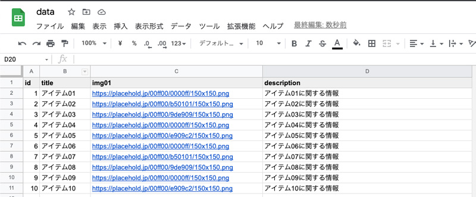
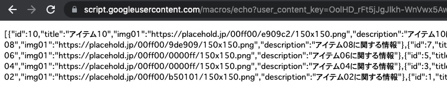
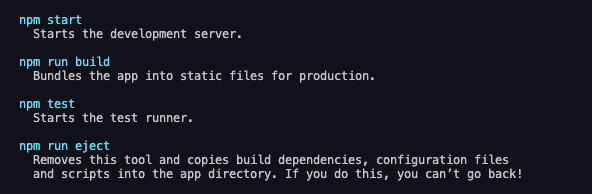
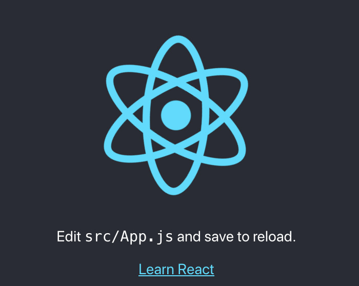
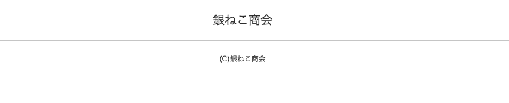
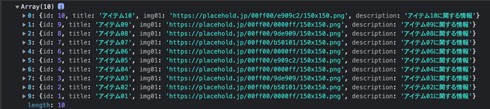
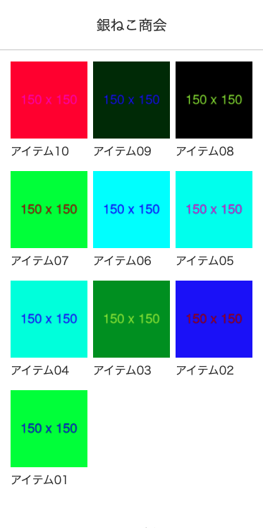
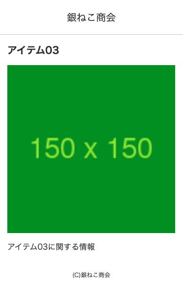

## 前提条件
前提条件は以下です。
* アイテム一覧のようなページを一度に量産する
* ページ情報のスプシが準備できる
* レンサバが準備できる
* npmコマンドが使える
* JSが分かりある程度Reactを使ったことがある

## スプシの準備
先にスプシを準備します。


以下のような構成でセルに情報を入力していきます。

|id|title|img01|description|
|-|-|-|-|
|1|アイテム01|https://....png|アイテム01の情報|

データができたら、GASでデータをJSON化します。その後、デプロイしてURLを取得します。

```js:title=GAS
const SPREAD_SHEET_ID = [スプシのID];
const SHEET_NAME = 'items';//スプシのシート名
function doGet() {
  const app = SpreadsheetApp.openById(SPREAD_SHEET_ID);
  const sheet = app.getSheetByName(SHEET_NAME);
  const last = parseInt(sheet.getRange(1, 1).getNextDataCell(SpreadsheetApp.Direction.DOWN).getRow());
  const labels = sheet.getRange( 1,1,1,4).getValues()[0]
  const values = sheet.getRange( 2,1, last-1, 4).getValues().reverse();
  data = values.map(arry=>{
    param = {}
    arry.map((item, num)=>{
      param[labels[num]] = item;
    })
    return param;
  })

  const result = ContentService.createTextOutput();
  result.setMimeType(ContentService.MimeType.JSON);
  result.setContent(JSON.stringify(data));
  return result
}
```

取得したURLを叩いてブラウザで表示すると、以下のような値が返ってきたらOK。<br>JSONデータ作成の下準備終了です。



GASツールの開き方、デプロイやURLの取得方法に関してはこちらに詳しく記載してあるので参考にしてください。

<card id="/blogs/entry481/"></card>

## React の開発環境を構築
Reactのドキュメントを参考に開発環境を作成します。

[新しい React アプリを作る - React](https://ja.reactjs.org/docs/create-a-new-react-app.html)

```bash:title=コマンド
npx create-react-app my-app
```
インストールが終わったら、使えるコマンドが表示されます。

今回はstartとbuildの2個のコマンドを使って進めていきます。




my-app/というディレクトリーが作成されるので、そのディレクトリをVS Codeなどのエディターで開きます。
### 開発環境を走らせる

Reactで開発できる状態にします。タスクランナーでコンパイル・ライブリロードしながら開発できるようになります。
```bash:title=コマンド
npm start
```
localhost:3000にアクセスすると、以下のようなページが表示されます。



タスクランナーを止めたい時はCtrl+C（Mac）。

### プロダクション（本番用）データを出力
開発したデータを本番用データにコンパイルするコマンドはこちら。

```bash:title=コマンド
npm run build
```

## まずはベースのテンプレを作成
srcディレクトリ配下にあるApp.jsを編集します。
```
my-app/
  └ src/
    ├ App.css（編集）
    ├ index.css（編集）
    ├ logo.svg
    ...
    └ App.js（編集）
```

今回はindex.cssを編集してリセットCSSとしました。
<br>コリスさんがリセットCSSをまとめてるので必要に応じてお好みのものを使ってください。

[2022年、現在の環境に適したCSSリセットのまとめ](https://coliss.com/articles/build-websites/operation/css/css-reset-for-modern-browser.html)

App.jsを書き換えます。とりあえずheaderとfooterだけ編集しました。後でheaderとfooterの間に入るコンテンツを入れていきます。

ついでにアロー関数で書き直しちゃいます。

```js:title=App.js
import "./App.css";

const App = () => {
  return (
    <div className="App">
      <header className="App-header">
        <h1>銀ねこ商会</h1>
      </header>
      <footer className="App-header">
        <p>
          <small>(C)銀ねこ商会</small>
        </p>
      </footer>
    </div>
  );
}
export default App;
```

CSSも編集。
```css:title=App.css
.App {
  min-height: 100vh;
  color: #333;
}

.App-header {
  font-size: 20px;
  padding: 20px;
  text-align: center;
  border-bottom: 1px solid #ccc;
}

.App-footer {
  padding: 20px;
  text-align: center;
  font-size: 12px;
}
```

簡易的ですがヘッダーとフッター完成。



## axios でJSONデータ取得
まずは *axios* のインストールします。

```bash:title=コマンド
npm i axios
```
```
src/
  └ App.js（編集）
```
App.jsを編集して、*axios* でJSONデータを取得します。

```js{2-3}:title=App.js
import "./App.css";
import React, { useState, useEffect } from "react";
import axios from "axios";
//省略
```
*useState* と *useEffect* も使ってJSONデータを取得します。
```js{2-15}:title=App.js
// 省略
const App = () => {
  const [itemList, setList] = useState([]);
  useEffect(() => {
    const url =[GASで取得したURL];
    axios
      .get(url)
      .then((res) => {
        setList(res.data);
      })
      .catch((error) => {
        console.log(error);
      });
  }, [setList]);
  console.log(itemList);//出力確認
  // 省略
}
export default App;
```

デバッグしてデータが取得できたか確認できたので、次はこのデータを加工して表示します。



このデータはアイテム一覧と詳細、両方で使います。

## 一覧とアイテム詳細ページ作成
一覧とアイテムのパーツを出力する、コンポーネント用のファイルを作ります。
```
src/
  ├ components/（新規作成）
  | ├ List.js（新規作成）
  | └ Item.js（新規作成）
  ...
  └ App.js（編集）
```
### react-router-dom でページのパスを設定

*react-router-dom* でページのパスを設定します。

* 一覧ページ（/（ルートディレクトリ））
* アイテム詳細ページ（/items/id）

*react-router-dom* をインストールします。
```bash:title=コマンド
npm i react-router-dom
```
*react-router-dom* は現時点最新版のv6.2.1をインストールしました。巷に出回っているものとは記述方法が変わってます。チュートリアルがあるので、以下URLを参考に。

[Tutorial](https://github.com/remix-run/react-router/blob/main/docs/getting-started/tutorial.md)

```js{4-5,14-20}:title=App.js
import "./App.css";
import React, { useState, useEffect } from "react";
import axios from "axios";
import { BrowserRouter, Routes, Route } from "react-router-dom";
import List from "./components/List";

const App = () => {
  // 省略
  return (
    <div className="App">
      <header className="App-header">
        <h1>銀ねこ商会</h1>
      </header>
      <main>
        <BrowserRouter>
          <Routes>
            <Route path="/" element={<List />} />
          </Routes>
        </BrowserRouter>
      </main>
      <footer className="App-footer">
        <p>
          <small>(C)銀ねこ商会</small>
        </p>
      </footer>
    </div>
  );
};

export default App;
```
List.jsに仮のコードを追加して、表示されるか確かめます。
```js:title=List.js
const List = () => {
  return <p>一覧</p>;
};
export default List;
```
### propを使わずに取得したJSONデータを子コンポーネントに渡す
createContextを使って、親（App）=>子（List）コンポーネントに値を渡します。

createContextを使うと、データの受け渡しが超簡単です。

```js{1,8,10}:title=App.js
import { useState, useEffect, createContext } from "react";
export const ItemList = createContext();

const App = () => {
  // 省略
  <Route
    path="/"
    element={
      <ItemList.Provider value={itemList}>
        <List />
      </ItemList.Provider>
    }
  />
  // 省略
}
export default App;
```
子コンポーネントで値を受け取り、値が取得できているか確認します。
```js{1-2,4}:title=List.js
import { useContext } from "react";
import { ItemList } from "../App";
const List = () => {
  const itemList = useContext(ItemList);
  console.log(itemList);//値が取得できるか確認
  return <p>aaa</p>;
};
export default List;
```
データが取得できていることを確認できたら、出力してみましょう！
```js:title=List.js
import { useContext } from "react";
import { Link } from "react-router-dom";
import { ItemList } from "../App";
const List = () => {
  const itemList = useContext(ItemList);

  if (itemList.length !== 0) {
    return (
      <ul className="App-list">
        {itemList.map((item, index) => {
          return (
            <li key={`item${index}`}>
              <Link to={`item/${item.id}`}>
                
                <h2>{item.title}</h2>
              </Link>
            </li>
          );
        })}
      </ul>
    );
  } else {
    return <p style={{ textAlign: "center" }}>読み込み中・・・</p>;
  }
};
export default List;
```
わーい、ちょいキモだけど出力できましたー。


```js
import { Link } from "react-router-dom";

// 省略
<Link to={`item/${item.id}`}>
// 省略
</Link>
```
ポイントはLinkコンポーネントを呼び出して、遷移先を設定しているところです。

では次は詳細ページのベースを作ります。

### 各ページidをパラメーターとして受け取る
Item.jsを編集してアイテム詳細を表示できるようにします。
```
src/
  ├ components/
  | ├ List.js
  | └ Item.js（編集）
  ...
  └ App.js（編集）
```
App.jsにList.js同様、ルーティングを追加します。
```js{2,18-26}:title=App.js
// 省略
import Item from "./components/Item";

const App = () => {
  // 省略
  return (
    // 省略
    <BrowserRouter>
      <Routes>
        <Route
          path="/"
          element={
            <ItemList.Provider value={itemList}>
              <List />
            </ItemList.Provider>
          }
        />
        <Route
          exact
          path="/item/:id"
          element={
            <ItemList.Provider value={itemList}>
              <Item />
            </ItemList.Provider>
          }
        />
      </Routes>
    </BrowserRouter>
    // 省略
  );
};

export default App;
```
パラメーターは*react-router-dom*の*useParams*を利用して取得可能です。

List.js同様、*useContext*で親コンポーネントからJSONデータを取得します。
```js:title=App.js
import { useContext } from "react";
import { useParams } from "react-router-dom";
import { ItemList } from "../App";
const Item = () => {
  const itemList = useContext(ItemList);
}
export default Item;
```
*useParams*を使ってパラメーターを取得し、JSONデータと一致するものだけ取り出して、ページに表示します。
```js{6-7,10-22}:title=App.js
import { useContext } from "react";
import { useParams } from "react-router-dom";
import { ItemList } from "../App";
const Item = () => {
  const itemList = useContext(ItemList);
  const params = useParams();
  const item = itemList.find((i) => i.id === parseInt(params.id));

  if (itemList.length !== 0) {
    return (
      <div className="App-item">
        <h2 className="App-item-title">{item.title}</h2>
        
        <p className="App-item-description">{item.description}</p>
      </div>
    );
  } else {
    return <p style={{ textAlign: "center" }}>読み込み中・・・</p>;
  }
};
export default Item;
```
出力できました！わーい。

すべてのCSSです。


```css:title=App.css
.App {
  min-height: 100vh;
  color: #333;
}
.App-header {
  font-size: 20px;
  padding: 20px;
  text-align: center;
  border-bottom: 1px solid #ccc;
}

.App-footer {
  padding: 20px;
  text-align: center;
  font-size: 12px;
}
.App-main {
  padding: 16px;
  max-width: 750px;
  margin: 0 auto;
}
.App-main img {
  max-width: 100%;
  height: auto;
}
.App-list {
  display: flex;
  flex-wrap: wrap;
  margin-left: -4px;
  margin-right: -4px;
}
.App-list li {
  width: 33.333%;
  padding: 0 4px 16px;
}

.App-item .App-item-title {
  font-weight: bold;
  margin-bottom: 16px;
  font-size: 20px;
}

.App-item .App-item-img {
  display: block;
  width: 100%;
  margin-bottom: 16px;
}

```
## titleタグなどをreact-helmetで設定する
*react-helmet*を使ってSEO詳細情報を追加します。<br>
*react-helmet*をインストールします。
```bash:title=コマンド
npm i react-helmet
```
SEO情報を`Helmet`コンポーネント内に格納します。
```js:title=Item.js
// 省略
import { Helmet } from "react-helmet";
  // 省略
  return (
    // 省略
      <div className="App-item">
        <Helmet>
          <title>{item.title} | かみーゆ商会</title>
          <meta name="description" content={item.description} />
        </Helmet>
      </div>
    // 省略
  )
};
```
同様にList.jsにも`Helmet`コンポーネントを追加すれば、ヘッダー内のtitleや説明を自由に編集できるようになります。

実はタイトルや説明はpublicディレクトリにあるindex.htmlへ直書きされています。

titleタグや説明のタグなどは不要なので削除しましょう。

## レンタルサーバーなどに直にアップする
サーバーに直にアップ用のファイルを出力します。

```bash:title=コマンド
npm run build
```
buildディレクトリが生成されます。
```
my-app/
  ├ src/
  ├ build/（新規自動生成）
  └ public/
```
buildが終わると、正しく動いてるか確認するために`serve`で調べるようにすすめられます。

入ってない場合はインストールします。その他の方法で確認できるようであれば無理にインストールする必要はありません。
```bash:title=コマンド
serve i -g
```
以下コマンドでまずは表示が大丈夫か確認します。
```bash:title=コマンド
serve -s build
```

buildディレクトリの中身をサーバーにアップします。

ファビコンなど変更が必要なものを適宜変更します。

### URLを直接叩くとアクセスできない？.htaccessの設定を忘れずに

buildディレクトリの中身だけをUpするだけでは、トップページを経由しないと他のページに直接アクセスできなくなります。

*React-router-dom*でページがある風になっているものの、物理的にはindex.htmlしかありません。

なので.htaccessで必ずindex.htmlを経由するように設定します。

```md:title=.htaccess
RewriteEngine On
RewriteCond %{REQUEST_FILENAME} !-f
RewriteCond %{REQUEST_FILENAME} !-d
RewriteRule ^ index.html
```

これでURLを直接叩いても他のページにアクセスできるようになります。

## おまけ404ページ追加
404ページの追加方法です。`Switch`を使う方法が数多く紹介されていますが、新しい`react-router-dom`ではいたってシンプルな方法で追加できます。
```
src/
  ├ pages/
  | └ NotFound.js（新規追加）
  ...
  └ Apps.js（編集）
```
App.jsに404用の設定を追加します。

```js:title=App.js
// 省略
import NotFound from "./pages/NotFound";

const App = () => {
// 省略
  return (
    // 省略
    <BrowserRouter>
      <Routes>
      // 省略
        <Route path="*" element={<NotFound />} />
      </Routes>
    </BrowserRouter>
    // 省略
  )
// 省略
}
```
NotFound.jsのコードはこんな感じ。
```js:title=NotFound.js
import { Link } from "react-router-dom";
const NotFound = () => {
  return (
    <>
      <h2>404 Page Not Found</h2>
      <p>お探しのページは見つかりませんでした。</p>
      <Link to="/">ページの先頭に戻る</Link>
    </>
  );
}
export default NotFound;

```
## まとめ・モジュールを駆使すればページ量産は難しくない
今回、モジュールやGoogleのサービスを利用して省エネでページが量産できるものを作ってみましたが思った以上に簡単でした。<br>案件とリソースを照らし合わせた時、いかにリソースを節約していいプロダクトを作れるかって重要だなぁと思いつつ、今後の自分の糧となるように記事にまとめましたが。。。

この記事が皆さんのコーディングライフの一助となれば幸いです。

最後までお読みいただきありがとうございました。
