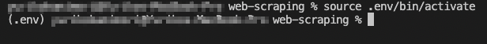
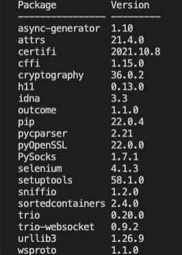
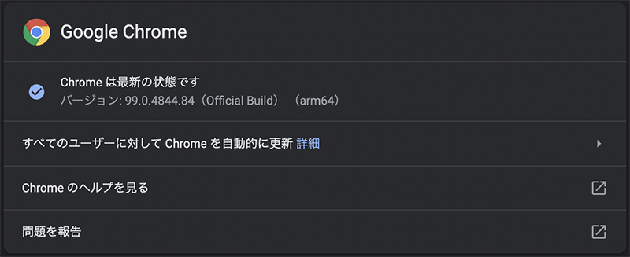
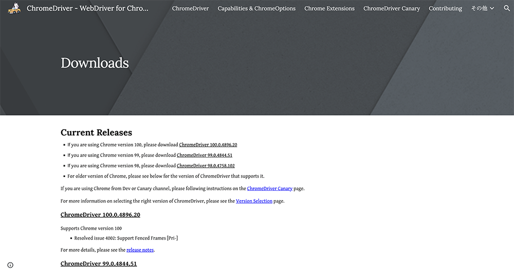
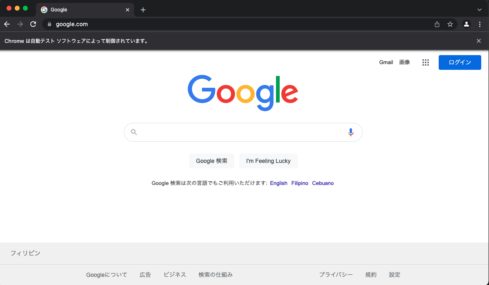
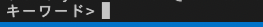
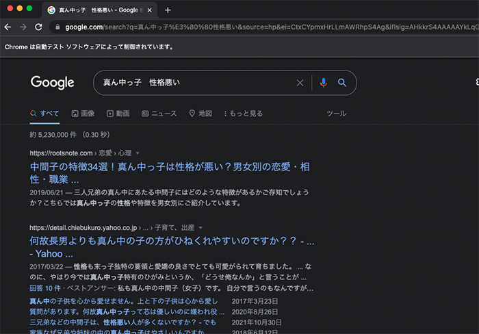

## 前提条件

<msg txt="今回はインストールとかの説明を省きます。ちなみにパソコン買い替えたてでM1チップで検証しました。"></msg>

自分のマシーンのpythonはPython 3.10.4です。

homebrew経由でインストールしました。バージョンは以下コマンドで確認できます。

<small>windowsは多少コマンドが違うのでご注意ください。</small>

```bash:title=コマンド
python3 -V
```
Macだと以下コマンドだと2系になるので注意です。

```bash:title=コマンド
python -V
```
## 仮想環境を作る

コマンドでルートディレクトリに移動しておきます。
```
web-scraping/（ルートディレクトリ）
  └ .env/（自動でできる）
```

グローバルにあれこれ入れたくないので仮想環境を作ります。

pythonには仮想環境を作るコマンドが用意されています。<br>コマンドを実行します。

```bash:title=コマンド
python3 -m venv .env
```
.envディレクトリが自動生成されます。

### 仮想環境を実行する
```bash:title=コマンド
source .env/bin/activate
```
コマンドを実行をすると、頭に(.env)が付きます。

仮想環境をディアクティベート。
```bash:title=コマンド
deactivate
```
## 検索結果を python で取得する
web-scraping.pyファイルを追加します。
pythonのファイルの拡張子は`.py`になります。
```
web-scraping/（ルートディレクトリ）
  ├ .env/
  └ web-scraping.py（新規作成）
```

今回はselenium を使ってchromeを操作し特定のキーワードを検索、検索結果を取得します。
selenium は python のライブラリの一つでブラウザを操作できるライブラリです。

ライブラリからは複数のモジュールが呼び出せます。

モジュールはライブラリをインストールしなくても使えるものもあります。

### ライブラリ selenium をインストール
selenium を仮想環境にインストールします。

```bash:title=コマンド
pip3 install selenium
```
以下コマンドでインストールされたパッケージが確認できます。
```bash:title=コマンド
pip3 list
```

アンインストールしたい場合。

```bash:title=コマンド
pip3 uninstall -y selenium
```
### webdriver で Chrome を操作する
seleniumからwebdriverをimportします。
今回はwebdriverを使ってChromeを操作します。

現在使用しているChromeのバージョンと同じものをDLします。
バージョンはGoogle Chromeを起動して調べることができます。




以下よりダウンロード。

https://chromedriver.chromium.org/downloads



chromedriverはdriverディレクトリに格納しておきます。

```
web-scraping/（ルートディレクトリ）
  ├ .env/
  ├ driver/chromedriver
  └ web-scraping.py（新規作成）
```
まずはwebdriverを使ってChromeを起動できるか確認してみましょう。

```python:title=web-scraping.py
import time
from selenium import webdriver
from selenium.webdriver.chrome import service
from selenium.webdriver.chrome.options import Options

url = 'https://www.google.com'
interval = 5
options = Options()
options.add_argument('--window-size=1200,700')
driver_path = 'driver/chromedriver'
chrome_service = service.Service(executable_path=driver_path)
driver = webdriver.Chrome(service=chrome_service, options=options)
time.sleep(interval)
driver.get(url)
time.sleep(interval)
driver.close()
```

以下コマンドを実行します。
```bash:title=コマンド
python3 web-scraping.py
```
Chromeが立ち上がり、5秒後に閉じるはずです。


```python
driver_path = 'driver/chromedriver'
chrome_service = service.Service(executable_path=driver_path)
options = Options()
options.add_argument('--window-size=1200,700')
driver = webdriver.Chrome(service=chrome_service, options=options)
```
optionsでウィンドウサイズなどの設定し、serviceを使ってchromedriverを呼び出します。

各設定はまとめて読み込みます。

```python
driver = webdriver.Chrome(service=chrome_service, options=options)
```

```python
time.sleep(interval) # 5秒スリープ
driver.get(url) # Chromeのホーム画面を開く
time.sleep(interval) # 5秒スリープ
driver.close() # driverを閉じる
```
intervalの値を変えるとスリープ時間を調整できます。あまり短縮しすぎると、処理が追いつかないこともあるので注意です。

Byを追加し、要素を操作します。
```python{3,9-13}:title=web-scraping.py
# 省略
from selenium.webdriver.chrome.options import Options
from selenium.webdriver.common.by import By #追加

url = 'https://www.google.com'
# 省略
time.sleep(interval)

search_string = input('キーワード> ')

driver.find_element(By.NAME, 'q').send_keys(search_string)
driver.find_elements(By.NAME, 'btnK')[1].click()
time.sleep(interval)
driver.close() # 最後の行に移動
```
実行。
```bash:title=コマンド
python3 web-scraping.py
```
対話形式でキーワードを入力。


検索できました。


`https://www.google.com`にアクセスして要素を検証してみると、検索のinputタグのname属性は`q`。送信ボタンのname属性は`btnK`です。同じname属性のボタンが2個あるので2つ目を取得。

chromedriverを使って取得したinputタグ（検索窓）にキーワードを入力、検索ボタンをクリックさせる操作をしています。

### 100件分の検索結果を取得し、配列（リスト）に格納
pythonでは単純な配列をリスト、連想配列をディクショナリーと呼ぶようです。

```python{5-24}:title=web-scraping.py
# 省略
driver.find_elements(By.NAME, 'btnK')[1].click()
time.sleep(interval)

results = []
flag = False
while True:
  g_ary = driver.find_elements(By.CLASS_NAME,'g')
  for g in g_ary:
    result = {}

    if g.find_element(By.TAG_NAME, 'h3').text != '' and g.find_element(By.CLASS_NAME,'yuRUbf').find_element(By.TAG_NAME,'a').get_attribute('href') != '':
        result['url'] = g.find_element(By.CLASS_NAME,'yuRUbf').find_element(By.TAG_NAME,'a').get_attribute('href')
        result['title'] = g.find_element(By.TAG_NAME,'h3').text
        results.append(result)
    if len(results) >= 100:
      flag = True
      break
  if flag:
    break
  driver.find_element_by_id('pnnext').click()
  time.sleep(interval)
driver.close() # 最後の行に移動
```
検索内容一個一個がクラス`g`に格納されているの取得し、ループ処理をします。
```python
g_ary = driver.find_elements(By.CLASS_NAME,'g')
for g in g_ary:
  # ここに処理
```
URLとタイトルを格納したディクショナリをリストに格納します。

タイトルとリンクが取得できたもののみ格納し、リストresultの長さが100になるまで繰り返します。

```python
result = {}
if g.find_element(By.TAG_NAME, 'h3').text != '' and g.find_element(By.CLASS_NAME,'yuRUbf').find_element(By.TAG_NAME,'a').get_attribute('href') != '':
  result['url'] = g.find_element(By.CLASS_NAME,'yuRUbf').find_element(By.TAG_NAME,'a').get_attribute('href')
  result['title'] = g.find_element(By.TAG_NAME,'h3').text
  results.append(result)
if len(results) >= 100:
  break
driver.find_element(By.ID,'pnnext').click()
time.sleep(interval)
```

## 取得したデータをcsvに格納
取得したデータをcsvに格納します。

csv作成するだけでなく、命名時にタイムスタンプを付与したいので2つのモジュールを読み込みます。

```python{2-3,8-14}:title=web-scraping.py
# 省略
import csv
from datetime import datetime

# 省略
driver.close()

if len(results) > 0:
  timestamp = datetime.isoformat(datetime.now())
  with open(f'output_{timestamp}.csv', 'w') as f:
    writer = csv.writer(f)
    writer.writerow(["URL", "title"])
    for result in results:
      writer.writerow([result["url"], result["title"]])
```
実行すると`output_2022-03-29T19:28:27.837116.csv`みたいな感じでfileができます。

## いちいちブラウザが開くのは面倒
いちいちブラウザが開くのが鬱陶しいときは、optionsに`--headless`を追加します。

```python
options.add_argument('--headless')
```

## pythonは記述方法が簡潔で初心者には敷居が低いかも
python書いてみた感想は記述方法が簡潔でビギナーでもとっつきやすい言語だと感じました。
<msg txt="コマンド操作さえ乗り越えられればね！"></msg>

今回はスクレイピングをご紹介しましたが、対象サイトや負荷を書けてしまう場合違法だったりもするので注意しましょう。
<br>Twitterなんかはスクレイピング禁止みたいですしね。


今はpandasの勉強中なのでまたブログにしようと思います。

ぜひもっと仕事を自動化し、効率化できる役に立つサンプルをご紹介できたら幸いです。

皆さんのコーディングライフの一助となれば幸いです。<br>最後までお読みいただきありがとうございました。

