## ハンバーガーメニュー、レパートリーほしいよね
<msg txt="ハンバーガーメニューいつも一緒で飽きますよね？"></msg>

実はハンバーガーメニューは類似のメニューボタンもあわせてレパートリーがたくさんあります。

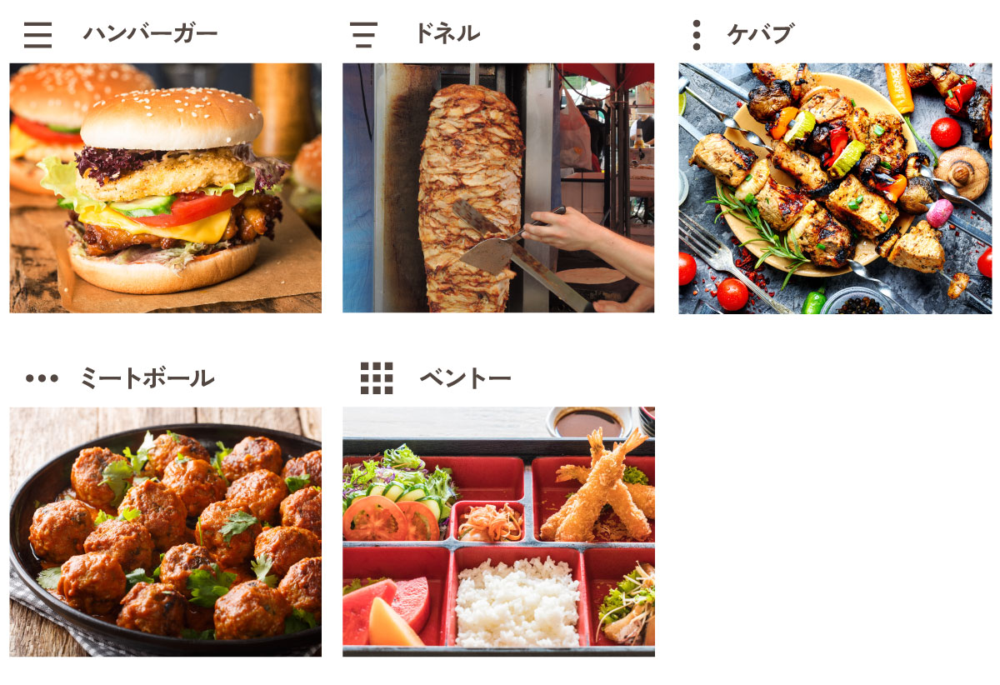

そこで、自分のレパートリーも増やすためにいくつかサンプルを作ってみました。

<br>グローバルメニューアニメーションやパンくずリストのサンプルあるのであわせてお読みください。
<card id="/blogs/entry449/"></card>

<card id="/blogs/entry498/"></card>

### 以下ご注意ください
* タグの入れ子はできるだけせず、可能な限り疑似要素を駆使しています
* アクセシビリティを考慮した要素などは含まれておりません
* 本記事ではコードが長くなるため、サンプルを外部サービス（CodePen）で用意しました
* 説明が必要な部分のみ、本記事でコードを紹介してあります
* サンプルでのスタイルの実装はSASS記法で書かれています
* サンプルはバニラJSを使用してあります

## そもそもハンバーガーメニューってなんぞ？
ハンバーガーメニューって何？って思っている方のためにそこから説明いたします。

ウェブサイトって主要なメニューを通常ヘッダーに配置するのですが、スマホになるとPCに比べ面積が小さくなってしまうのでメニューが邪魔になります。

そこで生まれたのがメニューの表示非表示をコントロールするメニューボタンです。

たいてい右上か左上に配置されています。

ハンバーガーメニューと言われる理由は三本の線が、*バンズ（パン）に挟まれた具のよう* だからみたいです。

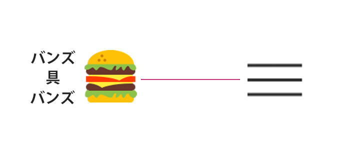

ボタンでメニューを表示すると大抵ボタンそのものがアニメーションで×になるものが王道です。

<msg txt="ボタンが×になるともう一回押したら閉じるよ！的なことが伝わりますよね？"></msg>

## ハンバーガーメニュー
ハンバーガーメニューを作ってみましょう。

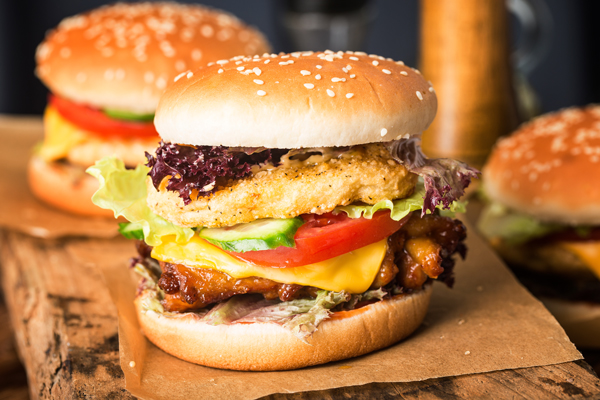

### 王道のハンバーガーメニュー
皆さんがよく見かけるであろうハンバーガーメニューの実装方法をご紹介します。

JSでクリックでクラスをつけたり外したりし、CSSでアニメーションさせます。

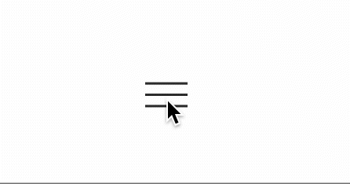

ボタンのHTMLのコードはこれだけです。

```html:title=HTML
<button class="c-nav-btn" type="button"></button>
```

疑似要素`after`、`before`と`box-shadow`を使って三本線を作り出します。

```css:title=css
.c-nav-btn {
  height: 44px;
  width: 44px;
  position: absolute;
  background: none;
  border: none;
}

.c-nav-btn::after,
.c-nav-btn::before {
  position: absolute;
  top: calc(50% - 1px);
  content: '';
  width: 30px;
  height: 2px;
  display: block;
  background: #333;
}

.c-nav-btn::before {
  transform: translateY(-8px);
  box-shadow: 0 8px 0 #333;
}

.c-nav-btn::after {
  transform: translateY(8px)
}
```
JSでボタンのクラスをつけたり外したりします。

```js:title=JavaScript
const navBtn = document.querySelector('.c-nav-btn')

navBtn.addEventListener("click", function(){
  navBtn.classList.toggle("is-active")
})
```
jQueryが使いたい方はコードを以下のように書き直してください。
```js:title=jQuery
$('.c-nav-btn').on("click", function(){
  $(this).toggleClass("is-active")
})
```

`transform: rotate()`で回転させて、`transiton`でアニメーションさせます。
```css:title=css
.c-nav-btn::after,
.c-nav-btn::before {
  transition: transform .3s;
}
.c-nav-btn.is-active::before {
  transform: rotate(45deg);
  box-shadow: none;
}
.c-nav-btn.is-active::after {
  transform: rotate(-45deg);
}
```

デモとサンプルコードはこちら（SCSS記法です）。

[Basic hamburger menu | Code Pen](https://codepen.io/camille-cebu/pen/WNdzMYO)


### 王道のハンバーガーメニュー180°回転プラス
更に親要素の回転を増やして勢いをつけます。

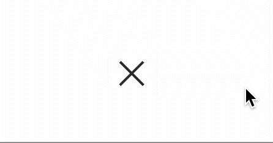

先程のコードに、少しコードを足します。

```css:title=css
.c-nav-btn {
  transition: transform .3s;
}
.c-nav-btn.is-active{
  transform: rotate(180deg);
}
```
デモとサンプルコードはこちら（SCSS記法です）。

[180 rotate hamburger menu | Code Pen](https://codepen.io/camille-cebu/pen/QWamQJM)

### コロコロ転がるハンバーガー
王道のハンバーガーメニュー180°回転プラスにアニメーションのタイミングを更にずらしてアレンジします。

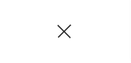
```css:title=css
.c-nav-btn {
  overflow: hidden;
}
.c-nav-btn::after, .c-nav-btn::before {
  transform-origin: center;
  content: "";
  width: 30px;
  height: 2px;
  display: block;
  background: #333;
}
.c-nav-btn::before {
  transition: 0.3s linear;
  margin-bottom: 8px;
  box-shadow: 0 8px 0 #333;
}
.c-nav-btn::after {
  transition: 0.3s 0.3s linear;
  margin-top: 15px;
}
.c-nav-btn.is-active {
  transform: rotate(45deg);
}
.c-nav-btn.is-active::before {
  margin-bottom: -1px;
  transform: rotate(90deg);
  box-shadow: none;
}
.c-nav-btn.is-active::after {
  margin-top: -1px;
  transform: rotate(180deg);
}
```
デモとサンプルコードはこちら（SCSS記法です）。

[Rolling hamburger menu | Code Pen](https://codepen.io/camille-cebu/pen/ZEvoEQM)
### ちょっと斜めったハンバーガーメニュー
`transform`の`skew`を使って少し斜めったメニューボタンにします。

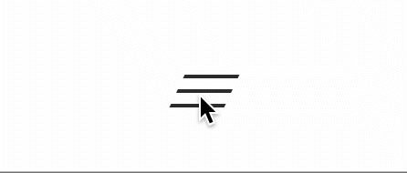

skewとは斜めとか歪めるという意味です。

`skew`の影響で右側のボーダーが細くなるので少し太くします。
```css:title=css
.c-nav-btn {
  transform: skew(-25deg);
}

.c-nav-btn.is-active::after {
  height: 3px;
  transform: rotate(-45deg);
}
```

### 棒の真ん中に一度集まって取り消しマークになる
`animation`を使って、ボタンをクリックすると三本線が中央に集まり、真ん中でばってんになるアニメーションを実現してみました。

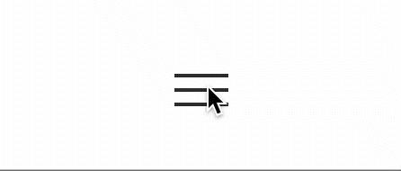

```html:title=HTML
<button class="c-nav-btn" type="button"></button>
```
`transition`だとヨーヨーのようにアニメーションを繰り返すだけで、きれいにタイミングをあわせられません。

アクティブ時、非アクティブ時の状態をそれぞれ`keyframes`で作成することでいい感じのアニメーションができます。

```css:title=css
..c-nav-btn::after, .c-nav-btn::before {
  position: absolute;
  top: calc(50% - 1px);
  content: "";
  width: 30px;
  height: 2px;
  display: block;
  background: #333;
}
.c-nav-btn::before {
  transform: translateY(-8px);
  box-shadow: 0 8px 0 #333;
  animation: top 0.7s forwards;
}
.c-nav-btn::after {
  transform: translateY(8px);
  animation: bottom 0.7s forwards;
}
.c-nav-btn.is-active::before {
  animation: top-active 0.7s forwards;
}
.c-nav-btn.is-active::after {
  animation: bottom-active 0.7s forwards;
}

@keyframes top {
  0% {
    box-shadow: none;
    transform: translateY(0px) rotate(45deg);
  }
  50% {
    box-shadow: none;
    transform: translateY(0px) rotate(0);
  }
  100% {
    transform: translateY(-8px) rotate(0);
  }
}
@keyframes top-active {
  0% {
    transform: translateY(-8px) rotate(0);
  }
  50% {
    box-shadow: none;
    transform: translateY(0px) rotate(0);
  }
  100% {
    box-shadow: none;
    transform: translateY(0px) rotate(45deg);
  }
}
@keyframes bottom {
  0% {
    box-shadow: none;
    transform: translateY(0px) rotate(-45deg);
  }
  50% {
    box-shadow: none;
    transform: translateY(0px) rotate(0);
  }
  100% {
    transform: translateY(8px) rotate(0);
  }
}
@keyframes bottom-active {
  0% {
    transform: translateY(8px) rotate(0);
  }
  50% {
    box-shadow: none;
    transform: translateY(0px) rotate(0);
  }
  100% {
    box-shadow: none;
    transform: translateY(0px) rotate(-45deg);
  }
}
```

サイト読み込み時のアニメーションが発動するのを止めます。

HTMLに予めクラスを付与し、
```html:title=HTML
<button class="c-nav-btn load" type="button"></button>
```
ボタンを操作するまではアニメーションさせないようにしておき、
```css:title=css
.c-nav-btn.load {
  &::before,
  &::after {
    animation: none;
  }
}
```
クリック時にJSでクラスを外します。
```js:title=JavaScript
navBtn.addEventListener("click", function(){
  navBtn.classList.toggle("is-active")
  navBtn.classList.remove("load")
  // jQueryは以下に置き換え
  // $(this).removeClass("load")
})
```

デモとサンプルコードはこちら（SCSS記法です）。

[Bended border hamburger menu | Code Pen](https://codepen.io/camille-cebu/pen/OJzvZoY)

### アクセシビリティ抜群ハンバーガーメニュー
ハンバーガーメニューの難点はそれがメニューだということがわかりにくいことです。

なので、本来ラベルや枠線で囲ってあげるのが親切です。

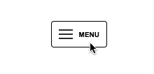

ラベルを追加し、
```html:title=HTML
<button class="c-nav-btn" type="button">MENU</button>
```
ラベル用のスタイルや枠を追加、色もアクティブ時には反転させます。
```css:title=css
.c-nav-btn {
  font-weight: bold;
  height: 38px;
  width: 80px;
  display: flex;
  align-items: center;
  position: relative;
  justify-content: flex-end;
  background: none;
  padding: 10px;
  font-size: 10px;
  border: 1px solid #000;
  border-radius: 4px;
  transition: all .3s;
}
.c-nav-btn.is-active {
  background: #333;
  color: #fff;
}
.c-nav-btn.is-active::after,
.c-nav-btn.is-active::after {
    background: #fff;
}
```
クリック時にJSでラベルを差し替えます。
```js:title=JavaScript
navBtn.addEventListener("click", function(){
  navBtn.classList.toggle("is-active")
  navBtn.textContent = navBtn.textContent == "CLOSE" ? "MENU" : "CLOSE"
  // jQueryは以下に置き換え
  // $(this).text($(this).text() == "CLOSE" ? "MENU" : "CLOSE")
})
```
デモとサンプルコードはこちら（SCSS記法です）。

[Accesibility hamburger menu | Code Pen](https://codepen.io/camille-cebu/pen/ExoLxvB)

## トルコの伝統料理由来のドネルメニュー
ドネルケバブというトルコの伝統料理があり、そこから名付けられたのが**ドネルメニュー**。

ドネルケバブ自体は垂直に味付けしたお肉を焼く料理で、でっかいものは写真のように焼けた部分から順次肉を削いで食べます。

お肉の形は下の方からこそいでいくので、下になればなるほど細くなるかたちがにているのでドネルメニューになったそう。

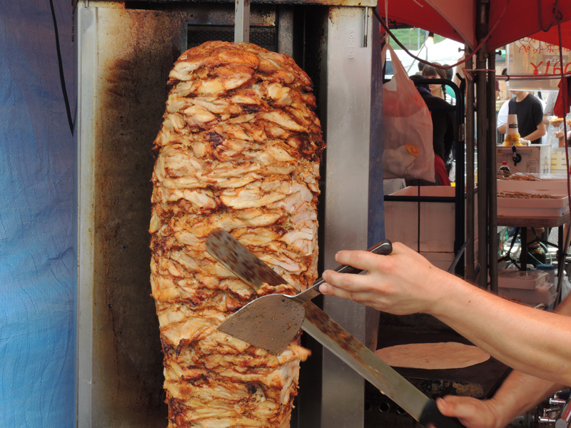

### linear-gradientで作るドネルメニュー

バックグラウンドは何重にも重ねることができるのでlinear-gradientを使ってドネルメニューを作ってみます。

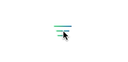

```css:title=css
.c-nav-btn::before {
  position: absolute;
  top: 16px;
  content: '';
  left: 2px;
  width: 40px;
  height: 30px;
  display: block;
  background: linear-gradient(90deg, rgba(80,230,121,1) 0%, rgba(0,139,209,1) 100%) center top / 30px 2px no-repeat,linear-gradient(90deg, rgba(80,230,121,1) 0%, rgba(0,139,209,1) 100%) center 8px / 22px 2px no-repeat,linear-gradient(90deg, rgba(80,230,121,1) 0%, rgba(0,139,209,1) 100%) center 16px / 18px 2px no-repeat;
  transition: .2s;
}
.c-nav-btn::after {
  position: absolute;
  top: 10px;
  transform: rotate(45deg) translate(50%, -50%);
  content: '';
  left: 2px;
  width: 40px;
  height: 30px;
  display: block;
  opacity: 0;
  background: linear-gradient(90deg, rgba(80,230,121,1) 0%, rgba(0,139,209,1) 100%) center / 30px 2px no-repeat, linear-gradient(90deg, rgba(80,230,121,1) 0%, rgba(0,139,209,1) 100%) center / 2px 30px no-repeat;
  transition: .2s;
}

.c-nav-btn.is-active::before{
  opacity: 0;
  transform: translateX(-30%);
}
.c-nav-btn.is-active::after {
  opacity: 1;
  transform: rotate(45deg) translate(0, 0);
}
```

デモとサンプルコードはこちら（SCSS記法です）。

[Gradient doner menu | Code Pen](https://codepen.io/camille-cebu/pen/vYpjEXp)

### 二本線のドネルメニュー
タイミングをずらして、二本のボーダーをスライドさせ、バッテンを作ります。

メニューの文字も同じようにCSSでスライドさせています。

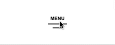

2つのアニメを0.5秒ずつずらします。

本来以下のようなアニメーションを0.5秒ずらしたいのですが、複雑なアニメーションは`animation`で設定しないとうまくいきません。

なので、`@keyffames`で待機時間を作ります。

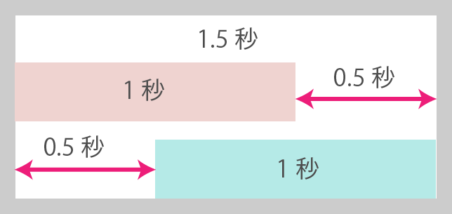

1秒のアニメーションを0.5秒の待機時間を設けて1.5秒で実行します。

アニメーションの設定は *0％から100％* なので、**100 ÷ 150 = 0.6666** となります。

待機時間を`@keyffames`のパーセンテージに落とし込むと **0.5 × 0.6666 × 100 = 33.3333％** になります。

*最初にアニメーションさせる要素は66.6666％で終わらせ* 、*次にアニメーションさせる要素は33.3333％付近から始める* とぴったりタイミングが合います。

一度待機時間無しでアニメーションを作成して、いい感じになったらパーセンテージを計算し直しました（スプシの関数などを使うとかんたんに計算できます）。

カスタムデータに「CLOSE」用のラベルを格納し、
```html:title=HTML
<button class="c-nav-btn load" type="button">
  <span data-label="CLOSE" class="c-nav-btn__label">MENU</span>
</button>
```
`attr`関数でカスタムデータを取り出して出力しています。
```css:title=css
[data-label]{
  transition: .5s 1s;
  box-sizing: border-box;
  width: 88px;
  position: absolute;
  left: -44px;
  top: 0;
  display: block;
  padding-left: 44px;
  text-align: center;
}
[data-label]::after {
  box-sizing: border-box;
  position: absolute;
  left: 0;
  top: 0;
  width: 44px;
  display: block;
  content: attr(data-label);
}
.c-nav-btn.is-active .c-nav-btn__label {
  left: 0;
}
```
フルのCSSのコードは長いです。

デモとサンプルコード詳細は以下から（SCSS記法です）ご確認ください。

[2 border Doner menu | Code Pen](https://codepen.io/camille-cebu/pen/oNpddXY)


## トルコの串焼きから由来ケバブメニュー
通常のケバブは先程のドネルケバブよりも小さく串焼きにしたものを言います。


### バッテンマークをマイナスマークに変えたケバブメニュー

シンプルにバッテンをマイナスに替えただけのケバブメニュー。


コード自体は[棒の真ん中に一度集まって取り消しマークになる](#棒の真ん中に一度集まって取り消しマークになる)を改良したものです。

デモとサンプルコード詳細は以下から（SCSS記法です）ご確認ください。

[Minus mark kebab menu | Code Pen](https://codepen.io/camille-cebu/pen/dyJeoza)

### ケバブメニュー

バッテンマークをマイナスマークに変えたケバブメニューの発展版。


デモとサンプルコード詳細は以下から（SCSS記法です）ご確認ください。

[Simple kebab menu | Code Pen](https://codepen.io/camille-cebu/pen/gOozboB)

## ケバブを90°回転したらミートボールメニュー
ケバブは縦3つのポチポチボタンですがこれを90°回転したらミートボールメニューになります。


### 回転するミートボールメニュー

シンプルにメニューを回転させます。

ミートボールっぽさを演出するために、バッテンもボテッと太め。

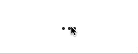

デモとサンプルコード詳細は以下から（SCSS記法です）ご確認ください。

[Rolling Meat ball menu | Code Pen](https://codepen.io/camille-cebu/pen/WNdJYYJ)
## 日本の誇るベントーメニュー

実は海外では「Bento」という言葉は結構浸透しています。

> A bento (弁当, bentō)[1] is the Japanese iteration of a single-portion take-out or home-packed meal, often for lunch.<br>
> https://en.wikipedia.org/wiki/Bento

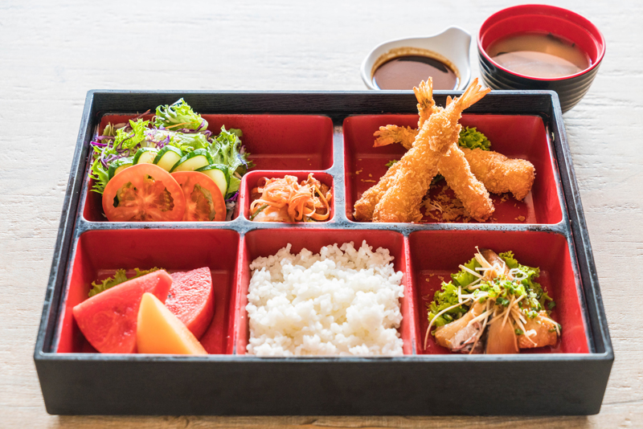

### 色の反転を利用したベントーメニュー

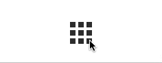

疑似要素と`box-shadow`を使ってベントーの仕切りを作ります。

色を反転させます。

```css:title=css
.c-nav-btn {
  transform-origin: center;
  transition: .3s;
}

.c-nav-btn::after {
  position: absolute;
  content: '';
  width: 8px;
  height: 8px;
  background: #333;
  display: block;
  left: calc(50% - 4px);
  top: calc(50% - 4px);
  box-shadow: -12px 0 0 #333,
    12px 0 0 #333,
    -12px -12px 0 #333,0 -12px 0 #333,
    12px -12px 0 #333,
    -12px 12px 0 #333,
    0 12px 0 #333,
    12px 12px 0 #333;
}
.c-nav-btn::before {
  position: absolute;
  content: '';
  height: 20px;
  width: 3px;
  left: 21px;
  top: 12px;
  background: #fff;
}
.c-nav-btn.is-active {
  background: #333;
  border-radius: 22px;
  transform: rotate(45deg);
}
.c-nav-btn::after {
  box-shadow: none;
  width: 20px;
  height: 3px;
  left: 13px;
  top: 21px;
  background: #fff;
}
```
デモとサンプルコード詳細は以下から（SCSS記法です）ご確認ください。

[Bento menu | Code Pen](https://codepen.io/camille-cebu/pen/MWrGZWR)

## SVGを使えばどんなメニューも実現可能！！
SVGがCSSアニメーション、HTMLタグとしても使いやすく、色んなデザインで使えて便利です。
わざわざCSSを駆使してデザインを作るくらいなら、SVGで素材作って利用したほうがコードも短くなることも。

### リアルハンバーガーメニュー
リアルなハンバーガーのメニューです。

メニューをクリックすると具とバンズが順次落下してきます。

わずかにバウンスします。

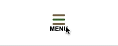

SVGの各パーツにはクラス名をつけておきます。

```html:title=HTML
<button class="c-nav-btn" type="button">
<svg xmlns="http://www.w3.org/2000/svg" viewBox="0 0 155 100.5">
<path d="M0,45.5C0,13.83,34.7,0,77.5,0s77.5,13.83,77.5,45.5H0Z" class="pan-top"/>
<path  d="M0,80.5c0,13.92,34.7,20,77.5,20s77.5-6.08,77.5-20H0Z" class="pan-bottom"/>
<g class="gu">
<path class="lettuce" d="M116.13,74.77l-17.82-3.74-20.85,3.73-17.2-3.73-17.87,3.73-19.97-3.74-18.95,3.64c-1.35,.26-2.67-.63-2.93-1.98-.26-1.36,.63-2.67,1.98-2.93l19.88-3.82,19.93,3.73,17.94-3.74,17.27,3.74,20.83-3.73,17.78,3.73,19-3.74,17.38,3.85c1.35,.3,2.2,1.63,1.9,2.98-.3,1.35-1.63,2.2-2.98,1.9l-16.36-3.62-18.97,3.73Z"/>
<path class="hanburg" d="M148.08,50.31H6.92c-3.04,0-5.5,2.46-5.5,5.5s2.46,5.5,5.5,5.5H148.08c3.04,0,5.5-2.46,5.5-5.5s-2.46-5.5-5.5-5.5Z"/>
</g>
</svg>
MENU
</button>
```

```css:title=css
.c-nav-btn {
  height: 44px;
  width: 44px;
  position: absolute;
  background: none;
  border: none;
  font-size: 10px;
  font-weight: bold;
}
.c-nav-btn svg .pan-bottom,
.c-nav-btn svg .pan-top {
  fill: #7F6844;
  opacity: 0;
}
.c-nav-btn svg.gu{
  opacity: 0;
}
.c-nav-btn svg.lettuce {
  fill: #3A682A;
}
.c-nav-btn svg.hanburg {
  fill: #591C09;
}
.c-nav-btn::after,
.c-nav-btn::before {
  content: '';
  position: absolute;
  display: block;
  left: 12px;
  height: 3px;
  width: 20px;
  border-radius: 3px;
  background: #7F6844;
  transition: transform .3s;
}
.c-nav-btn::after {
  top: 8px;
  box-shadow: 0 7px 0 #3A682A;
}
.c-nav-btn::before {
  top: 22px;
}
.c-nav-btn.is-active::after,
.c-nav-btn.is-active::before {
  transform: scaleX(0);
}
.c-nav-btn.is-active svg .pan-bottom{
  animation: fall 0.7s forwards;
}
.c-nav-btn.is-active svg .pan-top {
  animation: fall 0.7s 1s forwards;
}
.c-nav-btn.is-active svg .gu{
  animation: fall 0.7s 0.5s forwards;
}
@keyframes fall{
  0% {
    opacity: 0;
    transform:translateY(-100%);
  }
  30% {
    opacity: 1;
    transform:translateY(-100%);
  }
  90% {
    opacity: 1;
    transform: translateY(0px);
  }
  95% {
    opacity: 1;
    transform: translateY(10px);
  }
  100% {
    opacity: 1;
    transform:translateY(0);
  }

}
```

デモとサンプルコード詳細は以下から（SCSS記法です）ご確認ください。

[Real hamburger menu | Code Pen](https://codepen.io/camille-cebu/pen/bGaMOYO)
### 猫のファストフード・魚なメニュー

実はこの魚メニューをどうしても実装したいのがきっかけでこの記事を書きました。

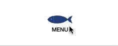

身と骨のパスを作り、身だけ`transform:scaleY`で縦軸のサイズをコントロールしているだけの単純なアニメーションです。

特に大したことはしていないので、コードの説明は省きます。

デモとサンプルコード詳細は以下から（SCSS記法です）ご確認ください。

[Sakana menu | Code Pen](https://codepen.io/camille-cebu/pen/qBpoXZj)
<!-- ### 曲線の美しいハンバーガーメニュー
### 飲食店で使ってほしいフォークとナイフのメニュー -->
## まとめ・CSSやSVGを駆使したらレパートリーは増やせる

今回は14個のハンバーガーメニューをご紹介いたしました。

タグの入れ子はできるだけせず、可能な限り疑似要素を駆使して作成しましたが、なかなかキツかったです笑。

SVGを使えばどんな実装もできると思います。

<msg txt="もっとサンプルを増やしますので乞うご期待"></msg>

この記事が皆さんのコーディングライフの一助となれば幸いです。

最後までお読みいただきありがとうございました。

関連記事もあわせてお読みください。

<card id="0/blogs/entry370/"></card>

<card id="0/blogs/entry393/"></card>
