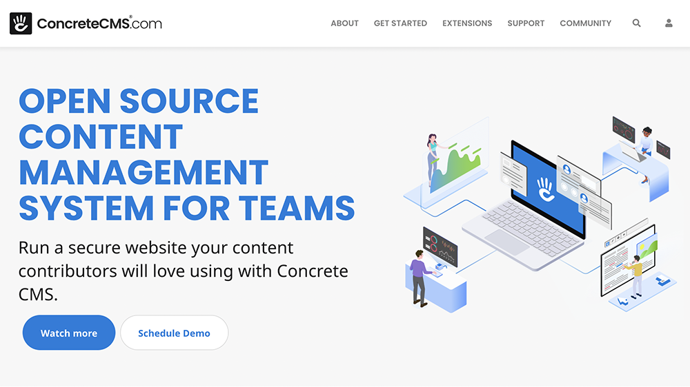
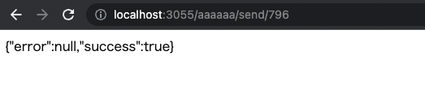
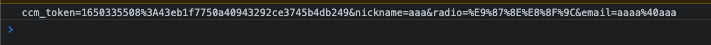
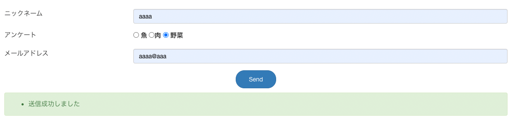
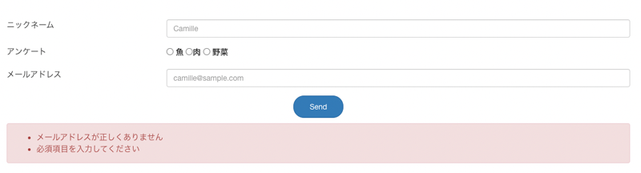
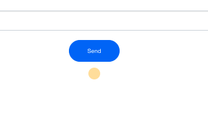
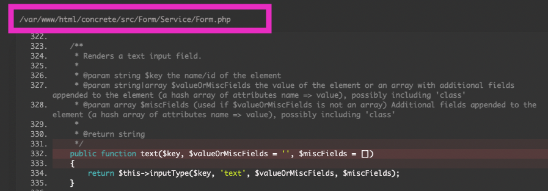
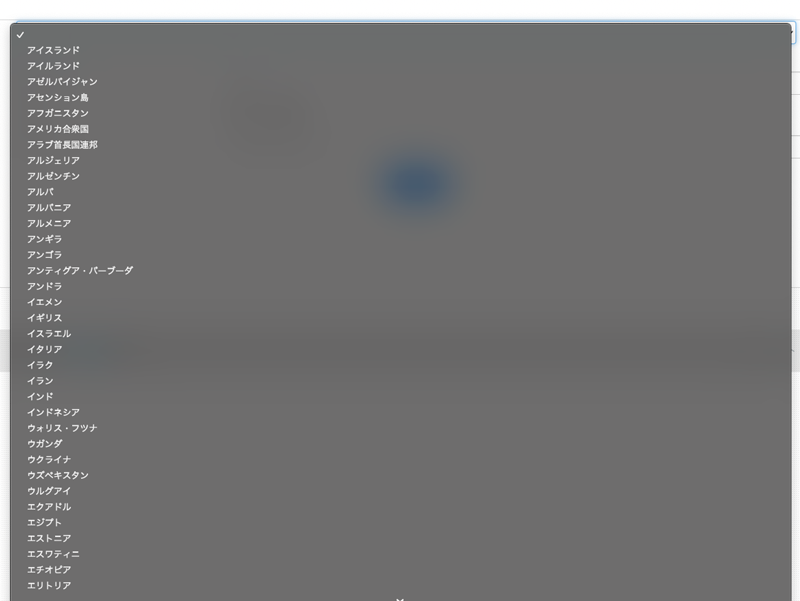

先日concreteCMSの外部フォームブロックを使ってフォームを実装しました。前も実装方法は紹介したのですが、今回はAjax を実装方法をまとめましたので参考にしてください。


## concreteCMSとは？



https://www.concretecms.com/

concreteCMSとは、今はほとんどのCMSで見かけるようになったブロック型CMSの先駆けです。

コンテンツをブロックのように積み上げてサイトを作ることができます。

標準機能で自由度が高く柔軟にカスタマイズでき、複数人で運用するコーポレートサイト、大型サイトなどに向いています（個人の意見）。

## 外部ブロックの作り方

applicationディレクトリに以下のようなディレクトリとファイルを作成します。

Contact Formという外部ブロックのテンプレートを作ります。

ファイル名がそのまま、テンプレート名になります。

```
externar_form/
  └ form/
    ├ contact_form.php（view）
    └ controller/
      └ contact_form.php（controller）
```
concreteCMSのブロックはMVCモデルになっており、コアのブロックをオーバーライドして作ることができます。

詳しい作り方は以下記事にまとめています（リライト済み）。

<card id="/blogs/entry236/"></card>

今回はcontrollerとviewを「外部フォームブロックでお問い合わせフォーム作成」を再利用して作ります。

## viewのコードを書く
まずは見た目部分のコードを書きます。

前回の「外部フォームブロックでお問い合わせフォーム作成」同様、アンケート（ラジオボタン）、ニックネーム、メールという簡単なメールフォームにします。

`Loader::helper('form')`フォームヘルパーを使って、フォームのパーツを作ります。

コードはこちら。
```php:title=contact_form.php
<?php
$form = Loader::helper('form');
defined('C5_EXECUTE') or die("Access Denied.");
?>
<form method="post" action="<?=h($view->action('send')) ?>" id="contact-form">
    <?=Core::make('token')->output('send');?>
    <div class="container form">
        <div class="row">
            <div class="col col-md-3">ニックネーム</div>
            <div class="col col-md-9"><?=$form->text('nickname', ['placeholder'=>'Camille'])?></div>
        </div>
        <div class="row p-3">
            <div class="col col-md-3">アンケート</div>
            <div class="col col-md-9">
                <span class="form-check form-check-inline">
                    <?=$form->radio('radio', h('魚'), ['class'=>'form-check-input','id'=>'radio1' ])?>
                    <label class="form-check-label" for="radio1">魚</label>
                </span>
                <span class="form-check form-check-inline">
                    <?=$form->radio('radio', h('肉'), ['class'=>'form-check-input','id'=>'radio2'])?><label class="form-check-label" for="radio2">肉</label>
                </span>
                <span class="form-check form-check-inline">
                    <?=$form->radio('radio', h('野菜'), ['class'=>'form-check-input', 'id'=>'radio3'])?>
                    <label class="form-check-label" for="radio3">野菜</label>
                </span>
            </div>
        </div>
        <div class="row">
            <div class="col col-md-3">メールアドレス</div>
            <div class="col col-md-9"><?=$form->email('email', ['placeholder'=>'camille@sample.com'])?></div>
        </div>
        <p><button class="btn btn-primary">Send</button></p>
    </div>
</form>
```

## コントローラー側の下準備
コントローラー側のコードの紹介です。
まずは正常に値が飛ぶかテストしてみましょう。

```php:title=controller/contact_form.php
<?php
namespace Application\Block\ExternalForm\Form\Controller;

use Concrete\Core\Controller\AbstractController;
use Core;
use UserInfo;

class ContactForm extends AbstractController
{
    public function view()
    {
        $this->set('radio', '');
    }
    public function action_send($bID = false)
    {
        $token = \Core::make("token");
        $errorMsg = [];
        if ($this->bID == $bID && $token->validate('send')) {
            echo json_encode(['errors' => $errorMsg, 'success' => true]);
            dd();//処理中断
        }
    }
}
```
フォームの`post`で遷移するのですが、遷移先で`dd()` を使って処理をとめ、出力される値を確認します。

以下のようなページに遷移してレスポンスが返ってきたら成功です。



## Ajaxでcontrollerでの送信処理
今回はjQueryを使いました。

```js:title=jQuery
$(function(){
    $('#contact-form').submit(function( event ) {
        event.preventDefault();
        const formData = $(this).serialize();
        $.ajax({
          type: 'POST',
            url: $(this).attr('action'),
            data: formData
        })
        .done(function(response) {
          // 受信データの処理
        })
        .fail(function(XMLHttpRequest, status, e){
          // 失敗したあとの処理
        })
    })
})
```
`event.preventDefault()` で物理的にPOSTでページ遷移させるのを止め、`serialize()` でPOSTされるデータを取得します。

```js:title=jQuery
console.log(formData);
```
デバッグすると次のような値が取得できています。



`serialize()`ではポストされた値をキーと値のペアを以下のような形式で取得できます。

```
key1=value&key2=value
```

### controllerでの処理結果をAjaxを介してviewに渡す

controllerでのバリデーションなどの値をview側に渡します。処理後、`exit()` で抜けます。

```php:title=controller/contact_form.php
<?php
namespace Application\Block\ExternalForm\Form\Controller;

use Concrete\Core\Controller\AbstractController;
use Core;
use UserInfo;

class Myform extends AbstractController
{
    public function action_send($bID = false)
    {
        $token = \Core::make("token");
        $success = false;
        $errorMsg =[];
        if ($this->bID == $bID && $token->validate('send')) {
            $validation = Core::make('helper/validation/strings');

            if (!$validation->email($this->post('email'))) {
                $errorMsg[] = h('メールアドレスが正しくありません');
            }
            if (!$validation->notempty($this->post('radio')) || !$validation->notempty($this->post('nickname'))) {
                $errorMsg[] = h('必須項目を入力してください');
            }
            if (empty($errorMsg)) {
                $success = true;

                /**
                 * メール送信後の処理
                 */
            }
        } else {
            // $success = false;
            $errorMsg[] = h('メール送信に失敗しました。');
        }
        echo json_encode(['errors' => $errorMsg, 'success' => $success]);
        exit();
    }
}
```
受け取ったあとの処理をします。

```js:title=jQuery
$(function(){
    $('#contact-form').submit(function( event ) {
        event.preventDefault();
        $('.alert').remove();
        const formData = $(this).serialize();
        $.ajax({
        type: 'POST',
            url: $(this).attr('action'),
            data: formData
        })
        .done(function(response) {
            $json = JSON.parse(response);
            console.log($json.success);

            if( $json.success === true) {
                $('.form').append('<div class="alert alert-success"><ul></ul></div>');
                $('.alert ul').append('<li>送信成功しました</li>');
            } else {
              $('.form').append('<div class="alert alert-danger"><ul></ul></div>');
                $json.errors.map(function( item ) {
                    $('.alert ul').append('<li>' + item + '</li>');
                })
            }
        })
        .fail(function(XMLHttpRequest, status, e){
            $('.form').append('<div class="alert alert-danger"><ul></ul></div>');
            $json.errors.map(function( item ) {
                $('.alert ul').append('<li>' + item + '</li>')
            })
        })
    })
})
```
送信成功。

エラーが有った場合。


## ローディング処理
レスポンスが返ってくるまでにタイムラグが生じ、送信できたかどうかわからなくなります。

ボタンはクリックできないようにして、ローディングアニメをつけます。

今回はBootstrapが用意しているSpinnerをつかいました。



[Spinners (スピナー)](https://getbootstrap.jp/docs/5.0/components/spinners/)

送信処理中はCSSとJSでフォームを操作できないようにし、ローディングアニメを表示します。

```php:title=contact_form.php
<form method="post" action="<?=h($view->action('send')) ?>" id="contact-form">
    <?=Core::make('token')->output('send');?>
    <div class="container form">
        <div class="row">
            <div class="col col-md-3">ニックネーム</div>
            <div class="col col-md-9"><?=$form->text('nickname', ['placeholder'=>'Camille'])?></div>
        </div>
        <div class="row p-3">
            <div class="col col-md-3">アンケート</div>
            <div class="col col-md-9">
                <span class="form-check form-check-inline">
                    <?=$form->radio('radio', h('魚'), ['class'=>'form-check-input','id'=>'radio1' ])?>
                    <label class="form-check-label" for="radio1">魚</label>
                </span>
                <span class="form-check form-check-inline">
                    <?=$form->radio('radio', h('肉'), ['class'=>'form-check-input','id'=>'radio2'])?><label class="form-check-label" for="radio2">肉</label>
                </span>
                <span class="form-check form-check-inline">
                    <?=$form->radio('radio', h('野菜'), ['class'=>'form-check-input', 'id'=>'radio3'])?>
                    <label class="form-check-label" for="radio3">野菜</label>
                </span>
            </div>
        </div>
        <div class="row">
            <div class="col col-md-3">メールアドレス</div>
            <div class="col col-md-9"><?=$form->email('email', ['placeholder'=>'camille@sample.com'])?></div>
        </div>
        <p><button class="btn btn-primary">Send</button></p>
        <div class="spinner collapse">
            <div class="justify-content-center d-flex mb-3">
                <div class="spinner-grow text-warning" role="status">
                    <span class="visually-hidden">Loading...</span>
                </div>
            </div>
        </div>
    </div>
</form>
```

今回はフォーム全体に `pointer-events: none` を使って操作できなくしました。

```js:title=jQuery
$(function(){
    $('#contact-form').submit(function( event ) {
        event.preventDefault();
        $this = $(this);
        $('.alert').remove();
        $this.css('pointer-events','none');
        $('.spinner').removeClass('collapse');
        const formData = $this.serialize();

        $.ajax({
        type: 'POST',
            url: $this.attr('action'),
            data: formData
        })
        .done(function(response) {
            $json = JSON.parse(response);
            $this.css('pointer-events','');
            $('.spinner').addClass('collapse');

            if( $json.success === true) {
                $('.form').append('<div class="alert alert-success"><ul></ul></div>');
                $('.alert ul').append('<li>送信成功しました</li>');
            } else {
                $('.form').append('<div class="alert alert-danger"><ul></ul></div>');
                $json.errors.map(function( item ) {
                    $('.alert ul').append('<li>' + item + '</li>');
                })
            }
        })
        .fail(function(XMLHttpRequest, status, e){
            $this.css('pointer-events','');
            $('.spinner').addClass('collapse');
            $('.form').append('<div class="alert alert-danger"><ul></ul></div>');
            $json.errors.map(function( item ) {
                $('.alert ul').append('<li>' + item + '</li>')
            })
        })
    })
})
```

## メールヘルパーでメールを送信
メール処理は、通常フォームと一緒です。今回は割愛するので「[メールヘルパーを使ってメール送信する](https://ginneko-atelier.com/blogs/entry236/#%E3%83%A1%E3%83%BC%E3%83%AB%E3%83%98%E3%83%AB%E3%83%91%E3%83%BC%E3%82%92%E4%BD%BF%E3%81%A3%E3%81%A6%E3%83%A1%E3%83%BC%E3%83%AB%E9%80%81%E4%BF%A1%E3%81%99%E3%82%8B)」を参照してください。

## まとめ

Ajaxを使った方がロードを待つストレスが少なくて済むので、今回Ajaxで実装してみました。
コアファイルを漁っていたら色んなバリデーターが出てきたので、また追記できればと思います。

concreteCMSの情報は少なく、リファレンスを探しても英語サイトに辿り着き困ってる人も多いと思います。

この記事がみなさんのCMSライフの一助となれば幸いです。

最後までお読みいただきありがとうございました。

<prof></prof>

### おまけ・ヘルパーなどの設定があるファイルのソースコードを確認したいとき
ヘルパーの他のメソッドを確認したいときがあります。

ググるのも面倒だし、すぐ確認したいときはわざとエラーを起こしてファイルの場所を特定することができます。

```php
//わざと引数を入れない
$form->text();
```
格納場所。



ソースを漁ると、他にも面白い出力できるフォームを発見できました。

```php
echo $form->selectCountry('country');
```
国名を選ばせたいときに活用してみてください。



