## パンくずリストてなんぞ？
パンくずリストとは、一般的にはグローバルナビ下あたりに設置されている小さなナビゲーションです。

これを辿れば、一般的にはトップページに辿り着けるようになっています。<br>実は私たちの普段使っているツールでもパンくずリストは慣れ親しまれており、Mac の Finder や WordPress のブロックエディタなんかにもしれっと設置されています。
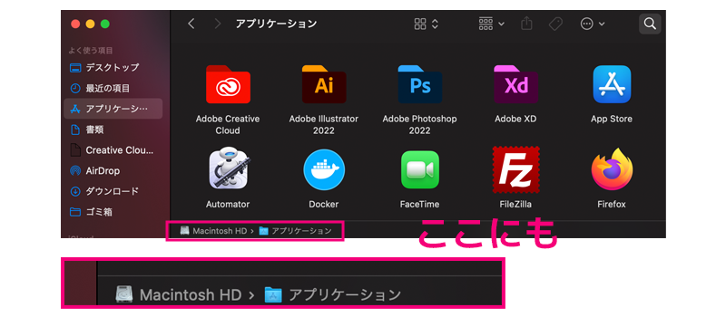
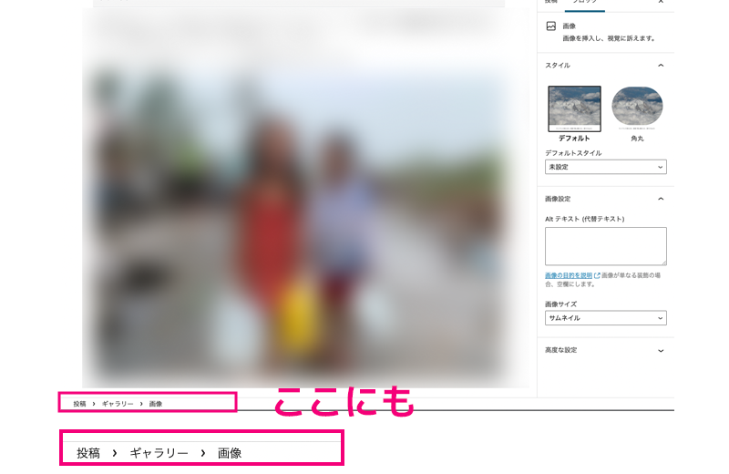

元々は森に捨てられたグレーテルがヘンゼルとグレーテルが帰り道を示すためにパンくずを置いたことから、パンくずリストと呼ばれるようになりました。

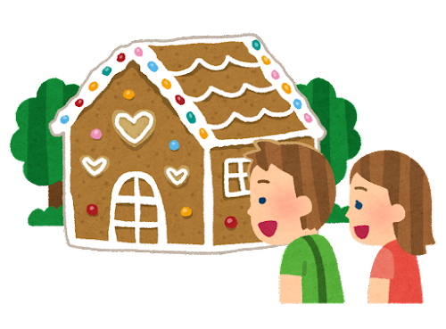

<msg txt='パンくずは鳥に食べられてヘンゼルとグレーテルは帰れなくなってますけどね！'></msg>

ヘンゼルとグレーテルのパンくずは役に立ちませんでしたが、Webサイトでは自分の現在地を知る上では重要なパーツです。

## パンくずリストを設置するメリット
パンくずリストを設置するメリットは以下の通り。
* クローラビリティ向上
* ユーザーが自分の位置がわかる
* 内部リンクを増やせる

<msg txt='ぶっちゃけメリットしかありません。設置しないと損しますよ！'></msg>

### クローラビリティ向上
クローラビリティとは検索エンジンがクロールしやすくなることです。

こちらはサーチコンソールです。

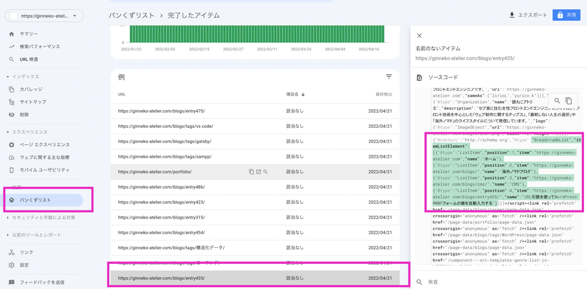

クロールされパンくずリストが見つかると、このようにインデックス(Googleのデータベースに登録)されます。

インデックスされたページは、検索すると以下のようにパンくずがある状態で検索一覧に表示されます。

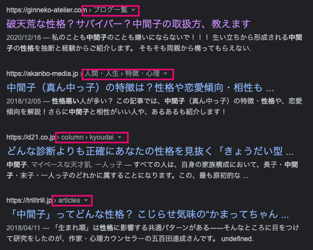

パンくずリストがあるのとないのでは、目の引き方が変わります。
<br><small>※今回この記事の執筆を機会にパンくずリストの設定を見直しました。</small>

<br>なので、パンくずリストとしてインデックスさせるためには、適切にコーディングする必要があるのです。

### ユーザーが自分の位置がわかる
サイトを閲覧していて、前のページやその前のページに戻りたいことがあります。

<msg txt='「前のページにあった、あの記事気になるなぁ」ってこと、よくありますよね？'></msg>

ブラウザバックで戻ることもありますが、パンくずを辿って戻ることもあります。

### 内部リンクを増やせる
内部リンクとは、同じWebサイト内でリンクを貼ることです。

内部リンクがあると関連性の高いページを繋ぐことですでにアップされたページが検索エンジンにクロールされることにインデックスされ、検索にも上がりやすくなります。

つまり、内部リンクを適切に設置するとSEOの評価も上がりやすくなります。

パンくずリストを設置することで、内部リンクを増やすことができます。

## 評価を上げるポイントはパンくずリストの詳細度を上げる

評価を上げるためには、パンくずリストの詳細度をあげます。

具体的にはカテゴリーなどのリンクをはさみます。

今回自分のサイトを見直したとき、Google検索結果でブログ一覧としか表示されてませんでした。

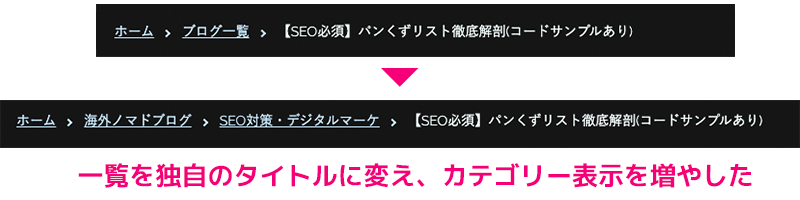

ブログ一覧なんて、どのサイトでもつけているのでよりユニークな名前かつこのブログに関連づくキーワードを含んだ名前に変えました。

検索結果を改めてじっくり見てみましょう。<br>適切なパンくずリストを設置している記事は、パンくずリスト内に記事に関連するキーワード（カテゴリーなど）が散りばめられていて何の記事かわかりやすいです。


### パンくずリストは3種類あります

* *位置型パンくずリスト*...静的に出力するパンくずリストです。階層が辿れるのが特徴です。検索エンジンにインデックスされます。
* *属性型パンくずリスト*...ECなどに採用されてます。ユーザーが閲覧しているページがウェブサイト上のどの属性に当てはまるかを表します。
* *パス型パンくずリスト*...履歴を辿れる動的パンくずリストです。ブラウザバックがあるのであまり採用されてません。

通常パンくずリストを検索エンジンにインデックスさせるためには位置型パンくずリストを設置させる必要があります。

必ずしも **実際のウェブサイトの階層通りでなくてもかまいません**。


## パンくずリストの設置方法
まずはパンくずリストの設置方法です。
順番のあるリストなので `ol` オーダーリストを使ってます。

* *ol*...順番のあるリスト
* *ul*...順不同リスト

私は `nav` は使いません。`nav` は主要な *ナビゲーションを格納するためのタグ* なのでラッパーが必要な場合は、`div` を使ってます。

アクセシビリティ考慮するなら、スクリーンリーダーに読み上げれるようにしてあげると親切ですね。

```
aria-label="パンくずリスト"
```
この記事のパンくずリストを表示するなら、コードの例はこんな感じになります。

```html:title=HTML
<div class="c-bread-crumb-list" aria-label="パンくずリスト">
  <ol>
    <li><a href="https://ginneko-atelier.com/">ホーム</a></li>
    <li><a href="https://ginneko-atelier.com/blogs/">海外ノマドブログ</a></li>
    <li><a href="https://ginneko-atelier.com/blogs/seo/">SEO対策・デジタルマーケ</a></li>
    <li>【SEO必須】パンくずリスト徹底解剖(コードサンプルあり)</li>
  </ol>
</div>
```

### 構造化データを付与
さらに構造化データを付与して、クローラーにパンくずリストここだよ！って教えてあげます。

JSON+LD、RDFa、microdataで記述する方法があります。RDFaは今回は割愛します。

まずはmicrodataです。属性が増えるので一気にボリューミーになりますが、JSON+LDのようにscriptで書かなくてもいいので、とっつきやすいと思います。

```html:title=microdata
<div class="c-bread-crumb-list" aria-label="パンくずリスト">
  <ol itemscope itemtype="http://schema.org/BreadcrumbList">
    <li itemprop="itemListElement" itemscope itemtype="http://schema.org/ListItem">
      <a itemprop="item" href="https://ginneko-atelier.com/">
        <span itemprop="name">ホーム</span>
      </a>
      <meta itemprop="position" content="1" />
    </li>
    <li itemprop="itemListElement" itemscope itemtype="http://schema.org/ListItem">
      <a itemprop="item" href="https://ginneko-atelier.com/blogs/">
        <span itemprop="name">海外ノマドブログ</span>
      </a>
      <meta itemprop="position" content="2" />
    </li>
    <li itemprop="itemListElement" itemscope itemtype="http://schema.org/ListItem">
      <a itemprop="item" href="https://ginneko-atelier.com/blogs/seo/">
        <span itemprop="name">SEO対策・デジタルマーケ</span>
      </a>
      <meta itemprop="position" content="3" />
    </li>
    <li>【SEO必須】パンくずリスト徹底解剖(コードサンプルあり)</li>
  </ol>
</div>
```

私の大好きなJSON+LDです。***Google検索エンジンに解析されやすく*他の構造化データと1箇所にまとめることができる** のがいいところです。このサイトもJSON+LDで記述してhead内に格納しています。

HTMLは変える必要もありません。

```js:title=JSON+LD
{
  "@context":"http://schema.org",
  "@type":"BreadcrumbList",
  "itemListElement":[
    {
      "@type":"ListItem",
      "position":1,
      "item":"https://ginneko-atelier.com",
      "name":"ホーム"
    },
    {
      "@type":"ListItem",
      "position":2,
      "item":"https://ginneko-atelier.com/blogs/",
      "name":"海外ノマドブログ"
    },
    {
      "@type":"ListItem",
      "position":3,
      "item":"https://ginneko-atelier.com/blogs/seo/",
      "name":"SEO対策・デジタルマーケ"
    },
    {
      "@type":"ListItem",
      "position":4,
      "item":"https://ginneko-atelier.com/blogs/entry498/",
      "name":"【SEO必須】パンくずリスト徹底解剖(コードサンプルあり)"
    }
  ]
}
```
構造が正しいか[スキーマ マークアップ検証ツール](https://validator.schema.org/)でテストしてみましょう！

## デザインを含めたサンプルコード
それではコードサンプルのご紹介です。<br><small>リセットCSSを使ってデフォルトのスタイルは予め打ち消してます。</small>

<br>レスポンシブ対応済みです。

### SVGアイコンを使ったパンくずリスト
SVGを使った、汎用性の高いパンくずリストです。

アイコンの色やデザインを変えればバリエーションは増やせます。

今回は[fontawesome](https://fontawesome.com/)を使いました。

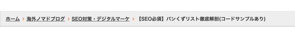
`li` のスタイルを `display: inline-block` にしておくことで改行し、レスポンシブにも対応できます。
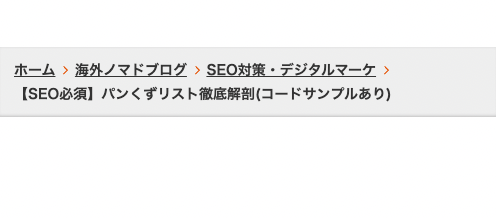

```css:title=CSS
.c-bread-crumb-list {
  background: #eee;
  box-shadow: inset 0 -1px 3px rgba(0, 0, 0, 0.2);
}
.c-bread-crumb-list ol {
  padding: 16px 16px 6px;
  list-style: none;
  color: #333;
  font-weight: bold;
  font-size: 14px;
}
.c-bread-crumb-list ol a {
  color: #333;
}
.c-bread-crumb-list ol a:hover {
  text-decoration: none;
}
.c-bread-crumb-list ol li {
  margin-bottom: 10px;
  display: inline-block;
}
.c-bread-crumb-list ol li::after {
  content: "";
  background: url('data:image/svg+xml;utf8,<svg xmlns="http://www.w3.org/2000/svg" viewBox="0 0 320 512"><path d="M96 480c-8.188 0-16.38-3.125-22.62-9.375c-12.5-12.5-12.5-32.75 0-45.25L242.8 256L73.38 86.63c-12.5-12.5-12.5-32.75 0-45.25s32.75-12.5 45.25 0l192 192c12.5 12.5 12.5 32.75 0 45.25l-192 192C112.4 476.9 104.2 480 96 480z" fill="%23E65100"/></svg>') center/contain no-repeat;
  width: 0.7em;
  height: 0.7em;
  display: inline-block;
  margin-left: 5px;
}
.c-bread-crumb-list ol li:last-child::after {
  content: none;
}
```
全体のコードはこちら(SCSS)。<br>
[breadcrumblist basic| Code Pen](https://codepen.io/camille-cebu/pen/eYyXgyw)

### 長くなるとスクロールするパンくずリスト
文字が長くなると…などで切りたくなりますが、今回はスマホではスクロールできる仕様にしました。
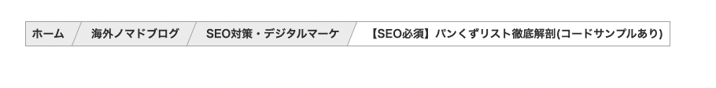

マウスオーバーで色が変わります。

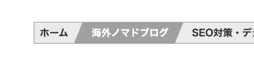

```css:title=CSS
.c-bread-crumb-list ol {
  white-space: nowrap;
  overflow-x: auto;
  overflow-y: hidden;
  max-width: 1080px;
  margin: 0 auto;
  list-style: none;
  color: #333;
  font-weight: bold;
  font-size: 0;
  -ms-overflow-style: none;
  scrollbar-width: none;
}
.c-bread-crumb-list ol::-webkit-scrollbar {
  display:none;
}
.c-bread-crumb-list ol li {
  white-space: no-wrap;
  display: inline-block;
  border: 1px solid #aaa;
}
.c-bread-crumb-list ol li:not(:first-child) a {
  padding-left: 24px;
}
.c-bread-crumb-list ol li:last-child {
  padding: 8px 8px 8px 24px;
  font-size: 14px;
}
.c-bread-crumb-list ol a {
  font-size: 14px;
  display: inline-block;
  color: #333;
  background: #eee;
  text-decoration: none;
  padding: 8px;
  position: relative;
}
.c-bread-crumb-list ol a:hover {
  background: #aaa;
  color: #fff;
}
.c-bread-crumb-list ol a:hover::after {
  border-top-color: #aaa;
}
.c-bread-crumb-list ol a::before {
  z-index: 10;
  content: "";
  position: absolute;
  right: -14px;
  top: 0;
  display: block;
  height: 100%;
  width: 1px;
  border-top: 30px solid #aaa;
  border-right: 12px solid transparent;
}
.c-bread-crumb-list ol a::after {
  z-index: 10;
  content: "";
  position: absolute;
  right: -13px;
  top: 0;
  display: block;
  height: 100%;
  width: 1px;
  border-top: 30px solid #eee;
  border-right: 12px solid transparent;
}
```
スクロール時の縦軸のグラつき防止に`overflow-y: hidden`を入れています。
```css
overflow-x: auto;
overflow-y: hidden;
```
スクロールバーが見えるとかっこ悪いので隠しています。
```css
.c-bread-crumb-list ol {
  -ms-overflow-style: none;/* Edge */
  scrollbar-width: none;/* Fire Fox */
}
.c-bread-crumb-list ol::-webkit-scrollbar {
  display:none;/* Chrome Safari */
}
```

全体のコードはこちら(SCSS)。<br>
[breadcrumblist scroll| Code Pen](https://codepen.io/camille-cebu/pen/rNpRjpX)

### 長くなるとスクロールするパンくずリスト2
先ほどとほぼ一緒ですが、少しデザインをアレンジしてみました。

このCSSはフローなどのコードを書くときも使えます。

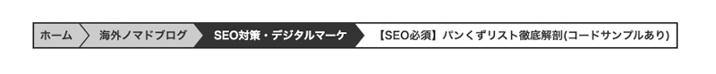
```css:title=CSS
.c-bread-crumb-list ol {
  white-space: nowrap;
  overflow-x: auto;
  overflow-y: hidden;
  max-width: 1080px;
  margin: 0 auto;
  list-style: none;
  color: #333;
  font-weight: bold;
  font-size: 0;
  -ms-overflow-style: none;
  scrollbar-width: none;
}
.c-bread-crumb-list ol::-webkit-scrollbar {
  display:none;
}
.c-bread-crumb-list ol li {
  white-space: no-wrap;
  display: inline-block;
  border: 2px solid #333;
  border-right: none;
}
.c-bread-crumb-list ol li:not(:first-child) a {
  padding-left: 24px;
}
.c-bread-crumb-list ol li:last-child {
  padding: 8px 8px 8px 24px;
  font-size: 14px;
  border-right: 2px solid #333;
}
.c-bread-crumb-list ol a {
  font-size: 14px;
  background: #ccc;
  display: inline-block;
  color: #333;
  text-decoration: none;
  padding: 8px;
  position: relative;
}
.c-bread-crumb-list ol a:hover {
  background: #333;
  color: #fff;
}
.c-bread-crumb-list ol a:hover::after {
  border-left-color: #333;
}
.c-bread-crumb-list ol a::before {
  z-index: 10;
  content: "";
  position: absolute;
  right: -14px;
  top: 0;
  display: block;
  border-top: 15px solid transparent;
  border-left: 12px solid #333;
  border-bottom: 15px solid transparent;
}
.c-bread-crumb-list ol a::after {
  z-index: 10;
  content: "";
  position: absolute;
  right: -12px;
  top: 0;
  display: block;
  border-top: 15px solid transparent;
  border-left: 12px solid #ccc;
  border-bottom: 15px solid transparent;
}
```
全体のコードはこちら(SCSS)。<br>
[breadcrumblist scroll2| Code Pen](https://codepen.io/camille-cebu/pen/wvpOgbY)

## まとめ・パンくずリストは必ずサイトに設置しよう
パンくずリストがSEOやユーザーにとってとても重要なパーツということおわかりいただけたと思います。<br>ぜひ、設置してユーザーにもクローラーにも優しいサイトを作りましょう。

他にもサイトでユーザビリティを上げるグロナビやハンバーガーメニューなど共通パーツの作り方をご紹介しています。

<card id="/blogs/entry449/"></card>

<card id="/blogs/entry496/"></card>


この記事が皆さんのSEOライフの一助となれば幸いです。

最後までお読みいただきありがとうございました。
