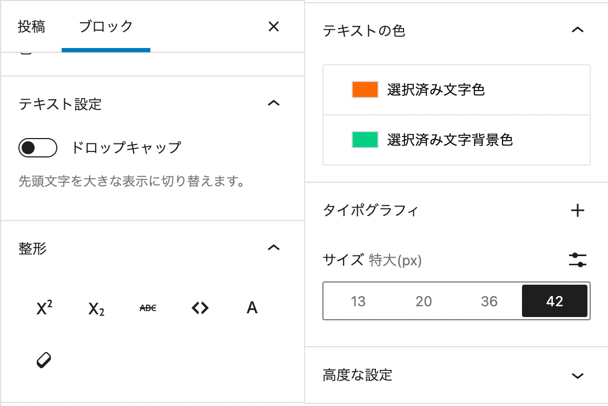
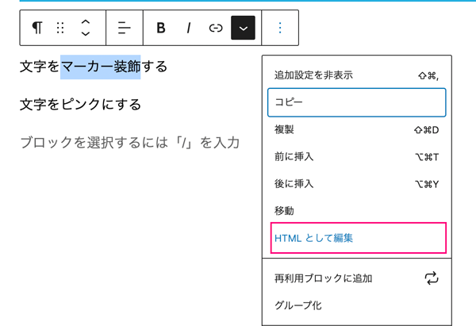
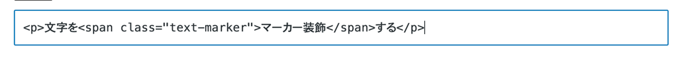
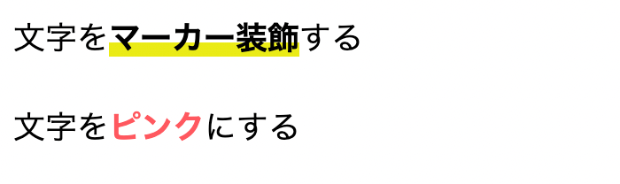
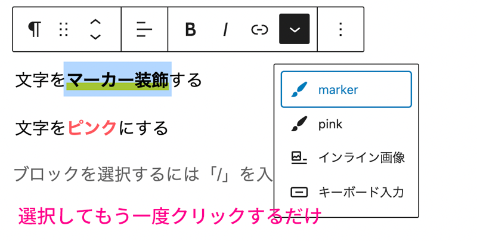

## プラグイン無しで文字装飾（蛍光マーカーなど）ボタンを追加したい
ブロックエディタでのデフォルトの文字装飾はブロック単位。ご覧の通り一歩間違えるとちょっぴりダサくなります。


プラグインなしでは右側のパネルからはブロック単位でしか装飾できません。


<msg txt="とても使い勝手が悪い！"></msg>

ということで、今回文字だけ装飾できるようにカスタマイズする方法をまとめました。

ブロックそのものをカスタマイズしたい方はこちらを参考にしてみてください。
  <card id="/blogs/entry488/"></card>

## functions.phpから文字装飾ボタンを追加する
今回は2個ほどボタンを追加します。
```
my-theme/（機能を追加したいテーマ）
  ├ func−js/editor.js（機能追加）
  └ functions.php（コード追加）
```
### functions.phpからJSファイルを読み込ませる
functions.phpにコードを追加します。

```php:title=functions.php
add_action( 'enqueue_block_editor_assets', function () {
	wp_enqueue_script( 'my_editor', get_theme_file_uri( 'func−js/editor.js'), [
		'wp-element',
		'wp-rich-text',
		'wp-editor',
	]);
	wp_localize_script( 'my_editor', 'myEditorObj', [
		[
			'item' => 'editor01',
			'title' => 'marker',
			'class' => 'text-marker',
		],
		[
			'item' => 'editor02',
			'title' => 'pink',
			'class' => 'color-pink',
		]
	]);
});
```
wp_enqueue_scriptの引数です。
```PHP
wp_enqueue_script(ハンドル, ファイルパス, 依存関係, バージョン, 読み込み位置 );
```
### editor.jsから管理画面のツールバーにボタンを追加
editor.jsでPHP側で依存関係で登録した３つを使えるようにします。

```js:title=editor.js
(function (richText, element, editor) {
// ここに設定を追加していきます。
}(
  window.wp.richText,
  window.wp.element,
  window.wp.editor
));
```
`wp_localize_script()` の値はJS側でオブジェクトとして受け取れます。
```js
console.log(myEditorObj);
// [
//     {
//         "item": "editor01",
//         "title": "marker",
//         "class": "text-marker"
//     },
//     {
//         "item": "editor02",
//         "title": "pink",
//         "class": "color-pink"
//     }
// ]
```
`span`で文字を装飾できるようにします。
```JS
(function (richText, element, editor) {
    richText.registerFormatType(`my-editor/${myEditorObj[0].item}`, {
        title: myEditorObj[0].title,
        tagName: 'span',
        className: myEditorObj[0].class,
        edit: function (args) {
            return element.createElement(editor.RichTextToolbarButton, {
                icon: 'admin-customizer',
                title: myEditorObj[0].title,
                onClick: function () {
                    args.onChange(richText.toggleFormat(args.value, {
                        type: `my-editor/${myEditorObj[0].item}`
                    }));
                },
                isActive: args.isActive,
            });
        },
    }),
    richText.registerFormatType(`my-editor/${myEditorObj[1].item}`, {
        title: myEditorObj[1].title,
        tagName: 'span',
        className: myEditorObj[1].class,
        edit: function (args) {
            return element.createElement(editor.RichTextToolbarButton, {
                icon: 'admin-customizer',
                title: myEditorObj[1].title,
                onClick: function () {
                    args.onChange(richText.toggleFormat(args.value, {
                        type: `my-editor/${myPluginObj[1].item}`
                    }));
                },
                isActive: args.isActive,
            });
        },
    })
}(
    window.wp.richText,
    window.wp.element,
    window.wp.editor
));
```
ツールバーにボタンが表示されるようになりました！


iconはお好みで変更可能です。

[Dash Icon](https://developer.wordpress.org/resource/dashicons/)

アイコン名がdashicons-list-viewであれば *dashicons-* を取り除いて使えばOKです。
```js
icon: "list-view",
```
### このままでは装飾できないのでスタイルを追加する
HTMLがどうなっているか確かめます。



きちんと`span`タグでラップされクラスが追加されています。



マーカーとピンク文字用のスタイルを追加します。

```
my-theme/（機能を追加したいテーマ）
  ├ style.css（追記）
  ├ editor-style.css（追記）
  ├ func−js/editor.js
  └ functions.php
```

エディターのスタイル設定がまだの場合は以下のようにファイルを読み込んでおきましょう。

```PHP:title=functions.php
add_action(
  'after_setup_theme',
	function() {
    add_theme_support( 'editor-styles' );
		add_editor_style();
	}
);
```
style.cssとeditor-style.css似同じコードを追加します。

```css
.text-marker {
  background: linear-gradient(to top, #eaeb16 40%, transparent 40%);
  font-weight: bold;
}
.color-pink {
  color: #fa343d;
  font-weight: bold;
}
```
文字にスタイルが当たるようになりました！



## 文字装飾の外し方
文字装飾の外し方ですが、装飾した文字を選択してもう一度同じボタンをクリックするだけです。



## まとめ・Classic Editor は少なくとも2022年までなのでそれまでに対策を
WordPressの公式の発表によると、クラシックエディターは少なくとも2022年まで、さらに必要とあれば今後もサポート・保守されるとのこと。

現在、クライアントにはできるだけブロックエディタに移行していただいています。

デフォルトのブロックエディタだけだとちょっと使い勝手悪いし、かといってプラグインはポンポン入れたくない方も多いと思います。

この記事がみなさんのコーディングライフの一助となれば幸いです。

最後までお読みいただきありがとうございました。
