既存記事をリライトするために Looker Studio(データポータル)を使ってSearch ConsoleとGoogleのインプレッション数や アナリティクスのPVを合算したデータの表を作りました。

Looker Studio はクセがあり複雑な設定があるので、具体的にどう作業してデータを統合したのかをまとめました。

画像多めで詳しく解説しているので、敷居の高い Looker Studio も設定可能です。

*この記事はこんな方におすすめです*

* ブログのリライトをしたいけどどの記事から手を付けていいかわからない
* Looker Studioを使っててっとり早くWeb解析をしたい
* Looker Studioを使っていろんなデータを統合してみたい
* GA4に慣れないので、ユニバーサルアナリティクスのような表示にLooker Studioでスタマイズしたい

~注意点！今回はユニバーサルアナリティクスを使用しています！後日、GA4版も作成します。~追加済みです！！

<msg txt="Looker Studioはビッグクエリなどと連携しない場合は無料で使えます！"></msg>

<toc id="/blogs/entry500/"></toc>

## 解析対象の記事のURLとタイトルのスプシを準備する
解析対象の記事のスプシを準備します。現在公開中の記事のURLとタイトルを抽出したシートを作りました。

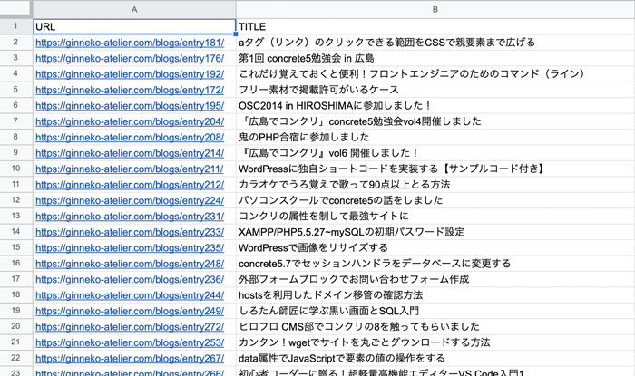

一般の方はWordPressでブログ管理している人が多いと思うので、[WP CSV Exporter](https://wordpress.org/plugins/wp-csv-exporter/)というプラグインを使って出力するのがベストと思います。

私のブログはGatsbyでできているのでローカル側のGraphQLで記事のみ抽出してシートを作りました。やり方は、[こちら](/blogs/entry336/#%E7%89%B9%E5%AE%9A%E3%81%AE%E6%96%87%E5%AD%97%E3%81%8C%E5%90%AB%E3%81%BE%E3%82%8C%E3%81%A6%E3%81%84%E3%81%AA%E3%81%84%E8%A1%8C%E3%82%92%E5%89%8A%E9%99%A422-05-22)に書いておきましたので興味のある方はお読みください。

## Looker Studioにアクセス、無料で利用するでスタート
[Looker Studio](https://marketingplatform.google.com/intl/ja/about/data-studio/)にアクセスし、無料で利用するをクリックします。
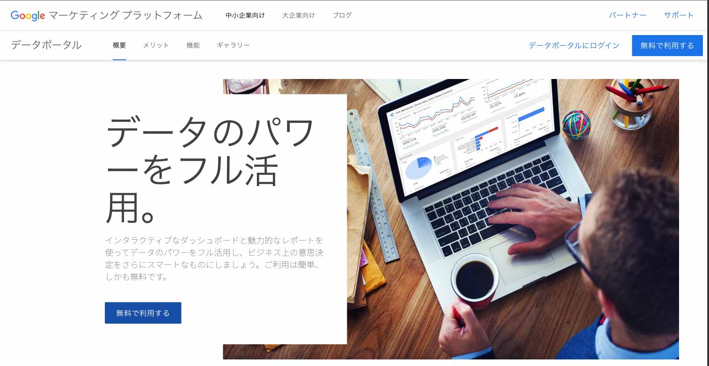

もしくは、[直接](https://lookerstudio.google.com/)アクセスしましょう。

### 空のレポートを作成しておく
まずは空のレポートを作成します。

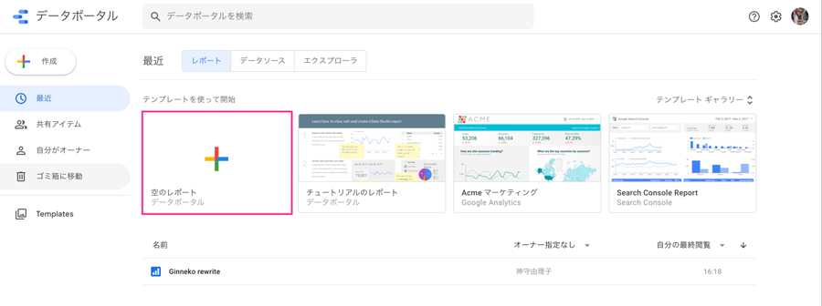
無題のレポートができました。
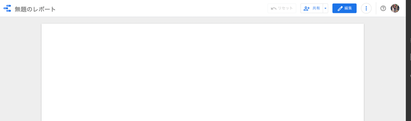

## データの連携処理
空のレポートからデータの連携処理を行っていきます。

無題のレポートが出来上がりますので編集をクリックします。

### スプレッドシートと連携しておく
まずはスプレッドシートのデータを取り込みます。

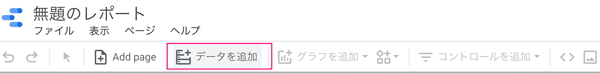

データを追加し、必要なスプシとシートを取り込みます。


使用したいスプシを選び、先頭行をヘッダーとして使用するにチェックをし、右下の追加ボタンをクリック。
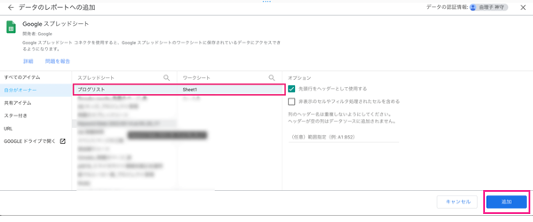

#### ディメンション設定をしてデータがきちんと取り込めているか確認する

URLとタイトルを表示してみます。

ディメンションにURLとTITLE（先頭行の名称）を選びます。以下のように表示されていれば成功です。

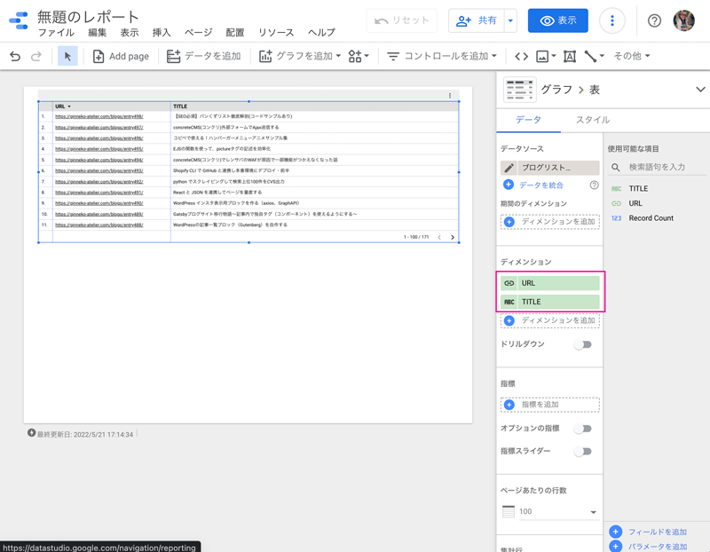

### Search Console と連携する
次に、Search Consoleのデータを取り込みます。データの追加を行います。


対象のドメイン、URLのインプレッション、Webを選びます。<br>スクショでは切れてますが、右下に追加ボタンがあるのでクリック。

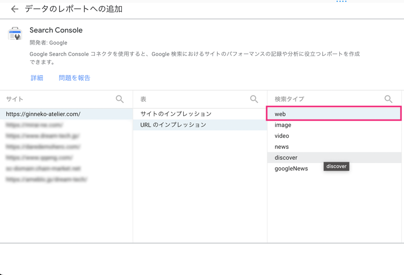

これでSearch Consoleのデータを使えるようになったので、データソースの*データを統合*をクリック。

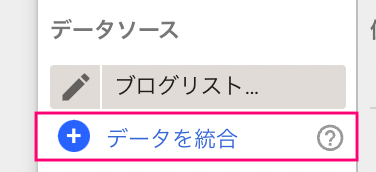

*別のテーブルを結合*をクリック。

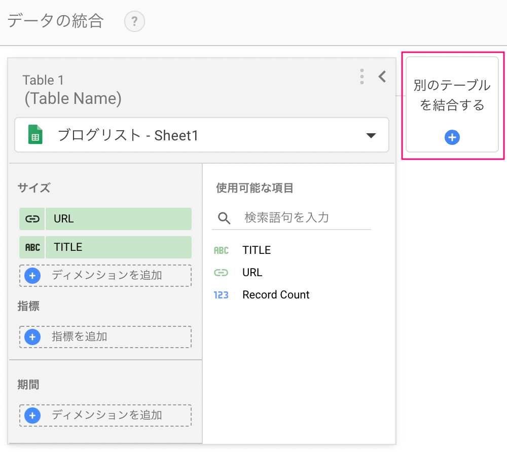

サイズにLanding Pageを選択。
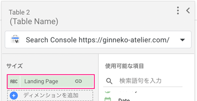

結合の設定（Confiture join）をクリック。URLとLanding Pageの一致を条件とし、左外部結合を選びます。
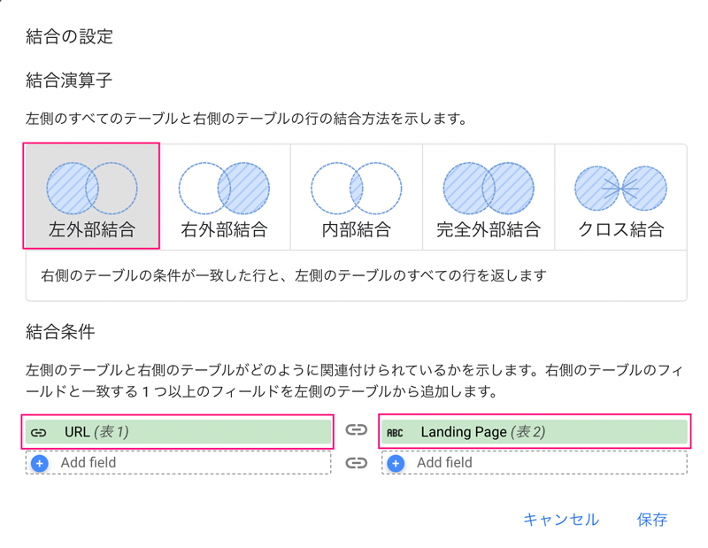

Search Consoleでは以下を指標として選びました。

* Impressions（表示回数）
* URL Clicks(クリック数)
* URL CTR（クリック率）
* Avarage Position（掲載平均順位）

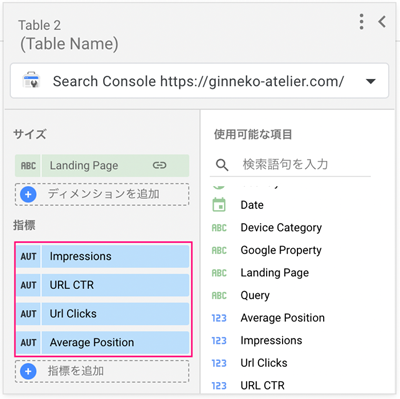


各ページの指標にどれだけの数値があるのか一目瞭然です。

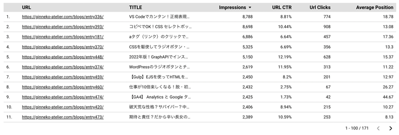

### GA4と連携する(2023年2月追記)
Search Console同様、GA4 を追加します。

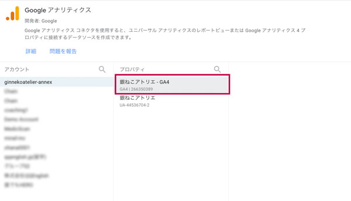

データが追加できたら、データソースを編集（鉛筆マーク）をクリック。

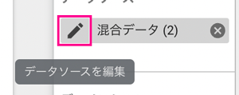

#### データの結合・スプシのURLと値が一致しないので専用のフィールドを作る
データの結合するためのGA4のディメンションには `ページパス + クエリ文字列またはスクリーン` もしくは `ページの完全な URL` を使います。

GA4では `ページパス + クエリ文字列またはスクリーン` もしくは `ページの完全な URL` は **他のURLに関するデータと一致しません**。

```js
// ページパス + クエリ文字列またはスクリーン クラス
/blogs/entry500/

// ページの完全な URL
ginneko-atelier.com/blogs/entry500/

// スプシ
https://ginneko-atelier.com/blogs/entry500/
```
そこでスプシやExcelでおなじみの *CONCAT関数* を使ってフィールドを作成し、一致する *URL* を作成します。

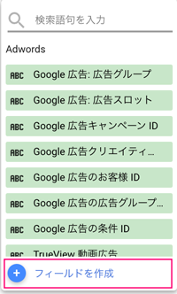

```js
CONTAT("https://", ページの完全な URL)
// もしくは
CONTAT("https://ginneko-atelier.com", ページパス + クエリ文字列またはスクリーン)
```
フィールド名をURLなどとし、ディメンションに追加し、データを結合します。

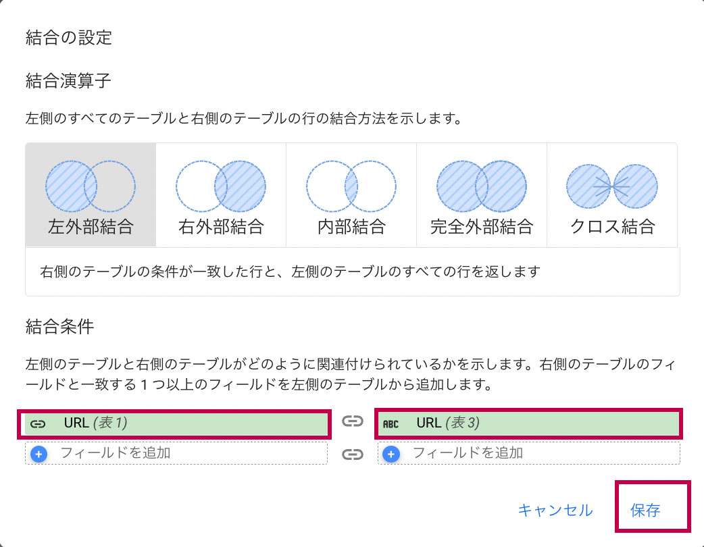

#### 指標の設定

GA4の指標を追加します。
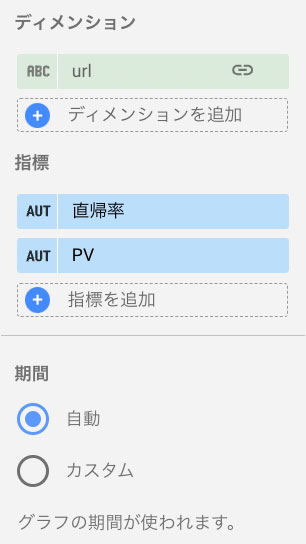

サーチコンソールと連携して主に行いたいのはランディングページの改善なので、アナリティクスでは以下を指標として選びます。

* ランディングページのPV
* 直帰率

残念ながら、直帰率もランディングページのPVも Looker Studio で指標として直接引っ張ってこれないのでフィールドやフィルターで割り出します。

*ランディングページのPVのみカウント*

GA4では、PV数などはイベントとしてカウントされます。

ランディングページのPV数をカウントするためには、session_startというイベントを利用します。このイベントはセッションが始まったときのみにカウントされるイベントなのでランディングページのPV数を数えることができます。今回は結合元のデータまるごとフィルターを使って絞り込みます。

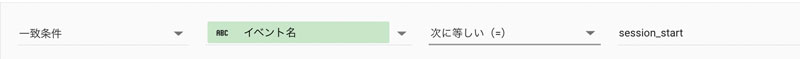

これでイベント数が *ランディングページのPV* になるので名前をPVなどに変更しておきます。

<div class="box">
一致条件 : <em>イベント名　=(一致)　session_start</em>
</div>

*直帰率のフィールド*

直帰率はエンゲージメント率を利用して作成します。

エンゲージメント率は直帰率の真逆の数字なので `1-エンゲージメント率` で直帰率が割り出せます。フィールドを使って出力します。

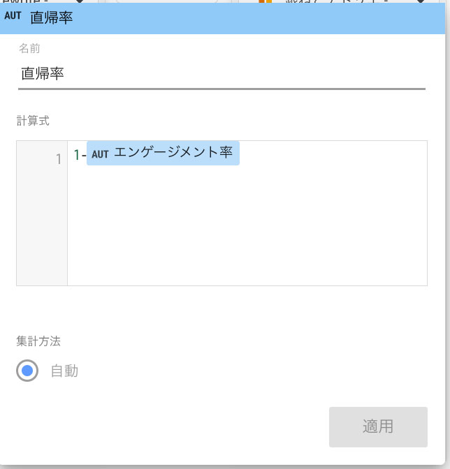

```js
1-エンゲージメント率
```


### ユニバーサルアナリティクス と連携方法（サポート終了後は削除予定）
Google アナリティクス のデータ追加方法も明記しておきます。
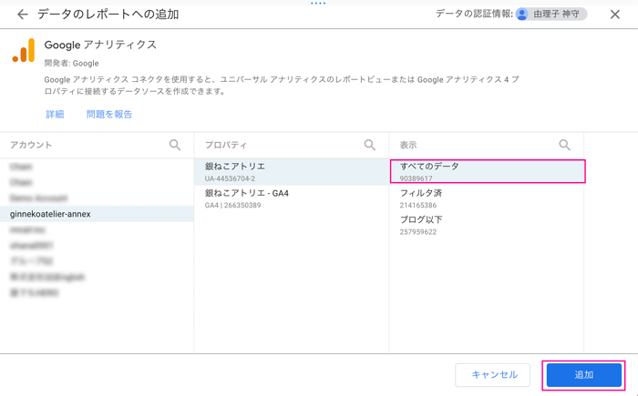

#### スプシのURLとアナリティクスのランディングページの値が一致しないので専用のフィールドを作る
アナリティクスのディメンションには*ランディングページ*を使います。
```js
// アナリティクス
/blogs/entry500/
// 他のデータの値
https://ginneko-atelier.com/blogs/entry500/
```
```js
CONTAT("https://ginneko-atelier.com/", ランディング ページ)
```

#### Google アナリティクス と結合の設定と指標の設定
結合の設定（Confiture join）で左外部結合、表1（スプシ）は*URL*、表3（アナリティクス）は*Perfect URL*のフィールドを選択。

必要なアナリティクスの指標を追加します。

## 取得日時をコントロールする
日時を設定します。すべてのデータが一度に設定できたほうが便利なので、コントロールを使った方法をご紹介します。

上部メニューから*コントロールの追加*をクリックし*期間設定*を選択します。

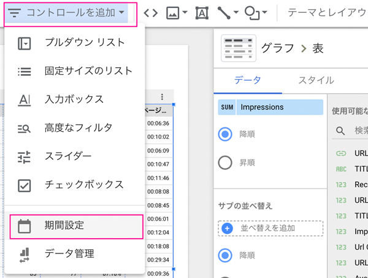

表の位置を調整して、表の上にコントロールを設置します。期間を選んでおきます。

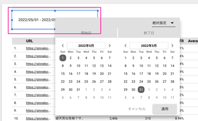

表のデフォルトの日付範囲を自動にしておきます。

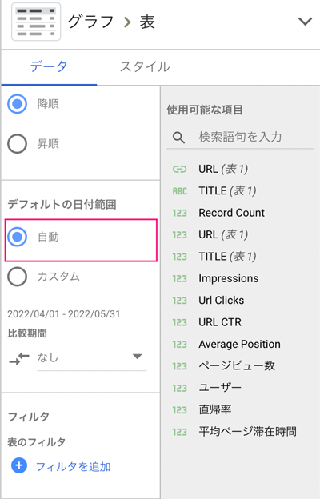

これでコントロールから日時を集計できるようになりました！

## 統合したデータに出力したいディメンション、指標を設定し表にする

以下の取得するデータをセットしただけなので、実際に出力する表に必要なデータを設定していきます。

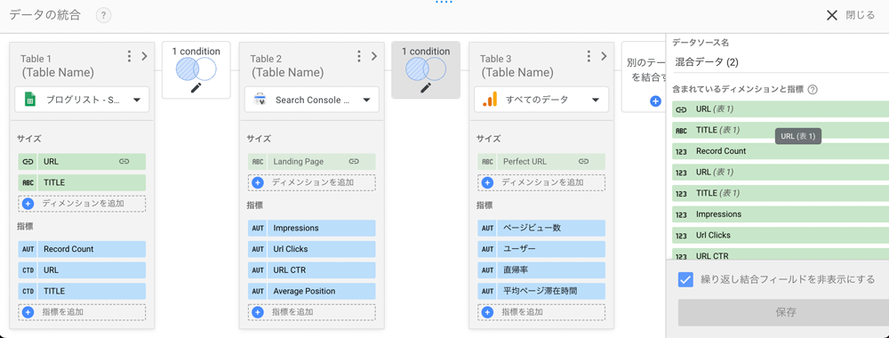

データの統合を保存して閉じ、実際の右側のパネルから指標とディメンションを設定します。

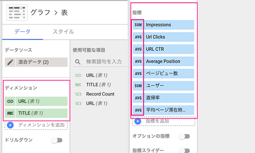

指標を追加するとおそらく右側のアイコンがデフォルトでSUM（合計値）と表示されているので必要に応じてAVR（平均値）に切り替えます。

|ディメンション|
|-|
|URL（表1）|
|TITLE（表1）|
|指標|周囲系方式|
|-|-|
|Impressions（表示回数）|SUM|
|URL Clicks(クリック数)|SUM|
|URL CTR（クリック率）|AVR|
|Avarage Position（掲載平均順位）|AVR|
|PV数（イベント数）|SUM|
|直帰率|AVR|

<small>※ SUMは合計、AVRは平均です。</small>

ヒートマップ付きデータ表にすると、データの統合の全体はこんな感じになります。

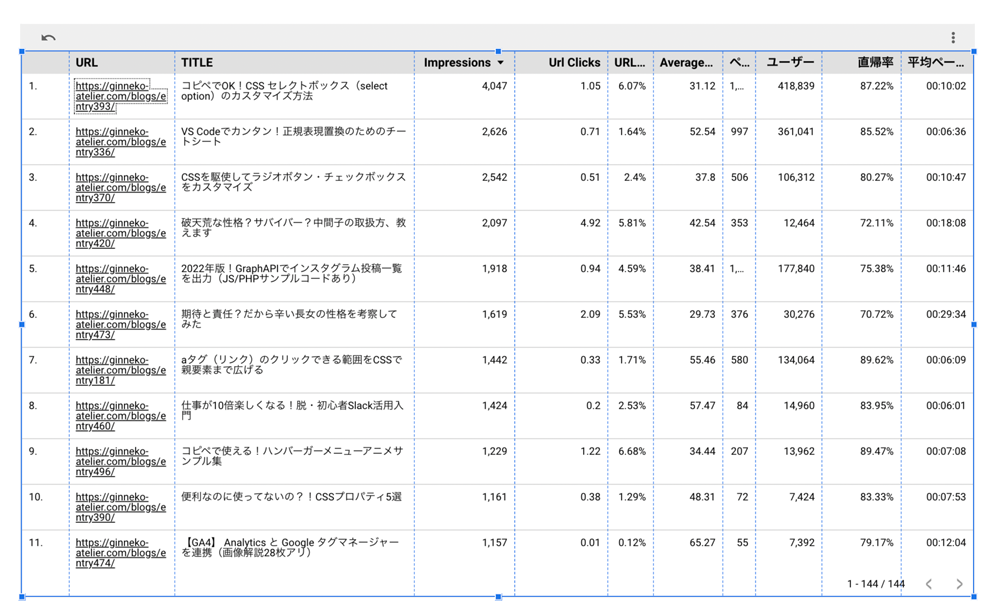

### リライト記事をフィールドを使って分類する（2023/02追記）


リライトする記事を条件ごと分類できるようにします。[【ブログのSEO対策】リライト記事の選び方](/blogs/entry444/)でリライト記事の選び方を紹介しました。せっかくなので、この記事の条件に沿って分類しできるようにします。

予めスプシに *公開日(date)* と *更新日(mod_date)* も追加しておきます。

データは公開して1ヶ月間以上立ったもののみで対象、期間も1ヶ月単位などという感じで固定しておくことをおすすめします。

|アクション|指標|
|-|-|
|リライト（フェーズ1）|公開3ヶ月以上インプレッション数月間100以下|
|リライト（フェーズ2）|順位平均20位以下|
|リライト（フェーズ3）|順位平均11 ~ 20位でクリック率平均3%以下|
|リライト（フェーズ4）|直帰率が80%以上|
|noindexもしくは削除|公開半年以上経ったのにimpression10以下/ページビュー10以下|
|-|ページビュー300以上|

<card id="/blogs/entry444/"></card>
<div class="box">
<em>統合したデータのスプシのディメンションにも、 date と mod_date を追加しておきます。</em>
</div>

まずは記事のフェーズの登録です。ディメンションにフィールドを追加します。

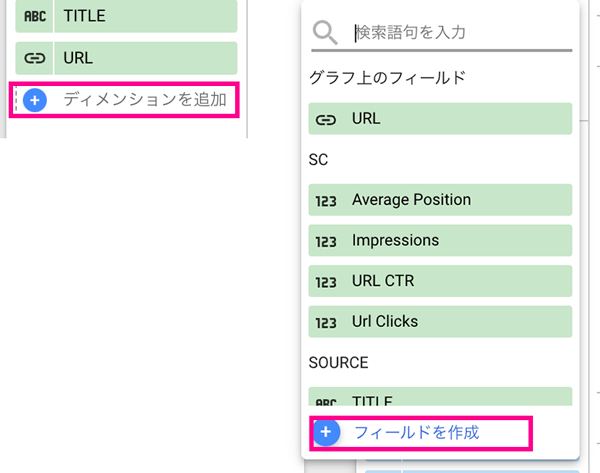

フィールドにフェーズという計算式を追加します。

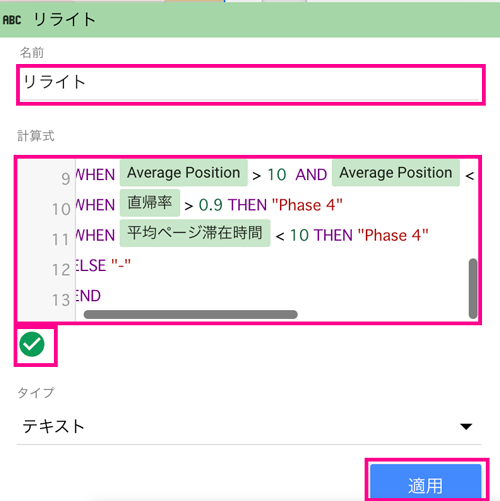

<small>※ スクショは多少値が違います。操作方法のみ参考にしてください。</small>

Looker Studioでの条件式の書き方です。CASE文を使って分岐します。

```sql
CASE
WHEN 条件 THEN 値
ELSE デフォ値
END
```
まとめて書くとこんな感じになります。

```sql:title=計算式
CASE
WHEN Impressions IS NULL AND PV IS NULL AND DATE_DIFF(TODAY("Asia/Tokyo"),date) > 180 THEN "noindex"
WHEN Impressions < 10 AND PV < 5 AND DATE_DIFF(TODAY("Asia/Tokyo"),date) > 180 THEN "noindex"
WHEN Impressions < 10 AND PV IS NULL AND DATE_DIFF(TODAY("Asia/Tokyo"),date) > 180 THEN "noindex"
WHEN Impressions IS NULL AND PV < 5 AND DATE_DIFF(TODAY("Asia/Tokyo"),date) > 180 THEN "noindex"
WHEN PV > 300 THEN "5"
WHEN Impressions < 300 AND Impressions > 50 AND DATE_DIFF(TODAY("Asia/Tokyo"),date) > 90 THEN "1"
WHEN Impressions > 300 AND Average Position < 20 AND Average Position > 50 THEN "2"
WHEN Average Position > 10  AND Average Position < 20 THEN "3"
WHEN 直帰率 > 0.9 THEN "4"
ELSE "5"
END
```
いくつか関数をご紹介します。
```sql:title=今日を取得
TODAY("Asia/Tokyo")
```
```sql:title=値がnull
〇〇 IS NULL
```
```sql:title=日の差分取得
DATE_DIFF(終了日,開始日)
```
### 記事の更新があった記事をわかりやすくしたい
記事の更新があった場合のみ値を表示したい時です。そのまま以下のように出力すればOKです。

```sql:title=日の差分取得
CASE
WHEN MOD_DATE IS NULL THEN ''
ELSE MOD_DATE
END
```
IS NULL が効かない場合は = 'null' に置き換えてください。

### 公開もしくは更新から30日以上立った記事のみに経過日数を表示したい

経過日数を表示するためのフィールドです。30日は様子を見たいので、公開ないしは更新から30日以上たった記事のみに経過日数を表示させます。

```sql:title=日の差分取得
CASE
WHEN MOD_DATE = 'null' AND DATE_DIFF(TODAY("Asia/Tokyo"), date) > 30 THEN  CONCAT(DATE_DIFF(TODAY("Asia/Tokyo"), date), '日経過')
WHEN DATE_DIFF(TODAY("Asia/Tokyo"), cast(mod_date AS DATE)) > 30 THEN  CONCAT(DATE_DIFF(TODAY("Asia/Tokyo"), cast(mod_date AS DATE)), '日経過')
ELSE '-'
END
```
mod_date は更新されたことがない記事がある場合、ブランクデータ（null）として取り扱われてしまいます。その場合は、mod_dateのタイプは文字列と認識されています。

CAST関数で日付にタイプを変換して使います。

```sql
cast(mod_date AS DATE)
```

これでリライトすべき記事や優先度がわかりやすくなります。


## 作成したデータを期間で区切ってスプなどに落とし、作業ログを作る
どのようにリライトしたかなどログを残しておきたいですよね？ログを記録するように作成したデータをさらにスプシに変換します。

表の右上にケバブメニュー（縦3つのドット）があるのでそちらをクリックしエクスポートを選びます。

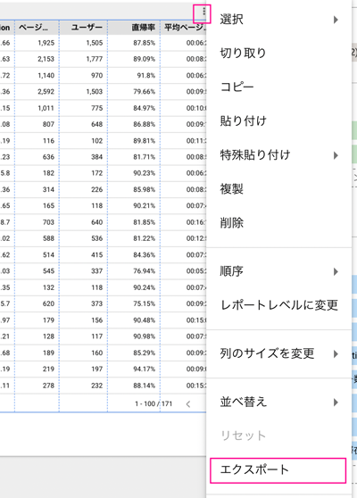

スプレッドシートにチェックを入れエクスポートをクリックします。もちろん、ExcelやCSVでエクスポートもできます。

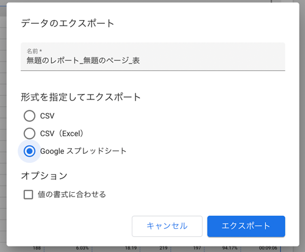

これで、いつどんなリライトをしたかログを残しておきつつ、効果測定が行なえます。

## まとめ・Looker Studio を使って各種データを統合すると全貌が把握できる
Looker Studio でデータを統合すると、総合的に見てどの記事を分析すればいいかなど把握しやすくなります。

今回この表を作るのも結構手探りで作りましたが、まだまだ紹介できていない機能があるのでまた記事にまとめられたらなーと思っています。

この記事が皆さんのWeb解析ライフの一助となれば幸いです。

最後までお読みいただきありがとうございました。

<prof></prof>
