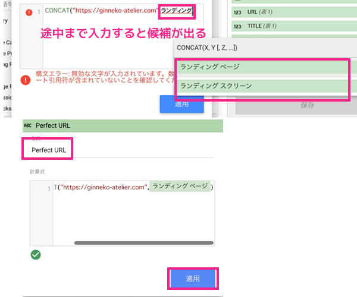
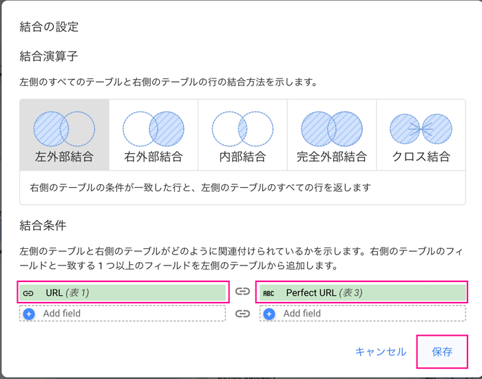
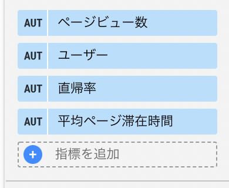

## この記事はこんな方におすすめ
* ブログのリライトをしたいけどどの記事から手を付けていいかわからない
* データポータルを使っててっとり早くWeb解析をしたい
* データポータルを使っていろんなデータを統合してみたい

注意点！今回はユニバーサルアナリティクスを使用しています！後日、GA4版も作成します。

<msg txt="データポータルはビッグクエリなどと連携しない場合は無料で使えます！"></msg>

## 解析対象の記事のURLとタイトルのスプシを準備する
解析対象の記事のスプシを準備します。現在公開中の記事のURLとタイトルを抽出したシートを作りました。


一般の方はWordPressでブログ管理している人が多いと思うので、[WP CSV Exporter](https://wordpress.org/plugins/wp-csv-exporter/)というプラグインを使って出力するのがベストと思います。

私のブログはGatsbyJSでできているのでローカル側のGraphQLで記事のみ抽出してシートを作りました。やり方は、[こちら](/blogs/entry336/#%E7%89%B9%E5%AE%9A%E3%81%AE%E6%96%87%E5%AD%97%E3%81%8C%E5%90%AB%E3%81%BE%E3%82%8C%E3%81%A6%E3%81%84%E3%81%AA%E3%81%84%E8%A1%8C%E3%82%92%E5%89%8A%E9%99%A422-05-22)に書いておきましたので興味のある方はお読みください。

## データポータルにアクセス、無料で利用するでスタート
[データポータル](https://marketingplatform.google.com/intl/ja/about/data-studio/)にアクセスし、無料で利用するをクリックします。


もしくは、[直接](https://datastudio.google.com/)アクセスしましょう。

### 空のレポートを作成しておく
まずは空のレポートを作成します。


無題のレポートができました。


## データの連携処理
空のレポートからデータの連携処理を行っていきます。

無題のレポートが出来上がりますので編集をクリックします。

### スプレッドシートと連携しておく
まずはスプレッドシートのデータを取り込みます。


データを追加し、必要なスプシとシートを取り込みます。


使用したいスプシを選び、先頭行をヘッダーとして使用するにチェックをし、右下の追加ボタンをクリック。


#### ディメンション設定をしてデータがきちんと取り込めているか確認する

URLとタイトルを表示してみます。

ディメンションにURLとTITLE（先頭行の名称）を選びます。以下のように表示されていれば成功です。


### Search Console と連携する
次に、Search Consoleのデータを取り込みます。データの追加を行います。


対象のドメイン、URLのインプレッション、Webを選びます。<br>スクショでは切れてますが、右下に追加ボタンがあるのでクリック。


これでSearch Consoleのデータを使えるようになったので、データソースの*データを統合*をクリック。


*別のテーブルを結合*をクリック。


サイズにLanding Pageを選択。


結合の設定（Confiture join）をクリック。URLとLanding Pageの一致を条件とし、左外部結合を選びます。


Search Consoleでは以下を指標として選びました。

* Impressions（表示回数）
* URL Clicks(クリック数)
* URL CTR（クリック率）
* Avarage Position（掲載平均順位）


各ページの指標にどれだけの数値があるのか一目瞭然です。


### Google アナリティクス と連携する（ユニバーサルアナリティクス）
Search Console同様、Google アナリティクス のデータを追加します。


データが追加できたら、データソースを編集（鉛筆マーク）をクリック。


#### スプシのURLとアナリティクスのランディングページの値が一致しないので専用のフィールドを作る
アナリティクスのディメンションには*ランディングページ*を使います。

アナリティクスのランディングページの値はドメインを除いたフルパスにってしまうので**他のデータと一致しません**。
```js
// アナリティクス
/blogs/entry500/
// 他のデータの値
https://ginneko-atelier.com/blogs/entry500/
```
そこでスプシやExcelでおなじみの*CONCAT関数*を使ってフィールドを作成し一致するURLを作成します。


```js
CONTAT("https://ginneko-atelier.com/", ランディング ページ)
```
関数には上記のように設定しますが、少し入力すると候補が出てくるので、補助機能を活用しながら関数を登録していくとラクチンです。
<br>フィールドには名前が必要なので今回は*Perfect URL*としました。



適用をクリックします。

私の環境下（Mac Chrome）では適用をクリックしたあともモーダルが閉じません。モーダル外のどこかしらをクリックしたら閉じるので閉じない方はやってみてください。

#### Google アナリティクス と結合の設定と指標の設定
結合の設定（Confiture join）で左外部結合、表1（スプシ）は*URL*、表3（アナリティクス）は*Perfect URL*のフィールドを選択します。



アナリティクスの指標を追加します。


アナリティクスでは以下を指標として選びました。

* ページビュー数
* ユーザー数
* 直帰率
* 平均ページ滞在時間

### 統合したデータに出力したいディメンション、指標を設定し表にする

以下の取得するデータをセットしただけなので、実際に出力する表に必要なデータを設定していきます。


データの統合を保存して閉じ、実際の右側のパネルから指標とディメンションを設定します。


指標を追加するとおそらく右側のアイコンがデフォルトでSUM（合計値）と表示されているので必要に応じてAVR（平均値）に切り替えます。

|ディメンション|
|-|
|URL（表1）|
|TITLE（表1）|

|指標|周囲系方式|
|-|-|
|Impressions（表示回数）|SUM|
|URL Clicks(クリック数)|SUM|
|URL CTR（クリック率）|AVR|
|Avarage Position（掲載平均順位）|AVR|
|ページビュー数|SUM|
|ユーザー数|SUM|
|直帰率|AVR|
|平均ページ滞在時間|AVR|

<small>※ SUMは合計、AVRは平均です。</small>

データの統合の全体はこんな感じになりました。


## 取得日時をコントロールする
日時を設定します。すべてのデータが一度に設定できたほうが便利なので、コントロールを使った方法をご紹介します。

上部メニューから*コントロールの追加*をクリックし*期間設定*を選択します。


表の位置を調整して、表の上にコントロールを設置します。期間を選んでおきます。


表のデフォルトの日付範囲を自動にしておきます。


これでコントロールから日時を集計できるようになりました！

## 作成したデータをスプシに落とし込み戦略を練る
作成したデータをさらにスプシに落とし込んで戦略を練ります。

せっかく作ったデータポータルの表をわざわざスプシに落とし込む理由ですが、時期によってやる対策が違うのと作業ログを残すためです。

表の右上にケバブメニュー（縦3つのドット）があるのでそちらをクリックしエクスポートを選びます。


スプレッドシートにチェックを入れエクスポートをクリックします。もちろん、ExcelやCSVでエクスポートもできます。


あとはシートにフィルターで、リライト対象や *noindex(※)* を設定する記事を抽出します。

例えば、以下のような対応を考えることができます。

|表示回数|クリック率|平均掲載順位|PV数|対応|
|-|-|-|-|-|
|1ヶ月500以上|3%以下|50位以内|-|キーワードを参考にタイトルやディスクリプションを中心にリライト|
|1ヶ月10以下|0|70位以上|null|noindexを追加|

※ここで言う noindex とはGoogle によるページのインデックス登録をブロックし、検索結果にページを表示させなくしてしまうことです。

```HTML
<meta name="robots" content="noindex">
```
サイトの成長過程で対策は変わってくると思いますのであくまで参考にしてみてください。

リライトに関する記事はこちらを参考にしてください。

<card id="/blogs/entry444/"></card>

## まとめ・データポータルを使って各種データを統合すると全貌が把握できる
データポータルでデータを統合すると、総合的に見てどの記事を分析すればいいかなど把握しやすくなります。

今回この表を作るのも結構手探りで作りましたが、まだまだ紹介できていない機能があるのでまた記事にまとめられたらなーと思っています。

この記事が皆さんのWeb解析ライフの一助となれば幸いです。

最後までお読みいただきありがとうございました。
