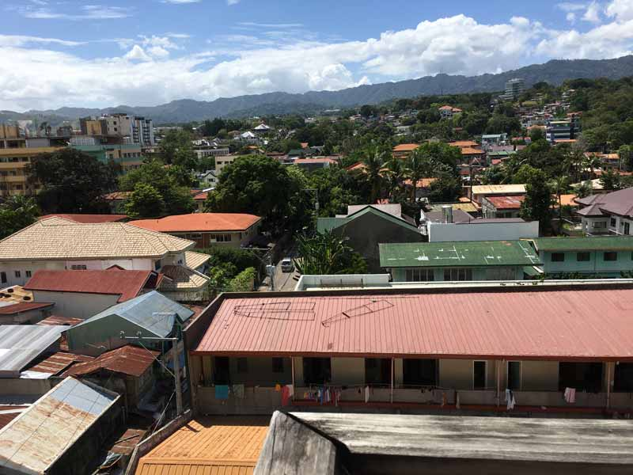
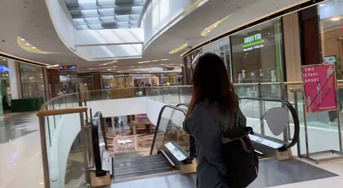
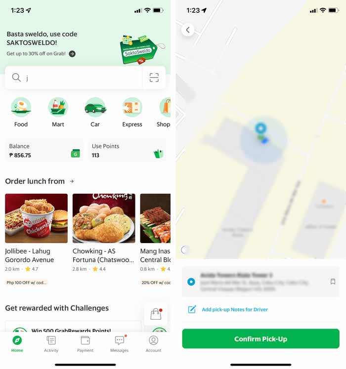
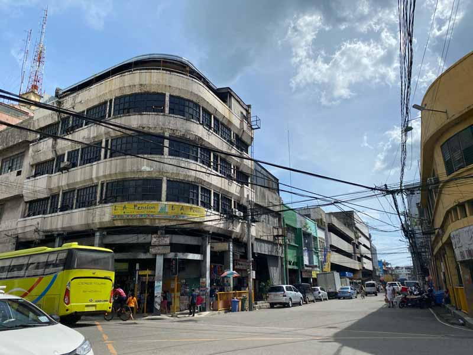
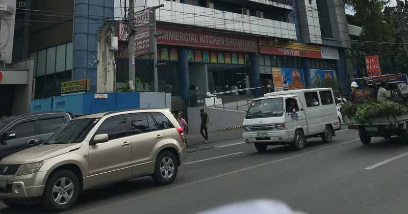

## セブ島あるあるトラブル
セブ島初渡航の方によくあるトラブルをまとめました。

### トイレにティッシュがない、水が流れない
キレイなモールでもトイレが汚く、壊れているなどよくある話です。

水が流れないトイレには大抵、便座や手洗い場の近くに水が汲んであるバケツと手桶があります。手桶で2、3杯水を汲みトイレに入れたら流れます。

便座のないトイレもザラです。ティッシュを敷く、足がつかないように浮かせるなど工夫します。

なぜ便座がないかというと、不潔な便座に座りたくないフィリピン人は靴のまま上がってしゃがんで用を足すので便座が割れるそう。

<msg txt="フィリピンには和式トイレを導入したらすべて解決!"></msg>

<h4>外出時のトイレ対策</h4>ウェットティッシュやポケットティッシュ、アルコールを持ち歩く

### いろんなお店でお釣りが用意されていない
スタバやコンビニなどのお店でもお釣りが無いと言われることが多いです。

タクシーなどでは特にお釣りが出ない事が多いので常に小銭を用意しておきましょう。

<msg txt="多少のお金はチップとしてあげちゃいます"></msg>

### モールで道を聞いても答えられない

<small>SMシーサイドモール</small>

  セブのモールは日本と違って現在地的な案内がないです。そもそも地図が読めない人が多いです。ガードなどに道を聞いても正確に答えられない人もしばしば。

解決策はググって日本語の情報サイトを調べるか、根気よく何人も聞くしか有りません。

### タクシーがメーターを上げない

タクシートラブルあるあるです。 メーターをわざと上げずに目的地に到着した途端、ありえない額を請求されることがあります。

<h4>ボられないポイント</h4>乗車したらドアを締める前に必ずメーターを上げたことをチェックし、上げてなかったら必ず上げるように伝える

私はメーターを上げない場合は降りるようにしています。降りる素振りを見せるだけでも、たいていメーターを上げます。

コミュニケーションに自信がない方は、トラブルに巻き込まれないためにGrabなどのタクシー配車サービスを使うことをオススメします。走行ルートと金額が決まっているのでトラブルが起きにくいです。

<msg txt="タクシーのドアは自動で開閉しないです"></msg>

### レストランで料金を水増しされる
こちらは一度大人数で会食中に起こったトラブルです。お釣りが少なく、あとから物申しに言ったことがありました。

ローカルのレストランなど（特にバー）では、金額を水増しされたり、わざと少なくお釣りを渡されることがあります。

レシートをよく見て、金額がおかしくないかチェックしましょう。

## よくある巻き込まれがちな犯罪

私と私の周りで起こった軽度な犯罪についてまとめます。

### 実体験・携帯を盗まれる
私の実体験です。3年前フィリピンに来た翌日に携帯を盗まれました。

携帯はリュックのサイドポケット（フタなし）に無造作に入れていました。

初出勤の仕事の帰り、精神的にも疲れてボーっとしながら1ピースチキンをコンビニで買いました。

家に帰ったら携帯がなくなっていました。

<iframe src="https://www.google.com/maps/embed?pb=!1m18!1m12!1m3!1d3925.1499543883056!2d123.89856681479674!3d10.329882092625459!2m3!1f0!2f0!3f0!3m2!1i1024!2i768!4f13.1!3m3!1m2!1s0x33a9992386f2eb13%3A0x5c28daeb652475da!2sSalinas%20Dr%2C%20Cebu%20City%2C%20Cebu!5e0!3m2!1sja!2sph!4v1653967692348!5m2!1sja!2sph" width="400" height="200" style="border:0;" allowfullscreen="" loading="lazy" referrerpolicy="no-referrer-when-downgrade"></iframe>

当時住んでいたのはセブシティのサリナスドライブ近隣のコンドミニアムです。

盗まれたあと、「iPhoneを追跡する機能」で追跡しましたがあっという間にマニラまで移動し、その後消息を絶ちました。

このサリナスドライブはホームレスやストリートチルドレンなど多く決して治安の良い場所では有りません。

私が携帯を盗まれた月は私以外にも3人位、日本人が被害に遭っていました。

その後も携帯を盗まれる被害は跡を絶ちませんでした。

<msg txt="サリナスドライブではあまりにも周りの人が携帯盗まれているので、「スマホパクられストリート」と別名を付けてやりました！"></msg>

私は何度も携帯を日本でなくしていますが、一度たりとも手元に戻ってこなかったことが有りません。タクシーに忘れようものなら、親切に警察に届けてくれます。

その感覚でいると、間違いなく標的にされます。

<msg txt="平和ボケした日本人はカモです。 ネギ背負ったカモ！"></msg>

<h4>カモられないポイント</h4>
<ul>
<li>携帯をポケットなど取り出しやすい場所に入れない</li>
<li>携帯を外で使わない（特に夜）</li>
</ul>

#### iPhoneが売れたら、日本では想像できないくらい生活の助けになる
iPhoneが売れたぐらいでお小遣い程度じゃない？

そう思う人もいると思います。

ここはフィリピン。物価が日本と違います。貧困層の世帯収入が2万円以下なので携帯が一個売れたら数カ月分の生活費になります。

### 出会い系アプリTinderで知り合った女性からお金をふんだくられる

Tinderなどの出会い系アプリで出会いを求めて、会ってみたもののお金をふんだくられた話を聞きます。

フィリピンでは日本人というだけでお金持ってると思われるので容姿や年齢に関係なくモテます。

あまり女性経験がない男性にとっては出会いのチャンスですよね？

<msg txt="正直に現実をお伝えすると、お金を目当てにされているだけですよ！"></msg>

逆に、あちらにとってもチャンスです。鼻の下伸ばして油断しまくってる男性なんてチョロいもんです。

* 「事」のあと、言いがかりをつけてビンタされお金を巻き上げられた
* 会いに来たのがレディボーイで「事」の前に恐喝された

私は女なのでそんな経験ありませんし、アドバイスできることといえば、海外に来たからといって鼻の下を伸ばさず気を引き締めて行動しましょう。

### トランプからの恐喝

これも知り合いが実際に遭遇したトラブルです。

お酒を飲んでいたらフレンドリーなフィリピン人が「一緒にトランプ（ギャンブル）で遊ぼう」と話しかけてきたそうです。

そこで一緒に遊んでいたら、囲まれて軟禁されてお金をふんだくられたそうです。

フィリピン人は見知らぬ人でも日本じゃ考えられないくらいフレンドリー。つい気をを許してしまいそうになりますが、油断してはいけません。

<h4>カモられないポイント</h4>
<ul>
<li>公共の場じゃないところでギャンブルなどの遊びをしない</li>
</ul>

## 日本人が最も殺される国、フィリピン

フィリピンは東南アジアで犯罪の多い国です。殺人事件も多く、2019年の殺人件数ですが比較しても日本の約15倍です。

||人数|
|-|-|
|日本|319|
|フィリピン|4,764|

引用：[ワールド・データ・アトラス](https://jp.knoema.com/atlas)

しかもフィリピンは日本人が最も殺される親日国と言われています。

私も日々地元のニュースを読んでますが、日本人を始めとする外国人が身近な場所で殺人事件に巻き込まれています。

一番いいのは犯罪に巻き込まれないことですが、身の危険を感じたらとにかくお金は渡してしまいましょう。

### 発砲事件に巻き込まれることもある
3年前SMモールで強盗事件があり、発泡があったそうです。たまたま私の知り合いが居合わせていてそれはもう怖かったそうです。

フィリピンは銃社会。今では見慣れてしまいましたが、ちょっと銀行の前を歩くと、お金の移送中などはガードマンがライフルをもって見張っています。

ちょっとした痴話喧嘩でも頭に血が昇り、銃を持ち出したニュースなど日常茶飯事です。

## 海外が治安が悪いわけではない。日本が治安が良いだけ
私の親世代とかはよく*海外は治安が悪い*って思い込んでますが、違います。

**日本の治安が良いだけ**です。

こちらは2022年のデータです。

||犯罪指数|順位|
|-|-|-|
|日本|21.95|8|
|フィリピン|42.33|59|

<small>※ ちなみに最下位位はベネズエラの142位でした。</small>

[NUMBEO](https://www.numbeo.com/crime/)

10年以上平和な日本に住んでいたら、**治安の良いのが当たり前** なので気をつけているつもりでも気をつけきれないのが現実です。

<h3>巻き込まれないためには</h3>
<ul>
  <li>夜遅く出歩かない</li>
  <li>遅い時間は誰かと一緒にいるようにする</li>
  <li>治安の悪い場所には行かない、近づかない</li>
  <li>高価なものを身に着けたり華美な格好はしない</li>
</ul>

また、同じ日本人でも長期在住者と観光客は一目瞭然です。

自分が外国人だという認識を持って、ここが日本ではないとよく肝に銘じた上で行動しています。

## まとめ・トラブルや犯罪に巻き込まれない環境に身を置く
海外だって治安のいい場所もたくさんあります。もちろん、犯罪や不正が大嫌いで正しく有りたい人のほうが大半です。

ほんのごく一部の人が犯罪を起こしているだけで、普通にしてたら日本とさほど変わらず過ごすことはできます。

海外で過ごす際にいちばん大切なのは **トラブルや犯罪に巻き込まれない環境に身を置く** ことです。

 セブ島での暮らしについてはこちらにまとめています。あわせてお読みください！

<card id="/blogs/entry417/"></card>

この記事がセブ渡航などの一助となれば幸いです。

最後までお読みいただきありがとうございました。
