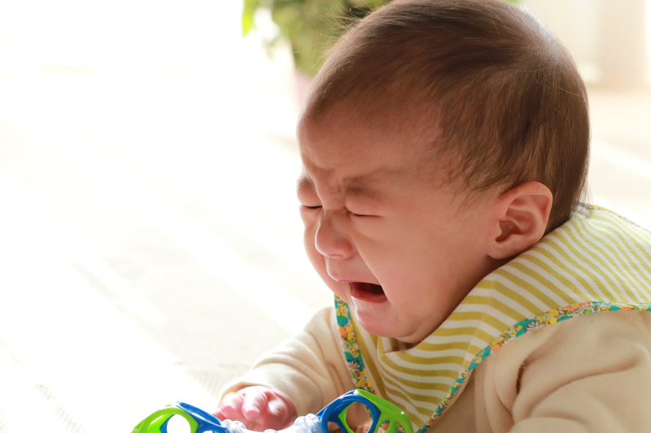
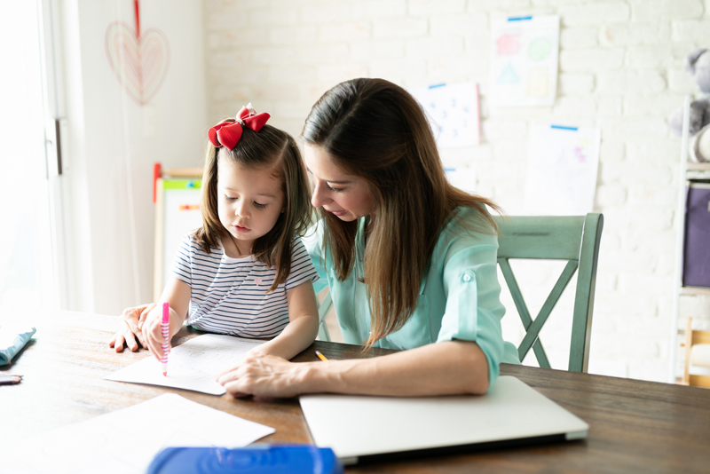
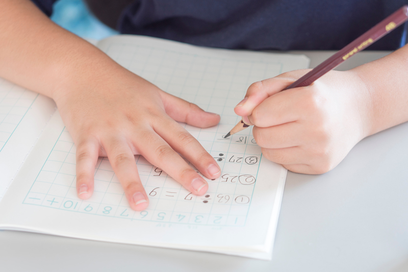
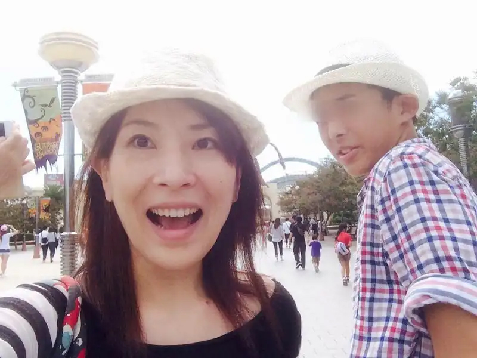

## 母はなぜ子育てでしんどいのか？

私は2年前、子育てという仕事を終えました。

ほとんどの母親が思うように育てられなかったと感じるのではないでしょうか？

こう育てたかった！と思いつつも実際は上手くいかず、理想と現実の間にギャップを思いしれば知るほど、後悔がたくさん残ります。

この理想が結局子育てを苦しくさせている原因だと今では思っています。

一見、理想通りになりたいのは当たり前じゃないか、と思いますよね？問題は中身で、どんな理想が生まれてるかです。

私のケースでは母親からの刷り込みや過去の自分をやり直したくなる呪縛が原因だったと振り返ります。

### 母親はこうあるべきという刷り込み

こんな親になりたくないという反面教師も理想の一つです。

うちの親は、子供の頃放任主義で特に母親は教育には無頓着でした。

基本私は母親のことは大好きです。しかし大人になってから一つだけ不満がありました。

<msg txt="私の過去の母に対してお願いしたかったことは、もっと進路に関するアドバイスが欲しかった。"></msg>

私の若い頃は、インターネットのない時代です。 
私は勉強して、いい大学を出たら将来選択肢が増えるなんて思いもしませんでした。

 初任給に差が出ることも知りませんでした。
<msg txt="なんでお母さんは、もっと私たちの教育に首を突っ込んでくれなかったんだろう。 大人になってからいつも思っていました。"></msg>

それが<strong>私の後悔から生まれた反面教師</strong>です。

<msg txt="「お母さんにやってもらえなかったことを息子にしてあげたい」と、思わずにいられなかったです。"></msg>

この行いが *過去の自分の人生をやり直しさせたくなる呪縛* にも繋がってきます。

### 過去の自分の人生を子供にやり直しさせたくなる呪縛

多くの母親がやりがちなのは過去の自分の人生のやり直しをさせてしまうことです。

<msg txt="たとえば、<em>子供の頃ピアニストになりたかった人</em>が<em>子供にピアノ教室に通わせる</em>などです。"></msg>

一見、悪くない話だと思いますし、子供が楽しんでいればいいんです。

問題は子供が嫌がってるのに強要してしまうことです。

私の場合、若い頃海外で働きたいという夢がありました。英語もペラペラになりたかったですし、もっと勉強しときゃ良かったという後悔もあります。

子供には、英語をはじめとする勉強をさせようと努力しましたが、まあやらない。

このままでは私のようになるという焦りからよく怒っていました。

また、学校の担任からもガミガミ言われるので余計拍車がかかります。

<msg txt="なんで、理想通りに勉強してくれないんだろう。勉強しないと、若い頃の私みたいに将来選択肢がなくなる。せめて宿題くらいやらせなきゃ。"></msg>

そんなことばかりいつも考えて、ガミガミ怒る。怒っては自己嫌悪の繰り返しで何度も苦しみました。

## だから、母親は理想と現実の狭間で苦しむ

このように理想通りの母親にも、子育てもできなかった私は何度も自己嫌悪に陥りました。

* 思い描く子育てや母親としての理想は私にとって正しいのか？
* 私の子育てや母親としての理想は実現可能なのか？

理想を捨てる、もしくは変えることができていたら、早い段階で理想と現実のギャップから生まれる苦しみから開放されていたと思います。タラレバですけどね。

<strong><em>私みたいに育ててはいけない</em></strong>

 残念ながら、当時は母親像は絶対的に正しかったので、簡単には軌道修正できませんでした。

そもそも子供は私ではありません。言いつけも守るか守らないかは子供次第です。理想通りにやってくれなければ、いつまでも現実とのギャップは埋まることはありません。

苦しみから解放されるためには、*理想を変えるか、捨てる* しかありません。

## 子供を理想で縛らないためには、距離を取ること
ではどうやって呪縛から開放されたか。距離を置かざるを得ない状況に陥ったからです。

私のケースでは息子の大学入学と私の転職で一緒にフィリピンに移住しました。 
しかし、息子はせっかく入った大学を辞めて日本に帰りました。

私は仕事があるので現地に残り、物理的にと息子から離れることになりました。

### 呪縛は距離や時間が解決する

もちろんしばらくは大学を辞めた、息子の取った行為が許せませんでした。

息子の帰国後、自分の後悔と息子が私と同じ後悔の道を歩むと思ったからです。

子育ての後悔のことばかり頭から離れず、なかなか負のスパイラルからは逃れられません。どんな親でも多かれ少なかれ子育ての後悔はあると思うので、母親であれば理解できると思います。

 苛まれつつも、私は幸運でした。

* 仕事が忙しくて息子に連絡できない
* 日本とフィリピンはおいそれと行き来できない

長い時間、強制的に距離を置くことができました。

もしこの期間がなく、近くにいれば、会うたびにガミガミ言っていたと思います。

いつまでも呪縛から解放されなかったのではないかと思うと、ゾッとします。

### 思い込みを捨てる決定的なきっかけになった一冊の本
私は、時間や距離だけではなかなか自分の理想が思い込みだと気づくことができませんでした。正しいことだと信じていたからです。

私の理想が正しいという思い込みと気づかせてくれたのは、「嫌われる勇気」という本でした。

セブで友達が勧めてくれた本でした。

青年と哲人の対話形式で進むアドラー心理学をベースとした哲学の本です。

ある日哲人は子供が勉強や宿題をしない時、親ならどうするかと青年に問いかけます。

*青年*:「子供に宿題や勉強させるのは親の責務でしょう。」

*哲人*:「勉強や宿題は子供の課題です。」

勉強や宿題をしなければ、将来子供が困るだけと一蹴します。

今まで親は子供に勉強をさせるのが責務だから、勉強しろとガミガミ言ってもいい。私もそう思いこんでました。

アドラー心理学では自分と他人の課題は切り分けるので他人の課題には踏み込みません。この一節で私の苦しみの原因が自分と子供を混同していたことと気づいたのです。

大切なのは、子供と自分の課題を混同しないことです。

私は正しさにとらわれるあまり、息子の課題に土足で入り込んでいることに気が付きました。

## 第一歩は理想や思い込みに苦しめられていることに気づくこと
物理的にも距離と時間を置きました。本や他人の意見を参考にした結果、理想や思い込みに苦しめられていることに気が付きました。

ほとんどが子供の頃「こうしておきたかった」「やってほしかった」という後悔から生まれた行動です。

残念ながら、人間は後悔を断ち切ることほど難しいことは有りません。

どうあがいても子供の頃には戻れないのに、人は後悔し続けるんですよね。過去に起こった理想と現実のギャップなんて一生埋まらないのに。

私が目指した理想の母親や子育ては後悔が生んだ思い込みでした。自分が子供の人生（課題）に干渉していたことを、やっと認めることができました。

あっさり認めてしまうと、理想の母親に慣れなかったことへの後悔も嘘みたいに薄らいできました。

全ては距離と時間は人を冷静にします。だから私は要因を突き止め、柵（しがらみ）を開放できたのだと思います。

今子育て真っ只中で、子育てと母である自分のギャップに苦しいと感じている人の一助となれば幸いです。

最後までお読みいただきありがとうございます。

 関連記事もぜひお読みください。

<card id="/blogs/entry473/"></card>

<card id="/blogs/entry420/"></card>
