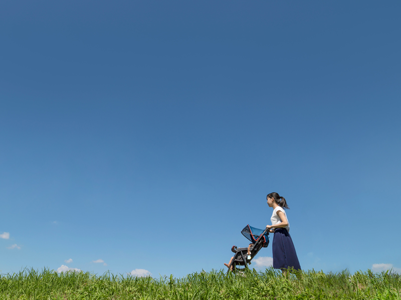

## 母親という役割が苦しい原因は思い込みや刷り込み
結論から言うと、私達母親が苦しい原因の殆どが思い込みや刷り込みです。

自らの思い込みのせいで、現実とのギャップが生まれ苦しくなるのです。

どんな思い込みがあるか、私の実体験を元に解説していきます。

### 自分の母親みたいにならなければならない。思い込みから育児ノイローゼへ

うちの母は「母親」であることを貫いた専業主婦でした。父が昔人間で女は家にいて家庭を守るを徹底的に押し付けたからです。 近代化が進む中、我々4人兄弟全て母乳と布おむつで育て、妻としての努めを果たすべく、出産後も実家に帰りませんでした。

小さな頃からそれを聞いて育ちました。いつしか母親は粉ミルクと紙オムツで育てるのは邪道で、出産後は実家に帰ってはいけないと思い込むようになりました。

 これが不幸の始まりでした。

 私は出産前は重度の切迫早産でした。ベッドから動くことも許されず、無事出産したものの体力が相当落ちていました。 にも関わらず、すぐに自宅に戻り布おむつと母乳で育てることを実践しました。

 赤ちゃん以外誰も何もない家。

 数時間おきに泣き出す地獄。体力もなく精神的に弱っていき、育児ノイローゼになりました。

私は布おむつを諦め、実家に帰りました。 私はその時、何でダメな母親なんだろう。なぜ自分の母と同じことができないんだろう、とひどく落ち込みました。

誰も実家に帰ってはいけない、布おむつで育てなければいけないなんて一言も言ってないのに。

### 「子どもと母親はこうあるべき」という周りからの洗脳

うちの子は私のように全く宿題をしませんでした。

小学一年の頃担任の先生は「ここで宿題を提出できるようにならないと、将来困りますよ」と何度も言われました。

何度も宿題を終わらせるように努力しましたが、すぐに集中力が切れ終わらすことができませんでした。

 「*私は母親なので、息子の宿題を監督して終わらせなければいけない*」という洗脳。

 その頃は、フルタイムで仕事していて帰ったらクタクタ。 
そんな中、宿題がノロノロと終わらないのを見ては毎日発狂していました。

### 自分の若い頃の後悔からの呪縛
誰にだって子どもの頃やりたかったことややっとけばよかったことがあります。 
私は子どもの頃、本当に勉強が苦手で、九九も苦手でいつまで経っても覚えられませんでした。
うちの家は度を越した放任主義でした。 母は中卒で、しかも若くに結婚したので学歴が社会に出たあとに武器になることをわかっていなかったようです。今のようにインターネットもなく自分で調べる術もありませんでした。

のんきな子どもだった私は宿題もしないし、ただその時楽しいことだけやって、将来のことなど考えたこともありませんでした。

それまでのツケが高校になってやってきました。初めてことの重大さに気づきました。 
「どこでもいいから大学に入れと」言われ、たまたま受かった地元の女子大に入学しました。 
訳もわからず全ての授業がとてもつまらなく、たった1年で辞めてしまいました。

私はその時知らなかったのです。

  *大学を卒業すると、高卒より良い仕事を得られるなど、たくさんの可能性と機会に恵まれやすくなる* ということを。

 例えば、IT系の学部を卒業していれば海外移住も難しくなく、プログラミングの職につけば日本より多くの給料をもらえるなど、です。

 大人になって知ったので後悔しました。

子どもが高校3年生になったとき、今からの時代国際人になっ他方が有利だということで海外への大学に入学をすすめました。私の転職と共にフィリピンに移住し、現地の大学に入学しました。

 入ったものの環境に馴染めず、突然辞めてしまいました。

 その時のショックは凄まじかったです。 
私が真剣に考えて大学を選ばなかった後悔と重なり、*この先私と似たような人生をこの子が歩まなければいけないかもしれない* というショックです。

何度も喧嘩しました。

## 第一歩。洗脳や思い込みに苦しめられていることに気づくこと
私は息子をちゃんと育てたくて逆に裏目に出た母親でした。それどころか、理想通りに進まない度に心をすり減らし、息子に対して怒り狂ってきました。

フィリピンに移住したあとも散々喧嘩した挙げ句、息子が日本に帰りました。

寂しいし苦しかったですが、一人の時間ができました。

この自分を遠巻きに見つめる時間こそが大事。今までの人生を振り返り、いかに洗脳や思い込みに苦しめられていることに気づくことができました。

### 理想の母親にならなくていい
私は自分の母と同じようにしなければならないと思い込んでいました。
時代も変わり、紙オムツも粉ミルクも発達しているにも関わらず。
母と同じことをしなければならないといつも緊張し、ストレスを感じていました。

子どもが産まれて20歳そこそこの小娘が、すぐそんな理想の母親になれる訳ないんですよ。

やったことないんですから。

そして、私は私の母とは違うんです。理想の母親にならなくてもいいんです。

若い頃の私に会えるとしたら、しんどいのなら周りに思いっきり甘えて子育てを手伝ってもらってもよかったんだと教えてあげたいです。

もちろん、苦しいことばかりでは有りません。

色んな所に連れて行ったりと、私だからできたこともあります。十分胸を張ってもいいかなと今では思えます。

### 周りの人のアドバイスに耳を貸さなくていい
息子が小学校の頃、担任先生や周りの大人は息子に対してこうすべき、あーすべきと言ってきました。

私は何が正解か分からず、できるだけアドバイスを実行していました。しかし息子が言うことを聞かないのでアドバイスは片っ端から守れませんでした。

アドバイス通りできないのが母親失格のようで自己嫌悪に陥り、言うことを聞かない息子に対しても苛立ちを覚えました。

ある日、大抵のアドバイスは彼ら自らの経験に基づいたものだったことに気づきました。

「 *あなたの子どもではできたかもしれないけど私の子どもはあなたの子どもじゃない* 」ということ。 
「 *私もあなたじゃない* 」ということ。

だからできなくてもいいんです。できなくて苦しむくらいなら耳を貸す必要すらありません。

### 何が何でも1人で子育てをしないこと
一番苦しかったのはワンオペ子育てです。

ワンオペ子育てはうちの母がやってきたことです。 
子どもと自分だけの世界だと、子どもしか視界に入らなくなります。悪いところもよく見え、つい起こりたくもなりますし、悪いところが連続で見えると冷静さを失います。 
これが母親の苦しさを増強させます。

私は早い段階でワンオペ子育てから脱却できました。子どもが小学生の頃、趣味でスポーツを親子で始めたのがきっかけでした。 
コミュニティでしょっちゅう集まりがあり、年上のお兄さんたちが息子をよく面倒見てくれました。

  *息子から解放される貴重な時間* でした。

 子どもと距離を置くだけでどれだけ心まで解放されることか、その時気づきました。

昔の人たちは村や町内単位で子どもを育てていました。私も近所のお兄ちゃんやお姉ちゃんと遊びながら育ちました。

うちの母親も基本ワンオペでしたが、子どもが勝手に外に遊びに行ける時代なので訳が違ったのでしょう。

今は子どもだけで外で遊ぶのが難しい時代です。

どこか心苦しさを感じるなら、親子で参加できるコミュニティを探してください。

少なからず私は救われました。

### 子どもに自分の人生のやり直しを1ミリもさせないこと
私のなかなか手放せなかった呪縛です。

国際人になりたかった。海外の大学に行きたかった。もう少しうちの母が知識があったら。

母親のせいにしつつ、若い頃たくさんの後悔が無意識レベルで未だに残っていました。

 だから息子にフィリピンの大学の入学を薦めたのだと思います。

*選択の余地がなかった。*  
こちらはフィリピンの大学に行くことを選択した息子の言い分です。

色んな後悔があることと思いますが自分の選んだこと。

 後悔するくらいなら自分がやり直せばいい。他人は私の人生をやり直すことはできません。

 息子に私の人生のやり直しをさせそうになりましたが、息子が大学中退を選んだので未遂に終わりました。お金も労力も費やしましたが、これでよかったと思います。

息子には当時は相当恨み言を言われました。選択の余地がないとか言ってますが、どんな状況下であれ選んだのは彼自身だと今は開き直っています。

## 思い込みを捨てるきっかけになった一冊の本
息子が大学を辞め、日本に帰った後もしばらく苦しかったです。多分一年は何度も後悔や自責の念が頭から離れませんでした。

そんな私を救ったのは一冊の本です。 
「嫌われる勇気」というベストセラーです。

ベストセラーなことは知ってましたが、読んだこともありませんでした。ふとしたきっかけで友達に薦められて読みました。

若者と哲人の会話形式で繰り広げられる、アドラー心理学に基づいた哲学書のような本です。 
若者は親のしがらみに苦しみながらも、親が責任を持ったり、子どもが期待に応えるのが当たり前と思い込んでいます。家族や周りの柵（しがらみ）のなか生きてきた私には共感しかなかったです。

* 親が子どもの責任をとったり犠牲になるのは当然
* 夫が家にお金を入れなければならない
* 母は家にいて家庭を守らなければならない

これらは戦後復興の中生き抜いてきた両親に私が小さい頃から洗脳されてきたことです。

そんな思い込みを一掃してくれる本でした。

人間時間がかかるもので2回読み、やっと真の髄に入り込んだ感じです。

宿題をしなかろうが、大学中退しようが困るのは息子。私ではない。

哲人が気づかせてくれました。

大切なのは *自分と子どもの人生を混同しないこと* です。

## 呪縛は距離と時間が解決する
苦しいと感じたら、無理にでも物理的に子どもと距離を置いてください。1時間でも2時間でもいいです。子どもから距離を置くことで相当楽になります。

実は私達母親は子どもにとってそんなに必要ではないんです。 
私達がいなくてもどうにか育つもんです。

子どもはあなたではなく、環境が育てます。 
あなたと子どもが居心地の良い環境、例えばスポーツサークルなどのコミュニティなどでみんなで子育てすればいいんです。

人間は子どもを一人で育てれられるほど、大した存在では有りません。

 私は息子が20歳になるまでにすべての呪縛からは解放されませんでした。 
なかなか払拭できなかったのは、母親としてちゃんと育てられなかったという後悔の念です。

この2年、十分に距離を置き、自分の心を俯瞰することでで後悔の気持ちは薄らいでいきました。今は元気に生きてりゃいいやという気持ちで見守ってます。

以上が私が呪縛から解放された体験です。

今子育て真っ只中で苦しいと感じている人の一助となれば幸いです。

最後までお読みいただきありがとうございます。

 関連記事もぜひお読みください。

<card id="/blogs/entry473/"></card>
<card id="/blogs/entry420/"></card>
